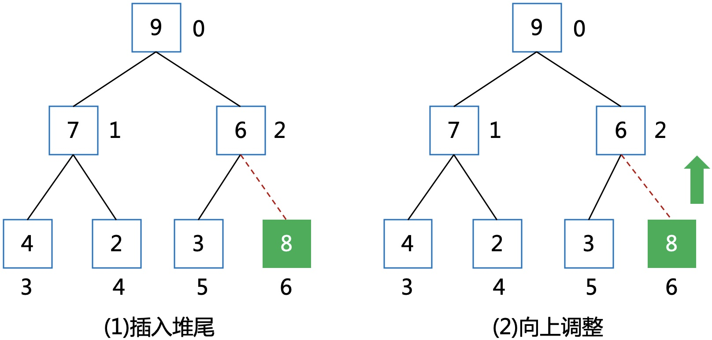

# 堆排序算法图解

### 1 演进
结点和边，构成一个**图**。
<div align=center></div>

不含环的连通图，便成了一棵**树**。每个结点拥有的子结点数称为结点的**度**。
<div align=center></div>

多棵树便构成了一个**森林**。
<div align=center></div>

结点的度最大为2的树便是**二叉树**；最大度为N的是**N叉树**，或**多叉树**。
<div align=center></div>

除叶子结点，每个结点的度都为2，称为**满二叉树**。  
除去最后一层之后的子树为满二叉树，且最后一层结点依次从左到右分布，则称为**完全二叉树**。
<div align=center></div>

如果在完全二叉树上再加一个限制条件：如结点都大于等于其子结点，或者小于等于其子结点，则称为**堆**。  
每个结点都大于等于其子结点，称为**大根堆**。  
每个结点都小于等于其子结点，称为**小根堆**。
<div align=center></div>

### 2 堆存储
#### 2.1 顺序存储：数组
用数组存储，将一个线性数组映射成一棵完全二叉树，父结点为i，则左儿子为2i+1，右儿子为2i+2。
<div align=center></div>

**代码如下**
```cpp
int heap[10];
```

#### 2.2 链式存储：链表
定义一个结点的结构体，两个指针分别指向左儿子和右儿子。
<div align=center></div>

**代码如下**
```cpp
struct Node {
    int value;
    Node *lson, *rson;
};
Node *heap;
```

> [!TIP|style:flat|label:说明]
> 以下思想都以大根堆举例。

### 3 堆调整
#### 3.1 向上调整
子结点与父结点的下标关系如下：
<div align=center></div>

用一个指针指向待调整的结点：  
* 先比较是否大于父结点，如果大于就进行交换，并将指针上移到父结点

直到指向根结点或者当前结点小于等于父结点。
<div align=center></div>

**代码实现**
```cpp
//将heap[k]向上调整
int heapUp(int *heap, int k) {
    int parent, son, x;
    x = heap[k];
    son = k;
    parent = (son - 1) / 2;
    while (son > 0) {
        //如果父结点大于等于heap[k]则退出，否则将父结点下移
        if (heap[parent] >= x)
            break;
        heap[son] = heap[parent];
        son = parent;
        parent = (son - 1) / 2;
    }
    heap[son] = x;
    return 0;
}
```

#### 3.2 向下调整
父结点与子结点的下标关系如下：
<div align=center></div>

用一个指针指向待调整的结点：  
* 先比较两个子结点哪个更大，取出更大的子结点
* 再比较更大的子结点是否大于父结点，如果大于就进行交换，并将指针下移

直到指向叶子结点或者当前结点大于两个子结点。
<div align=center></div>

**代码实现**
```cpp
//将heap[k]向下调整
int heapDown(int *heap, int k, int n) {
    int parent, son, x;
    x = heap[k];
    parent = k;
    son = 2 * k + 1;    //左孩子结点
    while (son <= n) {
        //比较左右儿子，选择较大的一个
        if (son + 1 <= n && heap[son + 1] > heap[son])
            son++;    //使son指向左右孩子中较大的结点。
        //如果儿子结点中较大的都小于等于待调整结点则退出，否则将子结点上移
        if (heap[son] <= x)
            break;
        heap[parent] = heap[son];
        parent = son;
        son = 2 * parent + 1;
    }
    heap[parent] = x;
    return 0;
}
```

### 4 增减元素
#### 4.1 push
从堆尾插入元素，再对该元素进行向上调整直到满足堆性质。
<div align=center></div>

#### 4.2 pop
将堆顶弹出，用堆尾的元素置换，再对堆顶的元素进行向下调整。
<div align=center></div>

### 5 构建堆
#### 5.1 插入构建
依次向堆尾插入元素，并对该元素进行向上调整，直到满足堆性质。
<div align=center></div>

时间复杂度：  
插入一个元素要调整的高度为logi，所以插入n个元素的总次数为log1+log2+...+logn=log(n!)。  

根据斯特林公式，有如下证明，所以复杂度O(nlogn)。
<div align=center></div>

#### 5.2 调整构建
待调整的数组，可以直接看成是一棵完全二叉树。
<div align=center></div>

从(n-1)/2位置开始，将每个元素进行向下调整，直到根结点。对于每一个待调整的当前结点，下面的子树都已经满足堆性质，所以调整完所有结点便成了堆。
<div align=center></div>

时间复杂度：  
倒数第二层有2^(h-2)个结点，调整高度为1，依次类推，第一层有1个结点，调整高度为h-1，整体加起来的复杂度为O(n)。
<div align=center></div>

**代码实现**
```cpp
void buildHeap(int *heap, int n) {

    for (int i = (n - 1) / 2; i >= 0; --i) {
        heapDown(heap, i, n);
    }
}
```

### 6 排序
一个已经调整完成的大根堆。
<div align=center></div>

核心思想：  
* 将堆顶与堆尾的元素置换
* 整体元素长度减1
* 对堆顶元素进行向下调整

重复以上过程直到整体元素为1，这时就变成了一个升序排列的数组。  

**模拟过程：**  
Step 1
<div align=center></div>

Step 2
<div align=center></div>

### 7总结
堆排的复杂度为nlogn，应用场景很广泛，这篇文章主要讲清楚堆相关的操作，具体的应用和建模以后会再专门写文章讲解。

如果喜欢小K的文章，请点个关注，分享给更多的人，小K将持续更新，谢谢啦!

---
**扫描下方二维码关注公众号，第一时间获取更新信息！**  
<div align=center></div> 