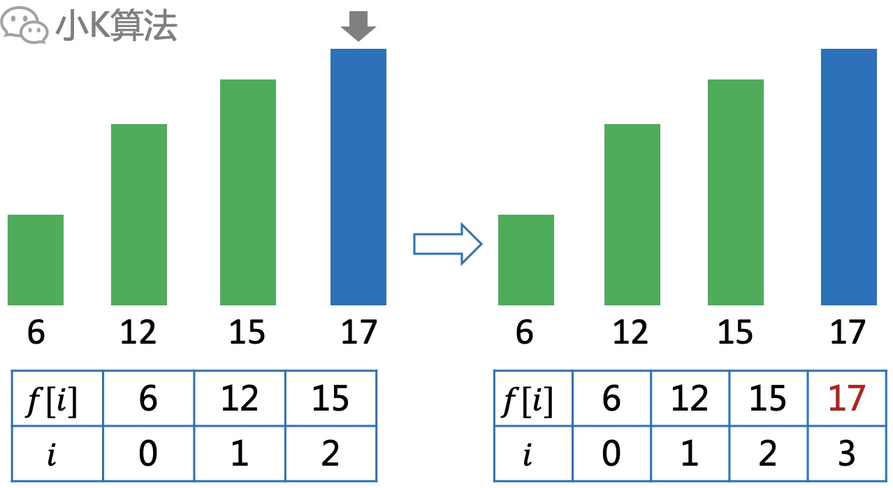

# 图解算法：LIS问题，单调队列+二分优化

### 1 故事起源
LIS：Longest Increasing Subsequence(最长递增子序列)。  
给你一个整数数组，如何求出其中最长的严格递增子序列的长度？
<div align=center></div>

比如下面绿色和蓝色都是符合要求的子序列，但蓝色的子序列更长，所以最大长度为4。
<div align=center></div>

### 2 思考
要求最长子序列的长度，那肯定要先找出这个最长的子序列。比如下面蓝色的子序列就是我们要找的序列。
<div align=center></div>

所以整个数组的元素就可以分为两类，一类是属于最终的目标序列，一类是不属于最终的目标序列。  
那我们要怎么确定一个元素是否应该选取到目标序列呢？咱们还是从小规模开始分析吧，懂的都懂(小K式思维法)。
<div align=center></div>

### 3 小规模分析
#### 3.1 一个元素
如果只有一个元素，那自然是要选了，最大长度为1。
<div align=center></div>

#### 3.2 两个元素
如果再加第2个元素，满足递增子序列，两个都选，最大长度为2。
<div align=center></div>

如果再加第2个元素是这样的，选了第1个就选不了第2个，不选第1个就可以选第2个。但怎么选都只能选1个，最大长度是1。 
<div align=center></div>

#### 3.3 三个元素
如果选取了前面2个元素，再加第3个元素，已经无法再选取，最大长度为2。
<div align=center></div>

如果前面只选取第1个元素，再加第3个元素，可以选取第3个元素，最大长度也为2。
<div align=center></div>

请问你发现什么规律了吗？
<div align=center></div>

因为是递增序列，所以一个元素能不能选，跟之前选择的最后一个元素有关。如果大于最后一个元素就可以选择，如果小于或等于就无法选择。

### 4 抽象分析
如果不考虑任何规律，每个元素可以选或不选，$$N$$个元素就有$$2^N$$种选取方法。当然要保证递增序列，就可以排除很多不合理的情况，但规模依然很大。
<div align=center></div>

假设原问题已经找到了最大的子序列，现在我再给你加一个元素进来，选还是不选呢？
<div align=center></div>

如果原问题最大长度为X，那选择最新的元素的前提就是最大长度能变成X+1，如果选了长度没变甚至更小那肯定就不选。说明新的元素一定要能接在之前的最优解后面才可选取。  
数据规模每扩大一次，最优解也是在之前的最优解上面扩充。
<div align=center></div>

再根据第3小节的分析，对于每一个最优解，其实我们并不关注前面的X-1个元素是怎么选择的，只关注第X个元素是选的啥，那就可以从小规模开始枚举，求出以每个元素作为结尾时的最大长度，这样就可以递推出更大规模的最优解，这其实就是动态规划的思想。

### 5 动态规划
设$$f[i]$$表示以第$$i$$个元素为结尾，能得到的最大的长度，那么$$f[i]$$一定是从之前的某个最优解递推过来。  
即$$f[i]=Max(f[j]+1),a[i]>a[j],1\leq j \leq i-1$$。
<div align=center></div>

**代码实现**
```cpp
void dp() {
    int a[100], f[100], ans = 0;
    for (int i = 0; i < n; ++i) {
        cin >> a[i];
        f[i] = 1;
        for (int j = 0; j < i; ++j) {
            if (a[j] < a[i]) {
                f[i] = max(f[i], f[j] + 1);
            }
        }
        ans = max(ans, f[i]);
    }
    cout << ans << endl;
}
```

动态规划的复杂度为$$O(N^2)$$，当$$N$$很大时效率就很低了，那能不能继续优化呢，这就还得继续找本质规律。

### 6 哪里有问题呢
#### 6.1 长度相等，高度更矮
如果前4个元素是这样的：  
选取前2个长度为2，选取后2个长度也是2，但明显选取后2个更好，因为末位的高度更矮。  
如果再加一个元素15，那就可以接在后面变成更大的长度3，但如果选择前面两个就不行。说明前面2个可以直接抛弃。
<div align=center></div>

#### 6.2 长度更长，高度更矮
如果前5个元素是这样的：  
选取前2个长度为2，选取后3个长度为3，而且高度更矮，明显更优。说明前面2个也应该直接抛弃。
<div align=center></div>

#### 6.3 长度更长，高度更高
如果前3个元素是这样的：  
选取前2个长度为2，选取第3个长度为1。虽然前面的高度更高了，但长度也更大，不能直接抛弃。  
比如再来一个元素18，就可以直接接在前面2个之后，长度为3。
<div align=center></div>

#### 6.4 公式分析
再回到之前的DP递推公式，在求每一个$$f[i]$$时，其实都是从之前找一个符合要求的最大的$$f[j]$$。之前的方法是枚举每一个，这样查找自然效率就比较低，那能否更快的找到我们想要的$$f[j]$$呢?
<div align=center></div>

6.1~6.3分析了不同的情况，其实我们只需要保留6.3中的情况，长度更长，末位更高。把这些单独拿出来再看，其实就是一个单调上升队列，长度和高度同步单调递增。对于一个单调有序的队列，你会怎么查找呢，当然最快就是二分查找了啊。
<div align=center></div>

再看上面的$$f[i]$$和$$i$$其实可以放在一起，这时$$f[i]$$的含义就变成长度为$$i$$时末尾的最小值，我们只需要维护这个一维队列即可。
<div align=center></div>

#### 6.5 如何维护
从左开始扫描每一个数，如果当前数$$a[i]$$等于队尾的数则直接抛弃。  
如果当前数$$a[i]$$大于列尾的数，就直接加入队尾。
<div align=center></div>

如果当前数$$a[i]$$小于列尾的数，就通过二分查找，找到刚好大于$$a[i]$$的数$$f[j]$$，并用$$a[i]$$替换$$f[j]$$。
<div align=center></div>

这样最终的$$f[i]$$队列的长度就是我们要找的最长递增子序列长度。

### 7 算法实现
在通过二分查找时，要注意几个细节，就是$$l,r$$指针最终停留的位置有不同的情况。  

如下$$f[l]>x$$。
<div align=center></div>

如下$$f[l]<x$$。
<div align=center></div>

如下$$f[l]=x$$。
<div align=center></div>

所以在更新的时候需要判断。

**代码实现**
```cpp
void greed() {

    int f[100000], x, num = 0;
    f[0] = 0;

    for (int i = 0; i < n; ++i) {
        cin >> x;
        if (x == f[num]) {
            continue;
        }
        if (x > f[num]) {
            f[++num] = x;
            continue;
        }

        int l = 0, r = num, mid;
        while (l < r) {
            mid = (l + r) / 2;
            if (f[mid] == x) {
                l = mid;
                break;
            }
            if (f[mid] < x) {
                l = mid + 1;
            } else {
                r = mid - 1;
            }
        }
        //最后停留位置，>,<,=都有可能，小于更新当前位置，大于更新后一位置
        if (x < f[l]) { f[l] = x; }
        else if (x > f[l]) {
            f[l + 1] = x;
        }
    }

    cout << num << endl;
}
```

### 8 总结
这是一道比较经典的动态规划问题，公式也很简单。但不论是通过原问题模拟过程的分析，还是直接通过递推公式分析，都可以发现有很多冗余的操作，这些就是我们优化的切入点，单调队列在DP中是很常用的优化技巧，而单调有序性就可以结合二分查询提高效率。以后可以再给大家讲讲其它的几种常用DP优化技巧。

本文原创作者：小K，一个思维独特的写手。  
文章首发平台：微信公众号【小K算法】。  

如果喜欢小K的文章，请点个关注，分享给更多的人，小K将持续更新，谢谢啦！

---
**扫描下方二维码关注公众号，第一时间获取更新信息！**  
<div align=center></div>

