# 算法：冒泡排序及优化

### 1 故事起源
幼儿园放学，小朋友们集合，需要先从低到高排队，应该怎么排呢？
<div align=center>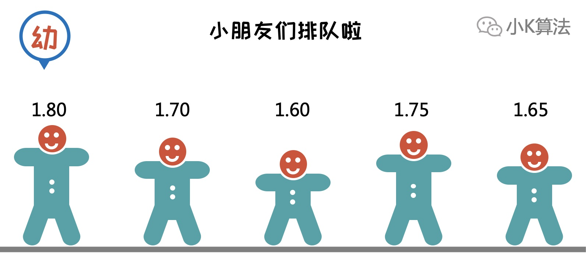</div>

### 2 开始行动
小K身高180，是班里最高的，自然得往后排啦。小K先和身后的小B比较，然后和小B交换。
<div align=center>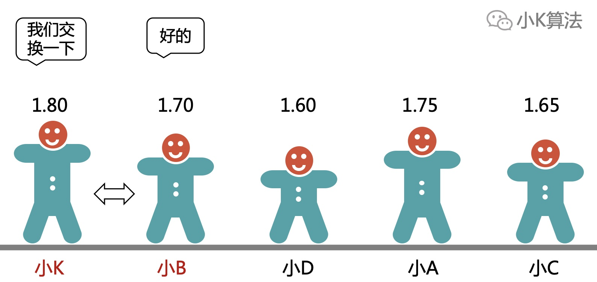</div>

小K接着和身后的小D比较，然后和小D交换。
<div align=center>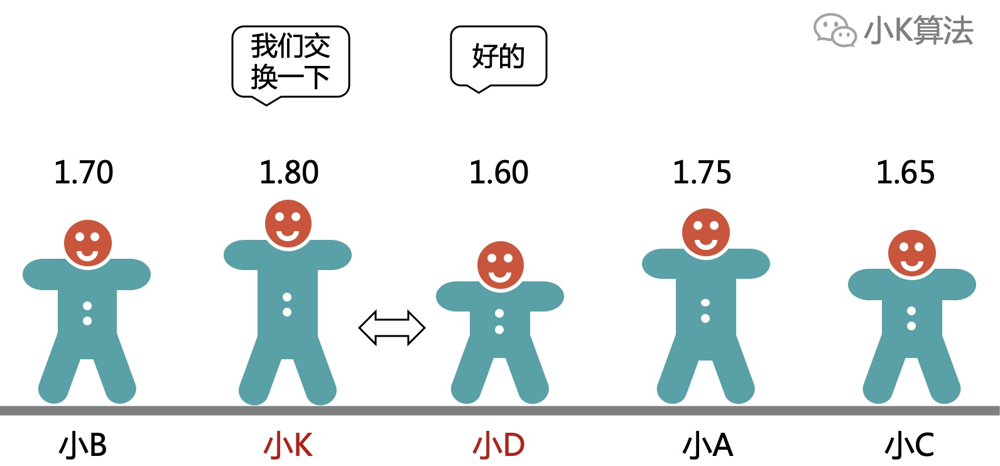</div>

经过和4个小朋友交换位置，小K终于找到自己的位置啦。
<div align=center>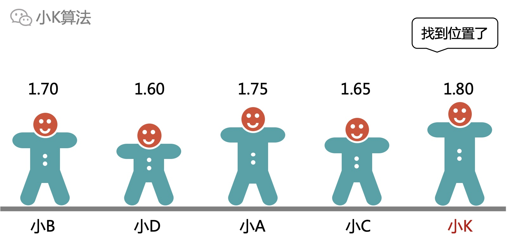</div>

上面的过程其实就是冒泡排序的核心思想了。

### 3 冒泡排序
为描述方便，用下面的数组模拟小朋友的交换过程。
<div align=center>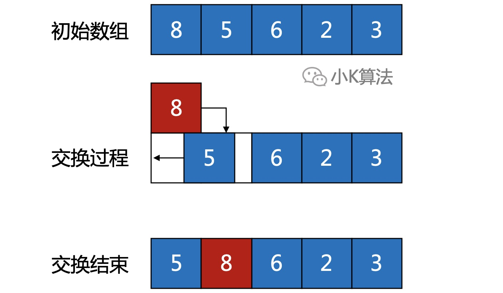</div>

核心思想(升序)：  
从首位置开始，依次比较前后两个数，如果前面的数比后面的数大，就交换两个数。这样第1轮结束后，最大的数就会移动到最后的位置。对剩余元素重复执行N-1次，整个数组有序。因为像空气上浮到水面，最大的元素会慢慢浮到最后，所以冒泡因此得名。

#### 3.1 第1轮
执行完成后，最大的元素归位。
<div align=center>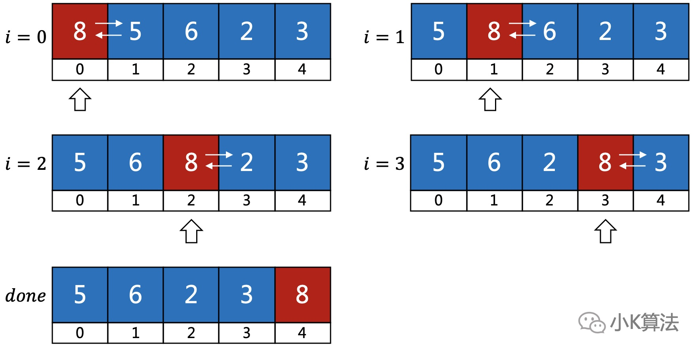</div>

#### 3.2 第2轮
第2轮接着对前面剩余的N-1个元素重复上面步骤，第2大的元素归位。
<div align=center>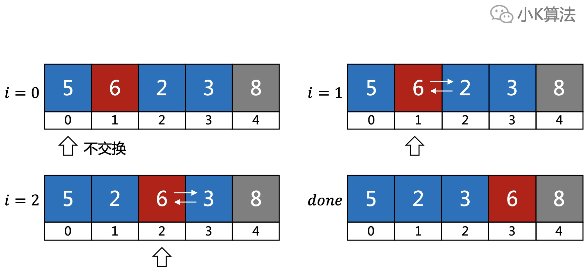</div>

#### 3.3 第3轮
第3轮对前面剩余的N-2个元素重复上面步骤，第3大的元素归位。
<div align=center>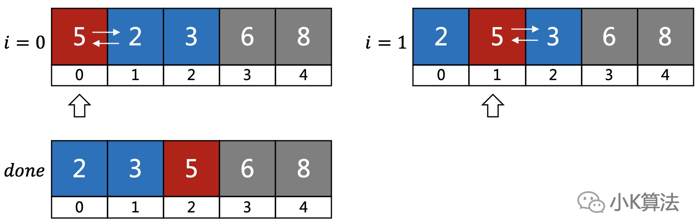</div>

总共执行N-1次操作，所有元素归位。

#### 3.4 代码实现
```cpp
for (int i = 0; i < n - 1; ++i) {
    for (int j = 0; j < n - i - 1; ++j) {
        if (a[j] > a[j + 1]) {
            swap(a[j], a[j + 1]);
        }
    }
}
```

### 4 问题及优化
#### 4.1 迭代轮次优化
如果原数组为如下情况，那么在执行完第1轮后，整个数组已经有序，后面的轮次没必要执行，可以针对这种情况做一次优化改进。  
**改进点1：**  
如果某一轮没有发生过交换，说明数组已经有序，那么以后也不会发生交换，此时可以终止迭代。
<div align=center>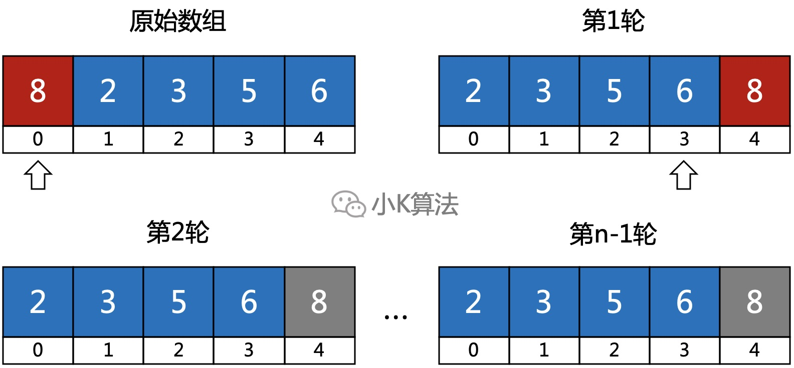</div>

**代码实现**  
```cpp
for (int i = 0; i < n - 1; ++i) {
    // flag标记是否有交换
    bool flag = true;
    for (int j = 0; j < n - i - 1; ++j) {
        if (a[j] > a[j + 1]) {
            swap(a[j], a[j + 1]);
            flag = false;
        }
    }
    if (flag) {
        break;
    }
}
```

#### 4.2 扫描范围优化
如果为以下情况，我们会发现最后的6和8所处的位置和最终排序完成的位置一样，说明过程中他们的位置不会发生变化。
<div align=center>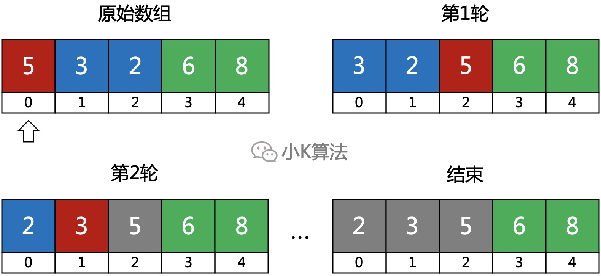</div>

上一轮最后交换的位置，在下一轮时，此位置后面的数也不会再发生交换。
<div align=center>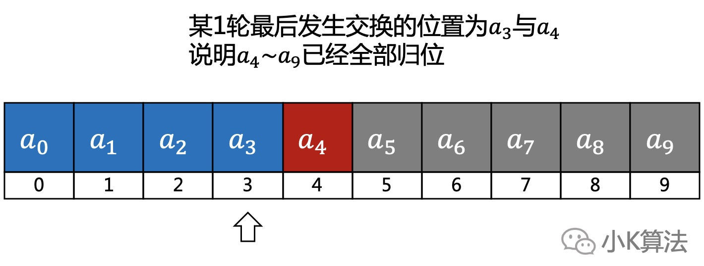</div>

**改进点2：**  
记录每一次最后发生交换的位置，下一轮只需要扫描到此位置的前一个即可。

**代码实现**  
```cpp
// 记录最后交换的位置
int position = 0;
int len = n - 1;
for (int i = 0; i < n - 1; ++i) {
    // flag标记是否有交换
    bool flag = true;
    for (int j = 0; j < len; ++j) {
        if (a[j] > a[j + 1]) {
            swap(a[j], a[j + 1]);
            flag = false;
            position = j;
        }
    }
    len = position;
    if (flag) {
        break;
    }
}
```

### 5 总结
冒泡排序是比较简单的一种排序算法，核心思想就是比较相邻的两个数，但效率比较低所以可做一些优化。时间复杂度为O(N^2)，数据规模较小时可采用，但数据过大时就不建议采用冒泡了。

本文原创作者：小K，一个思维独特的写手。  
文章首发平台：微信公众号【小K算法】。  

如果喜欢小K的文章，请点个关注，分享给更多的人，小K将持续更新，谢谢啦！

---
**扫描下方二维码关注公众号，第一时间获取更新信息！**  
<div align=center></div>