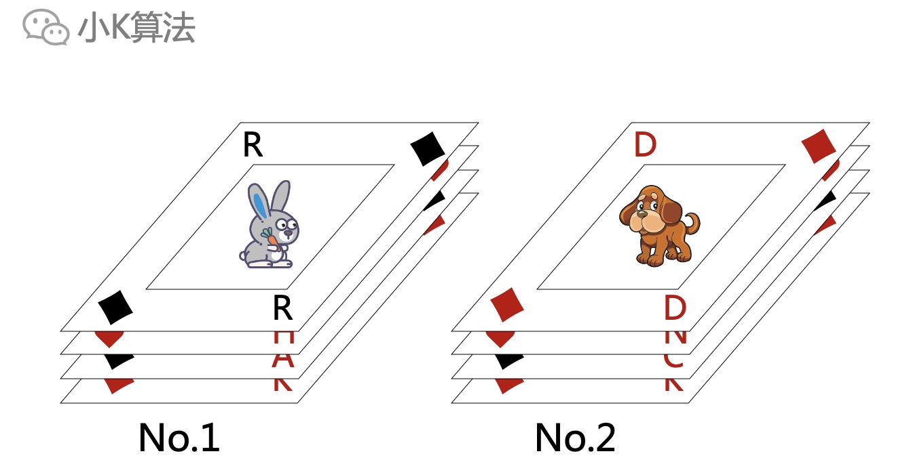

# 算法面试题：均分纸牌

### 1 故事起源
有N堆纸牌编号为1~N，每堆有若干张，但纸牌总数必为N的倍数。可在任一堆上取若干张移动。  
移牌规则：
* 编号为1的堆上取的纸牌只能移到编号为2的堆上
* 编号为N的堆上取的纸牌只能移到编号为N-1的堆上
* 其他堆上取的纸牌可向左右相邻堆移动

问最少要移动几次可使每堆上纸牌一样多？
<div align=center></div>

### 2 小规模分析
#### 2.1 一堆纸牌
如果只有一堆纸牌，那就不用移动，也就是移动0次。
<div align=center></div>

#### 2.2 两堆纸牌
如果有两堆纸牌，一种情况是两堆已经一样多了，那就不用移动，最少0次。
<div align=center></div>

另一种情况是不一样多，那只需要将多的移动到少的使两堆一样，最少1次。
<div align=center></div>

#### 2.3 三堆纸牌
如果三堆已经一样多，即都为平均数，那就不用移动。
<div align=center></div>

另外的情况就是有一堆为平均数，或者0堆为平均数，当然肯定不可能只有两堆为平均数。  

如果为下面这种情况，移动1次可以完成。
<div align=center></div>

如果为下面这种情况，移动2次可以完成。
<div align=center></div>

多列举几种不同的情况，你就会发现，三堆纸牌无论哪种情况，移动次数都在0~2次就可以完成。  
那N堆纸牌是不是移动次数也在0~(N-1)次就可以完成呢？继续往下分析。

#### 2.4 小规模总结
根据上面的分析，三堆纸牌移动的次数在0~2。那什么原因导致移动的次数不同呢？  
**总结：**  
* 0次：3堆都为平均数
* 1次：第一堆或者第三堆为平均数
* 2次：其它情况

为1次时，有一堆为平均数不用移动，那这时和两堆也没有区别啊，三堆可以分解成两堆+一堆，到这里小K已经隐约感觉到了有子问题的存在。  

### 3 分割子问题
想象这种场景，N堆纸牌，从中间某位置分开，左右两边都刚好够分，那么把每一边都看成整体时，一定不会有互相移动。因为如果你从左边移x张到右边，你必然还会从右边移x张回来，属于多余操作。  
这样两边其实可以看成两个完全独立的子问题。
<div align=center></div>

根据上面的规则，可以先将一个大问题分为多个不可再分割的子问题。
<div align=center></div>

到这里我们已经成功向前推进了一步，接下来思考每个子区间的情况。

### 4 子问题分析

#### 4.1 不可再分性
对于一个不可再分割的子区间，从任意位置切一刀，都无法再分割。
<div align=center></div>

也就是任意位置切一刀，一定是一边均摊后小于平均数，另一边均摊后大于平均数。
<div align=center></div>

现在我们要想办法让它能继续分割，即通过移动使得两边变成刚好够分。  
如果不考虑移动次数肯定可以做到，那能否通过一次移动使子区间可以分割开呢？

#### 4.2 均摊后大于平均数(充分性)
从左开始扫描每一堆纸牌，如果大于平均数，就把多余的移到右边相邻的堆上。这样左右两边都是刚好够分的情况，即通过一次移动就把该区间分割成两个更小的子区间。
<div align=center></div>

#### 4.3 均摊后小于平均数(充分性)
从左开始扫描每一堆纸牌，如果小于平均数，就继续向右扫描，这时判断整个左区间是否够分，直到扫描到$$a_{i+1}$$。  
区间[1,i+1]均摊后大于平均数(只有扫到末尾才可能刚好等于平均数)，这时只需从$$a_{i+1}$$上移动区间[1,i]还缺少的x个到$$a_i$$上，使得区间[1,i]刚好够分，这样一次移动也能把区间分割成两个更小的子区间。
<div align=center></div>

#### 4.4 X堆最少移动X-1次(必要性)
通过一次移动可将区间一分为二，对于一个有X堆纸牌的子区间，一定能通过X-1次将它分割为全部均等的X堆。那最少一定要X-1次吗，还能否更少？

不论在哪个位置移动，每移动一次，只会改变相邻的两堆纸牌的数量，所以只能影响左右两个区间是否可分割。  
即移动一次最多一分为二，不可能一分为三，那么有X堆的子区间最少也得移动X-1次。
<div align=center></div>

### 5 算法及实现
#### 5.1 算法思想
分析到这里问题的本质规律已经找出来了，先将整个区间分割开，然后对于每一个不可再分割的子区间，设有X堆纸牌，按上述方法移动X-1次可使得每堆都相等。  
我们不需要真正去移动，只需要求出最少的次数。所以如果初始区间可以分割为Y个子区间，那么整个区间最少移动就是N-Y次。

#### 5.2 代码实现
```cpp
int main() {
    int n, a[100], sum = 0, interval = 0;
    cin >> n;
    for (int i = 0; i < n; ++i) {
        cin >> a[i];
        sum += a[i];
    }
    int avg = sum / n, last = -1;
    sum = 0;
    for (int i = 0; i < n; ++i) {
        sum += a[i];
        if (sum == (i - last) * avg) {
            interval++;
            sum = 0;
            last = i;
        }
    }
    cout << n - interval << endl;
    return 0;
}
```

### 6 总结
估计最后给大家的感觉就是：编码一分钟，思考两小时，哈哈。  
实现代码非常简单，但思考过程并不简单，需要找出问题的本质规律，要证明算法的正确性，这个还是有一些思考量在里面的。大家跟着小K的思路多思考，勤用脑，总有一天你会感叹：原来都是套路啊，哈哈。

本文原创作者：小K，一个思维独特的写手。  
文章首发平台：微信公众号【小K算法】。  

如果喜欢小K的文章，请点个关注，分享给更多的人，小K将持续更新，谢谢啦！

---
**扫描下方二维码关注公众号，第一时间获取更新信息！**  
<div align=center></div>