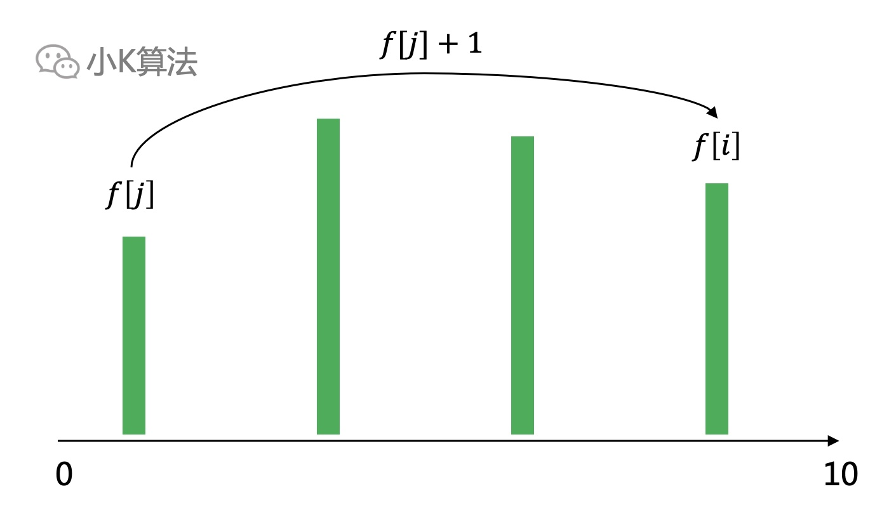

# 算法面试题：不重叠区间

### 1 故事起源
给定一个草坪区间的集合，为使区间互不重叠，最少需要移除多少个区间？
<div align=center></div>

简单描述如下图，最少移除多少个区间，可以使剩余的区间不重叠。  
注：1、区间终点一定大于起点；2、区间[1,2]和[2,3]接触，但不重叠。
<div align=center></div>

### 2 分析
题目求最少需要移除多少个，其实可以转换问题，变成最多有多少个区间不重叠。  
很多时候不容易直接求解时，都可以尝试反向思考，这个技巧非常重要。  

所以现在问题就是求最多有多少个区间，使他们落在x轴上不重叠。
<div align=center></div>


### 3 最终状态法
这里给大家介绍一种非常重要的思考方法，小K称之为“最终状态法”。其本质就是先思考最终要得到的状态，或者说正确结果应该是什么样子。

比如这个问题，假设我们已经求出了最优解，那这个最优解，一定是所有的区间中的k个区间，他们能平铺在数轴上且不重叠。下面的蓝色就是我们的答案。
<div align=center></div>


如果我在中间某个位置切一刀，分成两个子问题。现在我问你：左边区间中的解，是否仍然是左边子问题的最优解呢？  

<div align=center></div>

可以用反证法，先假设它不是最优解，那就意味着左边一定还有更优的解，比如下面这样，左边可以选出3个区间。
<div align=center></div>

如果再把2个子问题组合起来，那整个问题的最优解应该是4个区间，这和我们之前假设的蓝色是最优解矛盾了。说明分割子问题后，子问题的最优解也一定包含在整个问题的最优解中。

反过来，我们求出了子问题的最优解，就可以递推出大问题的最优解，这就是动态规划的思想。

###  4 动态规划
子问题是沿着数轴进行扩大的，有严格的顺序关系，所以先对区间进行排序。  
设f[i]表示前i个区间中，选择第i个区间作为最后一个区间时的最优解，则f[i]=max(f[j])+1，其中区间j与区间i无重叠。  
最大的f[i]就是我们要求的最优解。
<div align=center></div>

通过递推公式发现，这个模型跟最长上升子序列很像，如果我们把所有的区间绕起点逆时针旋转90度如下，这不就是一个变种的LIS问题了吗。
<div align=center></div>

LIS问题可以看成是所有的区间起点都是0，只要求终点要大于之前的终点，而这个问题可以看成区间的起点都不一样，且要求每个区间的起点要大于之前区间的终点。
<div align=center></div>

那他们之间的区别又有哪些呢？  

1、LIS问题不能排序，因为每个位置都是一个点，所以必须在原来的顺序上，找出最大递增的数量。现在的问题都是区间，只求最终可以放下的数量，与顺序无关，所以可以排序。

2、LIS问题的f[i]可以由前面任意一个f[j]转移过来。现在的问题如果排序完成后，其实不用枚举前面所有的f[j]，因为前面一定比后面的小，更大的数轴区间一定可以放下更大的数量啊，所以f[i]其实完全可以从最近的f[j]直接转移。

比如下面，f[3]一定大于等于f[2]。
<div align=center></div>

再换一种说法，如果在任何一个位置切一刀，前面是不是都是一个小规模的最优解。再加上前面的结论，每一步只需要从前一个转移过来，这就意味着，每一步都是选择最优的，而且最终得到的结果也是全局最优的。  

那这不就是贪心的思想了吗，每一步都选择当前最优的即可。
<div align=center></div>

### 5 贪心
动态规划的核心其实是对枚举的优化，它本质也是枚举了所有的情况，只是消除了重复子问题，所以一定能得到最优解。  
而贪心并不是计算了所有的情况，它是在每一步都选择一个最优的，从而保证全局也是最优的。  

#### 5.1 贪心策略
选择b比选择a更优，因为可以留下更多的空间给其它的区间占领。
<div align=center></div>

再考虑应该选择哪一个区间作为第一个区间呢？  
如果按区间终点排序，则选择a比选择b更优，因为从左向右求每一步的最优解时，选择a可以给后面的区间留下更多的空间。同理如果按起点排序，就从右向左扫描求解即可。
<div align=center></div>

#### 5.2 贪心建模
按区间终点排序，从左向右依次求出每一步的最优解。如果当前区间的起点大于等于上一步选择的终点，即可选择当前区间，并重置最右侧为当前区间的终点，否则放弃选择。
<div align=center></div>

#### 5.3 代码实现
```cpp
vector<vector<int>> a(100, vector<int>(2, 0));
bool cmp(const vector<int> &u, const vector<int> &v) {
    return u[1] < v[1];
}
int main() {
    int n;
    cin >> n;
    for (int i = 0; i < n; ++i) {
        cin >> a[i][0] >> a[i][1];
    }
    a.resize(n);
    sort(a.begin(), a.end(), cmp);
    int ans = 1, right = a[0][1];
    for (int i = 1; i < n; ++i) {
        if (a[i][0] >= right) {
            right = a[i][1];
            ans++;
        }
    }
    cout << n - ans << endl;
    return 0;
}

```

### 6 总结
这个问题难度不大，但却有很多可以思考的东西在里面，如果直接看问题肯定和LIS没有任何联系，但通过公式发现其本质还是有一些联系在里面。类似的思想很常见，比如如果发现问题符合这种模型，那就又可以用之前写过的一篇LIS问题的优化技巧，单调队列+二分来进行模型的优化。当然算法问题不应太注重固定的套路模型，思考方法才是更重要的，以不变应万变。

本文原创作者：小K，一个思维独特的写手。  
文章首发平台：微信公众号【小K算法】。  

如果喜欢小K的文章，请点个关注，分享给更多的人，小K将持续更新，谢谢啦！

---
**扫描下方二维码关注公众号，第一时间获取更新信息！**  
<div align=center></div>