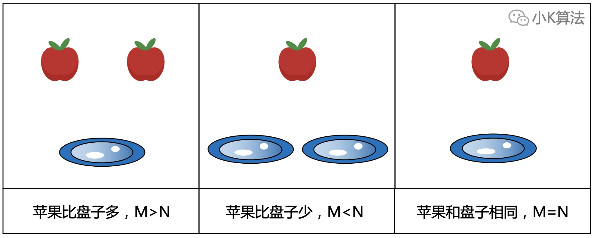
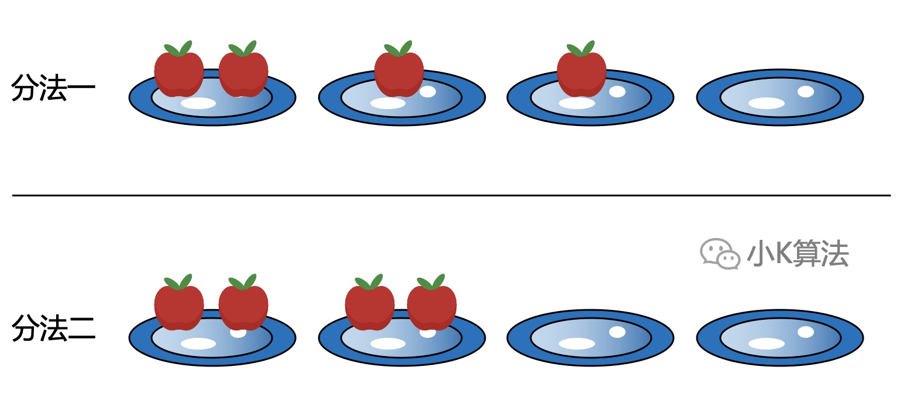

# 算法面试题：放苹果

### 1 故事起源
把M个苹果放在N个盘子里，允许有的盘子空着不放，那么总共有多少种不同的分法呢？  
注：5，1，1和1，5，1是同一种分法，且1<=M，N<=10。
<div align=center></div>

### 2 分析
#### 2.1 苹果和盘子数量关系
苹果和盘子的数量没有说明大小关系，那就意味着有3种情况：  
* 苹果比盘子多
* 苹果比盘子少
* 苹果和盘子数量相同

<div align=center></div>

如果苹果多，那么一定会有盘子放超过一个苹果。如果盘子多，那么一定会有空盘子。如果相等，情况就不一定。

#### 2.2 判断分法是否相同
所有的苹果是相同的，所有的盘子也是相同的，所以他们本身是无序的。  
其实这个问题就是把M个苹果分成不超过N堆，总共有多少种分法。所以可先按每堆苹果数量排序，依次比较每一堆的苹果，如果所有堆都一样才是相同的分法。这也就意味着堆数肯定相同，然后排序后每一堆也相同，这样才算是相同的分法。
<div align=center></div>

#### 2.3 怎样才是不同分法
上面有了相同分法的判断，那取反后自然就是不同的分法了。  
* 堆数不同一定是不同的分法。
* 堆数相同，但排序后，有超过一堆的数量不相同

如下，堆数不同，所以是不同的分法。
<div align=center></div>

如下，堆数相同，但有超过一堆的数量不同，所以也是不同的分法。
<div align=center></div>

### 3 划分子问题
知道了如何区分不同的分法，接着就是如何求出总共有多少种分法。
首先可以按堆数来划分，比如依次将M个苹果刚好分成1堆，2堆...，N堆，把所有的分法加起来，不就是总共不同的分法了吗？  

设f[m,n]表示M个苹果刚好分成N堆的方法数。  
那f[m,n]应该怎么求呢，或者说这个能否划分成小的子问题来求解？

**举例：**  
假设有5个苹果，需要刚好分成2堆，即f[5,2]。直接人工枚举，可以知道只有如下2种情况，即f[5,2]=2。
<div align=center></div>

继续思考，5个苹果要分成2堆，那这两堆，每一堆至少得有1个苹果，所以可以先在每一堆中放1个苹果，剩下的是不是就可以随意划分了。
<div align=center></div>

还剩下3个苹果可以随意划分，但依然不能重复，那问题是不是就变成把3个苹果分成1堆，2堆，即f[3,1],f[3,2]。  
<div align=center></div>

再仔细观察，这两种划分如果再合并上每一堆已经有的1个苹果，是不是和上面的f[5,2]的分法完全一样啊，这样已经划分出了子问题，接下来就依次求解就好了。

### 4 算法建模
设f[m,n]表示M个苹果刚好分成N堆的方法数，那最终要求的就是f[m,1]+f[m,2]+...+f[m,n]。  
这是一个递推关系，那肯定得有边界，不然从何推起呢？  
前面已经分析了m，n的大小关系不定，也就是有3种情况。  
* m<n，把m个苹果刚好分成n堆，明显是不可能的，所以f[m,n]=0
* m=n，把m个苹果刚好分成m堆，明显只有一种情况，就是每一堆1个，所以f[m,n]=1
* m>n，第3小节已经说明，这种情况就划分成子问题，先在每一堆放1个，剩下的再依次分成1堆，2堆...n堆，所以f[m,n]=f[m-n,1]+f[m-n,2]+...+f[m-n,n]

### 5 代码实现
**变量定义**
```cpp
int f[11][11];
```

**递归子问题**
```cpp
int solve(int m, int n) {
    if (f[m][n] != -1) return f[m][n];
    if (m < n) {
        f[m][n] = 0;
        return f[m][n];
    }
    if (m == n || n == 1) {
        f[m][n] = 1;
        return f[m][n];
    }
    f[m][n] = 0;
    for (int i = 1; i <= n; ++i) {
        f[m][n] += solve(m - n, i);
    }
    return f[m][n];
}
```

**main**
```cpp
int main() {
    int n, m;
    // 初始化为-1
    memset(f, 0xff, sizeof(f));
    cin >> m >> n;
    int ans = 0;
    for (int i = 1; i <= n; ++i) {
        ans += solve(m, i);
    }
    cout << ans << endl;
    return 0;
}
```

### 6 番外篇
以为已经解决完了？其实还没结束呢，因为还有一个更高级的解法，不过抽象程度更高，不太好理解。  

把M个苹果放在N个盘子里，其实可以直接划分成两种情况：
* 有空盘子
* 没有空盘子

那结果就是把两种情况相加即可。  
那怎么分解子问题呢，其实还是一样的，子问题也包括有空盘子和没有空盘子。  

还是假设M个苹果，N个盘子。  
有空盘子如何分解：  
其实就是先拿一个盘子出来空着，这样就变成了M个苹果，N-1个盘子。  
没有空盘子如何分解：  
其实就是先在每一个盘子放一个，这样就变成了M-N个苹果，N个盘子。  

我猜肯定有人会问，这样会不会重复统计啊。其实不会，上面2种大的情况肯定不会重复，在分解子问题的时候，子问题的属性并不会变。比如左边蓝色已经有一个空盘，下面的子问题无论怎么放置都有空盘。同理右边红色因为最开始已经在每个盘子放了一个苹果，所以无论子问题怎么放也一定没有空盘。  

<div align=center></div>

递归子问题分解出来的情况不会有重复，那组合起来也肯定不会有重复，所以这样递归出来的就是所有不同分法了。

而且每下分一次，一种是苹果减少，一种是空盘增多，因为总盘子数不变，那也就意味着有苹果的盘子数减少，即堆数减少，这不就是之前根据堆数不同的划分方法吗？苹果减少对应分解子问题，堆数减少对应分类，我们似乎在两种不同的方法间找到了一种莫名的联系。 

再画一个更形象的图帮大家理解，假设我要用0和1组合成不同的二进制数，从首位开始划分以0开头和以1开头，递归子问题依然保持这种性质，那么最终得到的数肯定不会有重复的。这跟上面的场景虽然不同，但都有类似的思想。
<div align=center></div>

**代码实现**
```cpp
int solve(int m, int n) {
    if (m < 0) return 0;
    if (m == 0 || n == 1) return 1;
    return solve(m - n, n) + solve(m, n - 1);
}
```

### 7 整数划分
再继续把问题抽象一下，如下有一个这样的数学问题：  
把一个整数n写成多个大于等于1小于等于它本身的整数的和，即n=m1+m2+...，则[m1,m2...]构成的一个集合称为n的一个划分，那么总共有多少种不同的划分呢？  
你品，你细品，这不就是同一个问题吗，只不过我们把它抽象成了一个纯数学问题，这就是很经典的整数划分问题。

### 8 总结
一般求总数的问题有几种情况，一是用排列组合公式，二是套用某种数列，如斐波拉契数列，三是自己构建递推或者递归公式。这个题首先可能会想到排列组合，高中数学经常遇到类似的问题，经典解法是“隔板法”。但这个问题的元素都是相同的，也无序，最大的难点就在于如何去重，所以排列组合不好解。不能直接套公式，那就用递推的方式分解子问题，其它就交给代码就好了。  

整个代码实现还是比较简单，但思考的过程其实并不简单，抽象思维的地方会比较多，大家要多分析规律，把抽象的问题变成具象的过程，这样就容易多了。

本文原创作者：小K，一个思维独特的写手。  
文章首发平台：微信公众号【小K算法】。  

如果喜欢小K的文章，请点个关注，分享给更多的人，小K将持续更新，谢谢啦！

---
**扫描下方二维码关注公众号，第一时间获取更新信息！**  
<div align=center></div>