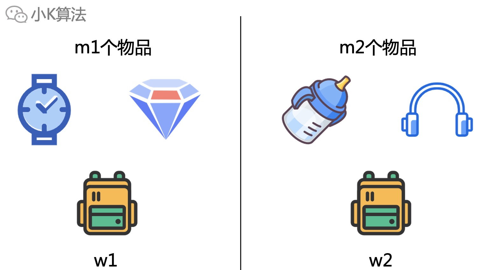

# 背包真的很简单


### 1 故事起源
有一个容量有限的背包，容量为w，以及m个待选择的物品，每个只有一件。每个物品有一定的重量和价值，那么选择哪些物品放入背包，可使选择的物品总价值最大呢？

<div align=center></div>

### 2 问题解析
如果背包没有容量限制，那肯定是把所有的物品都放入背包可使价值最大。
<div align=center></div>

但现在背包比较小，只能选择部分装进背包，比如只能放一个，那就把钻石装进去。
<div align=center></div>

很容易可以想到，尽量放重量小且单价高的物品，但怎么对问题进行一个严谨的建模呢，继续往下分析。

### 3 分析
背包有一个固定的容量，容量是1kg，或者2kg，或者3kg，其实具体的数量对问题的本质没有影响。
<div align=center></div>

对于物品来说，也就分两种情况，要么放入背包，要么不放。
<div align=center></div>

有m个物品，那总共就有2^m种选择方式，很明显这个数量很大，所以也不可能直接把所有的选择方式枚举出来。

### 4 小问题过度大问题
假设背包容量为1kg，那可装入的最大价值就是将手表装入，其他的也装不下。
<div align=center></div>

如果有一个更大的背包，它的容量可以看成是2个小容量的背包的总和。
<div align=center></div>

但它能装入的价值却不能简单的直接分解为2个小背包，因为物品只有一个，这会导致物品重复。
<div align=center></div>

所以对物品也再进行一次划分，m个物品可以分解为m1+m2个，同时背包容量也分解为w1+w2。
<div align=center></div>

再看上面左右两边，和原来的问题还是一样的，本质不变，只是变成了数据规模更小的一个子问题。如果有了子问题的答案，那是不是就可以组合成更大规模的答案了呢？  

我猜这里肯定有同学会说，这样分解的小问题一定能得到最终大问题的最优解吗？我们来尝试证明一下。


### 5 逆向思维
假设下面就是最终的最优解选择的物品。
<div align=center></div>

如果从某个位置砍一刀分开，保证w1和w2能装下自己这边的最终选择物品，那最优解也就被分成了两个小规模问题的最优解。这也说明如果枚举了所有小规模最优解的组合方式，也一定能得到大规模的最优解。
<div align=center></div>

### 6 算法建模
根据上面的分析，现在问题就变得简单了，直接按物品和重量拆分小问题，通过小问题递推出大问题就行了。

设f[i][j]表示前i个物品背包容量为j时，能选择的最大价值。w[i]表示第i个物品的重量，v[i]表示第i个物品的价值。 
* 装不下第i个物品，则f[i][j]=f[i-1][j] 
* 能装下第i个物品，则f[i][j]=max(f[i][j],f[i-1][j-w[i]]+v[i])

那为什么只需要从前i-1个物品递推就行了呢，因为只需要有一种情况能得到最优解就够了，并不需要把前面的所有划分都枚举出来。这其实就相当于把i个物品划分成i-1个物品和1个物品时的情况。前面的子问题也已经包含在当前的解中了。

**代码实现**
```cpp
int f[101][1001], w[101], v[101];
int n, m;
int main() {
    cin >> m >> n;
    for (int i = 1; i <= m; ++i) {
        cin >> w[i] >> v[i];
    }
    f[0][0] = 0;
    for (int i = 1; i <= m; ++i) {
        for (int j = 0; j <= n; ++j) {
            f[i][j] = f[i - 1][j];
            if (j >= w[i]) {
                f[i][j] = max(f[i][j], f[i - 1][j - w[i]] + v[i]);
            }
        }
    }
    cout << f[m][n] << endl;
    return 0;
}
```

### 7 总结
背包在动态规划中是一个非常重要的系列，涉及的类型和变种也非常的多，今天讲的01背包是最基本的一种，不过真正理解了01背包，对后续其它的背包也才能更好的掌握。

本文原创作者：小K，一个思维独特的写手。  
文章首发平台：微信公众号【小K算法】。  

如果喜欢小K的文章，请点个关注，分享给更多的人，小K将持续更新，谢谢啦！

---
**扫描下方二维码关注公众号，第一时间获取更新信息！**  
<div align=center></div>