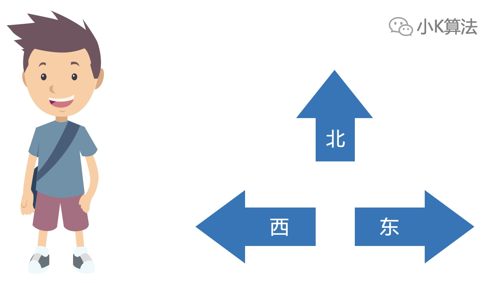
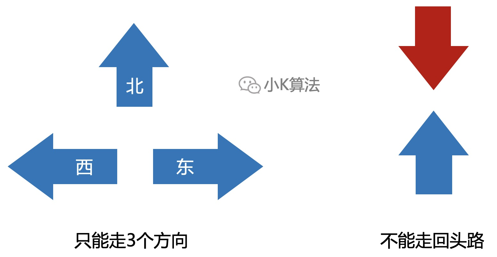
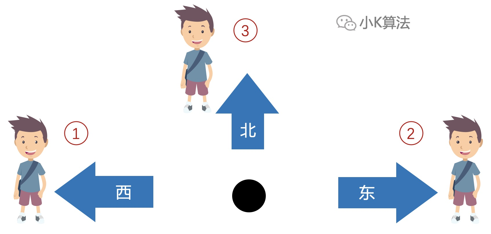
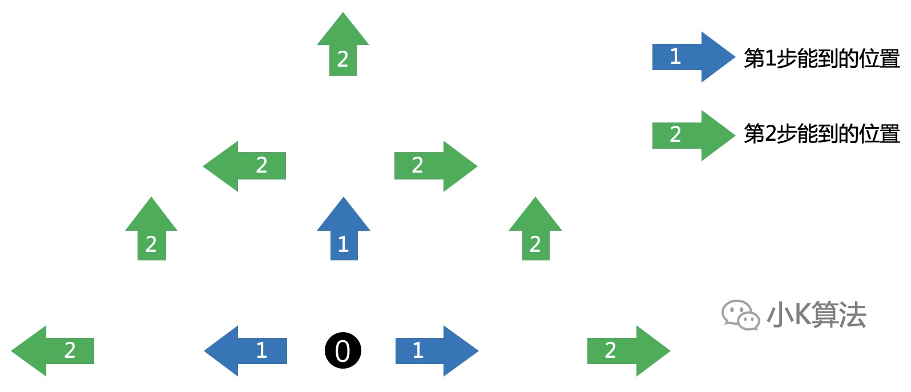
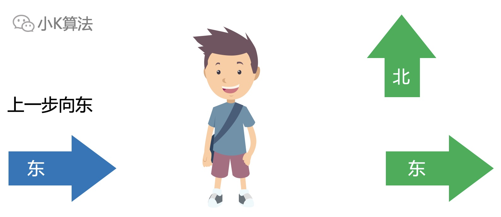
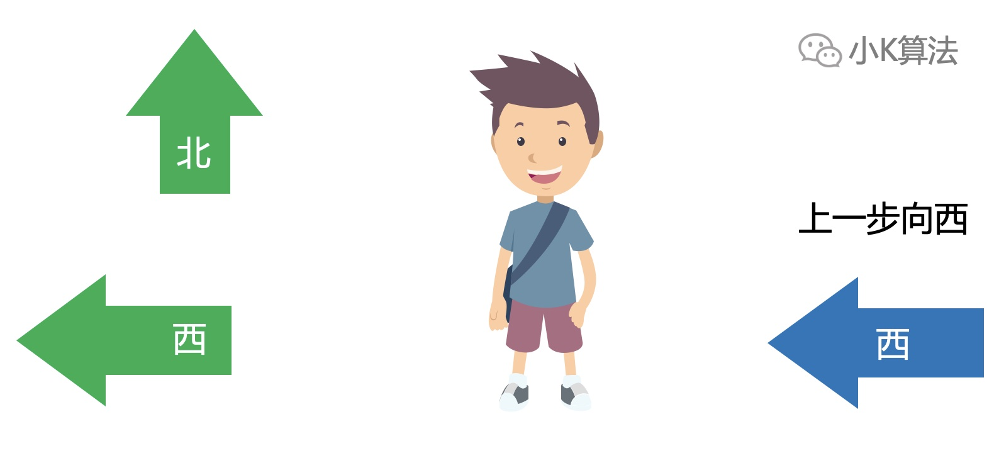
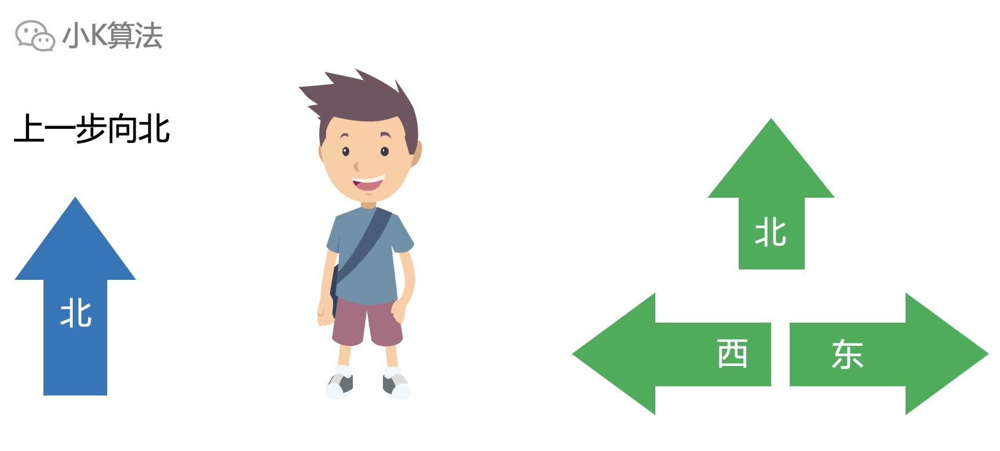

# 算法：路线

### 1 故事起源
从原点出发，每次只能向东，向北，向西走，且不能走已经走过的地方，那么走N步共有多少种不同的方式呢？

<div align=center></div>

### 2 分析

#### 2.1 条件分析
首先分析题目的限制条件，其实就2个。一是只有3个方向，二是不能走回头路。
<div align=center></div>

#### 2.2 走一步
走一步，只有3种路线。
<div align=center></div>

#### 2.3 走两步
走第二步要从前一步能到达的位置出发，所以总共就有7种方式。
<div align=center></div>

#### 2.4 规律
可以发现，每一步能走的地方其实与上一步有关。每次走一步，要保证不走回头路，也就是不走上一步走过的地方就行了。 

第i-1步向东走，那么第i步只能向北、向东。
<div align=center></div>

第i-1步向西走，那么第i步只能向北、向西。
<div align=center></div>

第i-1步向北走，那么第i步可以向北，向东，向西。
<div align=center></div>

### 3 算法建模
一维的f[i]只能记录一个总数，而不能记录状态，所以要再多一维记录每一步走的方向。    
设f[i][0]，f[i][1]，f[i][2]分别表示：第i步向东、向西、向北走的不同路线总数。    
则有如下递推关系：  
* 第i步向东，等于上一步向东和向北之和，即f[i][0] = f[i - 1][0] + f[i - 1][2]
* 第i步向西，等于上一步向西和向北之和，即f[i][1] = f[i - 1][1] + f[i - 1][2]
* 第i步向北，等于上一步向东，向西，向北之和，即f[i][2] = f[i - 1][0] + f[i - 1][1] + f[i - 1][2];

则走n步的总数即为f[n][0]+f[n][1]+f[n][2]。  

**代码实现**
```cpp
int f[100][3] = {0};
f[0][0] = 1;
f[0][1] = 1;
f[0][2] = 1;
for (int i = 1; i < n; ++i) {
    f[i][0] = f[i - 1][0] + f[i - 1][2];
    f[i][1] = f[i - 1][1] + f[i - 1][2];
    f[i][2] = f[i - 1][0] + f[i - 1][1] + f[i - 1][2];
}
cout << f[n - 1][0] + f[n - 1][1] + f[n - 1][2] << endl;
```

### 4 优化
设第i步的总方案数为s[i]。  
s[i]=f[i][0]+f[i][1]+f[i][2]。  
=2\*f[i-1][0]+2\*f[i-1][1]+3\*f[i-1][2]。  
=2*s[i-1]+f[i-1][2]。  

而f[i-1][2]=f[i-2][0]+f[i-2][1]+f[i-2][2]=s[i-2]。  
得s[i]=2*s[i-1]+s[i-2]。
  
所以对公式变形，也可以通过一维完成递推。

**代码实现**
```cpp
int s[100];
s[0] = 1;
s[1] = 3;
for (int i = 2; i < n; ++i) {
    s[i] = 2 * s[i - 1] + s[i - 2];
}
cout << s[n - 1] << endl;
```

### 5 总结
对于求总数的问题，递推的应用其实非常广泛，因为执行效率比较高。其它的方法比如枚举、搜索，效率就比较低了。递推算法也是非常考验抽象能力，很多问题最终的模型都很简单，但思考的过程却非常复杂，所以大家可以多思考一些递推问题，对于思维能力的训练有很大帮助。

本文原创作者：小K，一个思维独特的写手。  
文章首发平台：微信公众号【小K算法】。  

如果喜欢小K的文章，请点个关注，分享给更多的人，小K将持续更新，谢谢啦！

---
**扫描下方二维码关注公众号，第一时间获取更新信息！**  
<div align=center></div>