# 通俗易懂的链表

### 1 数组
数组是最简单的数据结构，存放一组相同类型的数据，可以通过下标快速进行读写操作。
<div align=center>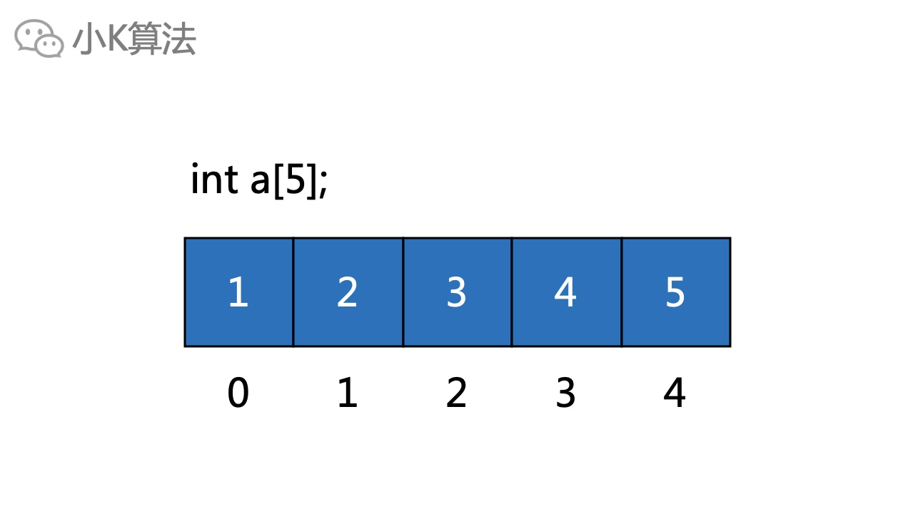</div>

它在内存中也是一段连续的地址。
<div align=center>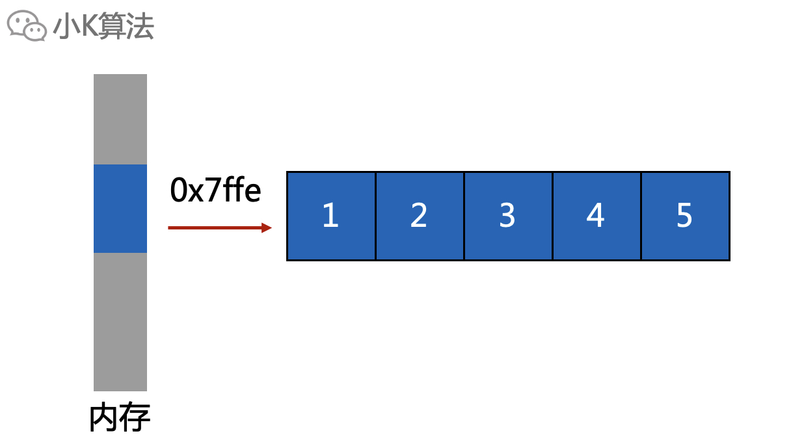</div>

如果告诉你数组的首地址，对地址递增，就可以遍历完数组的所有元素。
<div align=center>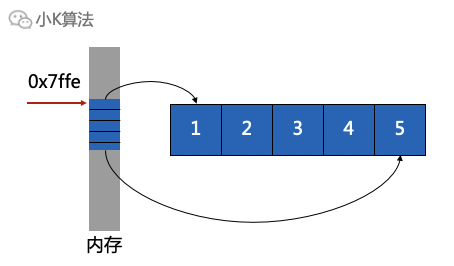</div>

但如果要删除元素，比如删除中间的一个元素，首先得找到这个元素。
<div align=center>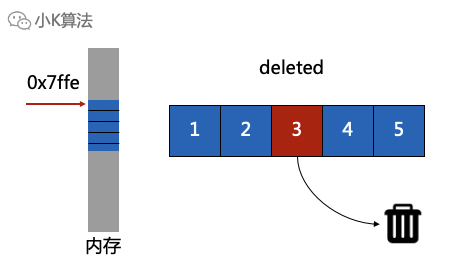</div>

然后用下一个元素覆盖掉当前元素，同理后面的所有元素都需要前移一位，时间复杂度为O(n)，当数据量很大时，效率就非常低。
<div align=center>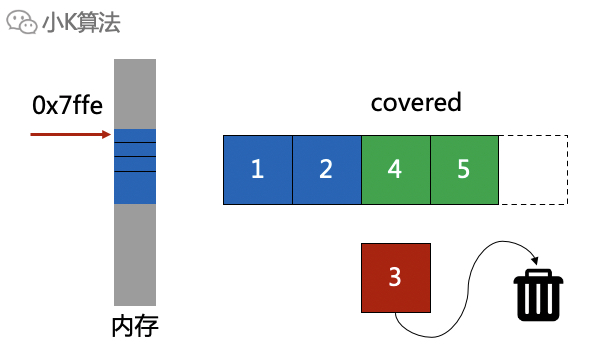</div>

那有没有办法改进呢？

### 2 链表
针对上面的问题，于是出现了链表。首先链表也是存在于内存中的数据结构，和数组不同的是，它不是一段连续的地址。
<div align=center>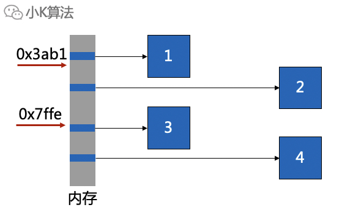</div>

为了能够遍历每个元素，所以需要将所有的元素串联起来，这就是链表的定义。
<div align=center>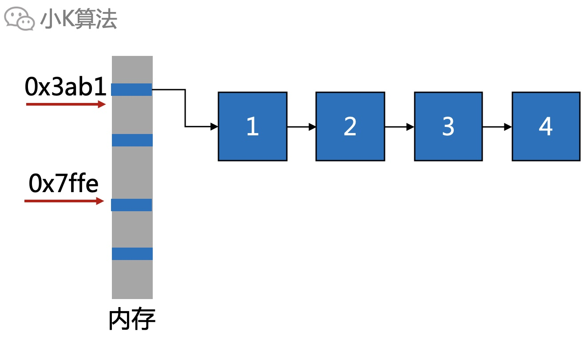</div>

所以每一个链表元素需要存储两个最重要的信息，一个是数据，另一个就是下一个元素的地址。
<div align=center>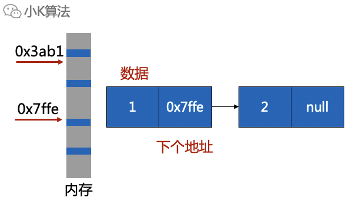</div>

### 3 链表定义
每一个结点，存储数据和下一元素的地址。为了方便操作，一般还需要定义一个头指针和尾指针，分别指向链表的头和尾。
<div align=center>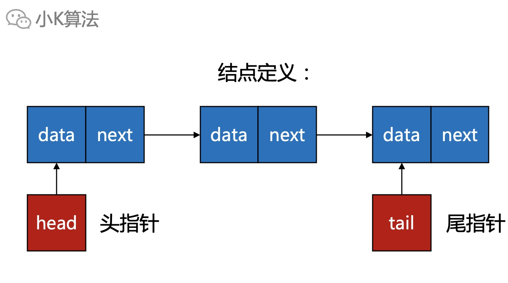</div>

**代码如下：**
```cpp
struct LinkNode {
    int data;
    LinkNode *next;
};
LinkNode *head, *tail;
```

### 4 插入结点
插入一般分两种，从头或尾插入新结点。  
从头插入：先新建一个结点，将新结点指向头结点，再将头指针指向新结点。
<div align=center>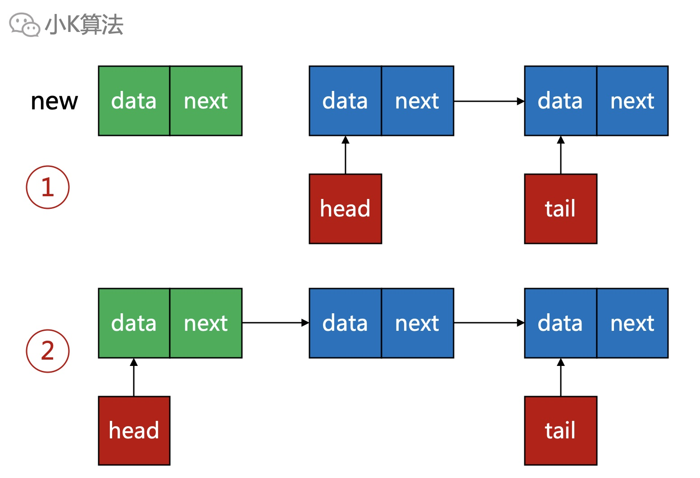</div>

**代码如下：**
```cpp
void insertFromHead(int x) {
    LinkNode *node = new LinkNode{x};
    if (head == nullptr) {
        head = node;
        tail = node;
    } else {
        node->next = head;
        head = node;
    }
}
```

从尾插入：先新建一个结点，将尾结点指向新结点，再将尾指针指向新结点。
<div align=center>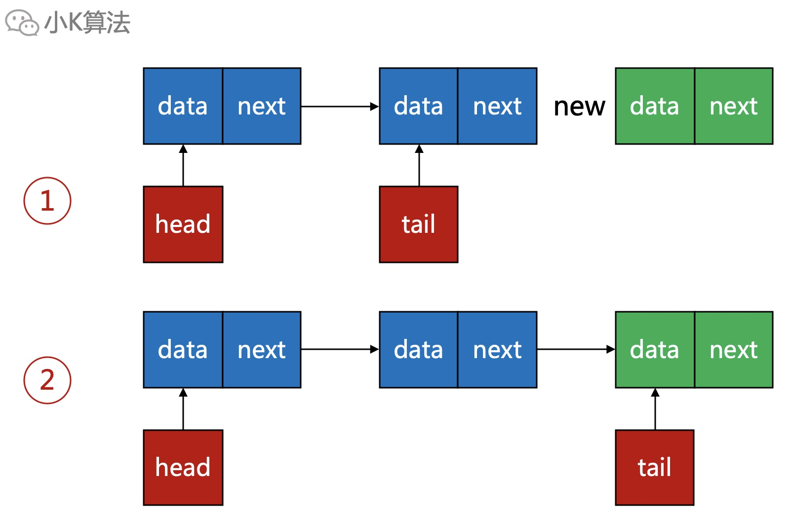</div>

**代码如下：**
```cpp
void insertFromTail(int x) {
    LinkNode *node = new LinkNode{x};
    if (head == nullptr) {
        head = node;
        tail = node;
    } else {
        tail->next = node;
        tail = node;
    }
}
```

### 5 删除结点
先找到要删除的结点，将上一结点的next指向当前结点的next，再释放当前结点。
<div align=center>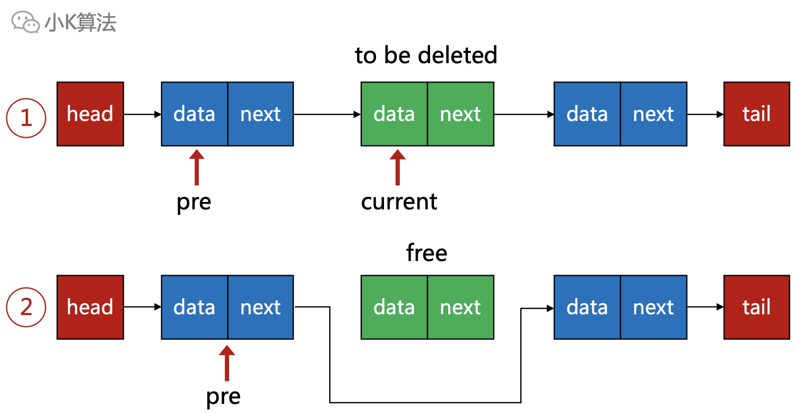</div>

**代码如下：**
```cpp
void deleteNode(LinkNode **head, int x) {
    LinkNode *pre;
    // 如果头结点是要删除的结点
    pre = *head;
    if ((*head)->data == x) {
        (*head) = (*head)->next;
        delete pre;
        return;
    }
    // 寻找要删除的结点
    while (pre->next != nullptr && pre->next->data != x) {
        pre = pre->next;
    }
    // 如果找到，则删除结点
    LinkNode *current;
    if (pre->next != nullptr) {
        current = pre->next;
        pre->next = pre->next->next;
        delete current;
    }
}
```

### 6 遍历结点
从头结点开始，依次读取直到结点为空。
<div align=center>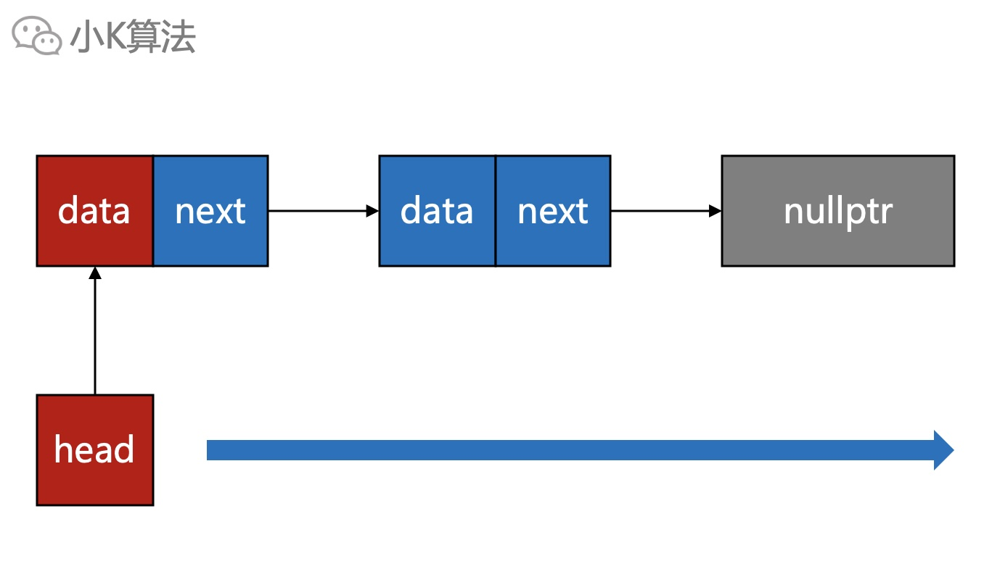</div>

**代码如下：**
```cpp
void printLink(LinkNode *head) {
    while (head != nullptr) {
        cout << head->data << endl;
        head = head->next;
    }
}
```

### 7 总结
数组读写都是O(1)，适合元素个数固定的场景。链表对于插入和删除操作都是O(1)，但访问却是O(n)，所以更适合频繁增减元素的场景。  
数组和链表都各有优缺点，互补。那有没有更完美的数据结构呢，既有数组的快速访问效率，又有链表的快速增减效率？那肯定是有的，有需求就有市场，用数组加链表组合起来，这不就是满大街都在用的hashmap了吗，欲知hashmap详情，即听下文分解。

本文原创作者：小K，一个思维独特的写手。  
文章首发平台：微信公众号【小K算法】。  

如果喜欢小K的文章，请点个关注，分享给更多的人，小K将持续更新，谢谢啦！

---
**扫描下方二维码关注公众号，第一时间获取更新信息！**  
<div align=center></div>