# 一种比线段树还高效的区间算法

### 1 故事起源
有N个数排列成一排，给定一个区间，如何快速找出区间内最大的数是多少呢？
<div align=center>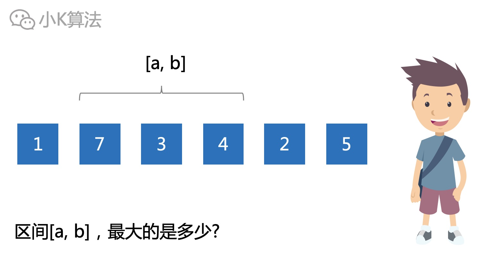</div>


### 2 分析
首先想到的自然是从区间头开始，依次遍历完区间内的元素，这样就可以找出结果了。但这个复杂度是O(n)，肯定不是我们想要的。
<div align=center>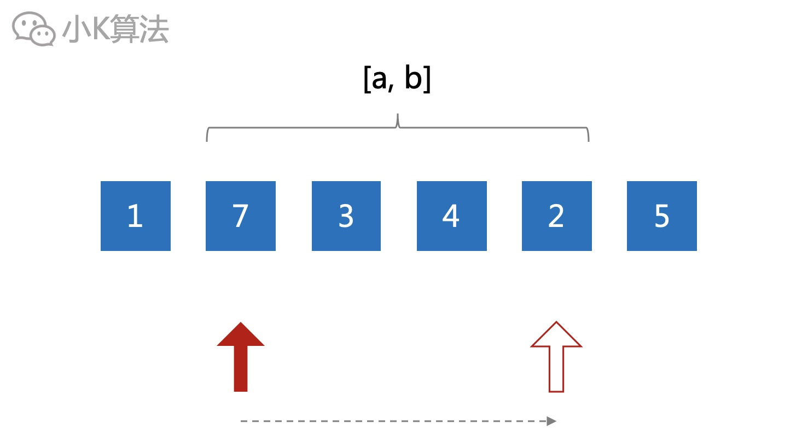</div>

再来分析一下有什么特点呢？  
这些数不会更改，所以每个区间的结果是不会变的，是否可以把所有的区间结果先计算出来？
<div align=center>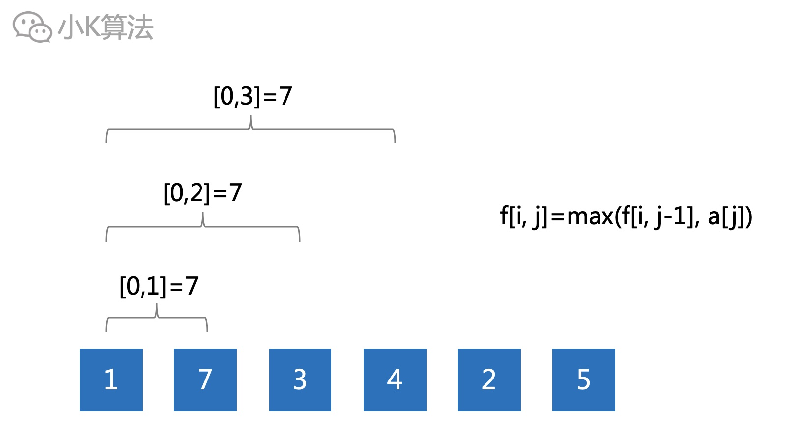</div>

如果数据规模很小确实可以，一旦数据过大肯定就不行了，因为时间和空间都是O(n^2)。
<div align=center>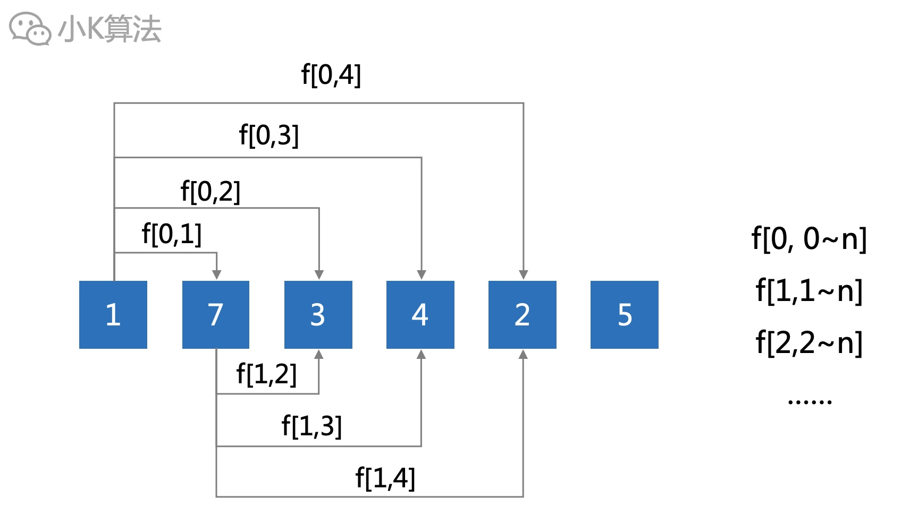</div>

再考虑一下，区间的最值是有很强的传递关系，这就引导我们可以把大问题化为小问题。
<div align=center>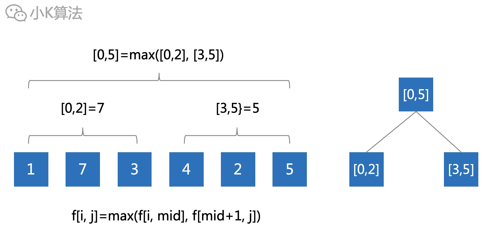</div>

很显然，这就是一个标准的线段树模型，不过今天我们再换一个更加高效的算法，稀疏表。

### 3 稀疏表
稀疏表的思想就是提前预处理数据，所以主要针对数据不变的情况，而线段树更加灵活，可以动态维护数据的变化。

首先还是将区间划分成很多的小区间。那如何划分更合理？  
第2章节中，我们枚举了所有的区间情况，可以看出其实有很多重复的情况，比如下面[0,3]其实可以通过[0,1]和[2,3]组合出来。
<div align=center>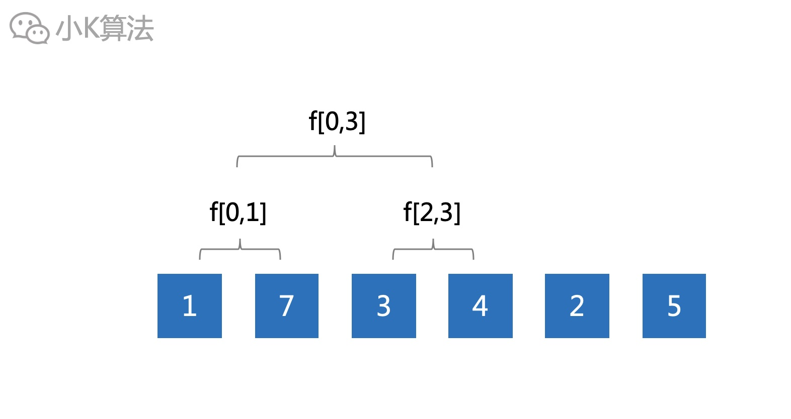</div>

可以根据长度划分区间。   
设数组为a[i]，f[i][j]表示区间[i,j]的最大值。  
则长度为1的区间总共有n个，f[i][i]=a[i]。
<div align=center>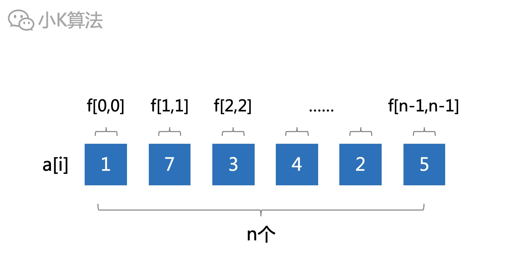</div>

长度为2的区间总共有n-1个。
<div align=center>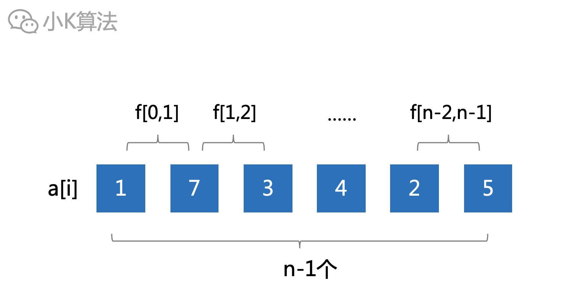</div>

因为之前已经求出了长度为1的区间的最大值，所以区间长度为2的最大值可以通过区间长度为1的结果直接推出来。
<div align=center>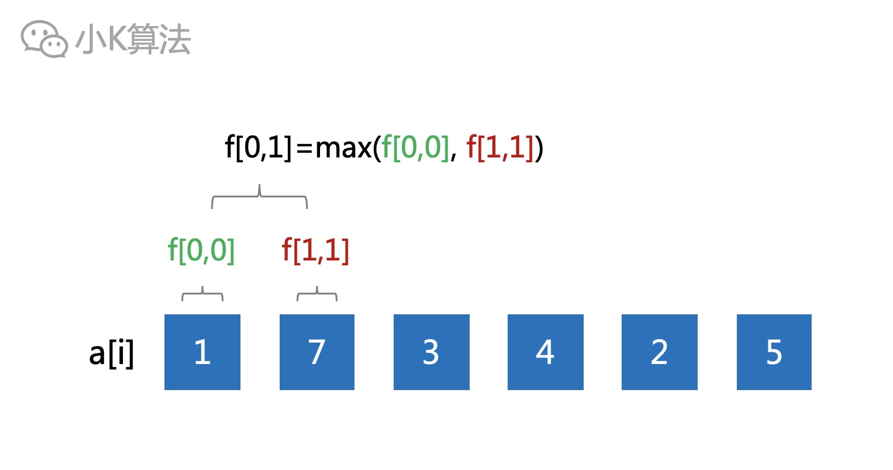</div>

接下来就考虑长度为3的区间了吗？  
其实并不是，因为前面已经有了长度为1和2的，所以可以组合出长度为3和4的。
<div align=center>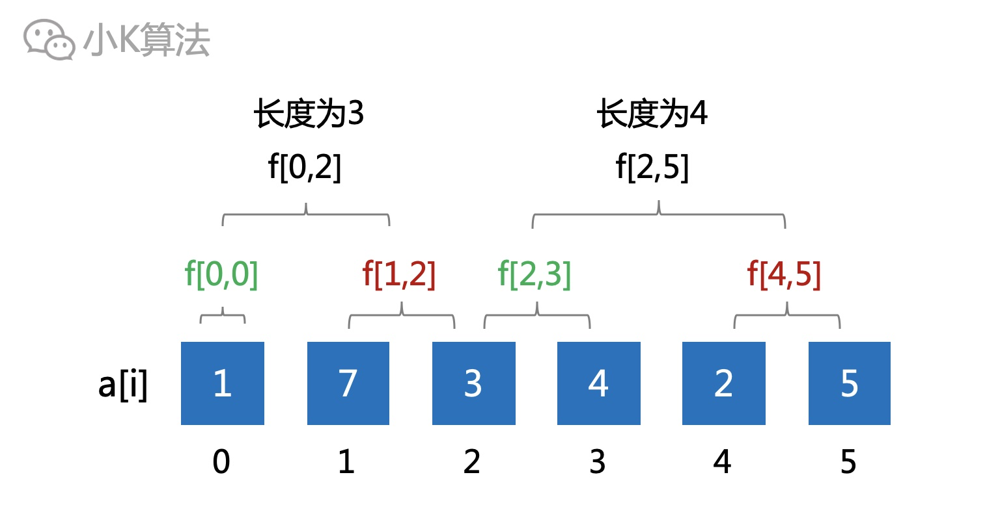</div>

那就直接考虑长度为5的吗？  
如果考虑为5的，那你怎么计算呢，前面的也推不出长度为5的结果啊，至少得有3个区间才能推出来。
<div align=center>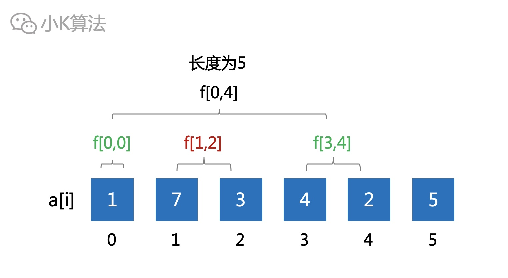</div>

所以接下来考虑长度为4的区间才是正解，总共有n-3个。
<div align=center>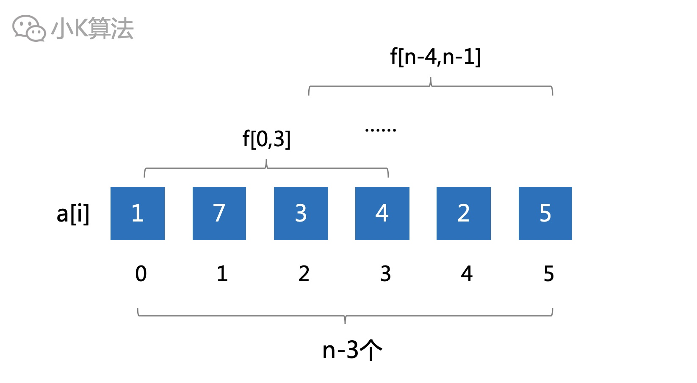</div>

再接下来自然就是考虑长度为8的区间了，总共有n-7个。  
但这里有个很明显的问题，就是我们的数组f[i,j]定义的不合理，因为里面很多的小区间没有用上，比如长度为3，5，6，7等，所以需要重新定义。

### 4 状态压缩
可以将第二维用于表示区间长度，第一维表示区间起点，对第二维就可以进行状态压缩。  
设f[i,j]表示从i开始，长度为2^j的区间的最大值，即区间[i,i+2^j-1]。
<div align=center>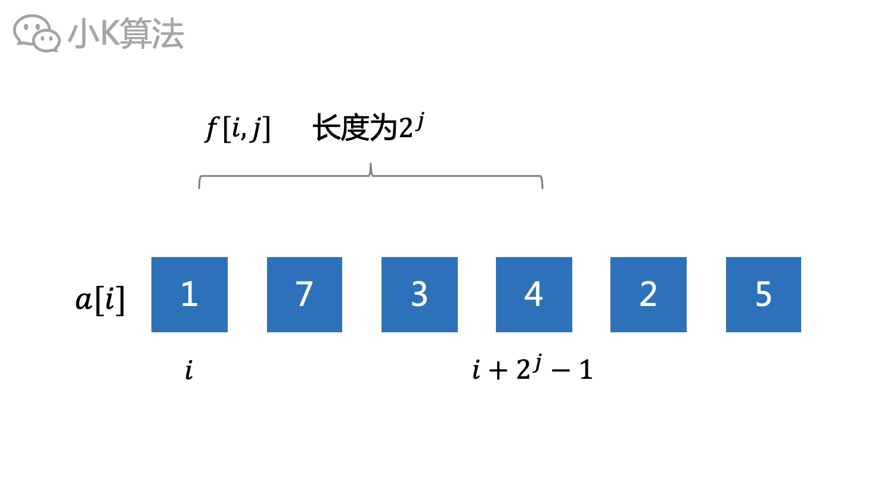</div>


则长度为2^j的区间就可以通过左右2个长度为2^(j-1)的区间推出结果。时间和空间的复杂度都为O(nlogn)。
<div align=center>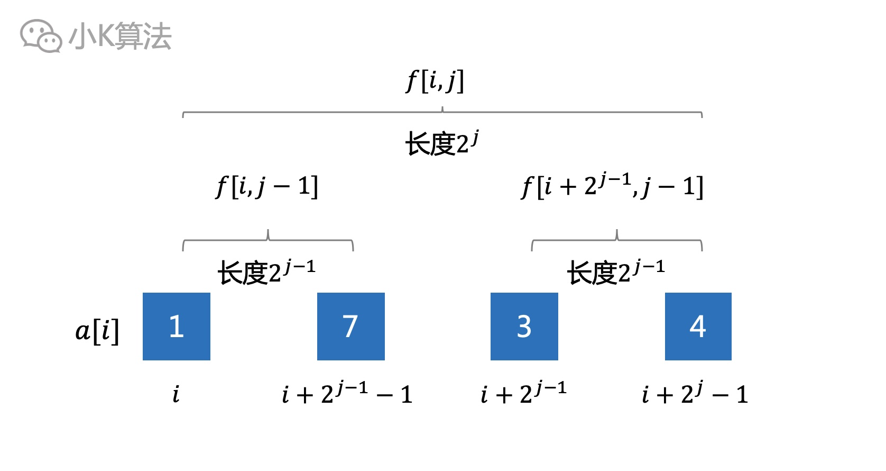</div>

### 5 区间分解
那查询结果的时候要怎么处理呢，我们只计算了长度为2^j的区间，并没有计算长度为3、5、7等区间的结果。  

所以这个处理和线段树的思想也类似，需要进行区间分解。不过线段树可能分解成很多个区间，而稀疏表只需要分解成2个区间就可以了。  

对于任意区间[a,b]，长度为b-a+1，总可以找到2个长度为2^j的区间，这2个区间组合起来可以完全覆盖[a,b]，其中j的值为log(b-a+1)。  

左边的区间左端点从a开始，长度为2^j，即区间[a,a+2^j-1]。右边的区间右端点从b开始，长度为2^j，即区间[b-2^j+1,b]。  
则区间[a,b]的最大值就是这两个区间中更大的那个，即max(f[a,j],f[b-2^j+1,j])。
<div align=center>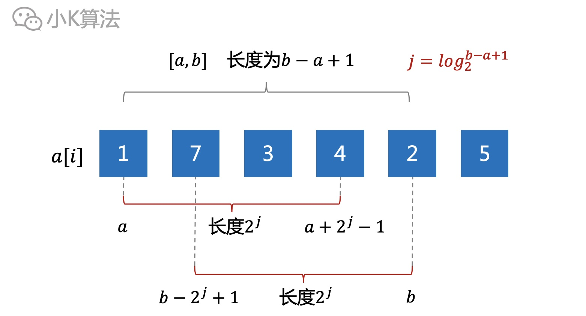</div>

### 6 代码实现
代码实现了最大值和最小值的获取。

**变量定义**
```cpp
int high[50000][17], low[50000][17], n, q;
```

**预处理**
```cpp
void solve() {
    // 枚举区间长度，2^j<=n
    for (int j = 1; (1 << j) <= n; ++j) {
        // 枚举左端点i，右端点i+2^j-1<=n-1
        for (int i = 0; i + (1 << j) <= n; ++i) {
            high[i][j] = max(high[i][j - 1], high[i + (1 << (j - 1))][j - 1]);
            low[i][j] = min(low[i][j - 1], low[i + (1 << (j - 1))][j - 1]);
        }
    }
}
```

**main函数**
```cpp
int main() {
    cin >> n >> q;
    for (int i = 0; i < n; ++i) {
        cin >> high[i][0];
        low[i][0] = high[i][0];
    }
    solve();
    for (int i = 0; i < q; ++i) {
        int a, b;
        cin >> a >> b;
        a--;
        b--;
        int j = (int) (log(b - a + 1.0) / log(2.0));
        int minHeight = min(low[a][j], low[b - (1 << j) + 1][j]);
        int maxHeight = max(high[a][j], high[b - (1 << j) + 1][j]);
        cout << maxHeight - minHeight << endl;
    }
    return 0;
}
```

### 7 总结
对于数据不变的情况，可以用稀疏表预处理，这种属于离线算法。如果要动态维护变化，动态查询，那就得用在线算法，比如线段树。但稀疏表的效率确实高，有状态压缩和动态规划的思想，值得深入研究学习。

本文原创作者：小K，一个思维独特的写手。  
文章首发平台：微信公众号【小K算法】。  

如果喜欢小K的文章，请点个关注，分享给更多的人，小K将持续更新，谢谢啦！

---
**扫描下方二维码关注公众号，第一时间获取更新信息！**  
<div align=center></div>