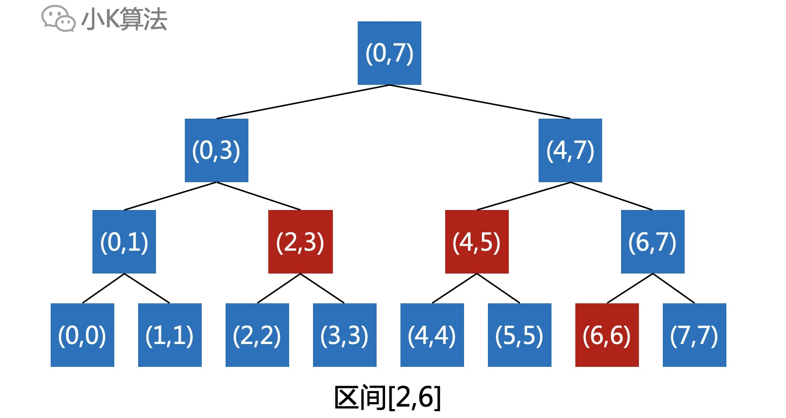

# 彻底搞懂线段树

### 1 故事起源
有N个数排列成一排，如何快速计算某个区间的和呢？
<div align=center></div>

如果要求区间[a,b]的和，那第一想法就是直接遍历区间[a,b]，把所有的加起来就行了。但这样效率太低，总共进行b-a+1次操作，O(n)复杂度。
<div align=center></div>

那有没有O(1)的复杂度呢？这时就得考虑用空间换时间的策略了。  
可以先对数据进行预处理，先计算出前i个数的总和num[i]，则区间[i+1,j]的和就等于num[j]-num[i]。
<div align=center></div>

如果还可能对数据进行修改，甚至是批量操作，比如对区间[x,y]的所有数都加上一个数c，这时再问你区间[a,b]的和是多少呢？  
因为数据改变，上面预处理的数组num[i]就没法使用了。
<div align=center></div>

It seems that things become so complicated...


### 2 分析
问题很清晰，第一是对数据进行修改，第二是对数据进行查询，但还有一些隐藏的特点不能忽略。  
修改和查询都是对一个区间操作，并且修改的策略是一样的，都是增加一个数c，所以有没有办法也进行批量处理？

根据之前的预处理可以在O(1)时间计算出区间[a,b]的和，如果对某区间[x,y]进行了修改，其实也不必对每一个数进行真正的修改后再更新num[i]。  

比如[x,y]属于[a,b]，可以先记录操作[x,y]+c，区间[x,y]总共有y-x+1个数，每个数加c，则区间[a,b]的总和就是增加了c*(y-x+1)。
<div align=center></div>

如果[x,y]不属于[a,b]，也可以先把[x,y]拆分成2个区间，然后进行和上面相同的操作即可。
<div align=center></div>

如果有多个操作叠加起来，比如[x,y]+c，[m,n]+d等，虽然不能直接计算结果，但到这里已经启发我们其实可以将区间划分成很多小区间，这样就可以对区间进行批处理。  

那如何划分更合理呢，这就要说到线段树了。

### 3 线段树
对于一个[0,7]的区间，可以通过二分的方式，划分成很多小区间。
<div align=center></div>

如果将每一个区间都看成是一个树的结点，所有的区间就正好对应了一棵二叉树，这就是**线段树**。
<div align=center></div>

那这棵树有什么用呢？

问得好，这棵树就是我们实现高效操作的基础。

### 4 区间分解
前面我们的问题是可以对任意的区间进行修改或者查询操作，但线段树结点只有2n个，这如何对应任意区间呢？

这就是最关键的一步，对于任意区间，都可以分解为线段树中的最少若干个结点。

比如区间[3,7]，可以用2个结点表示。
<div align=center></div>

比如区间[2,6]，可以用3个结点表示。
<div align=center></div>

发现规律了吗？  
以区间[2,7]举例如下：  
从根结点开始向下搜索，如果当前结点包含于目标区间，则标记该结点并直接返回，否则继续向下查找左右子结点，所标记的结点就是分解的小区间。
<div align=center></div>

因为线段树的所有结点水平之间都没有交集，只有上下包含关系，所以分解的结点也没有交集，这就可以把任意区间[a,b]分解为最少的n个结点。而且这个结点数n是远小于b-a+1的。  
对于区间[a,b]的操作，就可以分解为对这n个小区间的操作。

例如要对区间[2,7]执行加c的操作，只需要在分解之后的2个结点加c就可以了，返回的时候再沿路更新父结点所代表的区间总和。
<div align=center></div>

但这时有人会问了，如果下次查询区间[3,5]的和不就出问题了吗，因为这2个结点上面并没有加c啊。
<div align=center></div>

问得好，这就是线段树的另一个精髓思想，即Lazy思想。

### 5 Lazy思想
前面之所以要分解成尽量少的若干个结点，就是想对更少的结点操作以达到我们的目的，如果对线段树下面的每一个结点都进行操作就回退成O(n)的复杂度了。  
但为了保证结果的正确性，有一些还是得执行，只是不用立即执行，这就是Lazy思想。

那延迟到什么时候执行之前没执行的操作呢？其实就是在下次有必要经过的时候，顺带把之前本应该执行而未执行的操作给补上就行了。  

例如区间[3,5]，会经过[4,7]这个结点，但之前[4,7]结点有记录下面所有子结点都应该增加c，所以这时顺带把c加到子结点上，同时[4,7]上的记录也要清除，这就能保证结果正确。  
<div align=center></div>

如果没有经过的结点，比如[6,6]，[7,7]等，因为查询没有经过，所以也用不上，就等下次经过的时候再更新就可以了。更新和查询都是O(logN)复杂度。

### 6 代码实现
结点定义，需要包含子结点以及区间范围，其它附带的信息可根据情况而定。
<div align=center></div>

总和total是在返回的时候向上传递。
<div align=center></div>

应该增加的extra是在向下分解的过程中向下传递。
<div align=center></div>

**结点定义：**
```cpp
struct SegmentTree {
    long long left, right, total, childrenExtra;
    SegmentTree *lson, *rson;
};
// 获取区间个数
long long regionLength(SegmentTree *tree) {
    return tree->right - tree->left + 1;
}
// 将父结点未完成的操作更新到子结点
void updateChildren(SegmentTree *root) {
    if (root->lson != NULL && root->rson != NULL && root->childrenExtra != 0) {
        root->lson->total += root->childrenExtra * regionLength(root->lson);
        root->lson->childrenExtra += root->childrenExtra;
        root->rson->total += root->childrenExtra * regionLength(root->rson);
        root->rson->childrenExtra += root->childrenExtra;
        root->childrenExtra = 0;
    }
}
```

线段树构建，对完整区间进行二分递归即可。  
**线段树构建**
```cpp
SegmentTree *buildTree(vector<long long> &num, long long l, long long r) {
    if (l > r) {
        return NULL;
    }
    if (l == r) {
        SegmentTree *root = new SegmentTree;
        root->left = l;
        root->right = r;
        root->total = num[l];
        root->childrenExtra = 0;
        root->lson = NULL;
        root->rson = NULL;
        return root;
    }
    SegmentTree *root = new SegmentTree;
    root->left = l;
    root->right = r;
    root->childrenExtra = 0;
    long long mid = (l + r) >> 1;
    root->lson = buildTree(num, l, mid);
    root->rson = buildTree(num, mid + 1, r);
    root->total = root->lson->total + root->rson->total;
    return root;
}
```

**区间更新**
```cpp
void addRegion(SegmentTree *root, long long regionLeft, long long regionRight, long long addNum) {
    if (root == NULL || root->right < regionLeft || root->left > regionRight) {
        return;
    }
    if (root->left >= regionLeft && root->right <= regionRight) {
        root->total += addNum * regionLength(root);
        if (root->left < root->right)root->childrenExtra += addNum;
        return;
    }
    updateChildren(root);
    addRegion(root->lson, regionLeft, regionRight, addNum);
    addRegion(root->rson, regionLeft, regionRight, addNum);
    root->total = root->lson->total + root->rson->total;
}
```

**区间查询**
```cpp
void queryRegion(SegmentTree *root, long long regionLeft, long long regionRight, long long &sum) {
    if (root == NULL || root->right < regionLeft || root->left > regionRight) {
        return;
    }
    if (root->left >= regionLeft && root->right <= regionRight) {
        sum += root->total;
        return;
    }
    updateChildren(root);
    queryRegion(root->lson, regionLeft, regionRight, sum);
    queryRegion(root->rson, regionLeft, regionRight, sum);
}
```
 
**main函数**
```cpp
int main() {
    ifstream fin("a.in");
    ofstream fout("a.out");
    long long n, q, i, a, b, c;
    char type[2];
    SegmentTree *root;
    fin >> n >> q;
    vector<long long> num(n, 0);
    for (i = 0; i < n; i++) {
        fin >> num[i];
    }
    n--;
    root = buildTree(num, 0, n);
    for (i = 0; i < q; i++) {
        fin >> type;
        if (type[0] == 'C') {
            fin >> a >> b >> c;
            addRegion(root, a - 1, b - 1, c);
        } else {
            fin >> a >> b;
            long long sum = 0;
            queryRegion(root, a - 1, b - 1, sum);
            fout << sum << endl;
        }
    }
    return 0;
}
```

### 7 总结
线段树能做的事情远不止区间求和，只要跟区间操作相关的，都可以尝试用线段树的模型，例如区间求最大值，线段覆盖数等。本质原理就是把对一个大区间的操作分解为若干个小区间，既保证结果正确的同时，又提高了维护的效率。

二分，二叉，YYDS。

本文原创作者：小K，一个思维独特的写手。  
文章首发平台：微信公众号【小K算法】。  

如果喜欢小K的文章，请点个关注，分享给更多的人，小K将持续更新，谢谢啦！

---
**扫描下方二维码关注公众号，第一时间获取更新信息！**  
<div align=center></div>