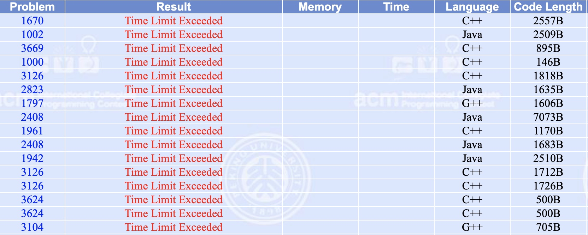
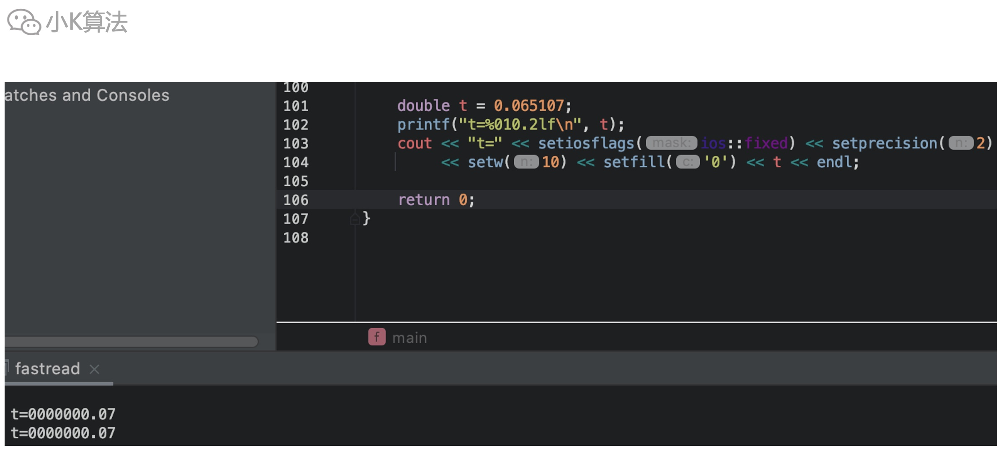
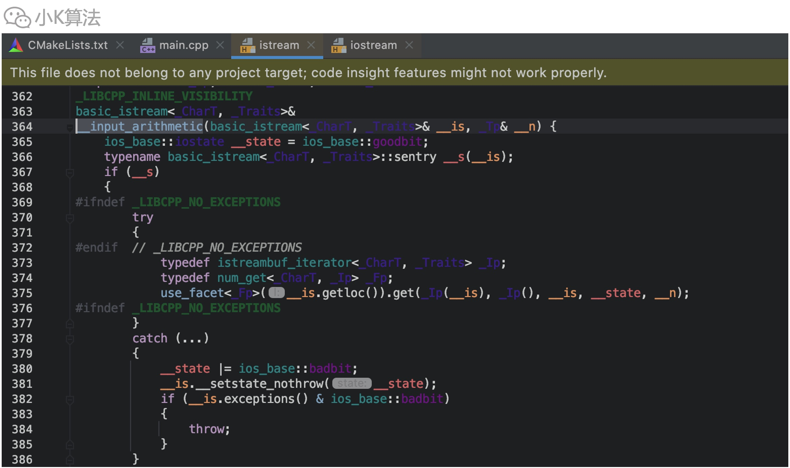
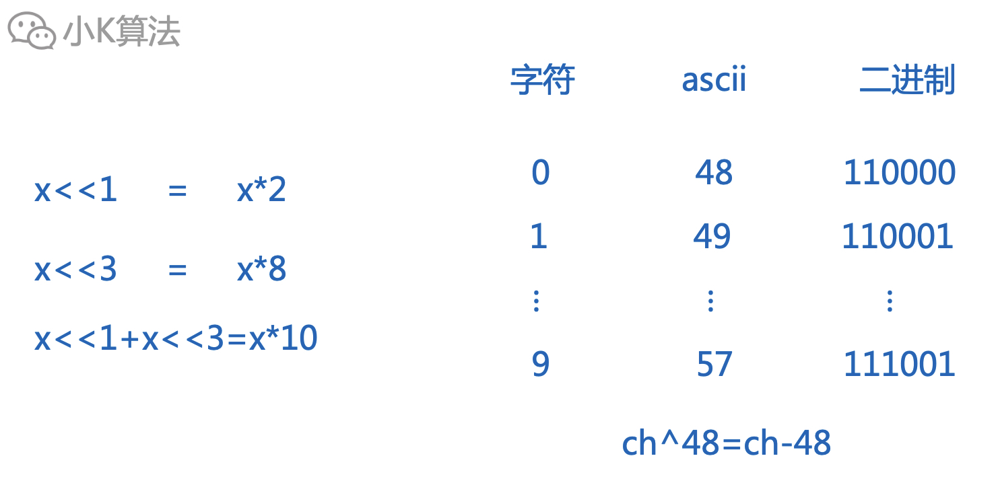
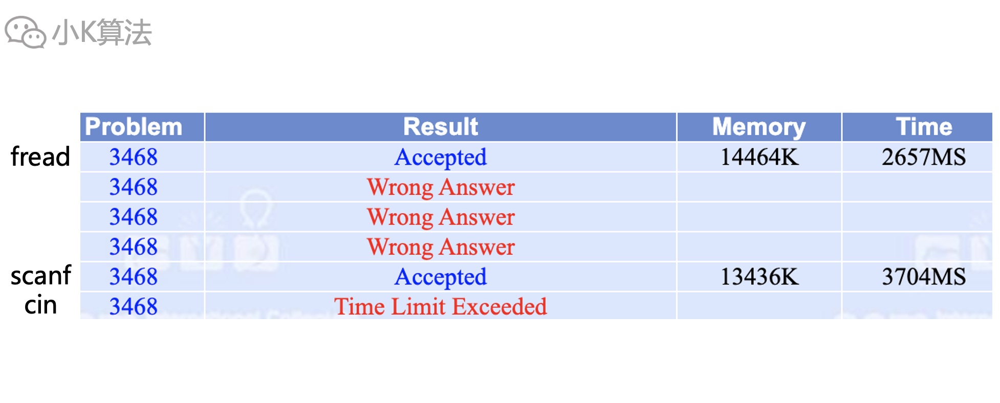

# 刷题老超时？那是因为你不会开挂

### 1 故事起源
不知道有多少人还在坚持着刷题，小K偶尔也会刷几道，以免生疏。如果只是为了面试，学会算法的思想就可以应付所有场景了，但如果是为了打比赛，可能coding的速度也很重要，还记得以前的要求是要能5分钟盲敲快排，bugfree。  

但有时有这么一种场景，自己满怀信心coding一道题，一提交直接TLE，这就让人有点头大了，可能因此丢掉100分，这就相当严重了呀。  

<div align=center></div>

之前我写了一道线段树的题就遇到了。

### 2 分析
小K刷过很多题了，所以对这类的问题也见怪不怪了，AC是天意，不AC才是常态，要习惯，哈哈。。。  

一般超时就几种原因：  
1、算法复杂度太高，如果数据规模是1w，那O(n^2)的算法肯定超时。  
2、某些特殊场景导致死循环，这种比较难排查，可以生成一些样例跑一跑，说不定有惊喜哦。  
3、语言的特性，比如java确实比c慢，但一般平台对不同语言的超时限制不一样。这也是我一直用c++来写算法的原因之一。  
4、递归太深，这种是指数级的，数据大于2位数估计就会超时，所以一看规模就知道能不能用递归。  
5、动态申请空间，这种也会增加耗时，所以堆、栈、树这些数据结构，如果内存允许，一般比赛都是直接用数组来模拟会更保险，别new。  
6、输入、输出，这个容易忽略，但不同的方式还真的差别很大。  

这次我的实现里面可能会比较耗时的点：一是用了动态申请内存，二是用了cin流读入。很快就定位了原因，还真是这个读入方式导致的。  

其实在读入方式上还是有点技巧的，不知你有没有听过一种方式，叫快读，俗称开挂。

### 3 读入方式
#### 3.1 cin
c++常用的方式是用cin\cout进行输入输出，比如像这样。  
```cpp
cin >> a;
```
简单场景用cin\cout还是挺方便的，但如果输出的格式复杂一点就会很恶心了，比如这样。  
```cpp
cout << "t=" << setiosflags(ios::fixed) << setprecision(2) << setw(10) << setfill('0') << t << endl;
```
如果用printf很简单就可以实现相同的效果。
```cpp
printf("t=%010.2lf\n", t);
```

就问你，有没有感受到来自c++的压迫感，为啥要这样设计来着。。。
<div align=center></div>

然而比这更恼火的就是cin的读入效率了，是真的低，后面我会做测试。至于为啥低，先看一下它的源码。  
<div align=center></div>

这一堆是啥，别问我，我也不知道，一看我直接退出了，哈哈，从来不去卷源码。  

还记得以前面试的时候，当面试官问我hashmap的底层数据结构是啥，如何实现的？通过临时看的几篇零散的博客，和多年数据结构和算法的经验，我早就脑补好了一切。
<div align=center></div>

“hashmap啊，这个我研究过，是这样来实现的，不就是数组+链表嘛...”
<div align=center></div>

“你们项目spring是咋配置的？”  
“哦，我没写过java，不过我搭过demo，不知你说的配置是啥？”

#### 3.2 scanf
那不用c++的流，自然就是用c里面的scanf，这个确实快很多了。
```cpp
scanf("%d", &a);
```

#### 3.3 getchar
还有一种更快的方式，就是常说的快读，用getchar按字符读取，再转为数字。
```cpp
inline int fast_read() {
    int x = 0;
    char ch = 0;
    bool minus = false;
    while (ch < '0' || ch > '9') minus |= ch == '-', ch = getchar();
    while (ch >= '0' && ch <= '9') x = (x << 3) + (x << 1) + (ch ^ 48), ch = getchar();
    return minus ? -x : x;
}
void main() {
    int t;
    t = fast_read();
}
```
位移等价乘10，异或是相同为0不同为1，等价减48。至于为啥要用位运算，是因为它快啊。
<div align=center></div>


#### 3.4 fread
这就是所谓的开挂读。即先读入内存中，再直接从内存里取。
```cpp
#define gc() (p1 == p2 && (p2 = (p1 = buf) + fread(buf,1,1<<20,stdin), p1 == p2) ? 0 : *p1++)
char buf[1 << 20], *p1 = buf, *p2 = buf;
template<typename T>
inline void fread_int(T &x) {
    x = 0;
    char c = 0;
    bool minus = false;
    while (c < '0' || c > '9') minus |= c == '-', c = gc();
    while (c >= '0' && c <= '9') x = (x << 3) + (x << 1) + (c ^ 48), c = gc();
    if (minus > 0) x = -x;
}
```

### 4 测试
针对上面的4种读入方式，来实际测试一下到底有多大的差别。先生成1kw个随机数。  
```cpp
const int N = 10000000;
void data() {
    ofstream fout("a.in");
    srand((int) time(0));
    for (int i = 0; i < N; ++i) {
        fout << rand() << endl;
    }
}
```

再依次用4种方式读入。
```cpp
struct read_function {
    function<void()> engine;
    string name;
};
void process(const read_function &func) {
    using namespace std::chrono;
    steady_clock::time_point start = steady_clock::now();
    func.engine();
    steady_clock::time_point end = steady_clock::now();
    duration<double> time_span = duration_cast<duration<double>>(end - start);
    cout << setw(7) << func.name << " time: " << setiosflags(ios::fixed) << time_span.count() << endl;
}
int main() {
    read_function fun_list[10];
    fun_list[0] = {read4, "fread"};
    fun_list[1] = {read3, "getchar"};
    fun_list[2] = {read2, "scanf"};
    fun_list[3] = {read1, "cin"};
    for (int i = 0; i < 4; ++i) {
        freopen("a.in", "r", stdin);
        process(fun_list[i]);
        fclose(stdin);
    }
    return 0;
}
```

用我的win台式机来测试，配置11700k，32g内存，跑出的结果如下：
```
  fread time: 0.211165
getchar time: 0.909146
  scanf time: 2.756034
    cin time: 3.857858
```

### 5 POJ平台测试
再用不同的读入方式通过POJ平台进行提交，也确实存在较大的耗时差异。
<div align=center></div>

### 6 总结
今天的小技巧在工作中可能用处不大，但在比赛中可就厉害了呀。不过还是不要轻易开挂，万一平台不支持就玩脱了，哈哈。

本文原创作者：小K，一个思维独特的写手。  
文章首发平台：微信公众号【小K算法】。  

如果喜欢小K的文章，请点个关注，分享给更多的人，小K将持续更新，谢谢啦！

---
**扫描下方二维码关注公众号，第一时间获取更新信息！**  
<div align=center></div>