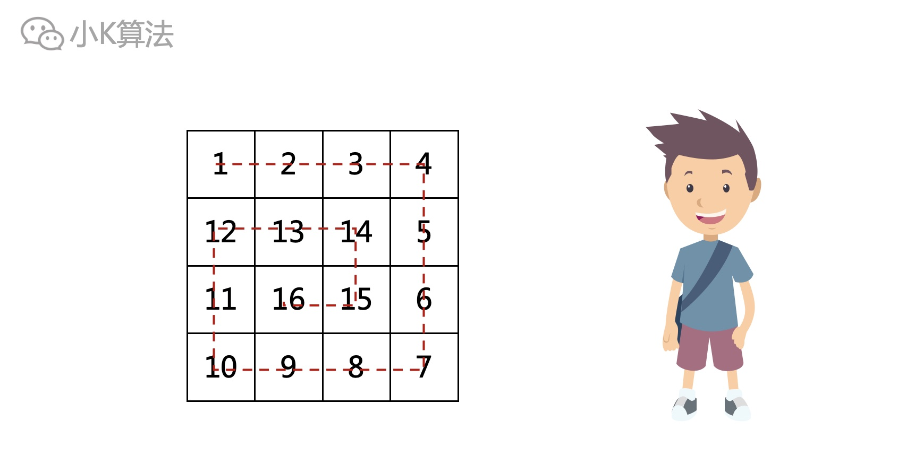
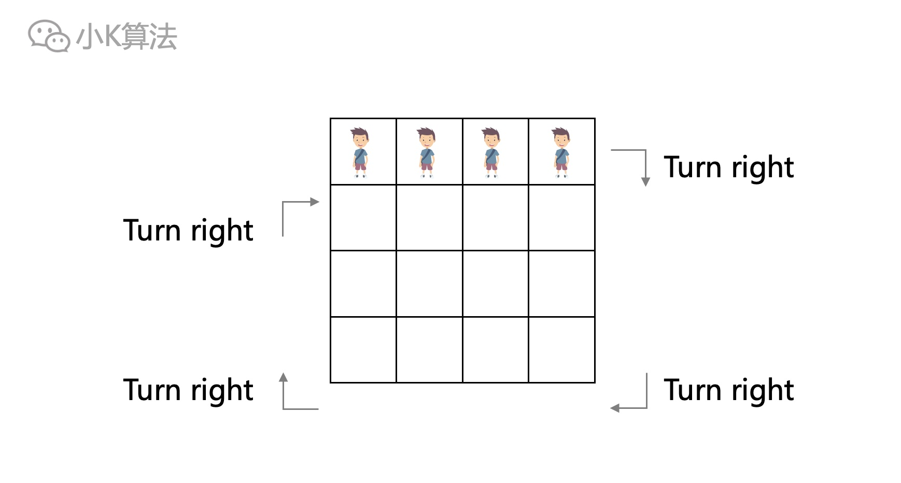
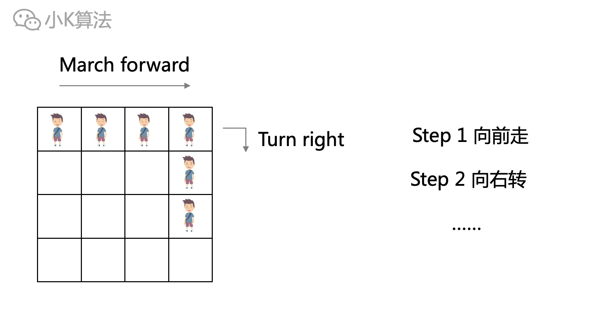
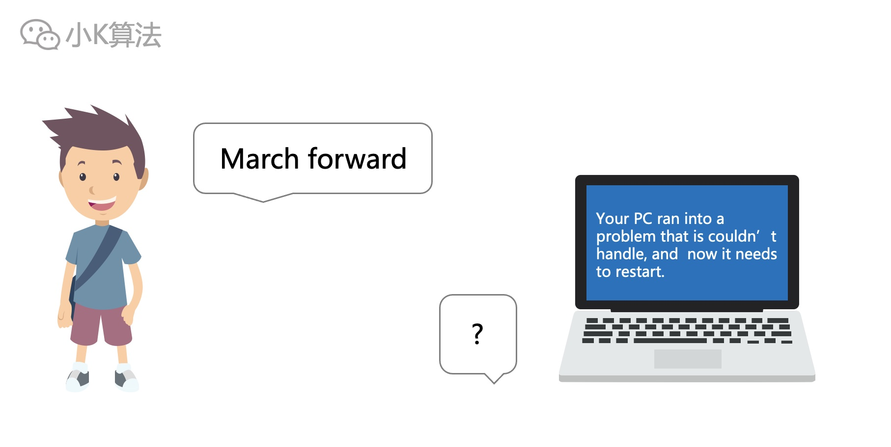
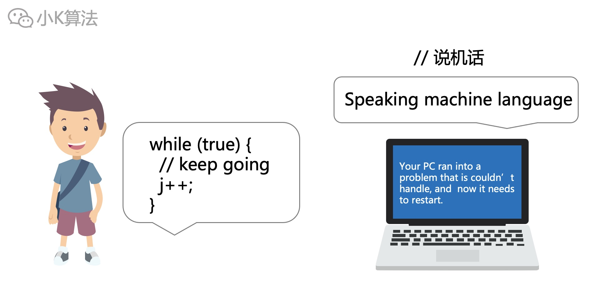
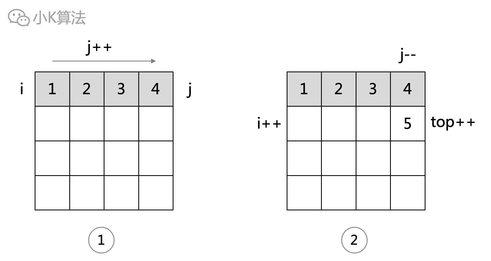
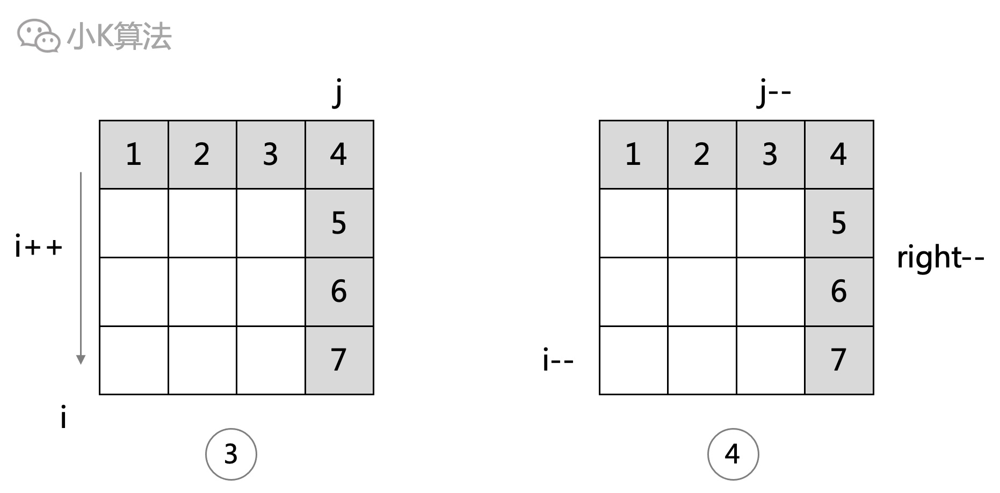

# 旋转矩阵

### 1 故事起源
有这样的一种矩阵，从左上角开始，顺时针从外向里旋转，数字依次递增，如果给定任意行n、列m，请问如何输出这样的矩阵呢？
<div align=center></div>

### 2 分析
这个问题第一眼就觉得很简单，为啥呢，因为规律很明显，问题描述都已经说的很清晰了，只要按照要求模拟一遍就行了。  
如果现在让你把这个问题描述给其他人，你是不是也会这样来描述：一直向前走，无路可走向右转。。。
<div align=center></div>

### 3 模拟
啥是模拟呢，模拟就是按照你的想法，机械的执行命令就可以了，没有啥算法可言，就像这个问题一样。
<div align=center></div>

不过机器并不能听懂你的高级语言，所以需要翻译一下。
<div align=center></div>

**说机话**   
整个过程拆解为4个步骤:  
从矩阵左上角开始向右直到边界；2）向下；3）向左；4）向上。  
重复上面4个步骤，直到填满整个矩阵。
<div align=center></div>

于是我们就得到了初步的框架：
```cpp
while (还没填满) {
	// 向右直到边界
    j++;
	// 向下直到边界
    i++;
	// 向左直到边界
    j--;
	// 向上直到边界
	i--;
}
```

### 4 细节
从左向右，结束时j超出边界，需要j--。最上一行已填满，上边界下移，同时i也下移。
<div align=center></div>

从上向下，结束时i超出边界，需要i--。最右一列已填满，右边界左移，同时j也左移。
<div align=center></div>

其余2个过程同理。

### 5 代码实现
```cpp
#define ROW 5
#define COLUMN 5
void main() {
    int left = 0, right = COLUMN - 1, top = 0, bottom = ROW - 1;
    int f[ROW][COLUMN], i = 0, j = 0, num = 1;
    while (i >= top && i <= bottom && j >= left && j <= right) {
        // left->right
        while (j <= right) {
            f[i][j++] = num++;
        }
        j--;
        top++;
        i++;
        // top->bottom
        while (i <= bottom) {
            f[i++][j] = num++;
        }
        i--;
        right--;
        j--;
        // right->left
        while (j >= left) {
            f[i][j--] = num++;
        }
        j++;
        bottom--;
        i--;
        // bottom->top
        while (i >= top) {
            f[i--][j] = num++;
        }
        i++;
        left++;
        j++;
    }
}
```

### 6 总结
模拟问题一般都比较简单，只需要把整个框架过程抽象出来，然后机械的实现即可。但偶尔也会遇到复杂的模拟，一般都是细节涉及的比较多，比如边界信息太多，或者过程太多等。不过这种问题很适合锻炼代码实现能力，多做就能达到“有思想就一定能实现”的状态。


本文原创作者：小K，一个思维独特的写手。  
文章首发平台：微信公众号【小K算法】。  

如果喜欢小K的文章，请点个关注，分享给更多的人，小K将持续更新，谢谢啦！

---
**扫描下方二维码关注公众号，第一时间获取更新信息！**  
<div align=center></div>