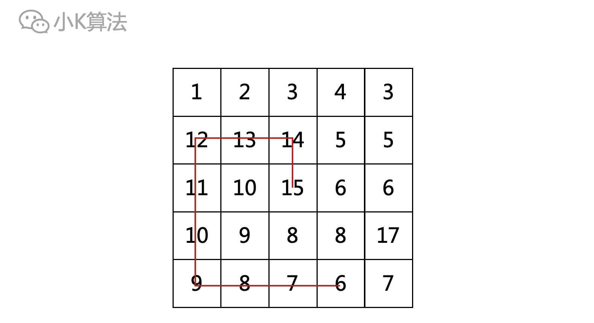

# 滑雪

### 1 故事起源
有一天小K去滑雪，雪山高低不平，当然小K只能从高的地方向低的地方滑，那如何选择路线才能滑的最远呢？
<div align=center></div>


把这个问题抽象描述如下：  
在一个二维地图中，数值代表此处山的高度，在某个点只能滑向上下左右4个相邻的点，最远的滑行路线，也就等价于找出一条最长的数值下降路线。  
比如下图中的红色路线就是此时最长的一条路线，长度为10。那要如何找出这样的一条路线呢？
<div align=center></div>

### 2 分析
在每个点上，只能向周围4个方向滑行，当然前提是此处的高度必须比周围高。
<div align=center></div>


我们当然可以选择尽可能高的位置出发，比如图中17比15要高。
<div align=center></div>

但这种有可能会陷入局部最优解，比如从下图中的15开始，最大长度为2。而从13开始会更优，长度为5。
<div align=center></div>

所以启示我们，不能简单的贪心，而是要考虑全局最优，因为每一个起点都有可能是最优的起点。  
那就有了初步的框架了，从每一个起点出发，把可行的路线都找出来，也就是能走的路线都走一遍，再比较全局最优的就行了，而且这也正好符合深搜的算法框架。  

**伪代码**
```cpp
int find(int i,int j){
	// 向4个方向尝试
	for (i=0->3){
		if (ok){
			return find(next)+1
		}
	}
}
int main(){
	for (i=0->n) {
		for (j=0->m){
			t=find(i,j)
			ans=max(ans,t)
		}
	}
}
```


### 3 问题
上面的做法可以得到最优解，但有一个问题。如下例，以15为起点的时候，会尝试把6->5->4->3->2->1走一遍。但以16为起点的时候，还会尝试把这条路线走一遍，这就会导致大量的重复计算。
<div align=center></div>

那能不能优化呢？  
之所以重复计算，是因为每一次尝试都是重新的开始，它并不知道这条路已经走过了，也就是没有记忆，所以我们引入一种优化的方法，就是记忆化搜索。


### 4 记忆化搜索
可以引入一个f[i][j]数组，记录以(i,j)为起点所能找到的最长路线的长度，初始赋值为-1，表示还没有走过。
<div align=center></div>

当走过一点，就将对应的f[i][j]更新为以(i,j)为起点的最大长度。  
再回到上面的问题，因为之前肯定走过了(2,3)，对应的f[2][3]为6，当尝试从(2,4)出发时，会发现周围已经走过了，只需要更新当前的值+1即可，就避免了重复计算。
<div align=center></div>


### 5 代码实现
路线搜索
```cpp
int find(vector<vector<int>> &snowMountain, vector<vector<int>> &f, int i, int j, int r, int c) {
    int x, y;
    if (f[i][j] != -1)
        return f[i][j];
    f[i][j] = 1;
    for (int k = 0; k < 4; k++) {
        x = i + direction[k][0];
        y = j + direction[k][1];
        //valid direction
        if (x >= 0 && x < r && y >= 0 && y < c && snowMountain[i][j] > snowMountain[x][y]) {
            f[i][j] = maxOfTwo(f[i][j], find(snowMountain, f, x, y, r, c) + 1);
        }
    }
    return f[i][j];
}
```
main函数
```cpp
int main() {
    ifstream fin("a.in");
    ofstream fout("a.out");
    int i, j, r, c, maxHeight = 0;
    fin >> r >> c;
    vector<vector<int>> snowMountain(r, vector<int>(c, 0));
    vector<vector<int>> f(r, vector<int>(c, -1));
    for (i = 0; i < r; i++)
        for (j = 0; j < c; j++)
            fin >> snowMountain[i][j];
    for (i = 0; i < r; i++)
        for (j = 0; j < c; j++) {
            maxHeight = maxOfTwo(maxHeight, find(snowMountain, f, i, j, r, c));
        }
    fout << maxHeight << endl;
    fin.close();
    fout.close();
    return 0;
}
```

### 6 总结
记忆化搜索是一种非常实用的算法，因为深搜用递归很容易实现，记忆化又避免了重复子问题的计算，提高了运行效率。  
这其实就是动态规划的思想，常见的动态规划用递推实现，相比记忆化搜索实现上会更难一点，而记忆化搜索就没有这个问题。  
算法的适用场景也需要根据具体的问题来分析，一般常用在地图或者树型结构中。

本文原创作者：小K，一个思维独特的写手。  
文章首发平台：微信公众号【小K算法】。  

如果喜欢小K的文章，请点个关注，分享给更多的人，小K将持续更新，谢谢啦！

---
**扫描下方二维码关注公众号，第一时间获取更新信息！**  
<div align=center></div>