# 求解根号2
### 1 故事起源
有一次小K去面试，面试官问我怎么求解根号2，这还用求，不就是1.414...
<div align=center></div>

原来他是想让我用代码来实现求解根号2。
<div align=center>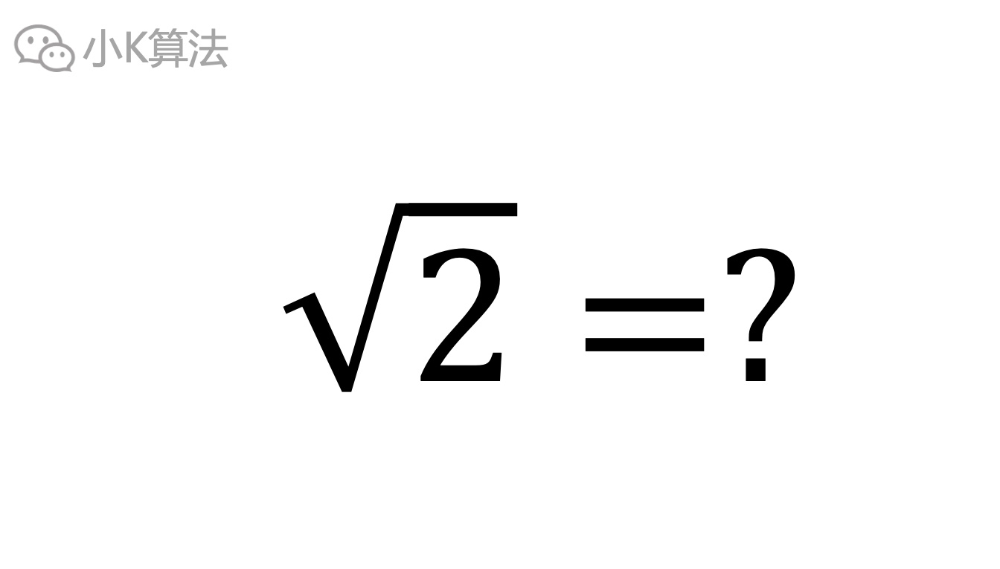</div>

那还不简单吗，一行代码搞定。
<div align=center>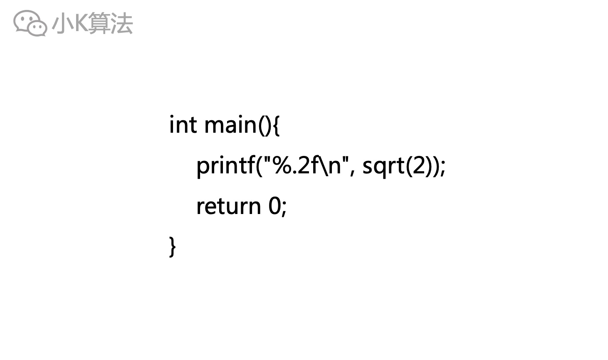</div>

然后，就没有然后了，下一个。。。

### 2 分析
回到正题，这个肯定不是想问你应该调用哪个函数，而是想问如何自己去实现一个这样的开方函数。

首先我们知道，一个数开方后肯定是某个固定的数。当这个数大于1时，开根号之后的数一定是小于原数的。
<div align=center>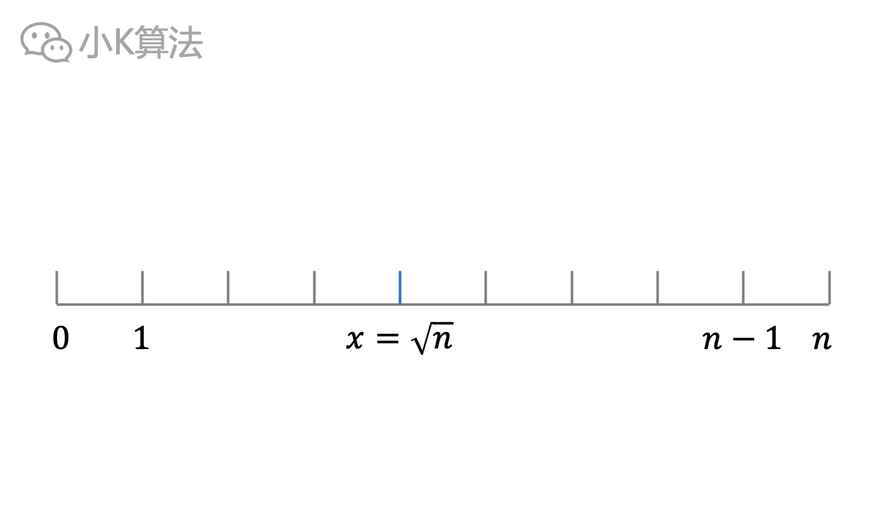</div>

对于求解固定的数，且当给出一个数，可以快速判断出所给数是不是我们要的目标数，同时还能确定大小范围，这种问题就可以用二分查找来求解。
<div align=center>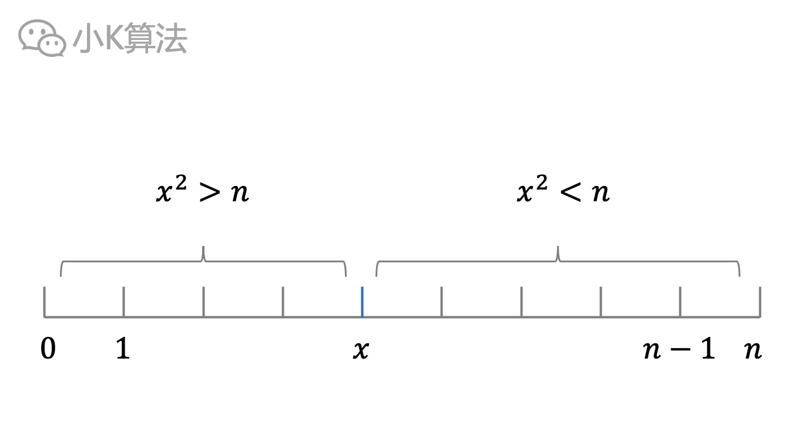</div>

### 3 二分
先在0~n中间取一个数x，如果x^2小于n，则在右边区间继续查找，否则在左边区间继续查找。  
如果n小于1，则要在区间[0,1]之间进行查找。

代码实现
```cpp
bool is_equal(double a, double b) {
    return abs(a - b) <= 1e-7;
}

double search(double n) {
    double left = 0, right = n;
    double mid = (left + right) / 2;
    while (!is_equal(mid * mid, n)) {
        if (mid * mid > n) {
            right = mid;
        } else {
            left = mid;
        }
        mid = (left + right) / 2;
    }
    return mid;
}
```

二分是log(n)的复杂度，已经非常优秀了。要是这时面试官继续挑战你呢？ 
那就得秀一波操作了，即牛顿迭代法。
<div align=center></div>

### 4 牛顿迭代法
那啥是牛顿迭代法呢，接下来就跟着小K的思路一起来研究一下。 

有一个函数y=f(x)，图像如下。
<div align=center>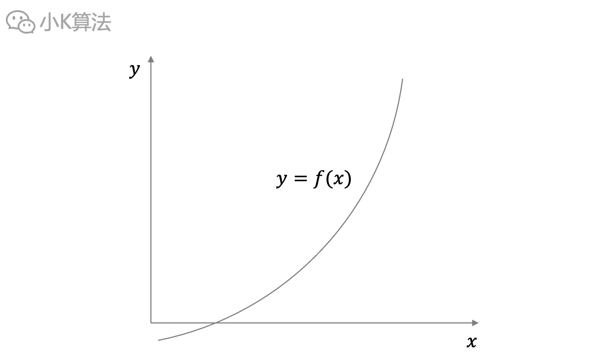</div>

在x轴上取一点x0，那在y轴对应的函数值就是f(x0)，即y0。
<div align=center>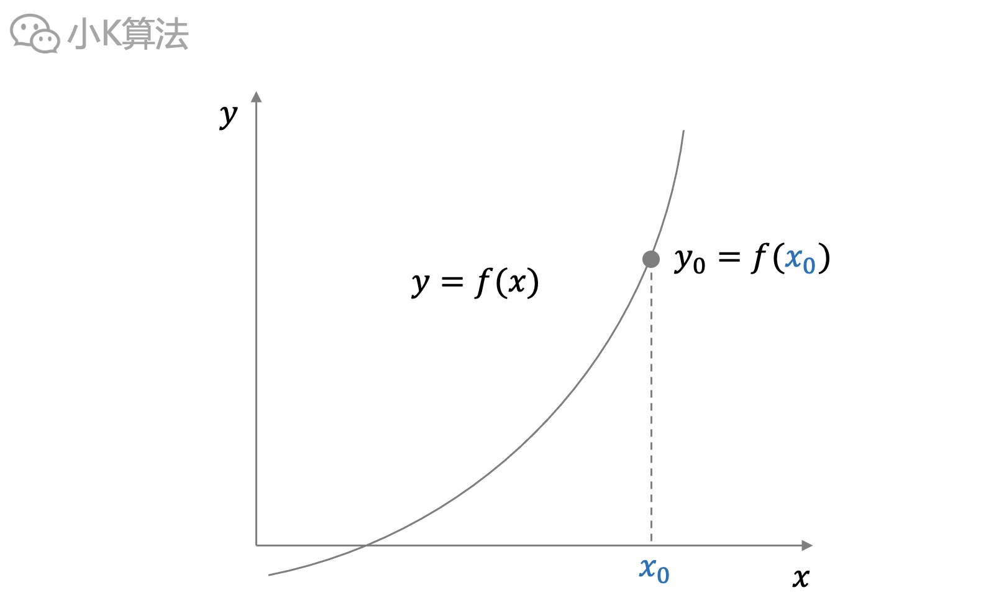</div>

过点(x0,y0)做一条与函数f(x)相切的直线，该直线的斜率k也就是函数在该点的导数，也叫微商(微分之商)。
<div align=center>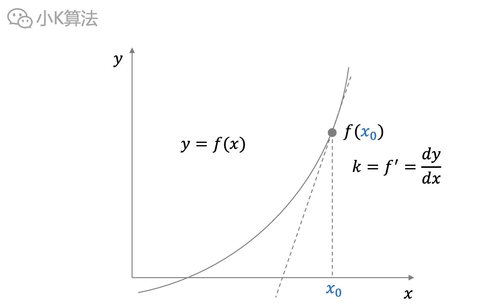</div>

过点(x0,y0)，斜率为k的直线，通过点斜式就可以很容易得到这条直线方程，即y=k(x-x0)+y0。
<div align=center>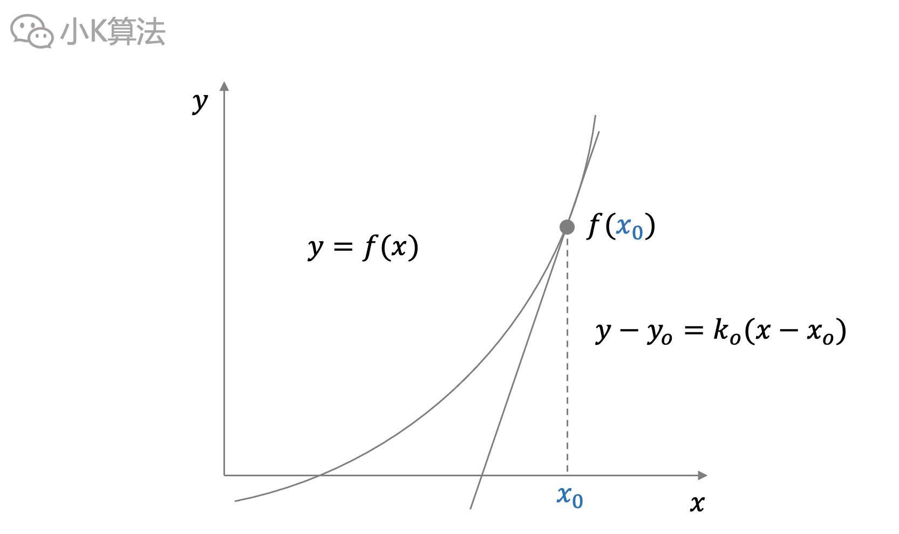</div>

该直线与x轴是有一个交点的，记为x1。令直线y=0，就可以轻松解出该直线与x轴的交点了，即x1=x0-y0/k0。  
此时我们发现x1相对于x0，在向左移动。
<div align=center>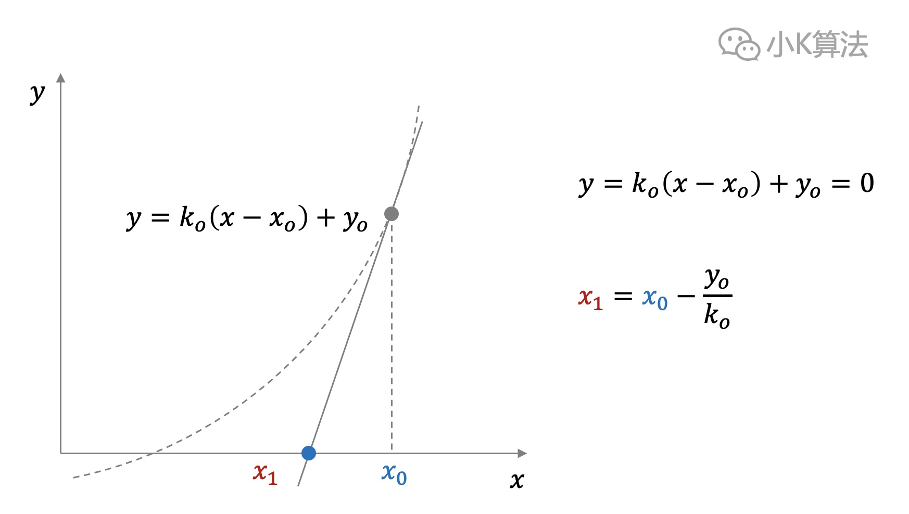</div>

如果重复上面的操作，通过(x1,y1)再作一条直线，得到直线方程。再令y=0，可解得x2，即与x轴的新交点。
<div align=center>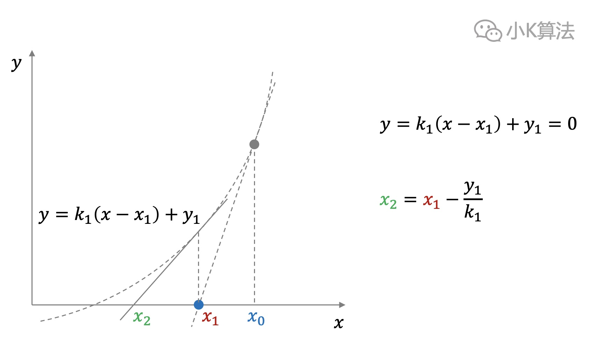</div>

我们发现x2又向左移动了，如果多重复几次上面的操作，就会发现xn在无限趋近一个点，那就是最开始曲线函数f(x)与x轴的交点。而这个交点也可以看成是f(x)=0的方程的解。
<div align=center>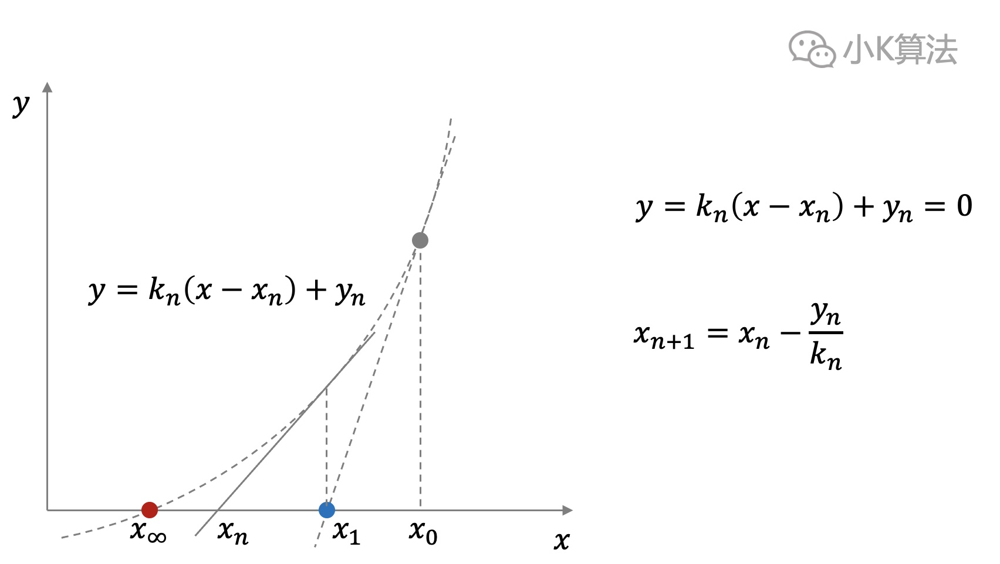</div>

如此，我们就得到了一种求解方程的迭代法，这就是牛顿迭代法。
<div align=center>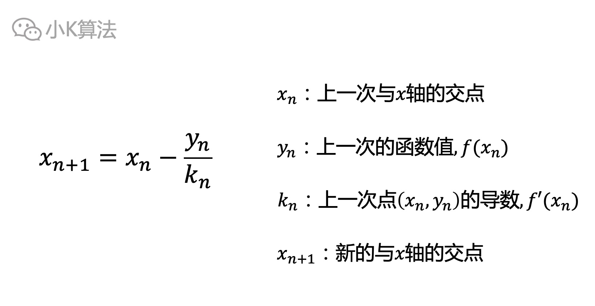</div>

那通过牛顿迭代法如何求解根号2呢？

### 5 求解根号
首先我们需要构造一个函数f(x)，把目标数变成求解一个函数与x轴的交点，即方程f(x)=0的根。
<div align=center>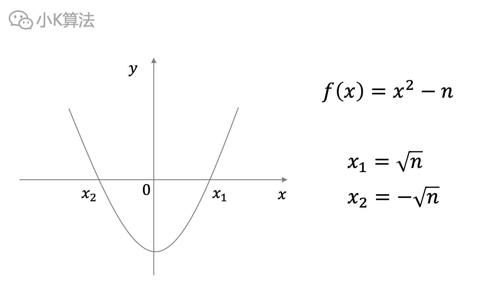</div>

再用上面的牛顿迭代法，就可以得到目标数“根号n”了。牛顿迭代法也有它的局限性，可能一些函数无法收敛。

还有一个问题就是第一个点x0的选择，如果第一个点选择了x0=0，这时斜率为0，也不可能与x轴相交，那就只能bbq了。
<div align=center>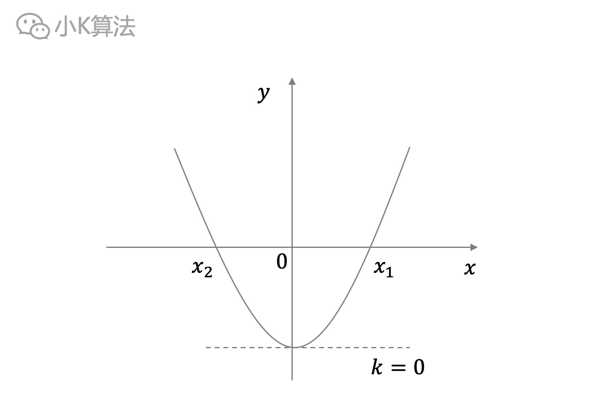</div>

代码实现
```cpp
// 判断相等，浮点数要考虑精度的问题
bool is_equal(double a, double b) {
    return abs(a - b) <= 1e-7;
}
// 函数f(x)
double f(double x, double n) {
    return x * x - n;
}
// 导数f'(x)
double fd(double x) {
    return 2 * x;
}
double newton(double n) {
    double x0 = 0, x1 = n;
    while (!is_equal(x1, x0)) {
        x0 = x1;
        x1 = x0 - f(x0, n) / fd(x0);
    }
    return x1;
}
```

### 6 总结
二分法通逧易懂，常规操作，时间复杂度也低。而牛顿迭代法收敛速度更快，但函数和初始点的选择都会有影响。两种解法都是不错的思路，领悟了思想，可以用在更多的场景上。

本文原创作者：小K，一个思维独特的写手。  
文章首发平台：微信公众号【小K算法】。  

如果喜欢小K的文章，请点个关注，分享给更多的人，小K将持续更新，谢谢啦！

---
**扫描下方二维码关注公众号，第一时间获取更新信息！**  
<div align=center></div>