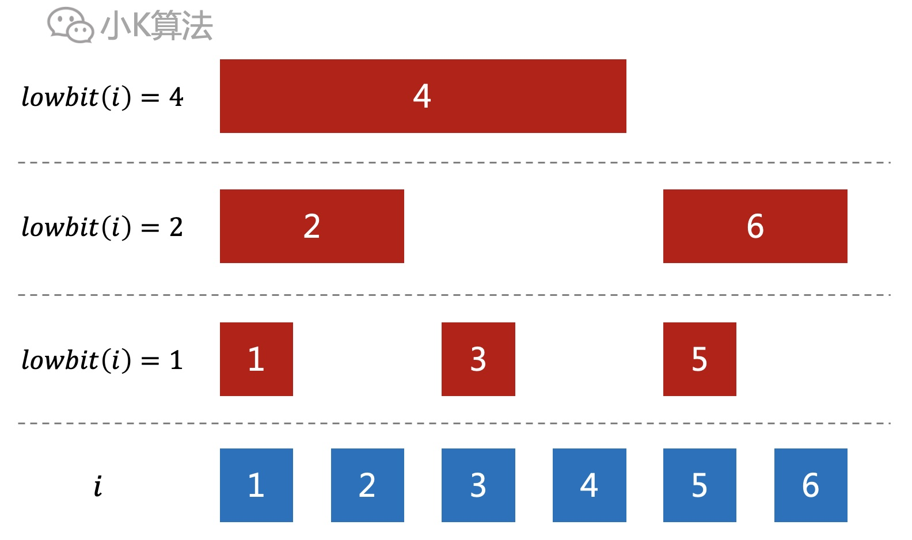

# 10行代码搞定树状数组

### 1 故事起源
有N个数排列成一排，如何快速进行区间修改与求和呢？
<div align=center></div>

### 2 分析
首先最容易想到的方法就是先求出前缀和sum[i]，然后区间[a,b]的和就可以直接通过sum[b]-sum[a-1]得到。
<div align=center></div>

但如果要对数组进行修改，就会有一些问题。比如对a[3]加1，则下面对应的sum[3],sum[4],sum[5]都需要进行修改，这个效率就很低了。
<div align=center></div>

原因在于sum[i]是前面区间[1,i]中所有元素的和，所以修改任何一个元素，则后面的sum[i]都得重新计算。  

那能不能找到一种间断式的前缀和呢，只需要统计前面区间中的部分元素。这样在修改某个a[i]的时候就不会影响后面的所有sum[i]。
<div align=center></div>

其实就是要找到这样的一种映射关系，既能统计出前缀和，还可以提高修改的效率。sum[i]以前是统计区间[1,i]所有的i个元素，而现在是统计区间[1,i]中的k个元素。
<div align=center></div>

树状数组其实就是这样的一种映射。

### 3 定义
树状数组是按下面这种对应关系来计算前面若干元素的和，但直接看可能还看不出来规律。
<div align=center></div>

先把元素的下标1、2、3...转成二进制。
<div align=center></div>

再把每个二进制数，从右向左，截取到第一个1的位置。截取的二进制数也会对应一个十进制数。
<div align=center></div>

比如12对应的二进制数为1100，截取的二进制数为100，而100转为十进制为4。所以我们可以定义这样一种运算，lowbit(12)=4。
<div align=center></div>

那这个lowbit要如何快速计算呢？

计算机原理中，首先我们知道有原码，反码，补码。最高位为符号位，0为正数，1为负数。正数的三码相同，负数的反码是符号位不变，其余位取反，而补码则是反码加1。在计算机中负数是以补码的方式存储的。

然后再看下面的12和-12，补码进行位与操作时，就正好是lowbit运算。
<div align=center></div>

代码实现：
```cpp
int lowbit(int x) {
    return x & -x;
}
```

把上面的对应位置的lowbit都计算出来再观察，可以发现lowbit的数值正好就是sum[i]统计的元素个数。
<div align=center></div>

总结一般的规律如下：  
sum[i]等于区间[i-lowbit(i)+1,i]中所有元素的和。也就是从位置i开始，往前数lowbit(i)个元素，加起来就是sum[i]。
<div align=center></div>

### 4 规律
lowbit(i)对应的数一定是1，2，4...，因为截取的二进制为1000...。根据lowbit(i)可以先对sum[i]进行分层。
<div align=center></div>

而sum[i]元素也有一种包含关系，再把包含关系提上来。
<div align=center></div>

sum[i]就是前面连续的lowbit(i)个元素的和，直接展开更清晰。红色矩形就是下面覆盖的蓝色小方块的和。
<div align=center></div>

红色是sum数组，蓝色是a数组，再观察下标之间的关系。
<div align=center></div>

### 5 单点修改
例如修改a[2]，因为sum[2],sum[4]都包含了a[2]，所以对应都要修改。
<div align=center></div>

如果修改a[3]，因为sum[3],sum[4]都包含了a[3]，所以对应都要修改。
<div align=center></div>

观察发现，修改一个元素a[i]时，sum[i]是一层一层的向上进行修改，上一层的下标正好是当前层的下标i加上lowbit(i)。

代码实现：
```cpp
void add(int index, int x) {
    while (index <= n) {
        sum[index] += x;
        index += lowbit(index);
    }
}
```

### 6 区间查询
例如查询区间[1,5]，需要统计sum[5],sum[4]。
<div align=center></div>

如果查询区间[1,3]，需要统计sum[3],sum[2]。
<div align=center></div>

观察发现，查询区间[1,i]的前缀和时，是一段一段往前查询的，下一段的下标正好是当前段的下标i减去lowbit(i)。

代码实现：
```cpp
int query(int index) {
    int ret = 0;
    while (index > 0) {
        ret += sum[index];
        index -= lowbit(index);
    }
    return ret;
}
```

如此，就可以轻松搞定单点修改及区间查询了，但最开始的问题是区间修改，这个又该如何实现呢？

### 7 区间修改
首先得引入一个差分数组d[i]，d[i]=a[i]-a[i-1]。
<div align=center></div>

对数组d[i]计算前缀和，又可以还原为原数组元素a[i]。
<div align=center></div>

通过公式替换，原数组的前缀和sum[i]也可以通过d[i]来得到。
<div align=center></div>

展开来看就是这样。
<div align=center></div>

通过观察，可以对上面公式作如下变形。其中最关键的是sigma(d[j])和sigma(d[j]*j)。
<div align=center></div>

如果维护d[i]和d[i]\*i两个数组的前缀和，就可以快速得到sum[k]。
<div align=center></div>

当对区间[3,5]增加2时，因为d[i]是差分数组，所以只需要对d[3]增加2，对d[6]减去2即可。同理e[i]数组，只需要e[3]增加2\*3，对e[6]减去2\*6。
<div align=center></div>

一般规律如下：
<div align=center></div>

代码实现：
```cpp
#define LL long long

// 单个修改
void add(LL *sum, LL index, LL x) {
    while (index <= n) {
        sum[index] += x;
        index += lowbit(index);
    }
}

// 区间修改
void range_add(LL left, LL right, LL x) {
    right++;
    add(sum1, left, x);
    add(sum1, right, -x);
    add(sum2, left, x * left);
    add(sum2, right, -x * right);
}
```


### 8 区间查询
代码实现：
```cpp
// 单个查询
LL query(const LL *sum, LL index) {
    LL ret = 0;
    while (index > 0) {
        ret += sum[index];
        index -= lowbit(index);
    }
    return ret;
}

// 区间查询
LL range_query(LL left, LL right) {
    left--;
    LL sumA = (left + 1) * query(sum1, left) - query(sum2, left);
    LL sumB = (right + 1) * query(sum1, right) - query(sum2, right);
    return sumB - sumA;
}
```

### 9 总结
树状数组主要应用于区间操作，相比起线段树来说，代码实现简单太多了，而且效率也很高，非常值得研究掌握。

本文原创作者：小K，一个思维独特的写手。  
文章首发平台：微信公众号【小K算法】。  

如果喜欢小K的文章，请点个关注，分享给更多的人，小K将持续更新，谢谢啦！

---
**扫描下方二维码关注公众号，第一时间获取更新信息！**  
<div align=center></div>