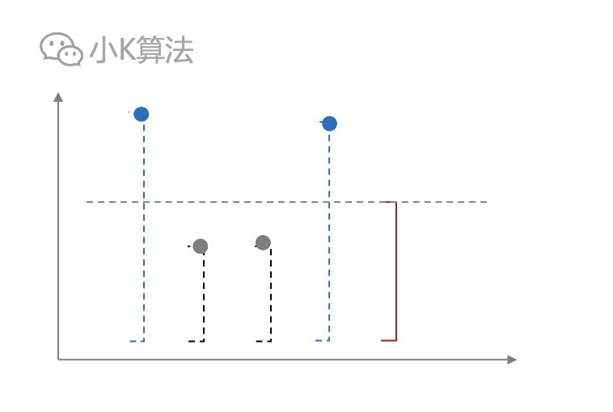

# 喜欢三叶草的牛

### 1 故事起源
山上长满了三叶草，有N只牛，每只牛只喜欢某一个范围的三叶草。
<div align=center></div>

把山看成一个数轴，则每只牛喜欢的三叶草范围可以用一个区间[si,ei]来表示。
<div align=center></div>

如果一只牛i喜欢的范围大于另一只牛j，则认为牛i比牛j更强壮。
<div align=center></div>

也就是满足下面的关系。
<div align=center></div>

那请问对于每一只牛，有多少只牛比它更强壮呢？

### 2 分析
题意应该很好理解，其实就是给了很多个区间，求对于每一个区间，它属于多少个区间的真子集。例如下面的红色区间，被两个蓝色区间真包含。
<div align=center></div>

最先想到的肯定是直接遍历。对于每一个区间，遍历剩余的其它区间，O(n^2)搞定。
```cpp
for (int i=0; i<n; ++i)
  for (int j=0; j<n; ++j) {
  	if 区间j真包含区间i {
  		ans[i]++
  	}
  }
```
最朴实无华的方法，效率肯定不高。那有没有更好的方案呢，这个就得继续找规律了。

### 3 找规律
先看一下上面最简单的方案有没有什么问题，因为很多优秀的方法都是从最简单的方法一步一步优化出来的。

对于红色区间，我们可以很容易看出，其它区间其实没有遍历的必要，因为都在区间之外，甚至都没有交集。
<div align=center></div>

这个说明其实跟区间的位置有很强的关系，如果有了相对位置，就可以减少很多计算。

那我们可以考虑一下，是不是能先按照区间排序，比如先按照左端点升序，左端点相同时，右端点降序。
<div align=center></div>

再看上面的图中，对于红包区间，可能真包含它的只会在前面的虚线区间中，后面的一定不可能，所以只需要遍历前面的即可。
```cpp
for (int i=0; i<n; ++i)
  for (int j=0; j<i; ++j) {
  	if 区间j真包含区间i {
  		ans[i]++
  	}
  }
```
这样会减少一些判断，但本质还是O(n^2)，还多了一个排序的代价。那有没有可能遍历更少，或者不遍历呢？

再想一下，其实对于红色区间来说，下面所有真包含它的虚线区间，你真的关心它的顺序吗，你只是需要知道它是否包含，即右端点的相对位置。
<div align=center></div>


如果先按照左端点升序，那么对于红色区间来说，前面的区间只可以分为两类。一类是右端点在它的右端点左边，另一类是在右边，知道这个数量就够了。
<div align=center></div>


把所有区间绕左端点竖起来，那么对于红色区间，就变成关注前面区间的上端点是在它的上端点的上面还是下面。
<div align=center></div>


再跳出上面的框架来看，我们已经把一个区间[si,ei]投射到了一个二维平面中的点，si,ei即为横纵坐标。再看上面要满足的关系式，其实就是以红色为原点画出四象限，所有左上方第二象限的点都满足。
<div align=center></div>

所以一上来根据描述看成是区间反而走了弯路，因为区间也是二维信息，在一维数轴里面无法表示。看成是二维平面就很简单，升维是一种重要的手段，尤其在动态规划中应用非常普遍，一维不行变二维，二维不行三维，四维。。。

现在模型已经建立好了，那下一个问题就是，如何快速求出第二象限的点数量呢？

### 4 快速统计
把二维中的点投射到y轴上去，压缩成一维，这就变成了求上半块区间中点的数量。因为这个区间需要不断的修改和查询，树状数组是再适合不过了。
<div align=center></div>

### 5 算法框架
对于所有的点(si,ei)，先按照si升序,si相同时按ei降序排列。在y轴上维护一个区间和，依次遍历队列中的点，并将每个点ei坐标所对应在y轴上的位置+1，再统计y轴上的区间上半块的区间和。
<div align=center></div>

### 6 代码实现
#### 6.1 快排
实现一个快排模板，以后就不用再重复敲了。  
**sort.h**
```cpp
template<typename T>
void sort(T arr[], int start, int end);
#include "sort.inl"
#endif
```
**sort.inl**
```cpp
template<typename T>
void swap(T arr[], int s, int t) {
    T temp = arr[s];
    arr[s] = arr[t];
    arr[t] = temp;
}
template<typename T>
int partition(T arr[], int left, int right) {
    srand(time(0));
    int pivot = left + rand() % (right - left + 1);
    swap(arr, left, pivot);
    T base = arr[left];
    while (left < right) {
        while (left < right && base <= arr[right]) right--;
        arr[left] = arr[right];
        while (left < right && arr[left] <= base) left++;
        arr[right] = arr[left];
    }
    arr[left] = base;
    return left;
}
template<typename T>
void sort(T arr[], int start, int end) {
    if (start >= end) {
        return;
    }
    int index = partition(arr, start, end);
    sort(arr, start, index - 1);
    sort(arr, index + 1, end);
}
```

#### 6.2 树状数组
```cpp
int lowbit(int x) {
    return x & -x;
}
void add(int sum[], int index, int x) {
    while (index <= MAX_NUM) {
        sum[index] += x;
        index += lowbit(index);
    }
}
int query(const int sum[], int index) {
    int ret = 0;
    while (index > 0) {
        ret += sum[index];
        index -= lowbit(index);
    }
    return ret;
}
```
#### 6.3 定义
```cpp
#include "sort.h"
#define MAX_NUM 100001
struct Point {
    int index, x, y;
    bool operator<=(const Point &node) const {
        if (x == node.x) {
            return y >= node.y;
        }
        return x < node.x;
    }
};

```
#### 6.4 main
```cpp
int main() {
    freopen("../a.in", "r", stdin);
    freopen("../a.out", "w", stdout);
    int n;
    scanf("%d", &n);
    while (n > 0) {
        Point cow[MAX_NUM];
        for (int i = 0; i < n; ++i) {
            scanf("%d%d", &cow[i].x, &cow[i].y);
            cow[i].y++;
            cow[i].index = i;
        }
        sort(cow, 0, n - 1);
        int sum[MAX_NUM] = {0}, ans[MAX_NUM] = {0};
        for (int i = 0; i < n; ++i) {
            if (i > 0 && cow[i].x == cow[i - 1].x && cow[i].y == cow[i - 1].y) {
                ans[cow[i].index] = ans[cow[i - 1].index];
            } else {
                ans[cow[i].index] = i - query(sum, cow[i].y - 1);
            }
            add(sum, cow[i].y, 1);
        }
        for (int i = 0; i < n - 1; ++i) {
            printf("%d ", ans[i]);
        }
        printf("%d\n", ans[n - 1]);
        scanf("%d", &n);
    }
    return 0;
}
```


### 7 总结
算法的组合应用是比较难掌握的，建模的过程很难想到，只有真正理解了核心思想，应用起来才能得心应手，多思考，没有捷径。

本文原创作者：小K，一个思维独特的写手。  
文章首发平台：微信公众号【小K算法】。  

如果喜欢小K的文章，请点个关注，分享给更多的人，小K将持续更新，谢谢啦！

---
**扫描下方二维码关注公众号，第一时间获取更新信息！**  
<div align=center></div>