# 棋盘分割

### 1 故事起源
有一个8\*8的棋盘，沿着格子的边进行分割，每分割一块拿走，将剩下的矩形棋盘继续分割。
<div align=center>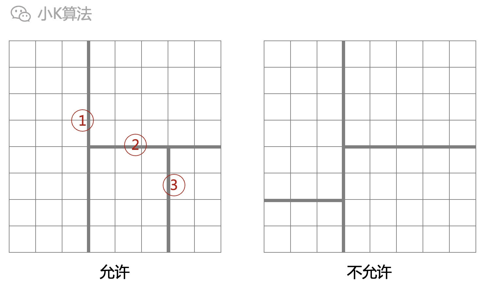</div>

n-1次分割后，可以得到n块矩形棋盘。
<div align=center>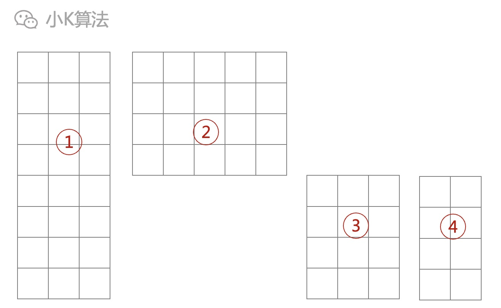</div>


假设原棋盘每一格都有一个分值，则分割后的每一块都有一个总分，总分即为所有格子分值之和。
<div align=center>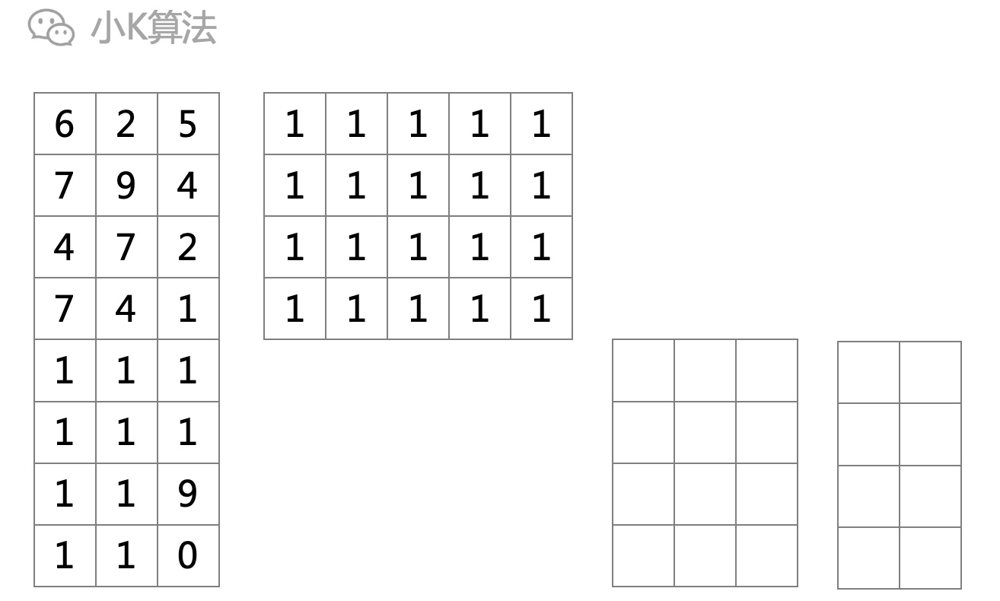</div>

设分割的每一块棋盘总分为xi。
<div align=center>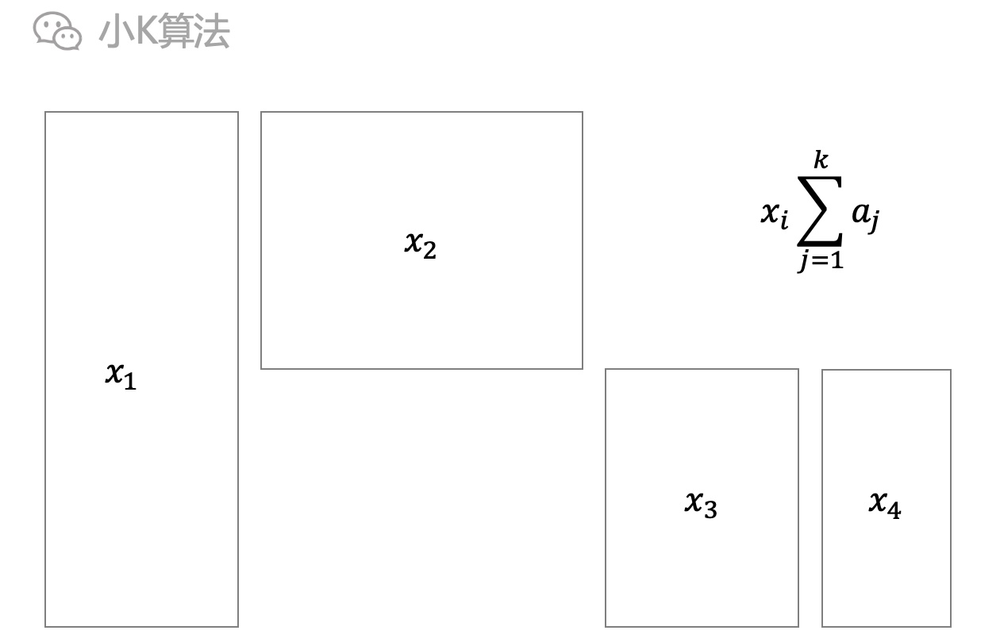</div>

如何分割可以让各矩形棋盘总分的均方差最小？
<div align=center>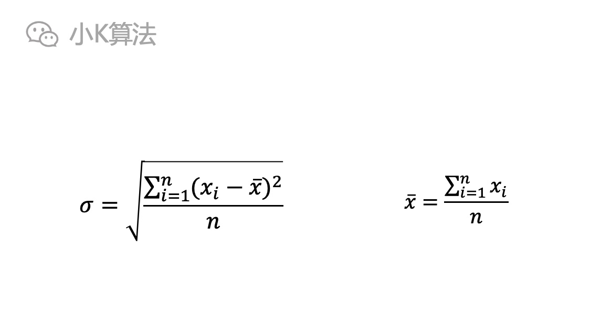</div>

### 2 分析
先对均方差公式作一些简化。
<div align=center>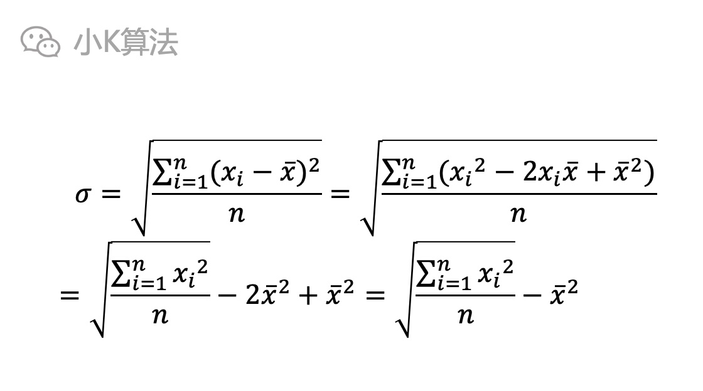</div>

通过上面公式可以看出，其实就是要求分割后的n个矩形棋盘，分值平方的总和最小。
<div align=center>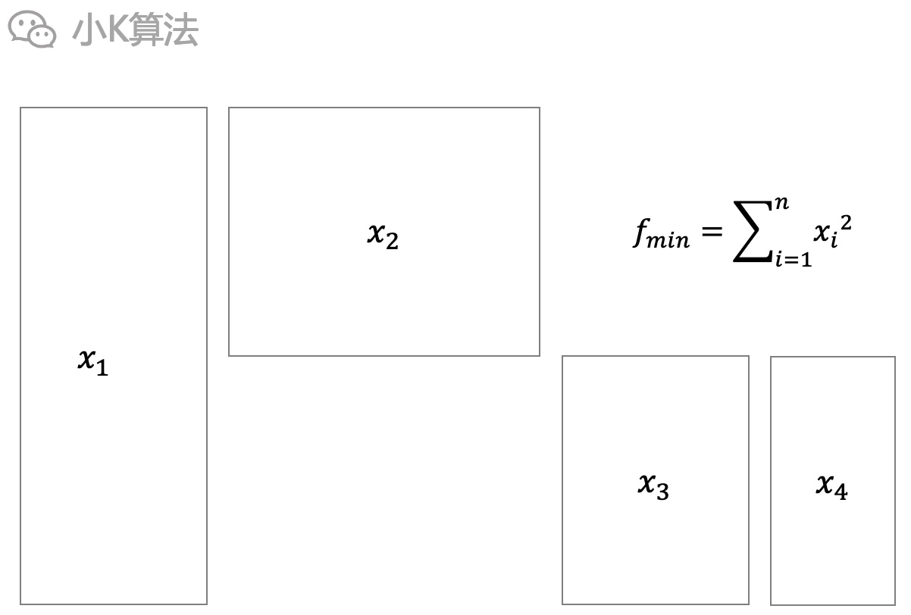</div>

当你遇到一些没有头绪的问题的时候，先不要想太多，别上来整什么高大上的思想，咱们就从最简单的场景开始分析。  

#### 2.1 缩小问题规模
假设棋盘规模不是8\*8，而是2\*2。缩小问题规模是一种很有用的方法，因为问题的本质并没有发生变化，只是数据更小，就更有利于我们分析问题的本质。
<div align=center>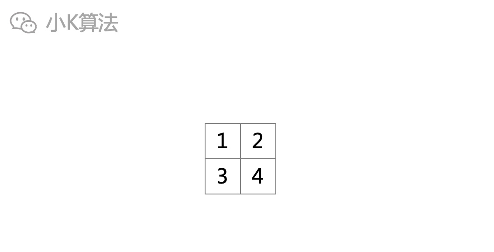</div>

#### 2.2 开始分割
这时再让你分割，还会觉得难吗，全部手动枚举也能解决啊。  
先垂直切。
<div align=center>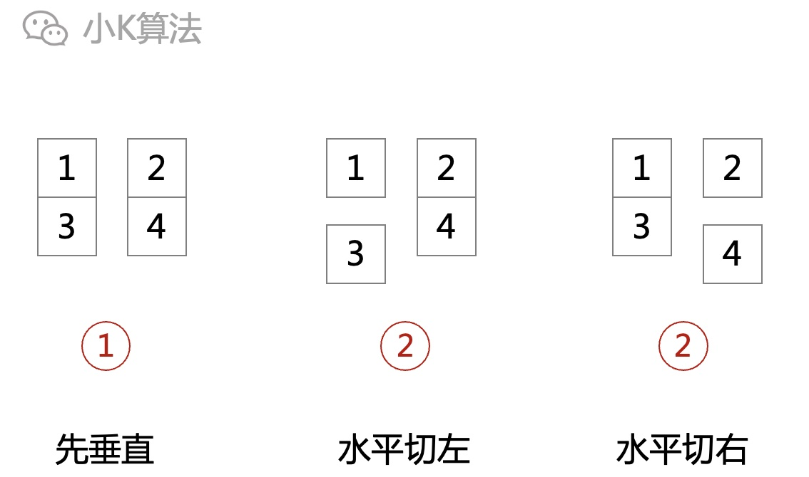</div>

先水平切。
<div align=center>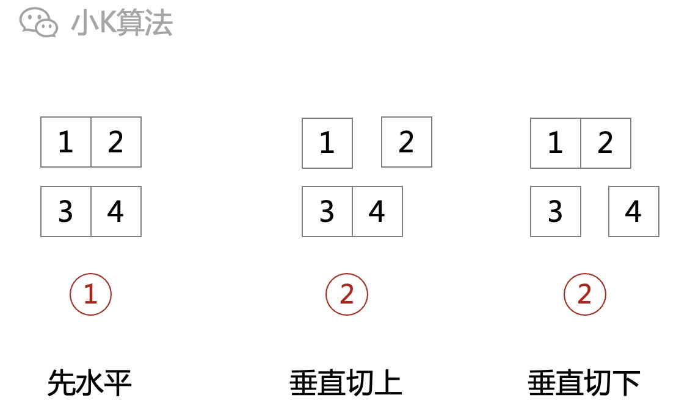</div>

切2次，分割成3块，总共也就4种情况，把每一种情况的方差算出来，选一个最小的就行了。

#### 2.3 规律
每次分割有2种决策，要么水平切，要么垂直切。
<div align=center>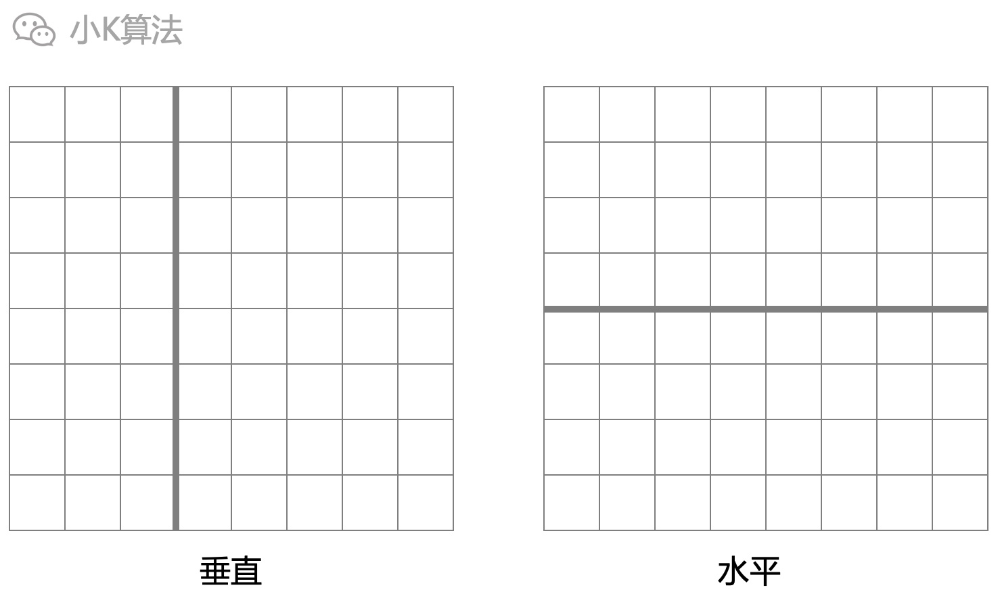</div>

针对一种决策，又有很多种具体的不同的切法。例如一个4\*4的棋盘，先垂直切，就可以从3个不同的位置切。
<div align=center>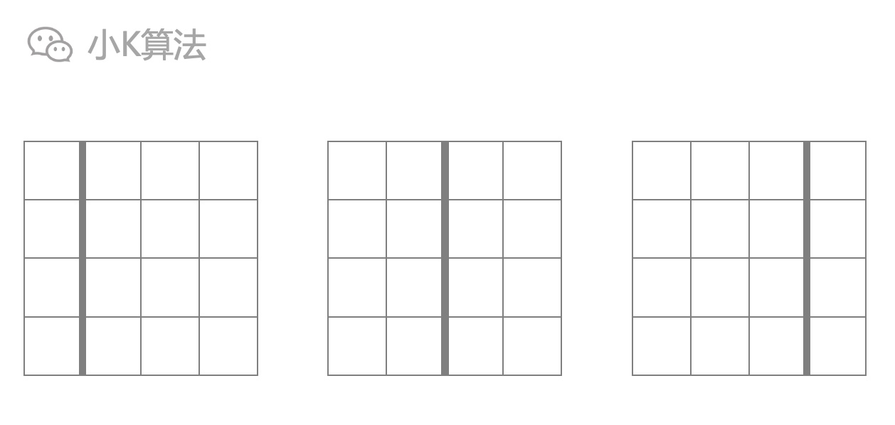</div>

如果给棋盘加一个坐标，每一种切法就可以用一个线段来具体表示，比如用这条切线的两个端点坐标。
<div align=center>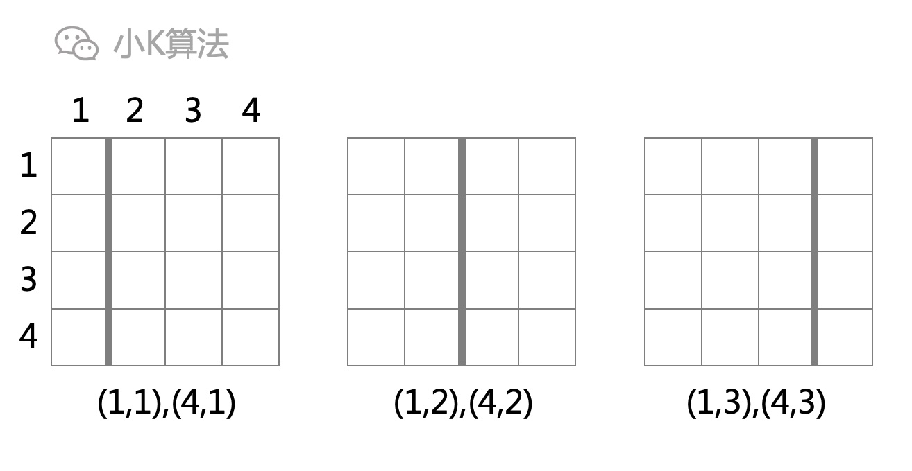</div>

分割之后，就变成了2个更小的棋盘，而这2个棋盘也可以用矩形的坐标表示，此时就把原问题变成了子问题，原问题的最优解也就是所有子问题中选一个最优的。
<div align=center>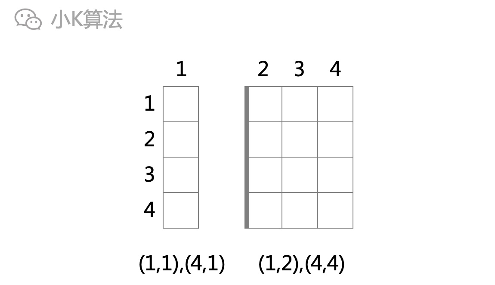</div>

此时你可能会有几个疑问：  
1.为什么全局最优解可以转化为子问题的最优解呢？  
上面的分割方法，在每一个阶段，我们已经把所有可能的分割方法全部枚举完了，那其中的最优肯定就是当前阶段的最优了，因为没有其它的可能性。  

2.为什么当前阶段的最优可以转化为下一阶段？  
这就是一个无后效性，因为我们只需要分割的分值平方和最小，并不关心它具体是怎么分割的。之前怎么分割，在当前阶段看来都是一样的，不受影响。

3.应该用几维来表示状态呢？
这个就是到底要开几维数组来递推。上面无论是表示分割的线段，还是分割后的矩形，都至少要2个点坐标，所以至少得4维。

### 3 建模
先垂直切，继续切左边或者右边，找出最优解。
<div align=center>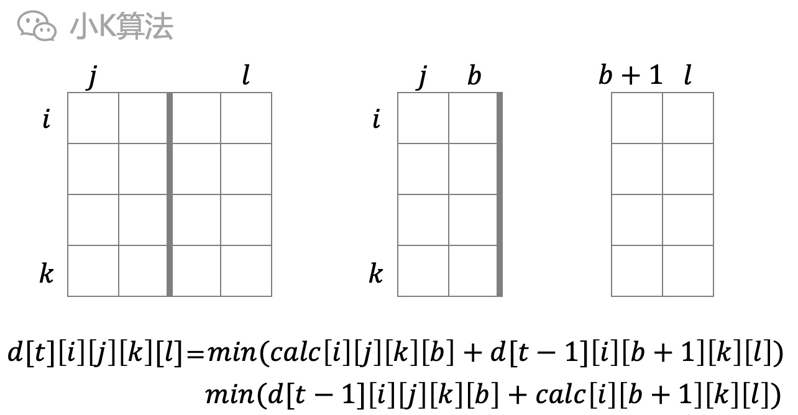</div>

先水平切，继续切上边或者下边，找出最优解。
<div align=center>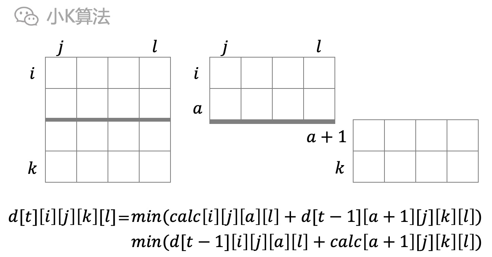</div>

当前轮次t只与上一次t-1有关，所以可以用01滚动数组，压缩一维。  
初始化的时候，所有小块的独立矩形棋盘都一次不切，所以就是矩形棋盘的分值平方。

### 4 代码实现
**定义**
```cpp
#define N 9
int chessboard[N][N];
int d[2][N][N][N][N];
int sum[N][N] = {0};

int getSum(int x, int y, int k, int l) {
    int ans = sum[k][l] - sum[k][y - 1] - sum[x - 1][l] + sum[x - 1][y - 1];
    return ans * ans;
}

int min(int x, int y) {
    return x < y ? x : y;
}
```
**初始化**
```cpp
void init() {
	 for (int i = 1; i <= 8; ++i) {
        for (int j = 1; j <= 8; ++j) {
            cin >> chessboard[i][j];
            sum[i][j] = sum[i - 1][j] + sum[i][j - 1] - sum[i - 1][j - 1] + chessboard[i][j];
        }
    }
    for (int i = 1; i < N; ++i) {
        for (int j = 1; j < N; ++j) {
            for (int k = i; k < N; ++k) {
                for (int l = j; l < N; ++l) {
                    d[0][i][j][k][l] = getSum(i, j, k, l);
                }
            }
        }
    }
}
```
**main**
```cpp
int main() {
    int n;
    cin >> n;
    init();
    int s = 0;
    for (int t = 1; t < n; ++t) {
        s = 1 - s;
        // 枚举起点
        for (int i = 1; i < N; ++i) {
            for (int j = 1; j < N; ++j) {
                // 枚举终点
                for (int k = i; k < N; ++k) {
                    for (int l = j; l < N; ++l) {
                        d[s][i][j][k][l] = 1e8;
                        // 横切
                        for (int a = i; a < k; ++a) {
                            d[s][i][j][k][l] = min(d[s][i][j][k][l], d[1 - s][i][j][a][l] + getSum(a + 1, j, k, l));
                            d[s][i][j][k][l] = min(d[s][i][j][k][l], d[1 - s][a + 1][j][k][l] + getSum(i, j, a, l));
                        }
                        // 纵切
                        for (int b = j; b < l; ++b) {
                            d[s][i][j][k][l] = min(d[s][i][j][k][l], d[1 - s][i][j][k][b] + getSum(i, b + 1, k, l));
                            d[s][i][j][k][l] = min(d[s][i][j][k][l], d[1 - s][i][b + 1][k][l] + getSum(i, j, k, b));
                        }
                    }
                }
            }
        }
    }
    double average = sum[N - 1][N - 1] * 1.0 / n;
    double ans = d[s][1][1][8][8] * 1.0 / n - average * average;
    printf("%.3lf", sqrt(ans));
    return 0;
}
```


### 5 总结
动态规划最重要的就是找出阶段、状态和决策，有时可以先用递归的方式建模，然后加记忆化优化，最后再转为递推。


本文原创作者：小K，一个思维独特的写手。  
文章首发平台：微信公众号【小K算法】。  

如果喜欢小K的文章，请点个关注，分享给更多的人，小K将持续更新，谢谢啦！

---
**扫描下方二维码关注公众号，第一时间获取更新信息！**  
<div align=center></div>