# 硬币翻转
### 1 故事起源
有n个硬币，每个硬币可能正面或者反面朝上。
<div align=center>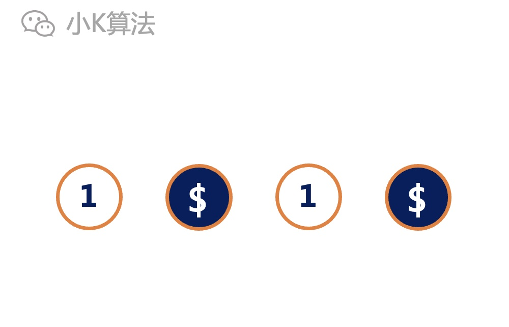</div>

如果每次翻转一个硬币，在进行一定次数的翻转后，就可以使所有的硬币都正面朝上或者反面朝上，即状态一致。
<div align=center>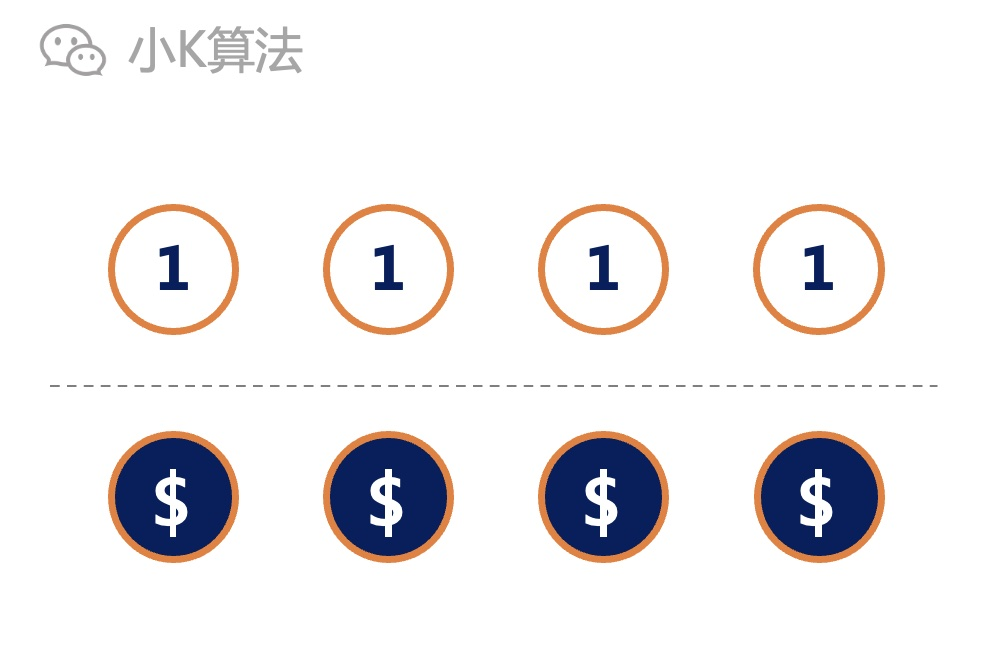</div>

请问是否存在一个固定的次数k，使得初始时无论是哪种状态，都可以刚好进行k次翻转，以达到全部正面或反面朝上的状态呢？如果存在，那这个最小的k是多少？

### 2 分析
先从简单的场景开始分析。  
如果只有1个硬币，它正面或者反面都可以，因为没有其它可对比的，所以状态都一致，不用翻转，那么最小的k就是0。
<div align=center></div>

如果有2个硬币，那么初始时可能有以下3种状态：2个正面，2个反面，1正1反。
<div align=center>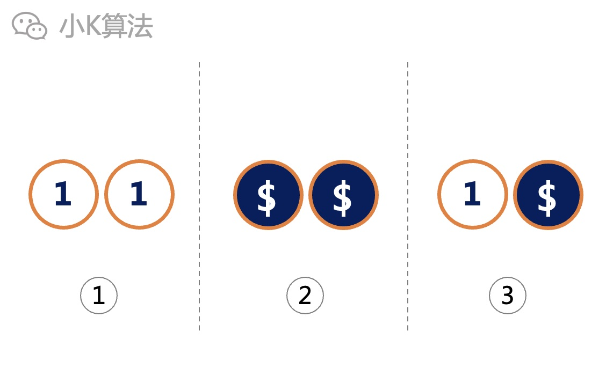</div>

针对以上第1、2种状态，不需要翻转，而第3种至少需要翻转1次。如果都翻转一次，前面的2种状态又会不一致，所以无法找到一个固定的翻转次数k。

如果有3个硬币，对于初始状态就一致的就不用再考虑了，最小0次。
<div align=center>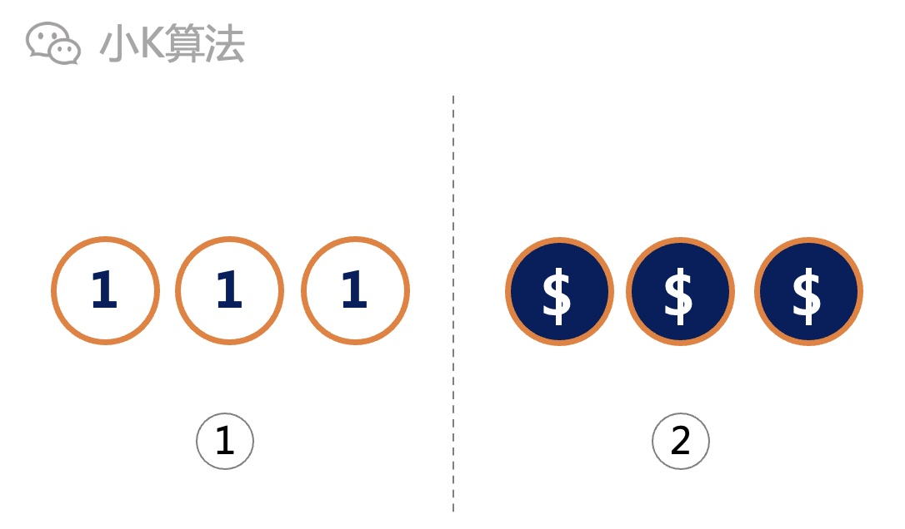</div>

主要考虑不一致的，例如有1个、2个...m个不一致。
<div align=center>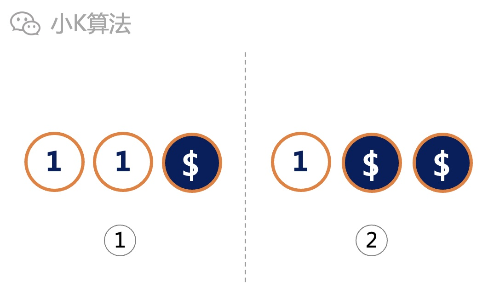</div>

可以看出，如果n个硬币，其中m个正面，那必定有n-m个反面，可以认为它是m个不一致，也可以认为是n-m个不一致，这2种情况是等价的，那就考虑更小的吧，因为更简单。
<div align=center>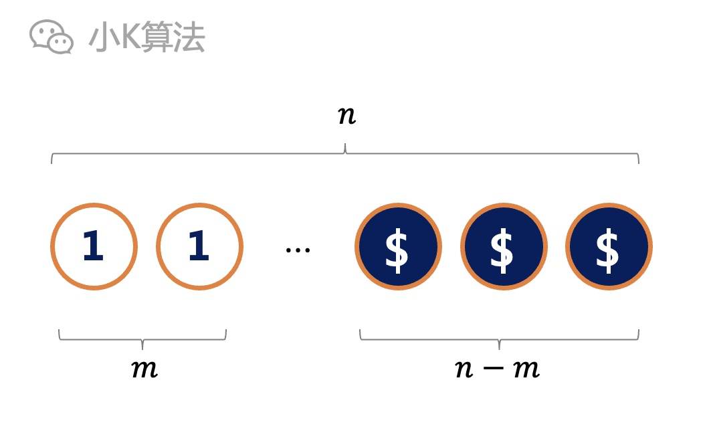</div>

再回到上面的3个硬币的情况，只需要考虑有1个正面和有2个正面。  
如果都翻转1次，可以使所有的一致，但对于初始时全部相同的情况也必须翻转1次，就一定会产生不一致，所以1次不行。
<div align=center>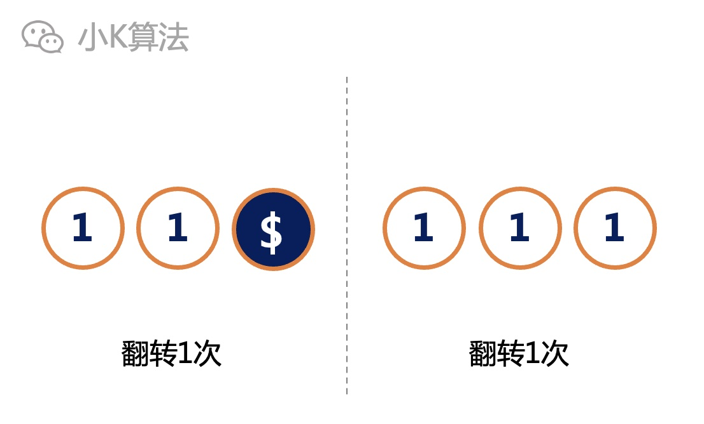</div>

如果都翻转2次，则一定可以。如果1个正面，就翻转另外2个反面；如果2个正面，就直接翻转这2个正面；如果全部相同，则对任何一个翻转2次，依然不改变一致的状态。所以3个硬币的最小k就是2。

那到这里你看出规律了吗，先别往下看，思考2分钟，3,2,1...  
有不一样的想法可打在下面的评论区

### 3 规律
到了开始总结规律、提取特征信息的时候了，不要限制你的想象，发散思维。

1.首先对于任何一个硬币，翻转奇数次一定改变状态，翻转偶数次一定不改变状态。  
既然翻转偶数次不变，为啥还要翻转呢，当然是为了凑数，因为要求必须刚好都翻转k次。

2.k必须是偶数。
如果初始状态一致，翻转奇数次一定会将某一个状态改变，变成不一致，所以k不可能是奇数。
<div align=center>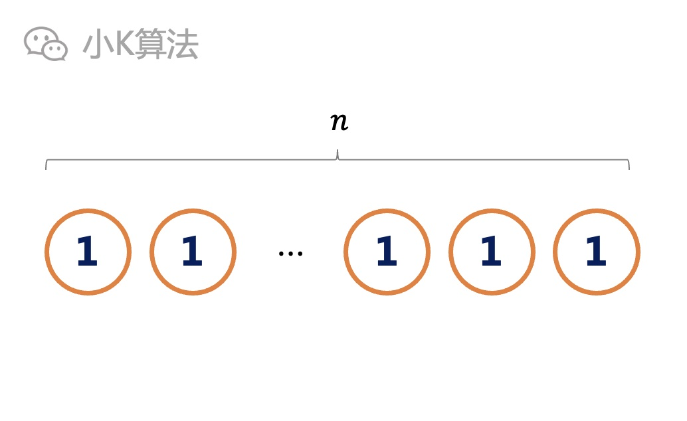</div>

3.n如果是偶数，则一定找不出来这样的k。  
例如下面这种场景，只有1个反面，有n-1个正面。1和n-1都是奇数，所以无论是全部翻转成正面或是反面，都需要奇数次翻转，偶数次不可能一致，所以n为偶数时无解。
<div align=center>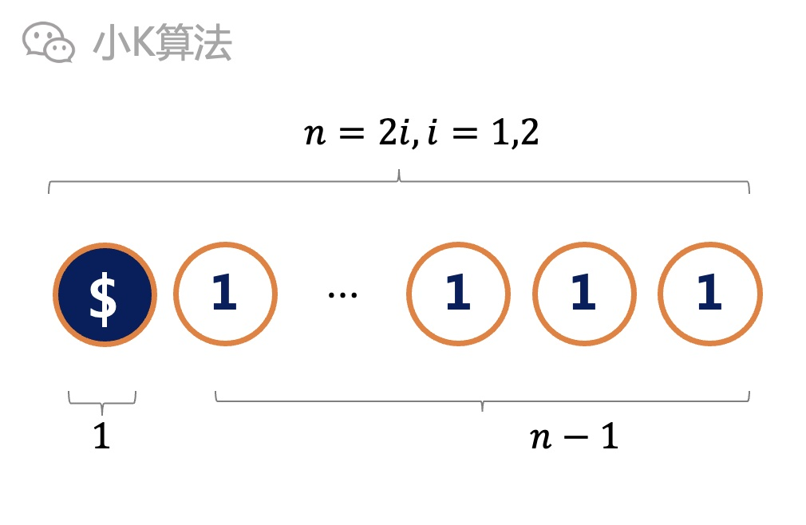</div>

4.最关键的来了，对于n为奇数时一定有解，那最小的k应该是多少呢？  
n为奇数，所以正面和反面肯定就是一奇一偶。
<div align=center>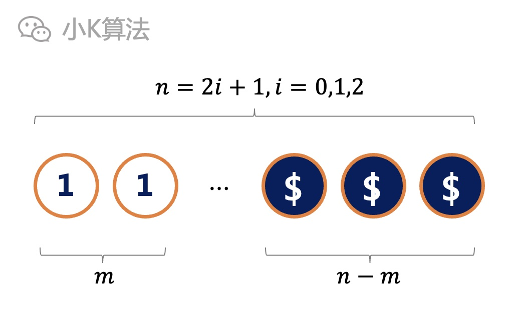</div>

考虑这种极端情况，只有1个反面，n-1个正面，这时n-1为偶数。
<div align=center>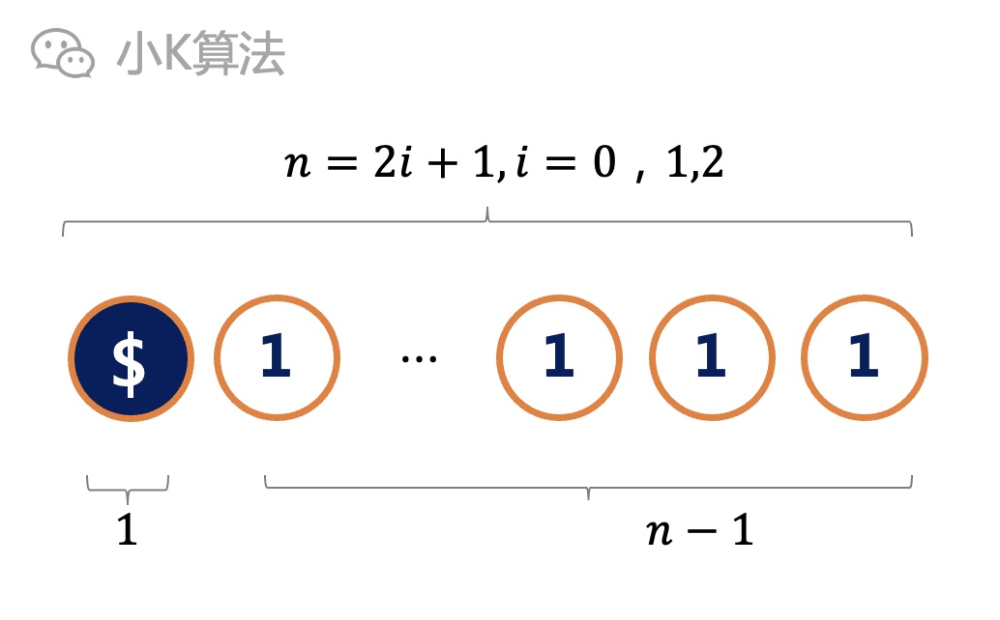</div>

如果最终要全部为正面，则只能一直翻转这1个反面，但翻转偶数次并不变，明显不行。所以只能最终全部为反面，那就得翻转剩下的n-1个正面，至少也得n-1次。

好了，规律找到了，接下来开始coding吧。

### 4 代码实现
当然这个问题的难点并不在coding，这只是推理成功之后的附属品。
```cpp
if ((n & 1) == 0) printf("No Solution!\n");
    else printf("%d\n", n - 1);
```

### 5 总结
这个问题主要就是要从本质上找出规律，推理了一大堆，结果异常的简单，但这些推理却是绕不开的。其实有很多看似复杂的问题，最终的结论都是非常的简单。有个经验分享给大家，如果你发现你解决一个问题时逻辑非常的复杂，要考虑很多分支情况，这时我可以大概率的猜测，90%你的方法是不对的，因为正解永远都是非常优雅简洁的。(如果不优雅，那一定不是正解)


本文原创作者：小K，一个思维独特的写手。  
文章首发平台：微信公众号【小K算法】。  

如果喜欢小K的文章，请点个关注，分享给更多的人，小K将持续更新，谢谢啦！

---
**扫描下方二维码关注公众号，第一时间获取更新信息！**  
<div align=center></div>