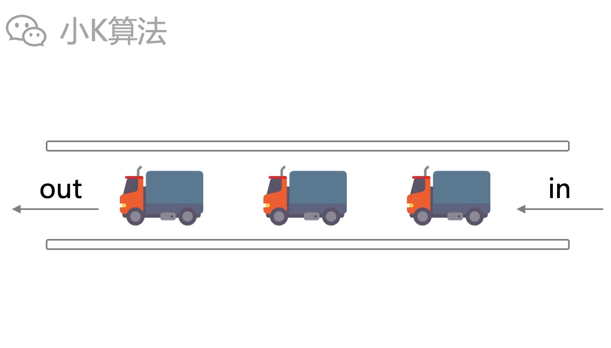

# 如何实现一个双端队列？

### 1 故事起源
队列是一种先进先出的数据结构。
<div align=center></div>

一般通过数组实现。
<div align=center></div>

还需要定义2个指针，头指针和尾指针。
<div align=center></div>

### 2 插入和删除

#### 2.1 插入  
从队尾tail处插入，再将tail指针后移。
<div align=center></div>

#### 2.2 删除 
从队首head处取出元素，再将head指针后移。
<div align=center></div>

但数组是定长的，如果多次插入删除，tail指针就会超出数组范围，而前面其实还是有空间的，所以常用的还是循环队列。
<div align=center></div>

### 3 循环队列
循环其实就是让head,tail两个指针在数组内循环移动，当移动到队尾时就跳到队首。
<div align=center></div>

通过取模就可以实现循环。
<div align=center></div>

当head==tail时，即为队空。
<div align=center></div>

当head==(tail+1)%n时，即为队满。如果队列长度为n，则只能装n-1个元素，最后一个元素要空着。因为如果放入元素，tail会和head重合，就无法判断是队空还是队满。
<div align=center></div>

### 4 双端队列
普通队列只能队首出，队尾进，但有时我们需要队首和队尾都能进出，即双端队列。
<div align=center></div>

#### 4.1 插入
队首插入，则head指针前移；队尾插入，则tail指针后移。
<div align=center></div>

#### 4.2 删除
队首删除，则head指针后移；队尾删除，则tail指针前移。
<div align=center></div>

### 5 代码实现
实现一个模板，以后可重复利用。  

先定义必要的方法和变量。
```cpp
template<typename T>
class Deque {
public:
    explicit Deque(int capacity);
    void PushFront(const T &node);
    void PushBack(const T &node);
    T PopFront();
    T PopBack();
    T Front() { return data_[head_]; }
    T Back() { return data_[(tail_ - 1 + capacity_) % capacity_]; }
    bool IsNotEmpty() { return head_ != tail_; };
    bool IsEmpty() { return head_ == tail_; }
    bool IsFull() { return (tail_ + 1) % capacity_ == head_; };
    int Size();
    int Head() { return head_; }
    int Tail() { return tail_; }
public:
    int capacity_, head_, tail_;
    T *data_;
};
```

构造函数
```cpp
template<typename T>
Deque<T>::Deque(int capacity) {
    capacity_ = capacity;
    head_ = tail_ = 0;
    data_ = new T[capacity_];
}
```

插入
```cpp
template<typename T>
void Deque<T>::PushBack(const T &node) {
    if (IsFull()) {
        std::__throw_logic_error("queue is full");
    }
    data_[tail_] = node;
    tail_ = (tail_ + 1) % capacity_;
}
template<typename T>
void Deque<T>::PushFront(const T &node) {
    if (IsFull()) {
        std::__throw_logic_error("queue is full");
    }
    head_ = (head_ - 1 + capacity_) % capacity_;
    data_[head_] = node;
}
```

删除
```cpp
template<typename T>
T Deque<T>::PopBack() {
    if (IsEmpty()) {
        std::__throw_logic_error("queue is empty");
    }
    tail_ = (tail_ - 1 + capacity_) % capacity_;
    return data_[tail_];
}
template<typename T>
T Deque<T>::PopFront() {
    if (IsEmpty()) {
        std::__throw_logic_error("queue is empty");
    }
    head_ = (head_ + 1) % capacity_;
    return data_[(head_ - 1 + capacity_) % capacity_];
}

```

size方法
```cpp
template<typename T>
int Deque<T>::Size() {
    if (head_ <= tail_) {
        return tail_ - head_;
    } else {
        return tail_ + (capacity_ - head_);
    }
}
```

使用案例
```cpp
int main() {
    Deque<int> deq(10);
    deq.PushBack(2);
    deq.PushFront(1);
    deq.PushFront(0);
    deq.PushBack(3);
    printf("head=%d tail=%d size=%d back=%d\n", deq.Head(), deq.Tail(), deq.Size(), deq.Back());
    while (deq.Size() > 2) {
        printf("%d\n", deq.PopBack());
    }
    deq.PushBack(2);
    deq.PushFront(1);
    deq.PushFront(0);
    deq.PushBack(3);
    printf("head=%d tail=%d size=%d front=%d\n", deq.Head(), deq.Tail(), deq.Size(), deq.Front());
    while (deq.IsNotEmpty()) {
        printf("%d\n", deq.PopFront());
    }
    return 0;
}
```

完整代码已放在github，地址：https://github.com/xiaok365/algorithm-cpp/tree/main/deque

### 总结
队列是非常基础且重要的数据结构，双端队列属于队列的升级。很多的算法都是基于队列来实现，例如搜索中的bfs，图论中的spfa，计算几何中的melkman等。队列结构本身很简单，如何使用才是比较难的，一定要深刻理解，以后才能熟练应用到不同的模型中。

本文原创作者：小K，一个思维独特的写手。  
文章首发平台：微信公众号【小K算法】。  

如果喜欢小K的文章，请点个关注，分享给更多的人，小K将持续更新，谢谢啦！

---
**扫描下方二维码关注公众号，第一时间获取更新信息！**  
<div align=center></div>