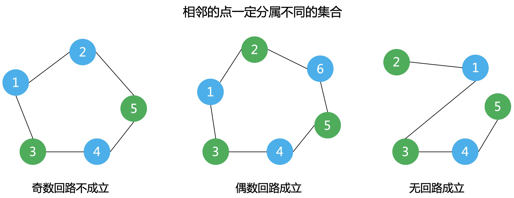

# 单身男女问题的科学解决方案

>[!TIP|style:flat|label:概述]
以下场景太过真实，但都是虚构，为了讲清楚理论的过程。如有雷同，纯属我瞎编，还望勿对号入座。

### 1 婚恋市场，明码实价
中国如今男女比例严重失衡，2021年预计将有9200万单身贵族。为了帮助解决这个社会性问题，提升整体人民的幸福感，小K打算投身到这份伟大的事业中。  
“**几何思维**”婚恋所，用最科学的方法，帮你脱单。通过概率论寻找最佳匹配对象，再通过微积分精确计算好感上升曲线，最后用数值分析无限逼近对方的理想型。最可怕的是，还包邮呢亲，关注一波了解一下？  

上班第一天，老板给了小K一份单身男女好感的数据资料。如下图，连线表示双方互有好感，可以尝试处对象。
<div align=center></div>

突然遇到了一个问题，那怎么才能进行最大的匹配，创造整体人民最大的幸福感呢，当然也可以顺便拿最多的中介费啦。

### 2 不要怂，就是干
很多时候不是你比别人差，而是你执行力不够，在犹豫中丧失机会。  
大家就先行动起来吧。  

快看，男1号选手在小K的鼓励(怂恿)下，率先对女1号发起了进攻。在离失败只有0.01公分的时候，他竟然奇迹般的完成反杀，没错，他成功啦，这种高超的技巧，娴熟的手法简直如同教科书一般，值得在座的每个同学深入研究反复琢磨啊。
<div align=center></div>

男2号选手也不甘落后，也对女2号选手发起了进攻，没错，又一次成功啦。

<div align=center></div>

男3号选手：我勒个去，我上我也行啊。于是也对自己心动的女1号发起了进攻，毫无意外，他阵亡了。。。
<div align=center></div>

中间彩蛋。
<div align=center></div>

男3号不甘心，原地复活，想再战一回。在一个地方跌倒，咱们就换一个地方再跌。。。  
于是对女2号发起了进攻。
<div align=center></div>

几经波折。
<div align=center></div>

男3号终于也成为了有牵绊的男人，不论未来有多久，只在乎曾经拥有过。
<div align=center></div>

男4一看：这也没我啥事儿了啊。

以上的过程其实就是经典的**匈牙利算法**，求解二分图的最大匹配问题。

### 3 匈牙利算法
**二分图**  
定义：设G=(V,E)是一个无向图，顶点集V可分割为两个互不相交的子集X，Y，并且图中每条边关联的两个顶点都分属于这两个互不相交的子集，两个子集内的顶点不相邻。  
<div align=center></div>

判断是否为二分图的充要条件：G至少有两个顶点,且其所有回路的长度均为偶数。  
判断方法：染色法  
* 开始对任意一未染色的顶点染色
* 判断其相邻的顶点中，若未染色则将其染上和相邻顶点不同的颜色；
* 若已经染色且颜色和相邻顶点的颜色相同则说明不是二分图，若颜色不同则继续判断

可用bfs或者dfs。
<div align=center></div>

**匹配**  
在二分图G的子图M中，M的边集E中的任意两条边都不依附于同一个顶点，则称M是一个**匹配**。
<div align=center></div>

**饱和点**  
匹配M的边集所关联的点为**饱和点**，否则为**非饱和点**。如上图：  
* $$M_1$$的饱和点：$$X_1,X_3,X_4,Y_1,Y_2,Y_3$$。
* $$M_2$$的饱和点：$$X_1,X_2,Y_1,Y_3$$。

**交错路**  
定义：图G的一条路径，且路径中的边在属于M和不属于M中交替出现。
<div align=center></div>

**增广路(非网络流中的定义)**  
定义：一条交错路，且该交错路的起点和终点都为匹配M的非饱和点。  
如上图，交错路1是增广路；交错路2不是增广路，因为终点$$X_1$$不是非饱和点。

由增广路推出以下结论：  
* 路径的边数为奇数，第一条边和最后一条边都不属于M
* 将路径中的边的匹配方式取反操作，会得到更大的匹配M'，匹配数加1
* M为图G的最大匹配等价于不存在M的增广路

<div align=center></div>

匈牙利算法核心思想：  
* 1) 初始匹配M为空
* 2) 找出一条增广路径p，取反操作得到更大的匹配M'代替M
* 3) 重复步骤2)，直到找不出增广路为止

### 4 代码实现
**变量定义及初始化**
```cpp
const int MAXM = 200, MAXN = 200;
bool map[MAXN][MAXM] = {false}, visit[MAXM];
int n, m, x[MAXM], y[MAXN], ans = 0;
```
**初始化**
```cpp
void init() {
    memset(x, 0xff, MAXM * 4);
    memset(y, 0xff, MAXN * 4);
    memset(map, false, MAXN * MAXM);

    int num, temp;
    cin >> n >> m;
    for (int i = 0; i < n; ++i) {
        cin >> num;
        for (int j = 0; j < num; ++j) {
            cin >> temp;
            map[i][temp - 1] = true;
        }
    }
}
```
**递归寻找增广路**
```cpp
bool hungary(int u) {
    for (int i = 0; i < m; ++i) {
        if (!visit[i] && map[u][i]) {
            visit[i] = true;
            if (y[i] == -1 || hungary(y[i])) {
                x[u] = i;
                y[i] = u;
                return true;
            }
        }
    }
    return false;
}
```
**遍历所有点**
```cpp
int main() {
    init();
    for (int i = 0; i < n; ++i) {
        if (x[i] == -1) {
            memset(visit, false, MAXM);
            if (hungary(i)) {
                ans++;
            }
        }
    }
    cout << ans << endl;

    return 0;
}
```
**测试数据**
```cpp
输入
5 5
2 2 5
3 2 3 4
2 1 5
3 1 2 5
1 2
输出s
4
```

---
**扫描下方二维码关注公众号，第一时间获取更新信息！**  
<div align=center></div>  