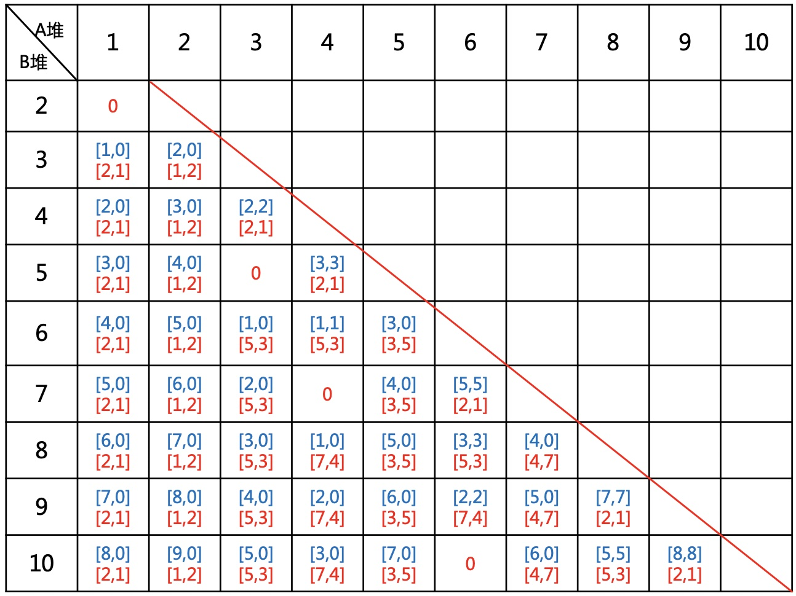

# 取石子游戏，用博弈论教你如何必胜

### 1.游戏规则
有两堆石子，数量任意，可以不同。游戏开始由两个人轮流取石子(至少取1个)。  

**每次有两种不同的取法，规则如下：**  
1.一是可以在任意的一堆中取走任意多的石子； 

2.二是可以在两堆中同时取走相同数量的石子。  

最后把石子全部取完者为胜者，假设双方都采取**最好的策略**，给定初始数量，你是否有必胜的把握？  
### 2.分析
为方便描述，设$$f[x,y]$$表示两堆石子数量分别为$$x,y$$，且你先取。  
1.$$f[x,y]=1$$表示必胜  
2.$$f[x,y]=0$$表示必败  
3.石堆没有顺序优先级，所以$$f[x,y]=f[y,x]$$  

#### 2.1首先分析3种特殊情况
1.两堆石子数量一样，两堆都取$$n$$个，必胜，得$$f[n,n]=1$$

2.只有一堆石子，一堆取$$n$$个，必胜，得$$f[n,0]=f[0,n]=1$$

3.石子数量为$$f[2,1]$$，只能取(1,0),(2,0),(1,1)，剩下石子为(1,1),(0,1),(1,0)对方都能胜，所以必败，得$$f[2,1]=f[1,2]=0$$，称此为**奇异局势**(必败局势)。


#### 2.2列出前面的几种情况如下：
<div align=center></div>

**可以得到如下规律：**  
* 奇异局势有$$f[2,1],f[5,3],f[7,4],f[10,6],\cdots$$，必败  
* 蓝色为先取的数量，一次就可以将状态转为奇异局势，必胜
* $$f[x+1,x],f[1,x],f[2,x]$$都可以转为$$f[2,1]$$，必胜
* $$f[x+2,x],f[3,x],f[5,x]$$都可以转为$$f[5,3]$$，必胜
* $$f[x+k,x]$$可以转化为$$f[x_1,y_1],x_1-y_1=k$$的奇异局势，而且$$f[x_1,x],f[y_1,x]$$也可以转化为$$f[x_1,y_1]$$

即奇异局势为$$f[x,y],|x-y|=1,2,3,4,\cdots,x,y\in N_+$$，且$$x,y不能重复出现$$  
**结论：**
如果两个人都采取最优策略，面对非奇异局势，先拿必胜；面对奇异局势，后拿必胜。  

### 3.理论推广
这个其实是经典的威佐夫博弈问题，但首先我们先介绍另一个定理，贝蒂定理。  
#### 3.1贝蒂定理
设$$a,b$$是正无理数，且$$\frac{1}{a}+\frac{1}{b}=1$$。  
记$$P=\{[na]|n \in N_+\},Q=\{[nb]|n \in N_+\}$$，($$[x]$$为取整函数)。  
则$$P,Q$$是$$N_+$$的一个划分，$$P\cap Q=\varnothing,P\cup Q=N_+$$。  

**证明如下**
##### 1.任一个整数至多在集合P或Q中出现一次。  
$$a,b>0,\frac{1}{a}+\frac{1}{b}=1,\Longrightarrow a,b>1$$，对于不同整数$$n,[na],[nb]$$各不相同。  
##### 2.$$P\cap Q=\varnothing$$(反证法)  
假设$$k\in P\cap Q,k\in N_+$$，则存在正整数$$m,n$$使得$$[ma]=[nb]=k$$，  
即$$k< ma,nb< k+1,\Longrightarrow$$  
$$\frac{m}{k+1}< \frac{1}{a}< \frac{m}{k}$$，$$\frac{n}{k+1}< \frac{1}{b}< \frac{n}{k}$$，  
两式相加得  
$$\frac{m+n}{k+1}< 1 < \frac{m+n}{k},\Longrightarrow k< m+n< k+1$$，与$$m,n$$为整数矛盾。  
##### 3.$$P\cup Q=N_+$$(反证法)  
假设$$k\in N_+,k\notin P\cup Q,$$，
则存在正整数$$m,n$$使得$$[ma]< k < [(m+1)a],[nb]< k < [(n+1)b]$$，  
由此得$$ma < k \leq [ (m+1)a]-1< (m+1)a -1$$(因为a是无理数)，  
类似有$$nb < k \leq [ (n+1)b]-1< (n+1)b -1,\Longrightarrow$$  
$$\frac{m}{k}< \frac{1}{a}< \frac{m+1}{k+1},\frac{n}{k}< \frac{1}{b}< \frac{n+1}{k+1}$$，  
两式相加得  
$$\frac{m+n}{k}< 1< \frac{m+n+2}{k+1},\Longrightarrow m+n< k< k+1< m+n+2$$，与$$m,n,k$$为整数矛盾。  
#### 3.2回归威佐夫问题
设奇异局势构成的序列组为$$s_n=(a_n,b_n)$$，$$s_n$$即为通项公式，可以看出$$s_n$$是一个贝蒂序列。  
设$$a_n=[na],b_n=[nb]$$，  
因为$$b_n=a_n+n=[an]+n=[(a+1)n]=[bn]$$，即$$a+1=b$$。  
代入$$\frac{1}{a}+\frac{1}{b}=1$$，得$$a=\frac{\sqrt{5}+1}{2}$$。  
即$$a_n=\left[\frac{\sqrt{5}+1}{2}n\right],b_n=a_n+n$$。  
而$$n=\left[\frac{\sqrt{5}-1}{2}a_n\right]$$。
#### 3.3如何快速判断
给定一个局势$$(x,y),x< y$$，得$$n=y-x$$，  
如果$$x==\left[\frac{\sqrt{5}+1}{2}n\right]$$，则是奇异局势，否则不是。
#### 3.4例题
poj1067：http://poj.org/problem?id=1067
#### 3.5代码实现
```cpp
const double q = (1 + sqrt(5.0)) / 2.0;

bool isWythoff(int a, int b) {

    int t;
    if (a > b) t = a, a = b, b = t;
    return (int) ((b - a) * q) == a;

}
```

---
**扫描下方二维码关注公众号，第一时间获取更新信息！**  
<div align=center></div>  
