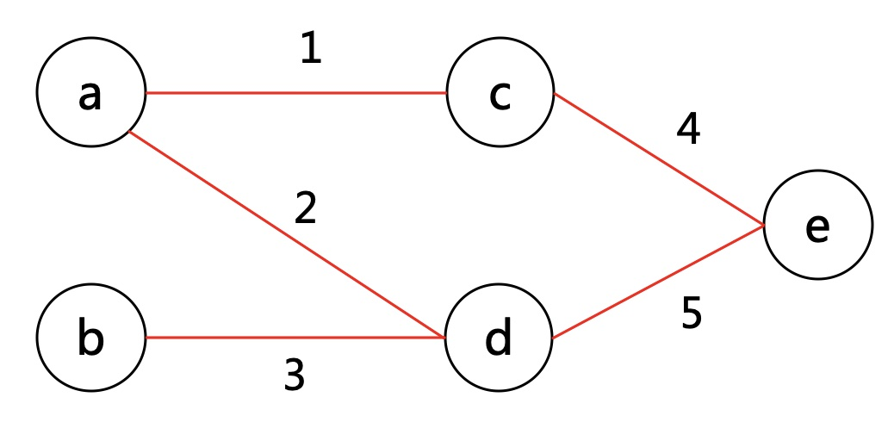
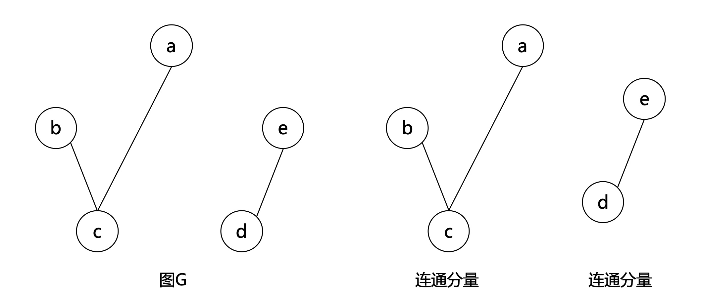

# 图论入门

> [!TIP|style:flat|label:概述]
图论是计机算算法中很重要的一种思想，很多的实际问题都可以通过图论建模来解决。本文先介绍基本的图论相关知识，为后续讲解具体的图论算法做铺垫，如最大匹配，最小生成树，最短路，网络流，差分约束，拓扑序等。

### 1 图定义
图的表示：G=(V,E), V=(v|v为图中的顶点)， E=(e|e为图中的边)  
如下图：点集V：a,b,c,d,e，边集E：1，2，3，4，5
<div align=center></div>

### 2 分类
可分为**有向图**和**无向图**
<div align=center></div>

### 3 存储
分邻接矩阵和邻接表：  
* 邻接矩阵，一般用二维数组实现，对于不带权的图，也可以用n(row)个m(column)位二进制数来表示；  
空间由点决定，适用点少、边多的稠密图
* 邻接表，一般用链表实现；  
空间由边决定，适用边少、点多的稀疏图

如上图中，无向图用邻接矩阵存储，有向图用邻接表存储。
<div align=center></div>

**变量定义**
```cpp
// 邻接矩阵
int map[100][100];

// 邻接表
struct ENode{
    int adjvex;
    int weight;
    ENode *next;
}

struct VNode{
    int vertex;
    ENode *edge;
}

VNode adjList[100];
```

### 4 简单图与多重图
无向图中，关联一对顶点的边多于一条，称为平行边。有向图中，关联一对顶点的边多于一条，且方向相同，也称为平行边。  
**多重图**：含平行边或自环边的图。  
**简单图**：既不含平行边，也不含自环边。
<div align=center></div>

### 5 完全图
每对顶点之间都恰有一条边的简单图，n个顶点的完全图，共有n(n-1)/2条边。
<div align=center></div>

### 6 独立集
**独立集**：图中两两互不相邻的顶点构成的集合，为图G的顶点集的子集。  
**极大独立集**：图的一个独立集，且不是其他任一独立集的真子集。  
**最大独立集**：顶点数最多的独立集。顶点个数称为图G的独立数，记为α(G)。  
如下图：  
独立集：[a,c],[a,e],[b,c],[b,e],[b,d],[c,e],[a,c,e],[b,c,e]  
极大独立集：[b,d]，加入任何点都无法构成独立集；而[a,c]不是极大独立集，还可以加入e构成更大的独立集[a,c,e]  
最大独立集：[a,c,e],[b,c,e]
<div align=center></div>

### 7 团
**团**：图G的一个完全子图。  
**极大团**：图的一个团，且不是其他任一团的真子集。    
**最大团**：顶点数最多的团。  
如下图：  
团：[a,b],[a,d],[c,d],[c,e],[d,e],[c,d,e]  
极大团：[a,b],[a,d],[c,d,e]  
最大团：[c,d,e]
<div align=center></div>

### 8 补图
定义：图G的完全图去除G的边集后得到的图。
<div align=center></div>

### 9 最大独立集也最大团
独立集是任意两点不相邻，而团是任意两点相邻。图G的补图是去掉了相连的边，添加不相邻的边。这样图G的最大独立集就可以转化成补图的最大团。    
如下图：
<div align=center></div>

<div align=center></div>

### 10 连通图
图中从一个顶点到达另一顶点，若存在至少一条路径，则称这两个顶点是连通的。  
无向图中，如果任意两个顶点之间都能够连通，则称此无向图为**连通图**。
<div align=center></div>

无向图G的一个极大连通子图称为G的一个**连通分量**。
<div align=center></div>

有向图中，如果任意两个顶点之间都存在路径，则称此有向图为**强连通图**。
<div align=center></div>

有向图的极大强连通子图，称为**强连通分量**。
<div align=center></div>

n个顶点的强连通图，边数最多为n(n-1)，最少为n。
<div align=center></div>

### 11 二分图
定义：设G=(V,E)是一个无向图，顶点集V可分割为两个互不相交的子集，并且图中每条边关联的两个顶点都分属于这两个互不相交的子集，两个子集内的顶点不相邻。
<div align=center></div>

充要条件：G至少有两个顶点,且其所有回路的长度均为偶数。  
判断方法：染色法  
* 开始对任意一未染色的顶点染色
* 判断其相邻的顶点中，若未染色则将其染上和相邻顶点不同的颜色；
* 若已经染色且颜色和相邻顶点的颜色相同则说明不是二分图，若颜色不同则继续判断

可用bfs或者dfs。
<div align=center></div>

---
**扫描下方二维码关注公众号，第一时间获取更新信息！**  
<div align=center></div>