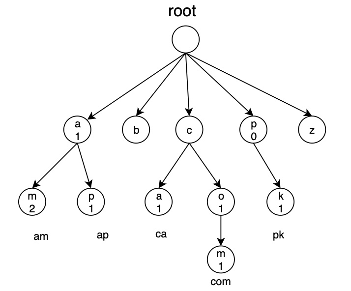
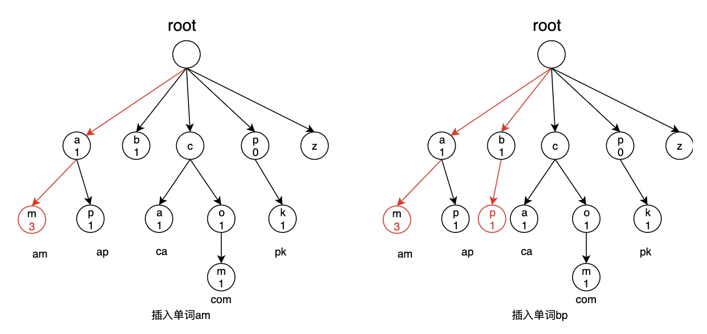
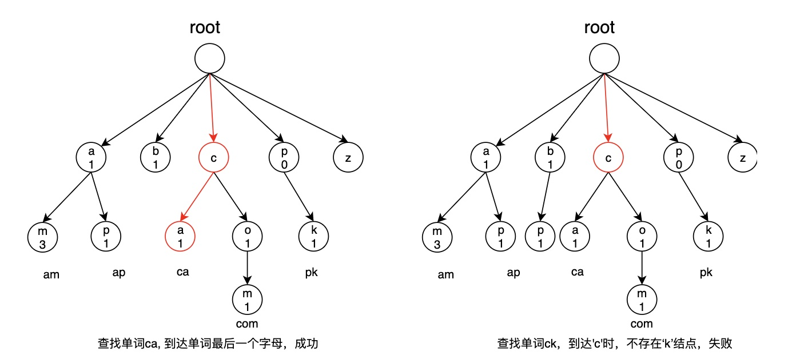

# 字典树

### 1.概念
> [!TIP|style:flat|label:定义]
字典树，也称为单词查找树，Trie树，本质上就是一个26叉树。应用于单词的统计，存储。  

如下图所示：
<div align=center></div>

### 2.性质
1. 从根结点出发，到每一个叶子结点的路径，即表示一个单词。
2. 每个单词拥有共同的祖先，即有公共前缀。
3. 每个结点可以存储额外信息，例如：
    * value:该点代表的单词(也可从底向上递归)
    * count:该单词的数量

### 3.结点定义
可根据实际场景，定义需要存储的信息。
```cpp
struct Trie {
    int count;
    string value;
    Trie *child[26];
};
```
### 4.插入
从根开始，向下查找路径。
* 如果路径中某结点不存在，则表示没有该单词，然后新建一个结点，继续向下查找。
* 到达叶子结点时，数量加1。

如插入单词`am`，`bp`
<div align=center></div>


```cpp
void insert(Trie *root, int step, const string &word) {

    // 找到插入位置
    if (step == word.size()) {
        root->count++;
        return;
    }
    if (!root->child[word[step]-'a']) {
        root->child[word[step]-'a'] = new Trie();

    }
    insert(root->child[getIndex(word[step])], step + 1, word);
}
```
### 5.查找
同插入过程，从根开始向下查找路径。
* 没有路径时表示单词不存在。
* 到达叶子结点时，如果数量大于0则表示存在，否则不存在。

如查找单词`ca`，`ck`
<div align=center></div>


```cpp
bool find(Trie *root, int step, const string &word) {

    if (step == word.size() && root->count > 0) {
        return true;
    }
    if (root->child[word[step] - 'a']) {
        return find(root->child[word[step] - 'a'], step + 1, word);
    } else {
        return false;
    }
}
```

---
**扫描下方二维码关注公众号，第一时间获取更新信息！**  
<div align=center></div>
