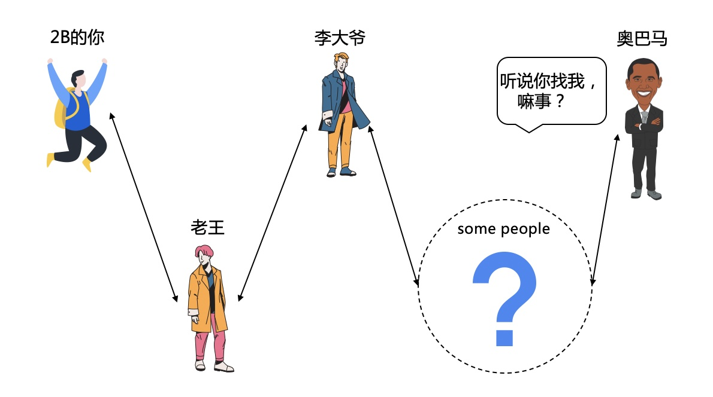
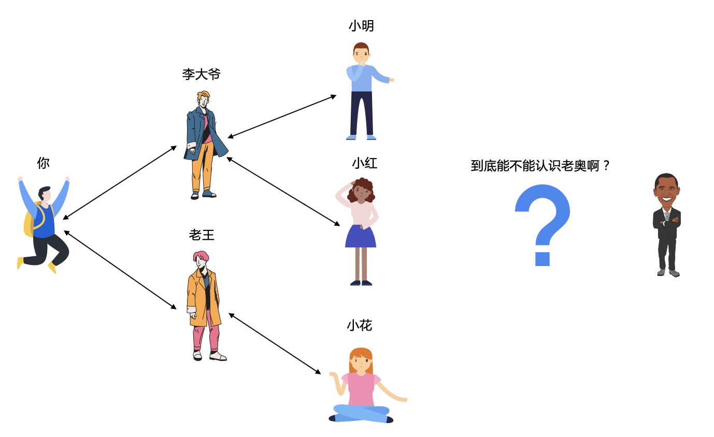
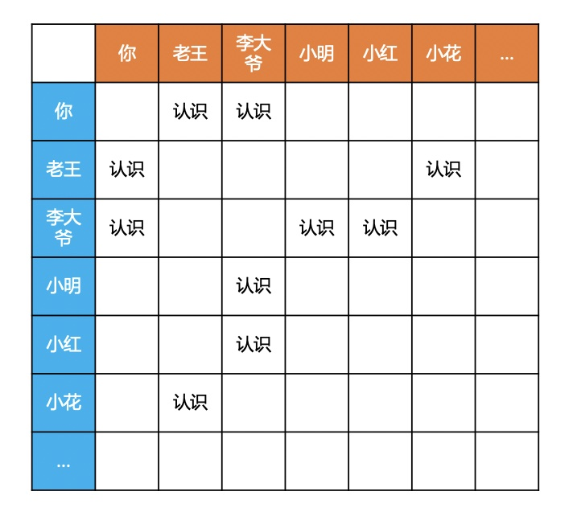
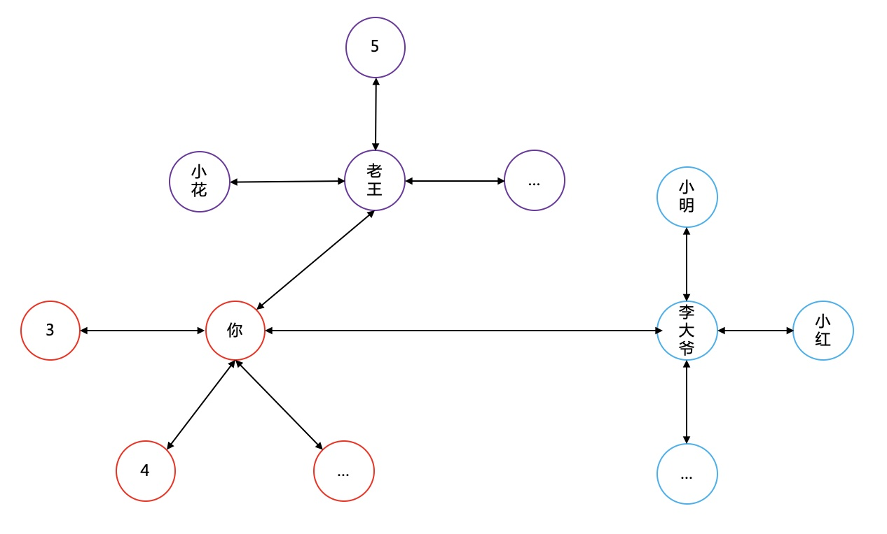
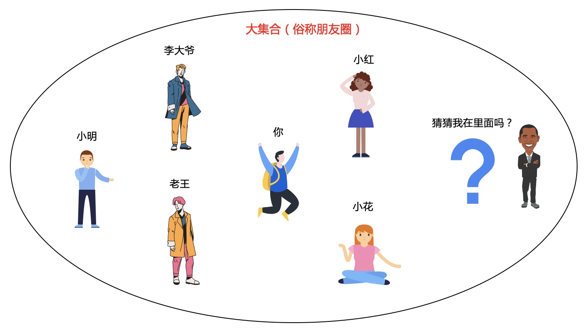
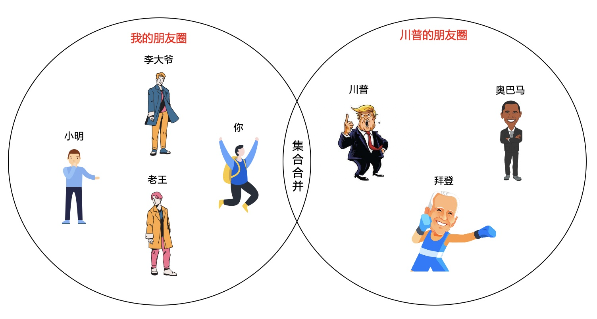
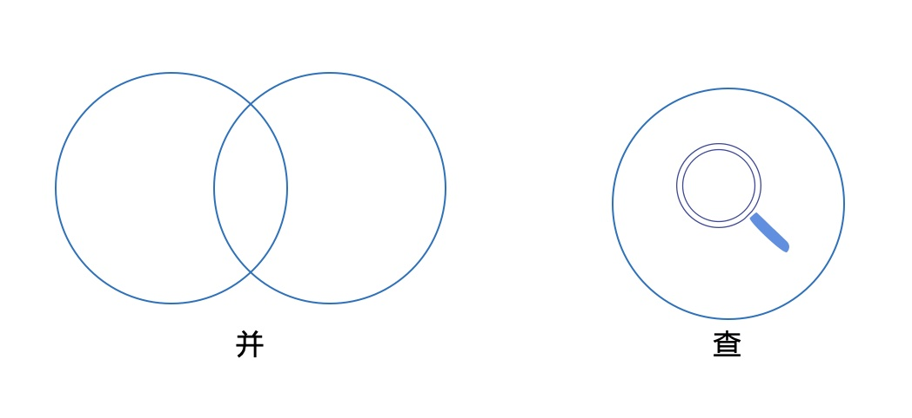
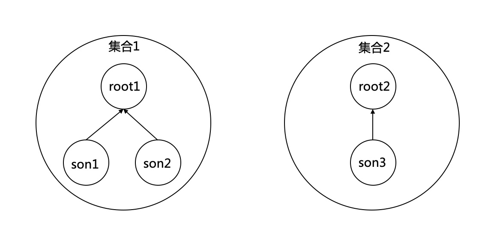
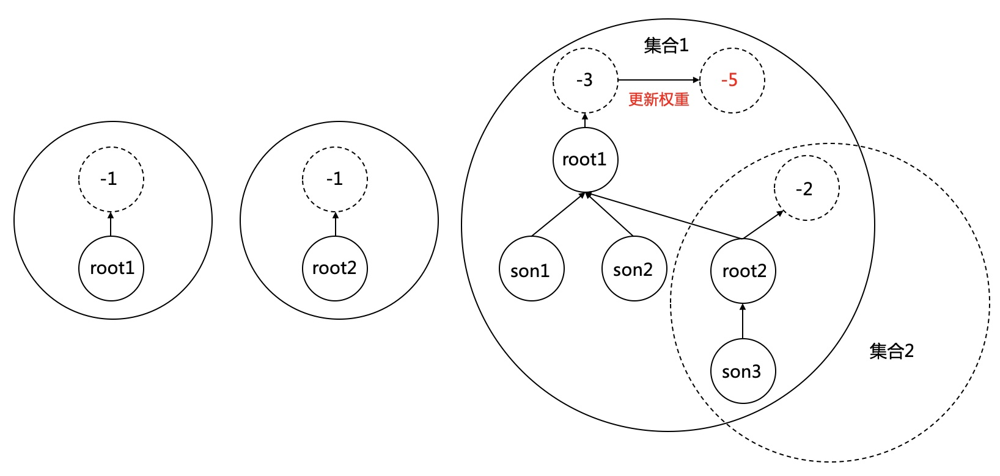
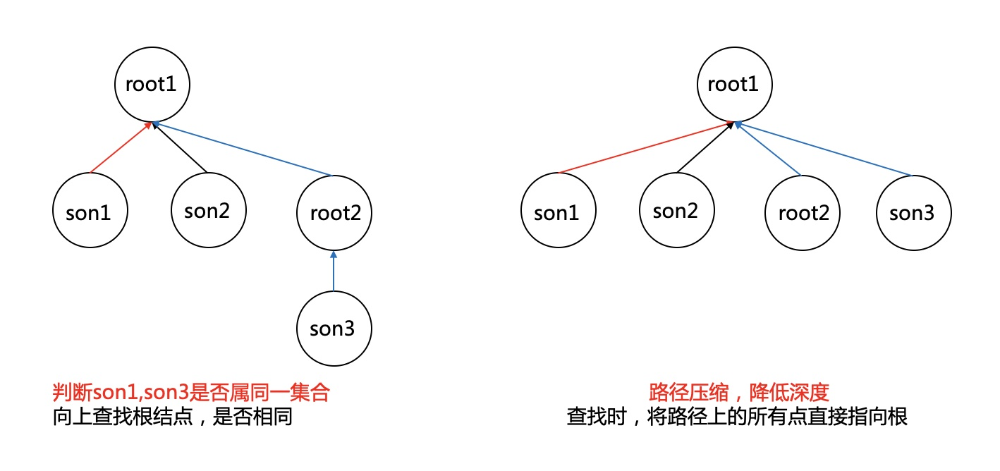

# 通过6人介绍可以认识世界上任何一个人？

### 1.六度分隔理论
**世界上任何两个互不相识的人，最多只需要通过6个中间人，就可以建立联系。**  
哈佛大学的社会心理学家米尔格兰姆于1967设计了一个连锁信件实验。他将一套连锁信件随机发送给居住在内布拉斯加州奥马哈的160个人，信中放了一个波士顿股票经纪人的名字，并要求每名收信人把这封信寄给自己认为是比较接近这名股票经纪人的朋友。这位朋友收到信后，再把信寄给他认为更接近这名股票经纪人的朋友。最终，大部分信件都寄到了这名股票经纪人手中，每封信平均经手6次到达。  

例如你认识老王，老王认识李大爷，李大爷又认识某人，如此关联，你和奥巴马之间，最多只差6个人介绍就可以加微信好友啦。
<div align=center></div>

### 2.引发思考
如果我现在知道了所有人的通讯录好友，我想知道我到底能不能认识老奥，怎么验证呢？  
全球有77亿人口，每个人的好友圈也有几百上千，这样的数据量是很大的，简单的一个一个的查找是行不通的。
<div align=center></div>

那么问题来了，人口普查哪家强，四川成都找老王。。。  
所有的信息数据如下表：  
<div align=center></div>
转换成图的形式会比较直观。如果把2个互相认识的人用线连接起来，问题就转化成：你和老奥之间能否找到一条通路（暂不考虑最短是不是不超过6个人）。  
<div align=center></div>

### 3.问题建模
假设**朋友的朋友都是朋友，朋友的敌人也是朋友**(或者敌人的朋友还是朋友，whatever...)。  

我们把所有直接认识的，或者能间接认识的都放到一个大集合中，建立一个大朋友圈。  
问题就变成：老奥在不在我们的大朋友圈里？

<div align=center></div>

如果你的大朋友圈里面有人认识川普，那就要把川普的朋友圈里面的所有人都加进来，形成一个新的朋友圈。
<div align=center></div>

相信敏锐的你已经发现问题的本质，这里面只有2个重要的操作，来跟我一起大声朗读，**并...查...**。这就需要一种能高效处理集合的合并与查找的算法，并查集就是专门为这种场景量身定制。  

<div align=center></div>

### 4.算法理论
**并查集本质是一个森林，里面有很多树。**  
每个树有一个根，以不同的根代表不同的集合。如下,root1,root2代表两个集合。  
<div align=center></div>

初始时，每个元素都属于一个独立的集合，该元素作为根。每个根指向一个虚拟根-n，代表权重(表示该集合有n个元素)。  
**更新合并**  
将权重小的集合的根指向权重大的集合的根(此操作是为尽量降低树的深度)。
<div align=center></div>

**查找**  
判断2个元素是否属同一集合，只需向上查找根，再判断是否相同。  
过程中做路径压缩，加快下一次查找速度。
<div align=center></div>

### 5.代码实现
**查找**
```cpp
int findFather(int s) {
    int root = s, temp;
    // 查找s的最顶层根
    while (father[root] >= 0) {
        root = father[root];
    }
    // 路径压缩，提高后续查找效率
    while (s != root) {
        temp = father[s];
        father[s] = root;
        s = temp;
    }
    return root;
}
```
**合并**
```cpp
void unionSet(int s, int e) {
    int rootS = findFather(s);
    int rootE = findFather(e);
    int weight = father[rootS] + father[rootE];
    // 将结点数少的集合作为结点数多的集合的儿子节点
    if (father[rootS] > father[rootE]) {
        father[rootS] = rootE;
        father[rootE] = weight;
    } else {
        father[rootE] = rootS;
        father[rootS] = weight;
    }
}
```
例题，poj1182，poj1308，poj1456，poj1611


---
**扫描下方二维码关注公众号，第一时间获取更新信息！**  
<div align=center></div>