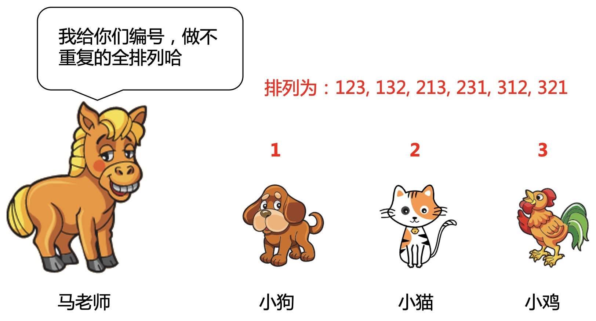
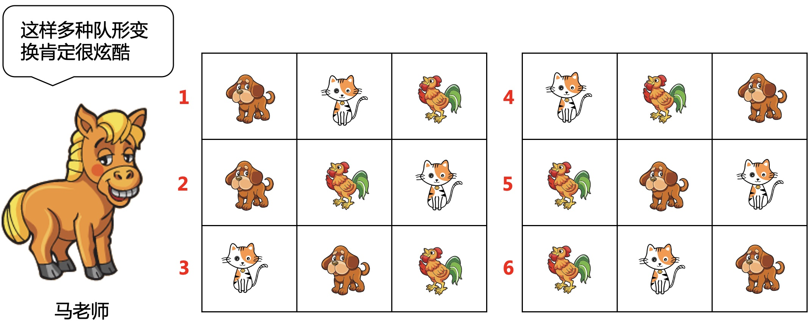
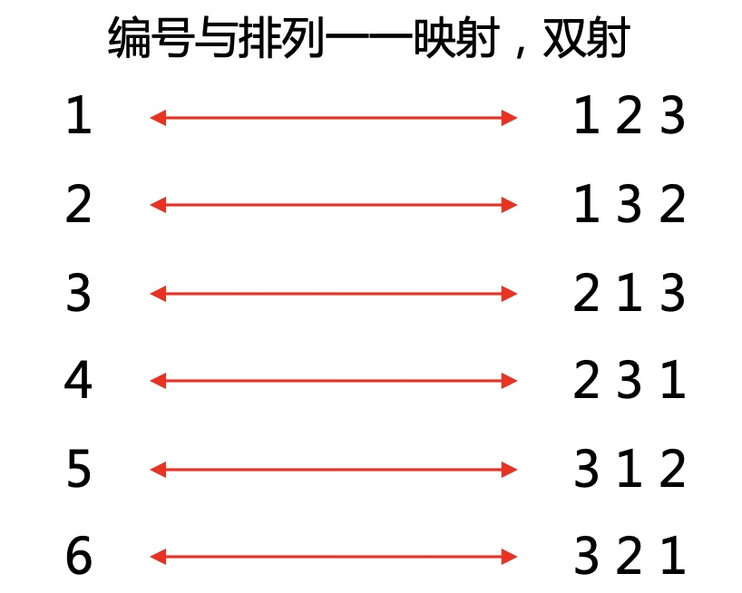
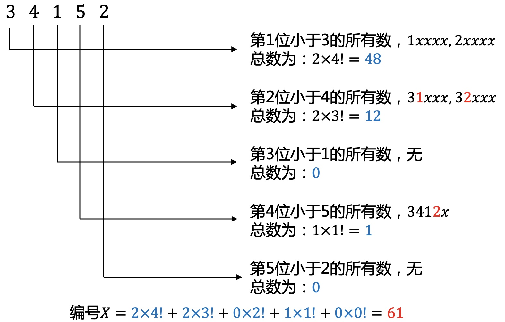
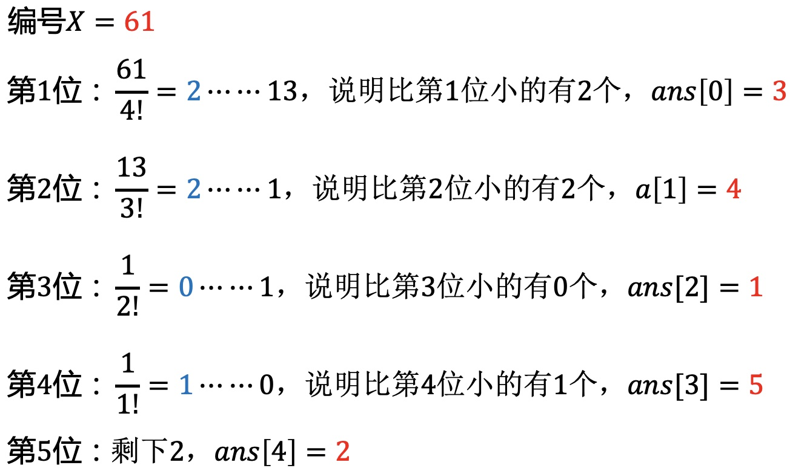

# 马老师的烦恼

### 1.动物园61节来啦
又到了一年一度的61儿童节，动物园里充满了欢声笑语。不仅有好吃的好喝的，还有各种好玩的活动。当然最重量级的就是小朋友们的节目表演啦。  
马老师也开始紧锣密鼓的筹备节目。
<div align=center></div>

马老师平时熟读《孙子兵法》，深知阵型的重要性，先让同学们变换一下阵型。  
马老师的博学也派上了用场，迅速下发了指令，满怀期待的看着同学们。  
<div align=center></div>
3秒后，同学们依然保持动能守恒，就是原地不动啦。
<div align=center></div>
原来是小朋友们平时没好好学习《孙子兵法》，根本听不懂老师说的啥。  
<div align=center></div>
马老师长叹一声，只好放弃。那就做简单的全排列吧，这个你们肯定学过。
<div align=center></div>

但正式表演的时候同学有很多，如果有20个同学，那马老师怎么下发指令呢，总不能说“同学们，变换队列为123456...20”。   
马老师陷入了沉思。。。
### 2.问题建模
能否找到一种简单的方法来指定是哪一种排列呢，比如给每个排列队形取一个名字，如“苹果队形，香蕉队形...”，这样也行，不过要想这么多名字也不容易。  
要是能给每个不同的排列按顺序编号就完美了。
<div align=center></div>

这样问题就转化为：能否找一个编号与排列的一一映射，简称双射。  
即$$f(编号)=排列,f^{-1}(排列)=编号$$。
<div align=center></div>

这就要说到一个著名的数学定理了，**康托展开**。
### 3.康托展开
>[!TIP|style:flat|label:定义]
>康托展开是全排列与自然数的双射，常用于空间压缩。  
>本质是计算当前排列在所有由小到大全排列中的顺序，因此可逆。

**3.1 排列$$\rightarrow$$自然数**  
<div align=center></div>

**3.2 自然数$$\rightarrow$$排列**  
<div align=center></div>

### 4.代码实现
**4.1 康托编码**
```cpp
// 0-9的阶乘
const int FAC[] = {1, 1, 2, 6, 24, 120, 720, 5040, 40320, 362880};

int cantor(int a[], int n) {
    int ans = 0;
    for (int i = 0; i < n; ++i) {
        int lessThan = 0;
        for (int j = i + 1; j < n; ++j) {
            if (a[j] < a[i]) lessThan++;
        }
        ans += lessThan * FAC[n - i - 1];
    }
    return ans;
}
```
**4.2 康托解码**
```cpp
void decode(int ans[], int x, int n) {
    bool visit[9] = {false};
    for (int i = 0; i < n; ++i) {
        ans[i] = x / FAC[n - i - 1];
        int j, order = 0;
        for (j = 0; j < n; ++j) {
            if (!visit[j]) {
                if (ans[i] == order) break;
                order++;
            }
        }
        ans[i] = j + 1;
        visit[j] = true;
        x %= FAC[n - i - 1];
    }
}
```
例题poj1077


---
**扫描下方二维码关注公众号，第一时间获取更新信息！**  
<div align=center></div>