# 经典面试题：有序矩阵的快速查找

>[!TIP|style:flat|label:引言]
>算法核心不在于框架用得有多熟练，更多在于逻辑和思维方式，很多情况都需要变换间接建模。本文将通过一个经典的面试题来描述思维过程，引导最终问题建模。

### 1 金三银四
最近招聘市场各路神仙出没，小K也打算去凑一下热闹。  
<div align=center>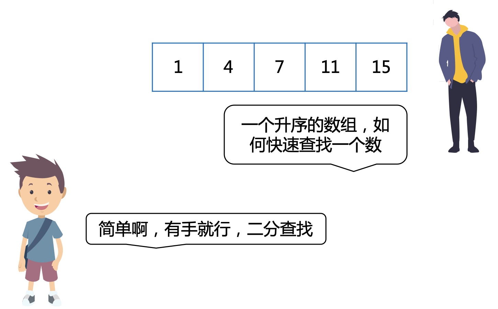</div>

热身运动，小K先和面试官过了几招，不分胜负。  
接着面试官要开始放大招了。
<div align=center>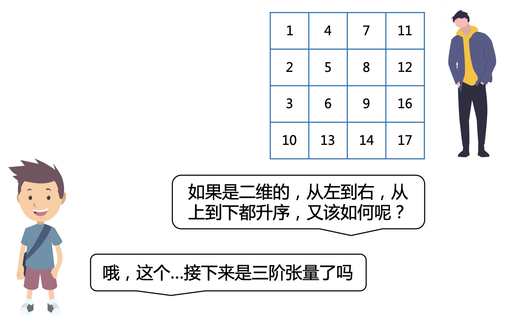</div>

这招怎么化解呢，等小K先思考2分钟。

### 2 分析
#### 不思考解法
从左上到右下，一个一个的对比不就行了吗，当然这肯定不是面试官期望的。
<div align=center>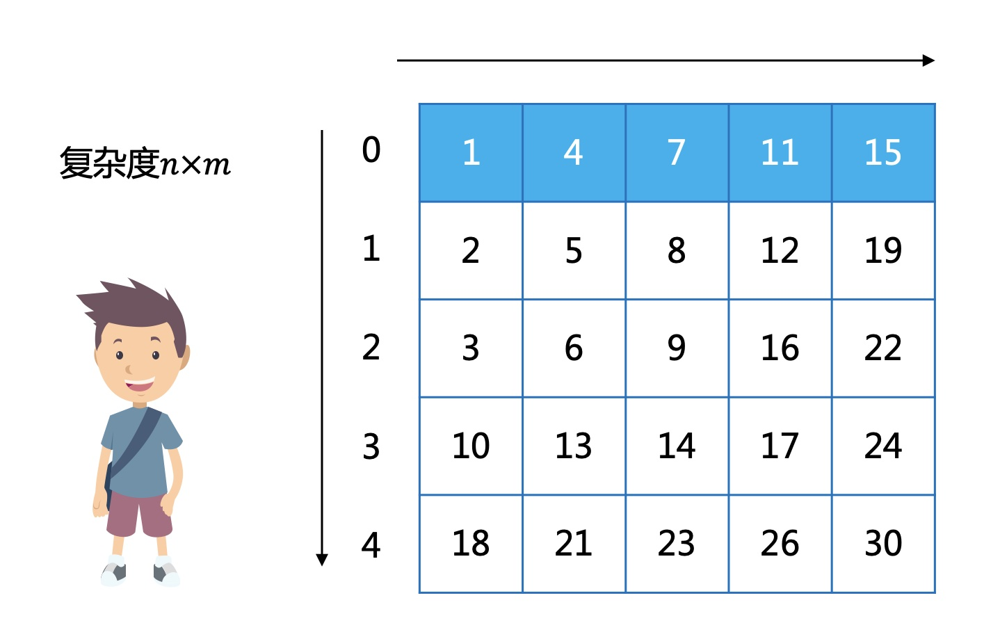</div>

#### 逐行二分
一维的可以用二分快速查找，那就分解成一维，一行一行的用二分不就行了吗。
<div align=center>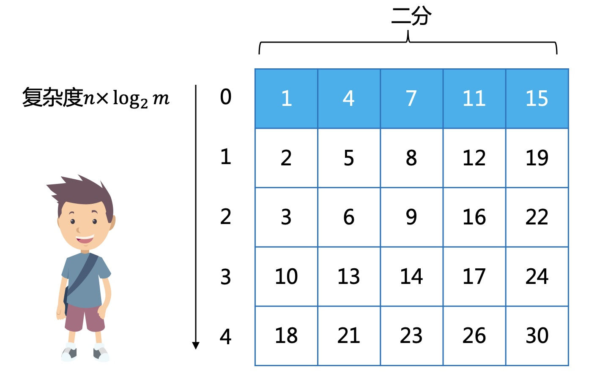</div>

但每一列也是有序的，这种方法其实就没有用上这个信息了，所以肯定还有更好的方法。

### 3 找规律
一般是先想一下有没有可以套用的算法框架，如果不能发现很明显的算法，可以先分析问题的规律，然后再尝试变换间接建模。我们先尝试把所有能发现的规律都找出来。

根据问题描述，每行每列都升序。
<div align=center>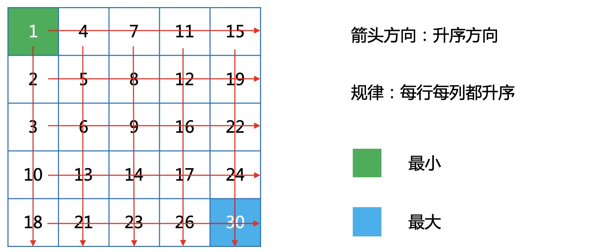</div>

更小规模也符合相同的规律，这就意味着可以想办法缩小问题规模。
<div align=center>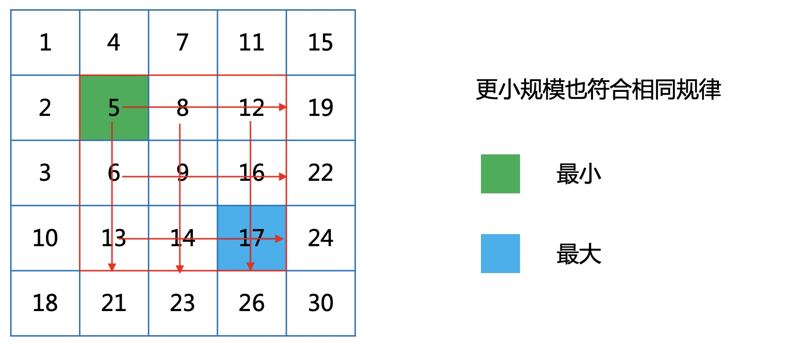</div>

从左上开始只能向下向右，则经过的路线升序。
<div align=center>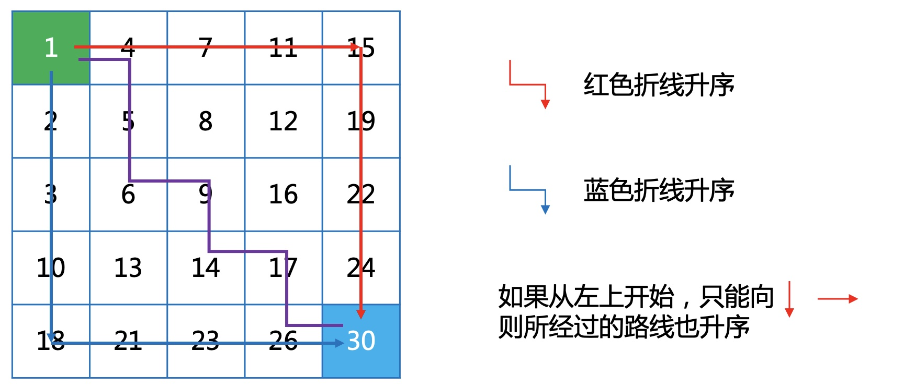</div>

从左上斜着看，还有点像小根堆。
<div align=center>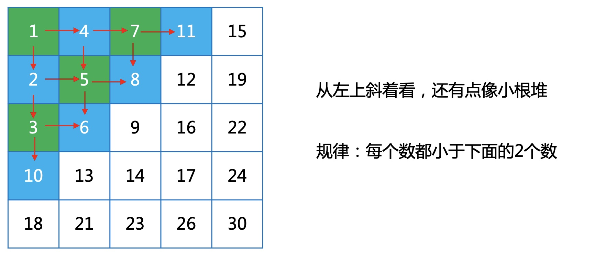</div>

对角线方向升序。
<div align=center>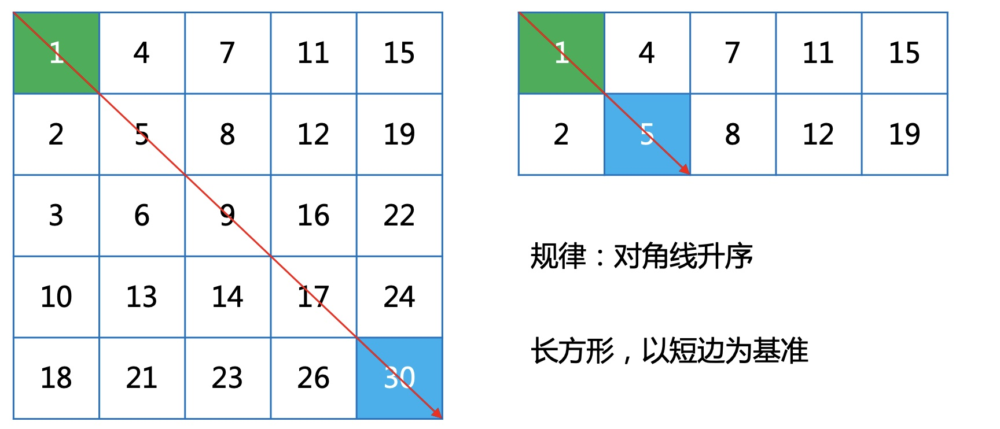</div>

在对角线上选取一个数与目标数对比，可以用分治的思想，分块把大问题化解为小问题。  
<div align=center>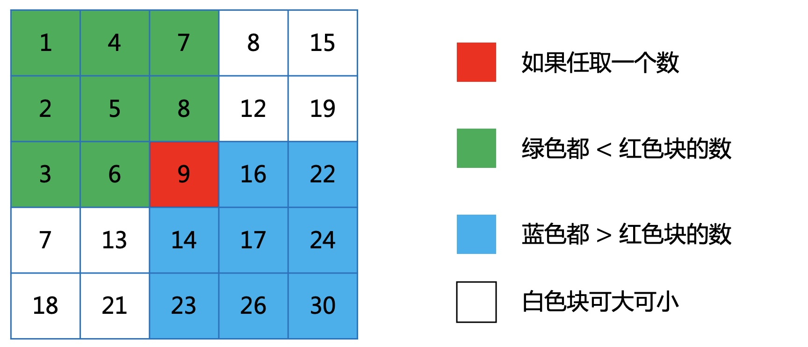</div>

在边缘选取一个数，可以一行一列的删除，把大问题化解为小问题。
<div align=center>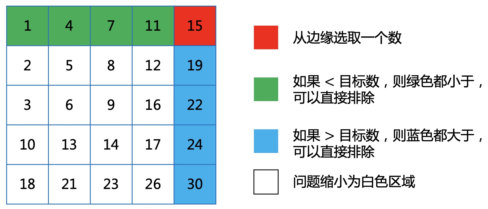</div>

大于目标数，按列快速缩小问题规模。
<div align=center>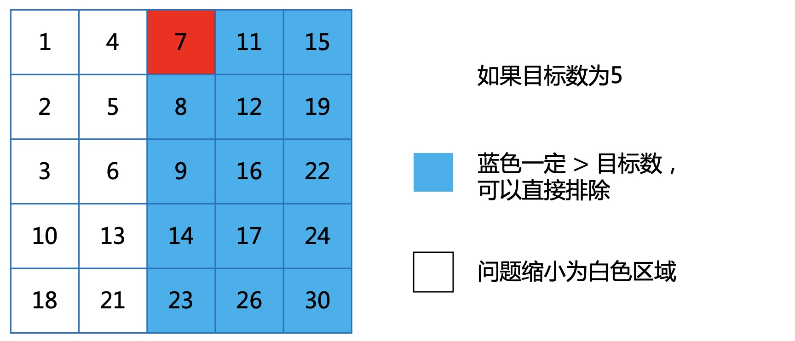</div>

小于目标数，按行快速缩小问题规模。
<div align=center>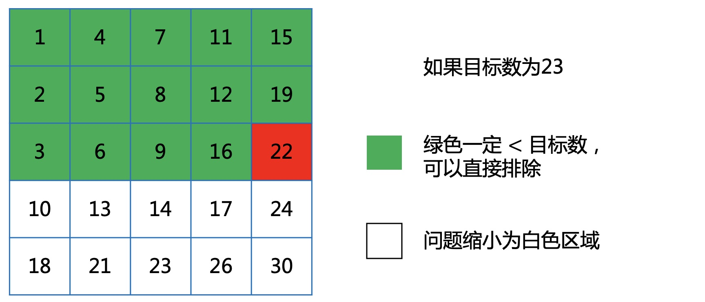</div>

根据上面找出的规律，有很多的方式都可以缩小问题规模，那从哪个点开始判断呢。
<div align=center>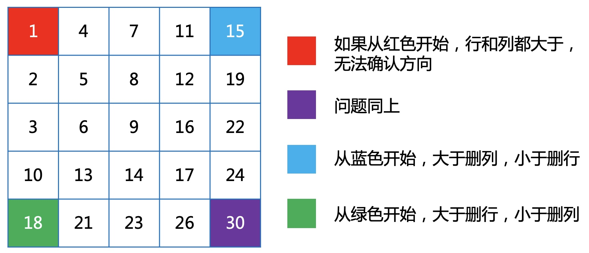</div>

所以从右上或者左下开始都可以。

### 4 算法建模
根据上面总结的规律，可以有很多种算法，这里以效率比较高的2种算法说明。
#### 4.1 线性缩小
<div align=center>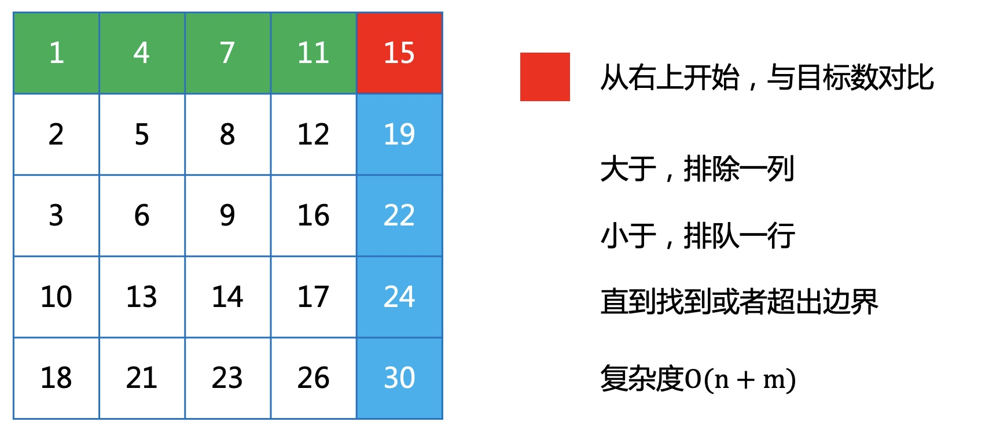</div>

**代码实现**  
```cpp
bool solve1(vector<vector<int>> &matrix, ofstream &cout, int x) {
    int i, j;
    i = 0;
    j = matrix[0].size() - 1;
    bool flag = false;
    while (i < matrix[0].size() && j >= 0) {
        if (matrix[i][j] > x) {
            --j;
        } else if (matrix[i][j] < x) {
            ++i;
        } else {
            return true;
        }
    }
    return false;
}
```

#### 4.2 二分缩小
<div align=center>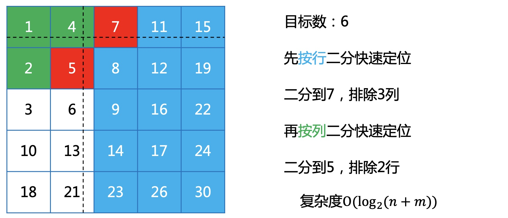</div>

**代码实现**  
**按行二分，缩小列**
```cpp
int searchColumn(vector<vector<int>> &matrix, int up, int right, int x) {
    int i, j, mid;
    i = 0;
    j = right;
    while (i < j) {
        mid = (i + j) / 2;
        if (x < matrix[up][mid]) {
            j = mid - 1;
        } else if (x > matrix[up][mid]) {
            i = mid + 1;
        } else {
            i = j = mid;
        }
    }
    if (matrix[up][i] > x) --i;
    return i;
}
```
**按列二分，缩小行**
```cpp
int searchRow(vector<vector<int>> &matrix, int up, int right, int x) {
    int i, j, mid;
    i = up;
    j = matrix.size() - 1;
    while (i < j) {
        mid = (i + j) / 2;
        if (x < matrix[mid][right]) {
            j = mid - 1;
        } else if (x > matrix[mid][right]) {
            i = mid + 1;
        } else {
            i = j = mid;
        }
    }
    if (matrix[i][right] < x) ++i;
    return i;
}
```
**主要过程**
```cpp
bool solve2(vector<vector<int>> &matrix, ofstream &cout, int x) {
    int up, right;
    up = 0;
    right = matrix[0].size() - 1;
    while (!(up == matrix.size() || right < 0)) {
        right = searchColumn(matrix, up, right, x);
        if (right < 0) continue;
        up = searchRow(matrix, up, right, x);
        if (up == matrix.size())continue;
        if (matrix[up][right] == x) {
            return true;
        }
    }
    return false;
}
```

### 5 数据测试
**数据生成**
```cpp
void dataInit() {
    ofstream cout("a.in");
    int s = 0;
    for (int i = 0; i < 5000; ++i) {
        for (int j = 0; j < 5000; ++j) {
            cout << s + i + j << " ";
        }
        s += 4999;
        cout << endl;
    }
}
```
**执行效率**
```cpp
目标数：10002500
线性执行效率：
row=2000, column=2500
T1=288
二分执行效率
row=2000, column=2500
T2=10
```

### 6 总结
通过问题的现象，分析本质，可以发现很多隐藏的规律，然后再通过所学的知识进行问题建模，进而解决未知的问题。

如果喜欢小K的文章，请点个关注，分享给更多的人，小K将持续更新，谢谢啦!  

---
**扫描下方二维码关注公众号，第一时间获取更新信息！**  
<div align=center></div>