# 村网通工程

### 1 新农村建设
大清都亡了，我们村还没有通网。为了响应国家的新农村建设的号召，村里也开始了网络工程的建设。  
穷乡僻壤，人烟稀少，如何布局网线，成了当下村委会首个急需攻克的难题。  
如下图，农户之间的距离随机，建设网线的成本与距离成正比，怎样才能用最少的成本将整个村的农户网络连通呢？
<div align=center>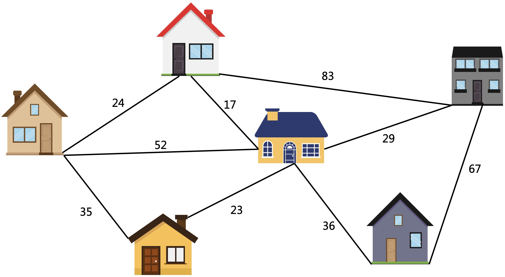</div>

### 2 思考
如果农户A到农户B，农户B到农户C的网线已经建好了，那农户A和农户C也间接的连通了，不用再建设。
<div align=center></div>

每一根线都可以连通2个农户，所以有N个农户，就只需要N-1条网线就可以了。
<div align=center>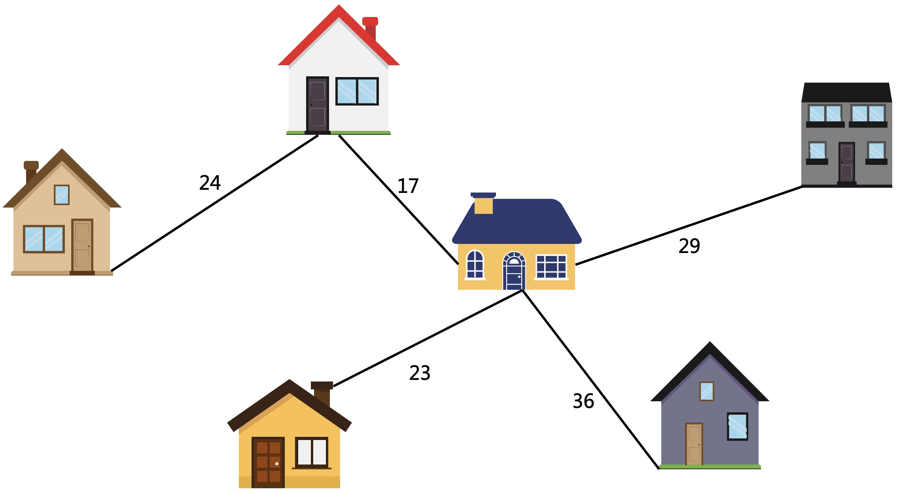</div>

### 3 问题建模
将上述问题转化为无向图来表示。
<div align=center>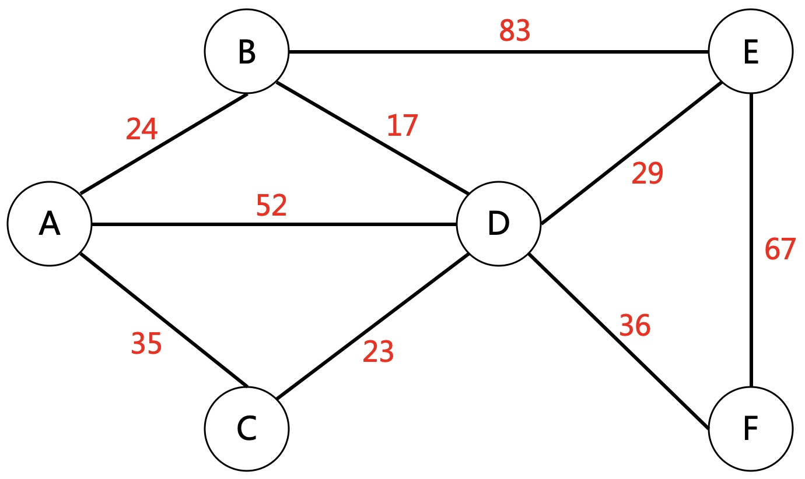</div>

用邻接矩阵存储农户之间的距离。
<div align=center>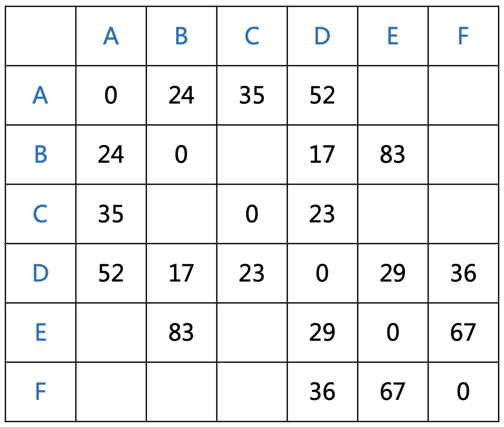</div>

这样问题就转化成：找N-1条边将上述图组成一个连通图，要求N-1条边的权值和最小。
<div align=center>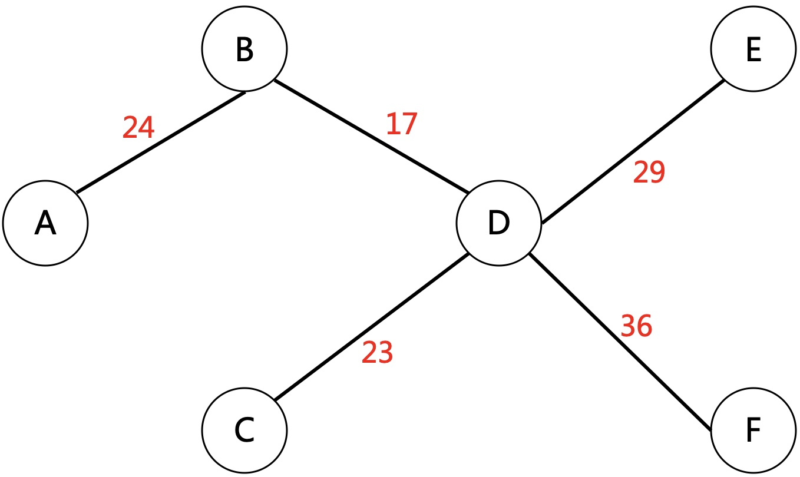</div>

这就是经典的**最小生成树**问题。有两种算法专门解决这类问题，**Prim**和**Kruskal**。

### 4 Prim
#### 4.1 反向思考
对于一个N个点，N-1条边的连通图：  
如果剪掉1条线，整个图会变成2个连通子图；如果剪掉2条线，就会变成3个连通子图。
<div align=center>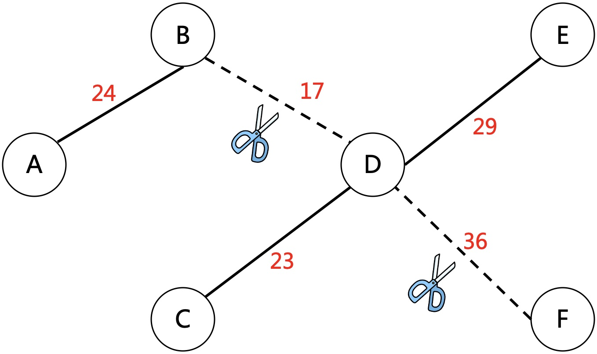</div>

如果剪掉了B到D之间的网线，这时变成2个连通子图。
* 连通子图1：A,B
* 连通子图2：C,D,E,F

<div align=center>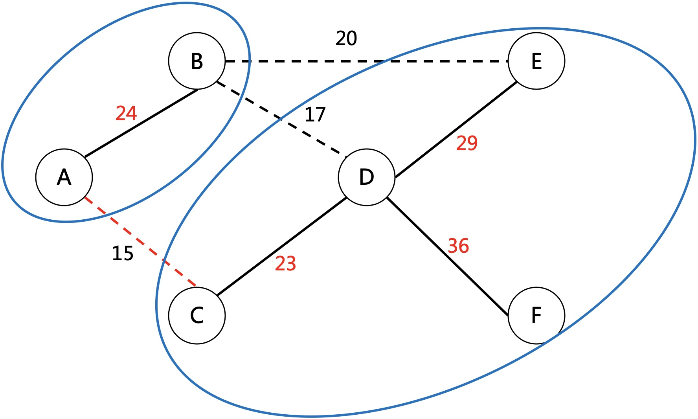</div>

为了将整个图连通，就需要找出两个子图之间的最小距离边，连通这条边就行了。  
其实就是找出子图1中的所有点到子图2中的所有点的最小边。  
这里有3条边，A-C，B-D，B-E，其中A-C距离最小，连通这条边就是最好的方案。  
**推论：**  
* 最优的方案是确定的，即最小权值和唯一
* 在最优方案中，剪掉任意一条边所分隔出的两个连通子图，之间的最小距离都应该是剪掉的这条，没有比这条边更小的，否则可以换掉这条边构成新的最优方案

如上图就不是最优方案，因为两个子图之间还有更小的边

#### 4.2 Prim算法框架  
对于加权连通图G=(V,E)，V为顶点集，E为边集。
* 以V中任意一点x为起点，将x加入一个新的顶点集S={x}，初始新的边集T={}为空
* 重复如下步骤直到S=V：  
  1）选择E中最小的边&lt;u,v&gt;，其中u属于S，而v不属于S但属于V  
  2）将v加入S，将边&lt;u,v&gt;加入T  
* 最终S,T即为所求最小生成树

算法解释：把S和非S想象成两个子图，每一步其实就是在找出这两个子图之间的最小边。  

过程模拟如下图：
* 以A为起点，将A加入S={A}；
* 第一条最小边为A-B，将B加入S={A,B}

<div align=center>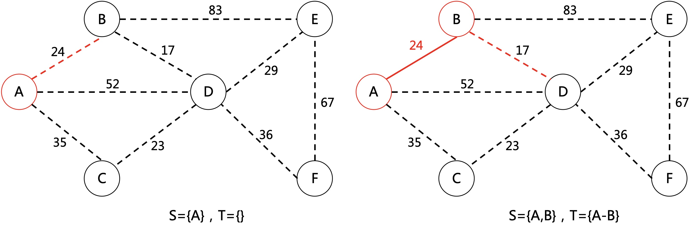</div>

* 第二条最小边为B-D，将D加入S={A,B,D}
* 第三条最小边为D-C，将C加入S={A,B,D,C}

<div align=center>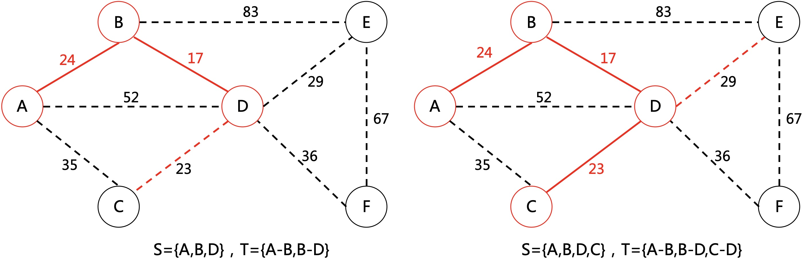</div>

继续重复以上过程直到S=V，T即为所求边集。

#### 4.3 Prim代码实现
**变量定义**
```cpp
const int MAXN = 100;
int n, m, temp, ans = 0, map[MAXN][MAXN], length[MAXN];
char s, t;
bool flag[MAXN];
```
**初始化**
```cpp
void init() {
    cin >> n >> m;
    memset(map, -1, MAXN * MAXN);
    for (int i = 0; i < n; ++i) {
        map[i][i] = 0;
        flag[i] = false;
        length[i] = 0x7fffffff;
    }
    for (int i = 0; i < m; ++i) {
        cin >> s >> t >> temp;
        map[s - 'A'][t - 'A'] = temp;
        map[t - 'A'][s - 'A'] = temp;
    }
}
```
**核心算法**
```cpp
int main() {
    init();
    // 将0作为起点加入集合S
    flag[0] = true;
    for (int i = 0; i < n; ++i) {
        if (map[0][i] >= 0) {
            length[i] = map[0][i];
        }
    }
    // 选择N-1条边
    for (int i = 0; i < n - 1; ++i) {
        int min = 0x7fffffff;
        int k = 0;
        // 枚举非S所有点，选择最小的边
        for (int j = 1; j < n; ++j) {
            if (!flag[j] && length[j] < min) {
                min = length[j];
                k = j;
            }
        }
        ans += min;
        cout << "k=" << k << " ,min=" << min << endl;
        // 将新的点k加入集合S,并通过k更新非S中点的距离
        flag[k] = true;
        for (int j = 1; j < n; ++j) {
            if (!flag[j] && map[k][j] >= 0 && map[k][j] < length[j]) {
                length[j] = map[k][j];
            }
        }
    }
    cout << "ans=" << ans;
    return 0;
}
```
### 5 Kruskal

#### 5.1 思考
最优解是要选取N-1条边，边的数量是固定的，但边的权值不一样，所以可以让这N-1条边尽可能的小。那就可以用贪心的思想，从最小的边开始选择。  
<div align=center>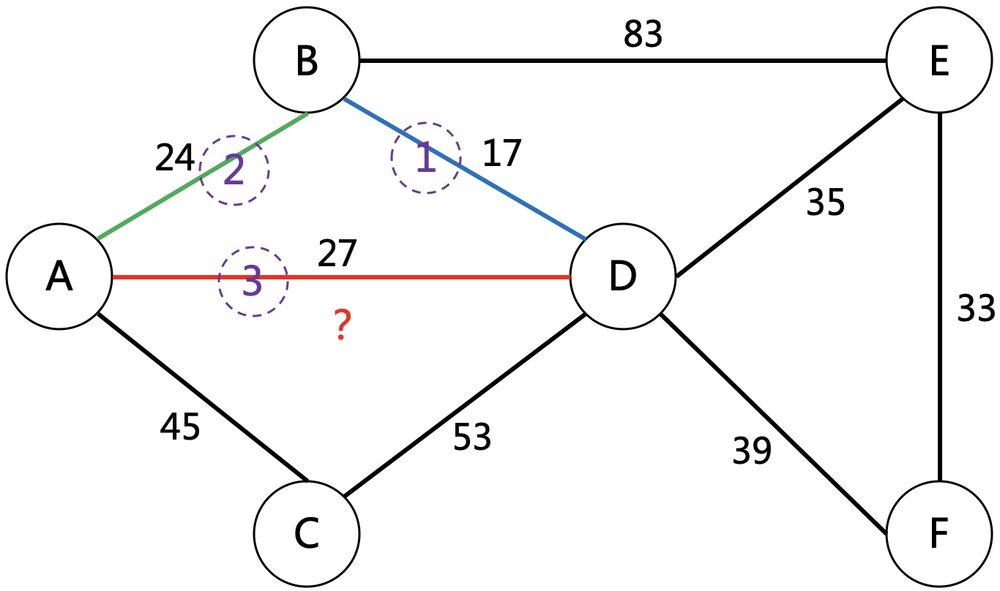</div>

如上图，从最小的边开始选择，第1条是A-B，第2条是B-D，第3条是A-D。  
但这里就出现了冲突，因为A与D已经连通，再多一条边会形成环，没有意义。  
所以再多加一个判断，如果一条边所关联的两个点已经连通就不能选择，否则可以选择。

<div align=center>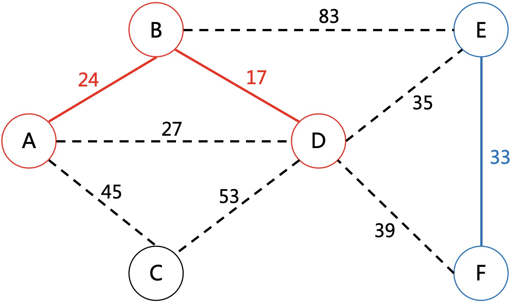</div>

当选择第4条边D-E时，判断D和E没有连通，将这两个子图连通。把两个子图看成不同的集合，这一步就是合并成同一个集合。

<div align=center>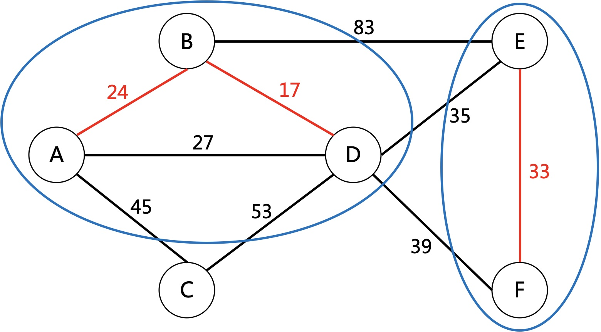</div>

如果初始每个点都属于一个独立的集合，每选择一条边，就将所在的集合合并成同一个，在下一次选择边的时候，就只需判断关联的两个点是否为同一集合。这就可以用并查集快速处理。  
详细可查看[并查集专题](/algorithm/并查集.html)。  
#### 5.2 Kruskal算法框架
对于加权连通图G=(V,E)，V为顶点集，E为边集。  
* 初始一个非连通图T=(V,{})，即含所有点，边集为空
* 重复以下步骤，直到成功选择N-1条边  
  1）在E中取出最小边&lt;u,v&gt;，如果u，v没有连通，就将该边加入T，同时将u,v连通；否则舍弃判断下一条最小边。
* 最终T即为所求最小生成树

过程模拟如下图：  
* 判断第1条边B-D，将B,D合并为一个集合；判断第2条边A-B，将A,B,D合并为一个集合

<div align=center>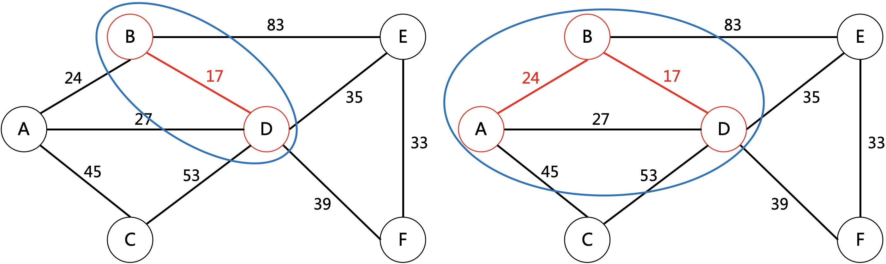</div>

* 判断第3条边A-D，A,D已经属于同一个集合，放弃选择

<div align=center>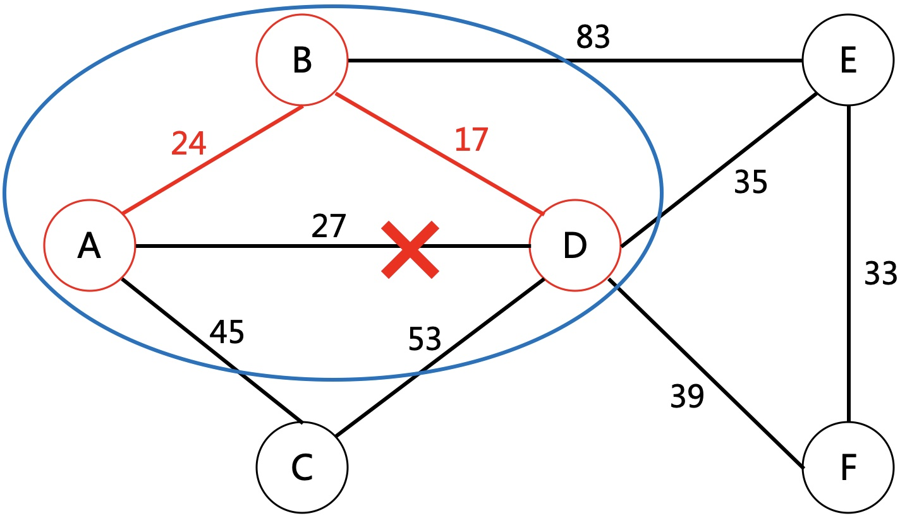</div>

* 判断第4条边E-F，将E,F合并为一个集合

<div align=center>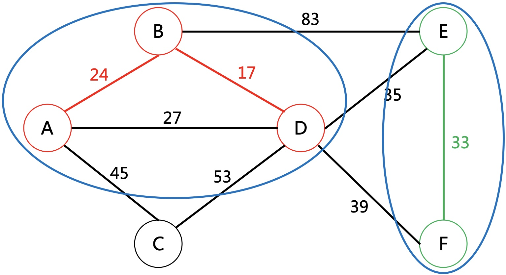</div>

继续重复以上过程直到选出N-1条边。
#### 5.3 Kruskal代码实现
**变量定义**
```cpp
struct Edge {
    int start;
    int end;
    int value;
};
const int MAXN = 100, MAXM = 100;

int n, m, answer = 0, edgeNum = 0, father[MAXN];
Edge edge[MAXM];
```
**初始化**
```cpp
void init() {
    char s, e;
    int temp;
    // 并查集根结点，初始为-1，合并之后为-num,num表示集合中的个数
    memset(father, -1, MAXN);
    cin >> n >> m;
    for (int i = 0; i < m; i++) {
        cin >> s >> e >> temp;
        edge[i].start = s - 'A';
        edge[i].end = e - 'A';
        edge[i].value = temp;
    }
}
bool compare(const Edge &a, const Edge &b) {
    return a.value < b.value;
}
```
**查找根**
```cpp
int findFather(int s) {
    int root = s, temp;
    // 查找s的最顶层根
    while (father[root] >= 0) {
        root = father[root];
    }
    // 路径压缩，提高后续查找效率
    while (s != root) {
        temp = father[s];
        father[s] = root;
        s = temp;
    }
    return root;
}
```
**合并集合**
```cpp
void unionSet(int s, int e) {

    int rootS = findFather(s);
    int rootE = findFather(e);

    int weight = father[rootS] + father[rootE];
    // 将结点数少的集合作为结点数多的集合的儿子节点
    if (father[rootS] > father[rootE]) {
        father[rootS] = rootE;
        father[rootE] = weight;
    } else {
        father[rootE] = rootS;
        father[rootS] = weight;
    }
}
```
**核心算法**
```cpp
int main() {
    init();
    sort(edge, edge + m, compare);
    for (int i = 0; i < m; i++) {
        if (findFather(edge[i].start) != findFather(edge[i].end)) {
            unionSet(edge[i].start, edge[i].end);
            answer += edge[i].value;
            edgeNum++;
            if (edgeNum == n - 1) {
                break;
            }
        }
    }
    cout << answer << endl;
    return 0;
}
```
### 6 总结
prim基于顶点操作，适用于点少边多的场景，多用邻接矩阵存储。  
kruskal基于边操作，适用于边少点多的场景，多用邻接表存储。  

---
**扫描下方二维码关注公众号，第一时间获取更新信息！**  
<div align=center></div> 