# 蚂蚁走迷宫

### 1.故事起源
有一只蚂蚁出去寻找食物，无意中进入了一个迷宫。蚂蚁只能向上、下、左、右4个方向走，迷宫中有墙和水的地方都无法通行。这时蚂蚁犯难了，怎样才能找出到食物的最短路径呢？
<div align=center>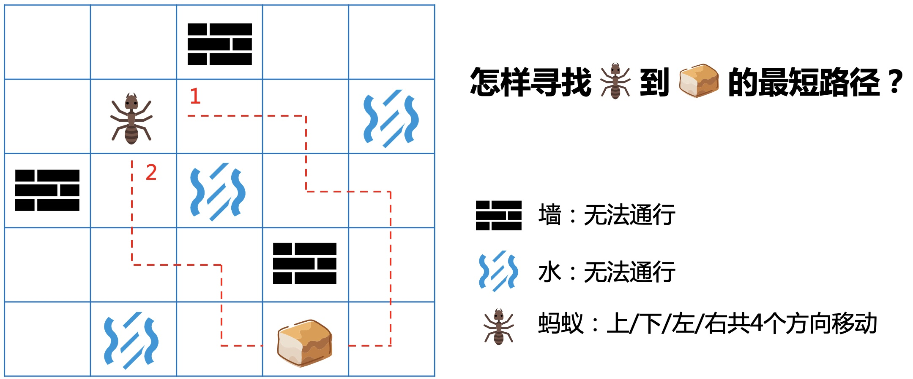</div>

### 2.思考
蚂蚁在起点时，有4个选择，可以向上、下、左、右某一个方向走1步。  
如果蚂蚁走过了一段距离，此时也依然只有4个选择。  
当然要排除之前走过的地方（不走回头路，走了也只会更长）和无法通过的墙和水。
<div align=center>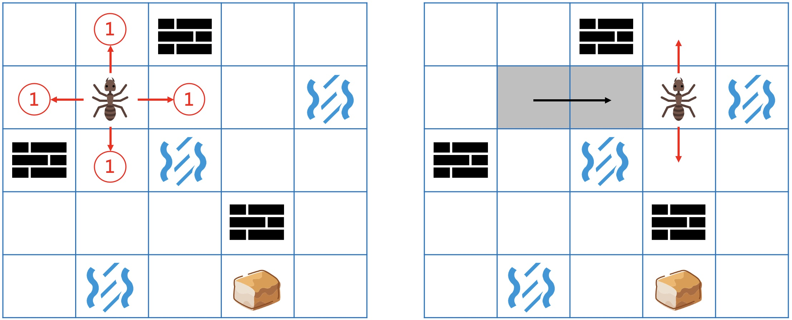</div>

蚂蚁想，还好我会影分身。如果每一步都分身成4个蚂蚁，向4个方向各走1步，这样最先找到食物的肯定就是最短的路径了（因为每一步都把能走的地方都走完了，肯定找不出更短的路径了）。  
<div align=center>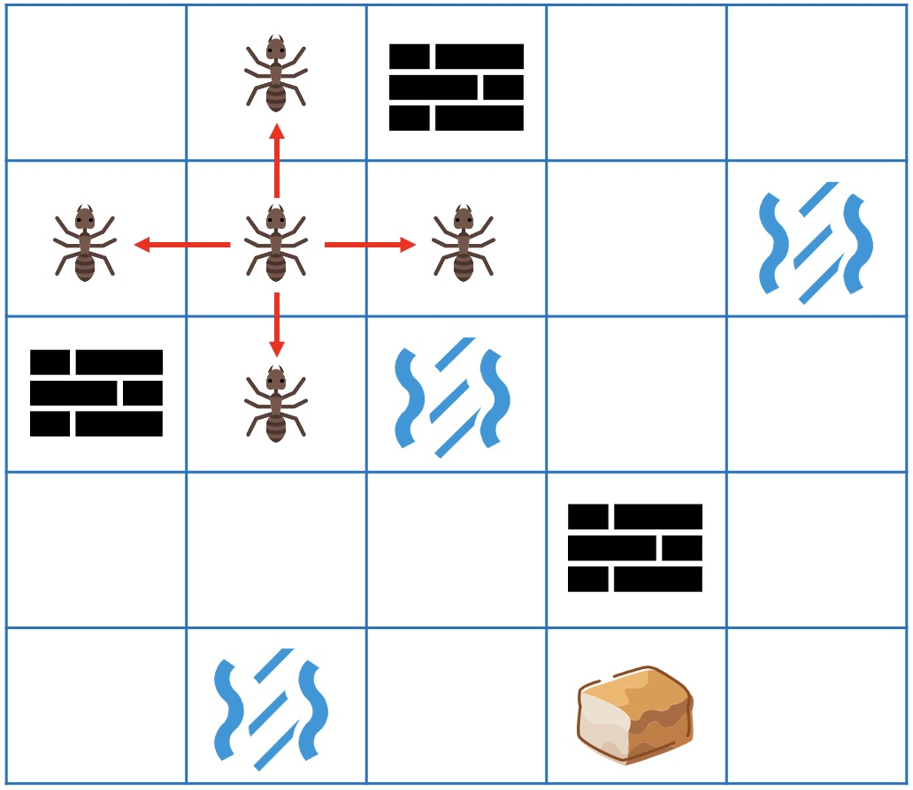</div>

而且还能看出，第1步会到达所有到起点距离为1的地方，第2步也会到达所有距离为2的地方。  
如此类推，第n步会覆盖所有到起点最短距离为n的地方。  
<div align=center>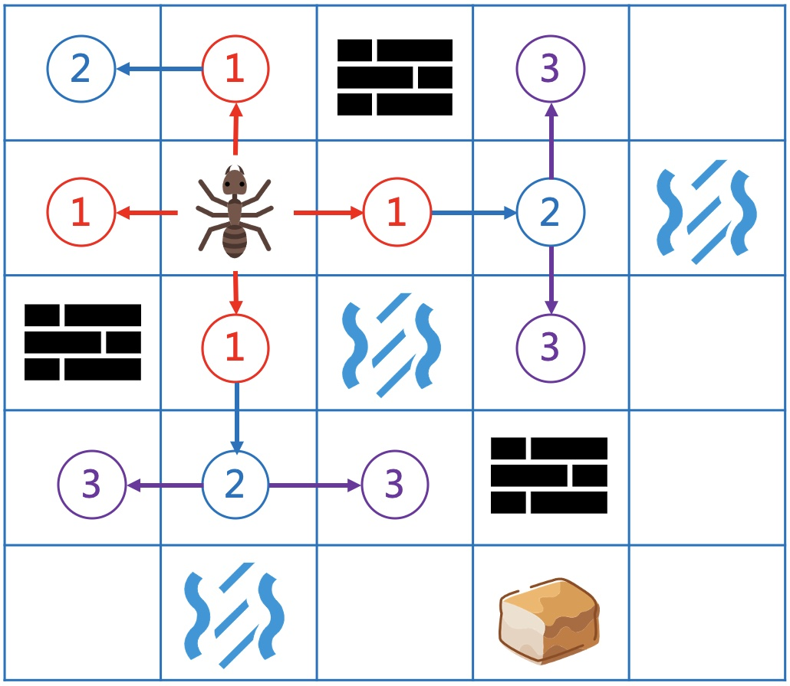</div>

### 3.问题建模
把迷宫地图放在二维数组中，能通行的地方为0，墙和水的地方为负数。  
<div align=center>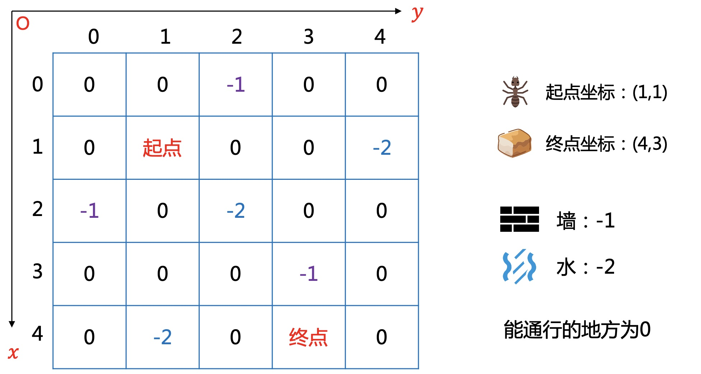</div>

每一步向4个方向走，可以通过当前坐标$$(x,y)$$加上一个方向向量。
<div align=center>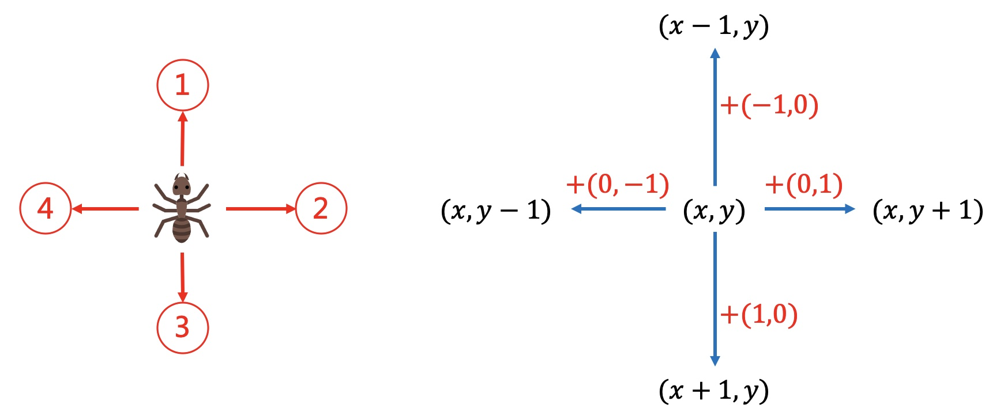</div>

这个其实就是**宽度优先搜索(BFS)**的思想。

### 4.宽度优先搜索(BFS)
>[!TIP|style:flat|label:定义]
>又称广度优先搜索，优先向四周扩展子节点，是最简便的图的搜索算法之一，一般通过队列来实现。

#### 4.1 队列
>[!TIP|style:flat|label:定义]
>是一种特殊的线性表，它只允许在表的前端进行删除操作，而在表的后端进行插入操作，即先进先出。

<div align=center>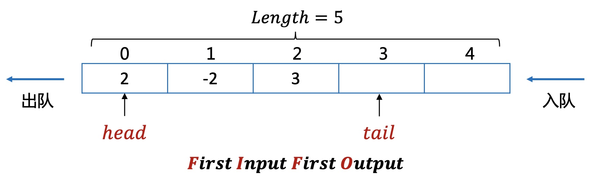</div>
队列一般通过数组实现，对该数组增加一些操作上的限制。
<div align=center>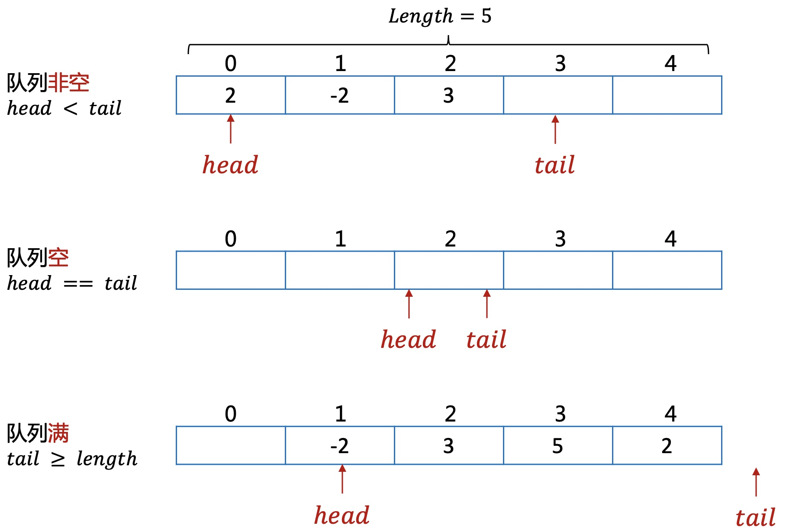</div>

但上面的实现有一些缺陷，当队列满时，也就是tail指针移动到队尾，这时就无法再插入数据，但前面的元素已经出队了，可能还有空缺的位置。  

为了能高效利用空间，对该队列增加一点改进，也就是**循环队列**的产生。

#### 4.2 循环队列
把队列想象成一个首尾相接的环形。
<div align=center>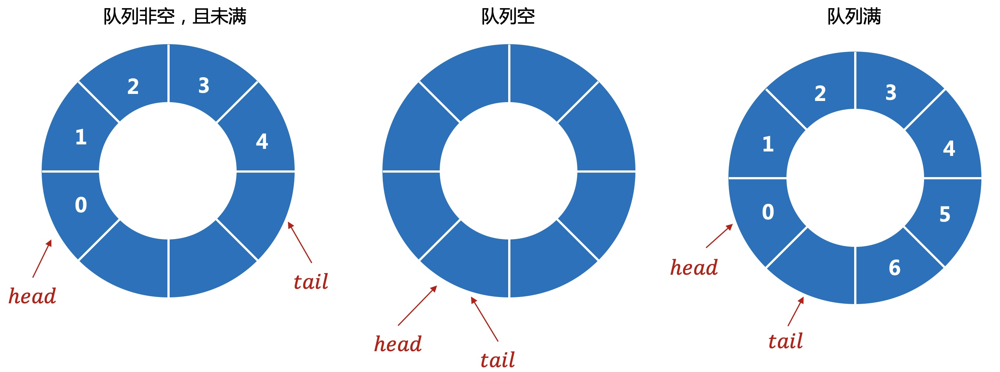</div>

数组实现，需要多预留一个空间。如果head=tail时，无法判断是队空还是队满，所以占用一个空间，通过tail+1与head的关系来判断是否队满。
<div align=center>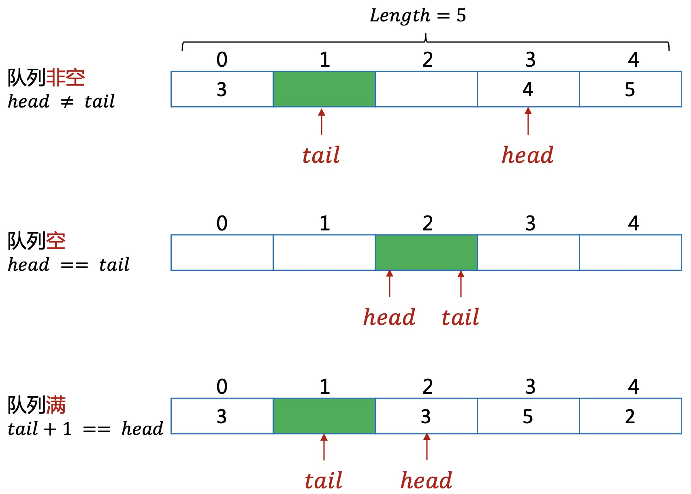</div>

#### 4.3 队列实现BFS
**实现步骤如下：**  
* 将起点加入队列。
* 从队首取出一个节点，通过该节点向4个方向扩展子节点，并依次加入队尾。
* 重复以上步骤，直至队空或已找到目标位置。

回归迷宫问题，到起点的距离为1,2,3...的点会依次入队。
<div align=center>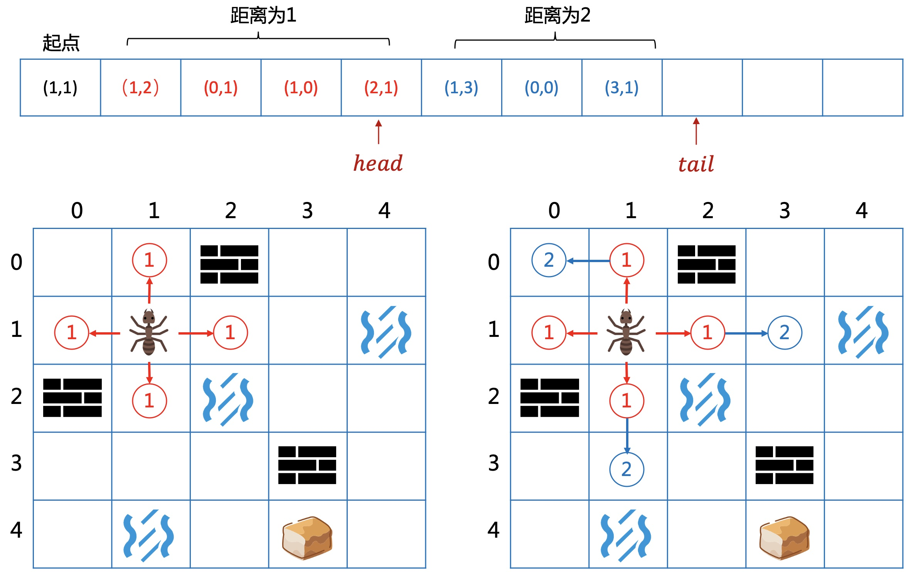</div>

当head指针遍历到距离为2的点时，向4周扩展距离为3的节点，并继续入队。
<div align=center>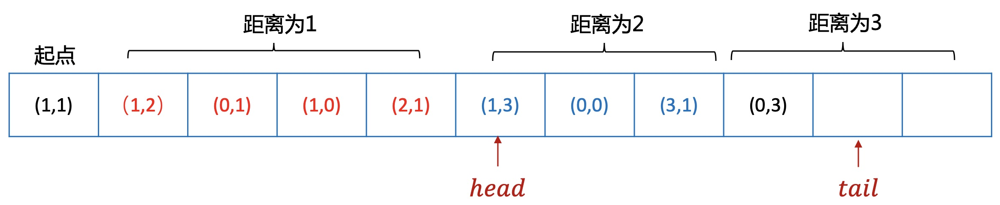</div>

### 5.代码实现

#### 5.1 变量定义
```cpp
// 方向向量
const int direction[4][2] = {{0,  1},
                             {-1, 0},
                             {0,  -1},
                             {1,  0}};

const int MAXM = 100, MAXN = 100, QUEUE_LENGTH = 5;
// 队列中的节点
struct Node {
    int x, y, distance;
    Node() {}
    Node(int xx, int yy, int d) : x(xx), y(yy), distance(d) {}
};

int n, m, step = 0, map[MAXM][MAXN], visit[MAXM][MAXN];
Node start, target;
```

#### 5.2 BFS标准模板
```cpp
void bfs() {
    Node queue[QUEUE_LENGTH];
    int head = 0, tail = 1;
    queue[0] = Node(start.x, start.y, 0);
    visit[start.x][start.y] = 0;

    while (head != tail) {
        int x = queue[head].x;
        int y = queue[head].y;
        int distance = queue[head].distance;
        head = (head + 1) % QUEUE_LENGTH;
        for (int i = 0; i < 4; ++i) {
            int dx = x + direction[i][0];
            int dy = y + direction[i][1];
            if (dx >= 0 && dx < m && dy >= 0 && dy < n && visit[dx][dy] == -1 && map[dx][dy] >= 0) {
                // 表示从i方向走过来的，方便后续回溯路径
                visit[dx][dy] = i;
                if (dx == target.x && dy == target.y) {
                    cout << "已到目标点，最短距离为" << distance + 1 << endl;
                    step = distance + 1;
                    return;
                }
                if ((tail + 1) % QUEUE_LENGTH == head) {
                    cout << "队列满" << endl;
                    return;
                }
                // 新坐标入队
                queue[tail] = Node(dx, dy, distance + 1);
                tail = (tail + 1) % (QUEUE_LENGTH);
            }
        }
    }
}
```

#### 5.3 路径回溯
```cpp
void printPath() {
    int x, y, d, path[MAXM][MAXN] = {0};
    for (int i = 0; i < m; ++i) {
        for (int j = 0; j < n; ++j) {
            path[i][j] = -1;
        }
    }
    x = target.x;
    y = target.y;
    path[start.x][start.y] = 0;
    // 路径回溯
    while (!(x == start.x && y == start.y)) {
        path[x][y] = step--;
        d = visit[x][y];
        x -= direction[d][0];
        y -= direction[d][1];
    }
    // 路径打印
    for (int i = 0; i < m; ++i) {
        for (int j = 0; j < n; ++j) {
            if (path[i][j] >= 0) {
                cout << path[i][j];
            } else {
                cout << "-";
            }
        }
        cout << endl;
    }
}
```

#### 5.4 数据输入
```cpp
int main() {
    cin >> m >> n;
    for (int i = 0; i < m; ++i) {
        for (int j = 0; j < n; ++j) {
            cin >> map[i][j];
            visit[i][j] = -1;
        }
    }
    cin >> start.x >> start.y >> target.x >> target.y;
    bfs();
    if (step > 0) printPath();
    return 0;
}
```
#### 5.5 测试结果
```
输入数据：
5 5
0 0 -1 0 0
0 0 0 0 -2
-1 0 -2 0 0
0 0 0 -1 0
0 -2 0 0 0
1 1 4 3

输出：
已到目标点，最短距离为5

路径打印：
-----
-0---
-1---
-23--
--45-
```


---
**扫描下方二维码关注公众号，第一时间获取更新信息！**  
<div align=center></div>

