# 递推的思维构建与技巧实现

> [!TIP|style:flat|label:概述]
递推是一种用若干步可重复运算来解决复杂问题的方法。

### 1.一维递推
#### 1.1 问题描述
有一个$$n$$层的楼梯，每次只可以向上爬1层或者2层，问爬完$$n$$层共有多少种不同的方式呢？
<div align=center>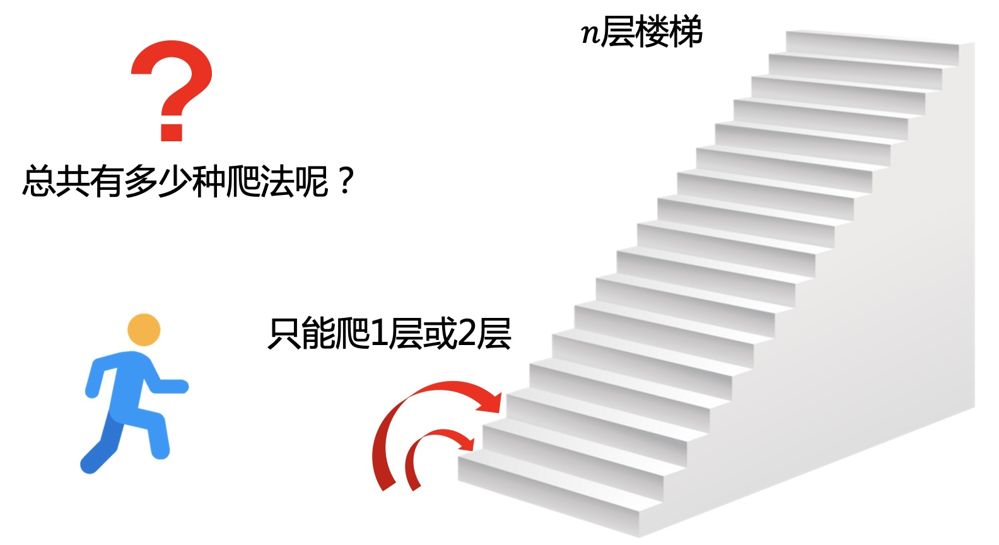</div>

#### 1.2 分析
设$$f(n)$$表示$$n$$层楼总共不同的方式。  
假设此时位于第$$i$$层，因为每次只能爬1层或2层，所以到第$$i$$层只有2种方式。 
* 从第$$i-1$$层爬上来。
* 从第$$i-2$$层爬上来。

所以得到递推公式为$$f(n)=f(n-1)+f(n-2)$$。前2项之和等于第3项，其实就是斐波那契数列，
$$1, 1, 2, 3, 5, 8, 13, 21 \cdots \cdots$$  
<div align=center>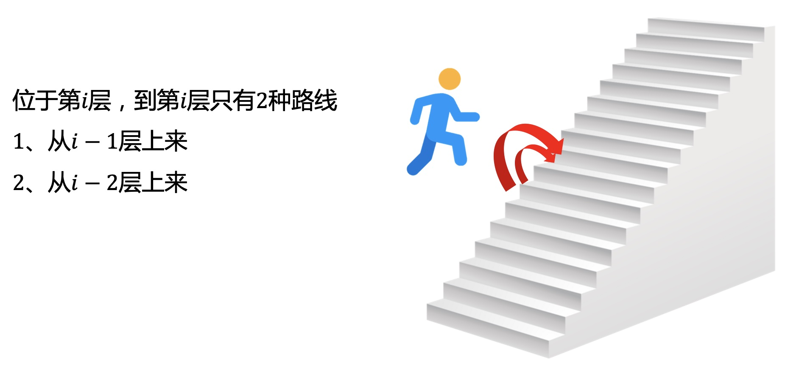</div>

#### 1.3 代码实现
```cpp
f[0] = 1; f[1] = 1;
for (int i = 2; i < n; i++){
    f[i] = f[i - 1] + f[i - 2]
}
cout << f[n - 1] << endl;
```
#### 1.4 空间优化
每一步的递推只与前2步有关，所以只需要记录前2步的方案数，用滚动数组，而不需要开$$o(n)$$的空间。  
**手动赋值**
```cpp
int f[3];
f[0] = 1;
f[1] = 1;
for (int i = 2; i < 10; ++i) {
    f[2] = f[1] + f[0];
    f[0] = f[1];
    f[1] = f[2];
    cout << f[2] << endl;
}
```
**取模滚动**
```cpp
int f[3];
f[0] = 1;
f[1] = 1;
for (int i = 2; i < 10; ++i) {
    f[i % 3] = f[(i - 1) % 3] + f[(i - 2) % 3];
    cout << f[i % 3] << endl;
}
```
如果只与前一个状态有关，比如$$f[n]=f[n-1]+1$$，可以用0，1滚动，这个在动态规划中会比较常用。
```cpp
int f[2], t = 0;
f[0] = 1;
for (int i = 2; i < 10; ++i) {
    t = 1 - t;
    f[t] = f[1 - t] + 1;
    cout << f[t] << endl;
}
```
> [!TIP|style:flat|label:补充]
递推和动态规划最大的区别：递推的每一步是所有方案数的加和，而动态规划在每一步递推中，需要用max,min来选取一个最优策略。本质其实都是通过重复的小规模子问题推导出大规模的结果。

#### 1.5 时间优化
斐波那契数列递推公式很简单，但数据很大时，效率就比较低，因为递推是$$O(n)$$复杂度。  
通过矩阵公式变换可将加法变为乘法  
如下将递推公式放入矩阵：
$$
\begin {bmatrix}1&1\\1&0\end {bmatrix}
\times
\begin{pmatrix}f(n-1) \\ f(n-2)\end{pmatrix}
=\begin{pmatrix}f(n-1)+f(n-2) \\ f(n-1)\end{pmatrix}
=\begin{pmatrix}f(n) \\ f(n-1)\end{pmatrix}
$$
假设：
$$A=\begin {bmatrix}1&1\\1&0\end {bmatrix}$$
则:
$$A^n \times
\begin{pmatrix}f(1) \\ f(0)\end{pmatrix}
= \begin{pmatrix}f(n+1) \\ f(n)\end{pmatrix}
$$  
$$A^n$$可以通过矩阵幂乘快速求出，时间复杂度为$$log_2N$$，再带入上式即可获得数列值。  
具体可以看另一篇[递推优化-矩阵幂乘](/algorithm/递推优化-矩阵幂乘.html)

### 2.多维递推
#### 2.1 问题描述
从原点出发，每次只能向东，向北，向西走，且不能走已经走过的地方，问走$$n$$步共有多少种不同的方式呢？
<div align=center>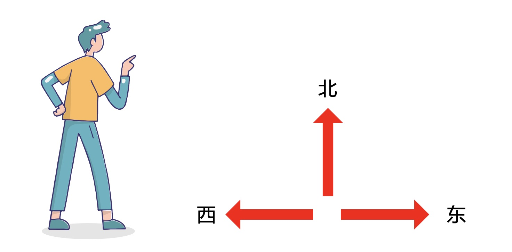</div>

#### 2.2 分析
假设已经走到第$$i$$步，因为不能走已经走过的地方，那这一步能走的方式只会与上一步有关。因为每次走一步，要保证不走回头路，就保证不走上一步走过的地方就行了。  
每次有3个选择，即向东，向北，向西。
* 第$$i-1$$步向东走，那么第$$i$$步只能向北、向东。
* 第$$i-1$$步向西走，那么第$$i$$步只能向北、向西。
* 第$$i-1$$步向北走，那么第$$i$$步可以向北、向东，向西。

<div align=center>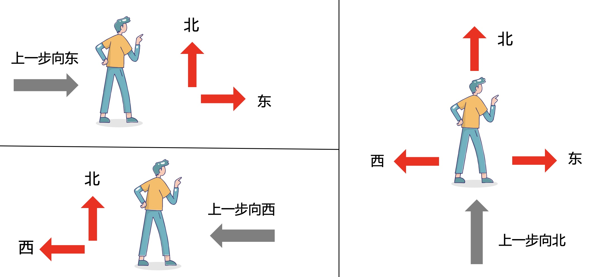</div>

一维的$$f[n]$$只能记录一个总数，而不能记录状态，所以要再多一维记录上一步走的状态。  
设$$f[n][0],f[n][1],f[n][2]$$分别表示：第$$n$$步向东、向西、向北走总共不同的方式。  
则有如下递推关系：  
* $$f[n][0] = f[n - 1][0] + f[n - 1][2];$$
* $$f[n][1] = f[n - 1][1] + f[n - 1][2];$$
* $$f[n][2] = f[n - 1][0] + f[n - 1][1] + f[n - 1][2];$$

#### 2.3 代码实现
```cpp
int f[100][3] = {0};
f[0][0] = 1;
f[0][1] = 1;
f[0][2] = 1;

for (int i = 1; i < n; ++i) {
    f[i][0] = f[i - 1][0] + f[i - 1][2];
    f[i][1] = f[i - 1][1] + f[i - 1][2];
    f[i][2] = f[i - 1][0] + f[i - 1][1] + f[i - 1][2];
}
cout << f[n - 1][0] + f[n - 1][1] + f[n - 1][2] << endl;
```
#### 2.4 进一步优化
设第$$n$$步的总方案数为$$s[n], s[n]=f[n][0]+f[n][1]+f[n][2]$$。  
$$s[n]=2\times f[n-1][0]+2\times f[n-1][1]+3\times f[n-1][2]$$。  
$$s[n]=2\times s[n-1]+f[n-1][2]$$。  
而$$f[n-1][2]=f[n-2][0]+f[n-2][1]+f[n-2][2]=s[n-2]$$。  
得$$s[n]=2\times s[n-1]+s[n-2]$$。  
所以对公式变形，也可以通过一维的方式完成递推，但这个关系无法直接通过建模构造出来。

### 3.图递推
#### 3.1 问题描述
在一个$$n\times m$$的二维地图中，一个人从左上角走到右下角，每次只能向右或者向下走，问到终点共有多少种不同的方式呢？
<div align=center>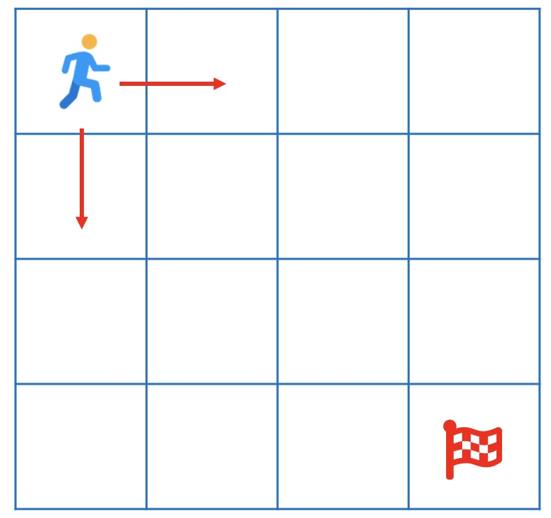</div>

#### 3.2 分析
假设已经位于某个位置，因为只能向右或者向下走，那上一步只能从上或者从左走过来。  
设$$f[i][j]$$表示走到坐标$$(i,j)$$总共的方案数。  
则$$f[i][j]=f[i-1][j]+f[i][j-1]$$。  
<div align=center>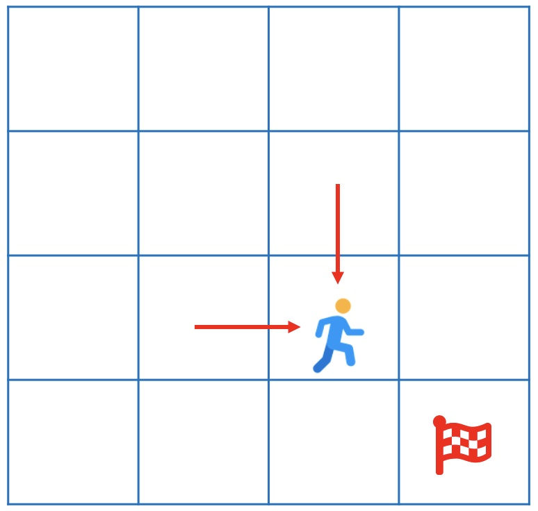</div>

#### 3.3 代码实现
```cpp
int f[10][10] = {0};
f[0][0] = 1;
for (int i = 0; i < n; ++i) {
    for (int j = 0; j < m; ++j) {
        if (i - 1 >= 0) {
            f[i][j] += f[i - 1][j];
        }
        if (j - 1 >= 0) {
            f[i][j] += f[i][j - 1];
        }
    }
}
```

#### 3.4 进一步思考
要到达终点，一定要向下走$$n-1$$步，向右走$$m-1$$步。  
把每一步组合在一起来看，其实问题就等价于在$$n+m-2$$步中选择$$n-1$$步向下走，或者选择$$m-1$$步向右走，通过排列组合公式$$C_{n+m-2}^{n-1}$$就可以直接得到结果。
<div align=center>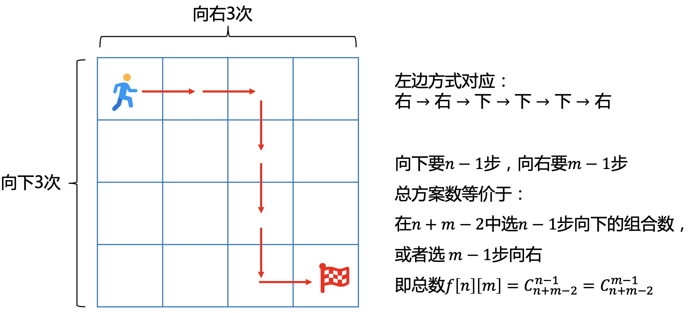</div>

### 4.状态压缩递推
#### 4.1 问题描述
在一个$$n\times n$$的棋盘中放置棋子，有一些地方不能放置。要求放置棋子时任意2个棋子不能在同1行或同1列，问放置$$k$$个棋子有多少种不同的方式呢？
<div align=center>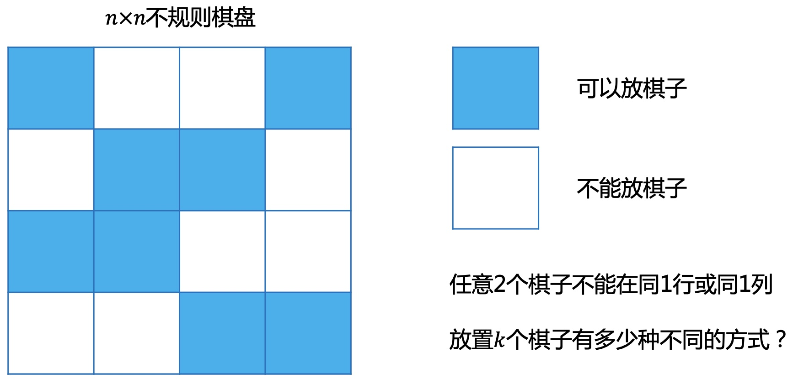</div>

#### 4.2 分析
对于每1个位置，只会有2种情况，就是放或不放。在数据规模不大的情况下可以用DFS(深度优先搜索)枚举所有的情况就可以了。
<div align=center>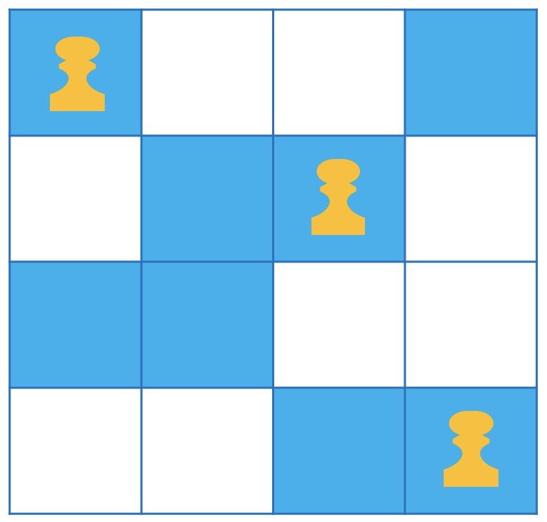</div>

那有没有更好的方法呢？  
这个最终是要求方案总数，而不需要考虑每一步是否需要择优，所以是符合递推模型，接下来就是怎么找出递推关系。  

先分析一些隐含的规律，把问题理得更清晰：  

<div align=center>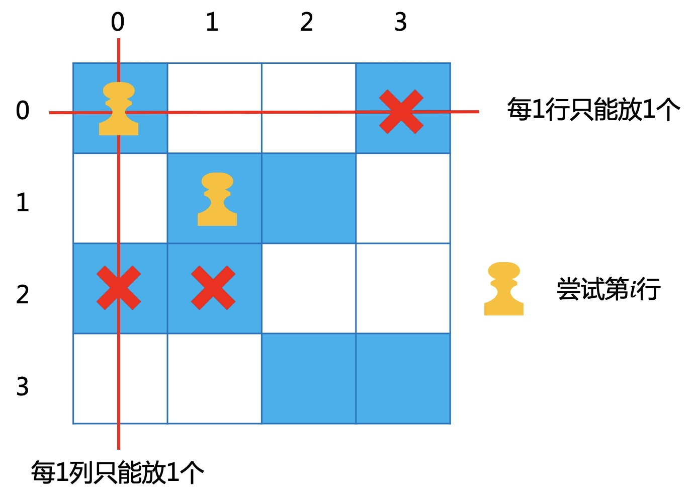</div>

* 每1行或者每1列都只能放置1个棋子，所以按每一行来枚举放置方法。  
* 在尝试第$$i$$行时，每一个位置$$(i,j)$$能不能放置，不只是跟上一行有关，而是跟之前的所有行都有关。这就说明需要记录之前放置的方法，也就是状态。

那怎么记录之前放置的方案状态呢，这就要用到状态压缩。  
**状态压缩**：本质就是用二进制记录对应位置的2种状态，0表示不放，1表示放。  
<div align=center>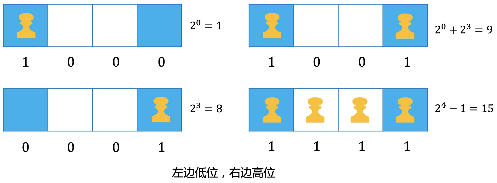</div>

对于$$n$$个位置，就可以用$$2^n$$个十进制数来表示所有放置的方案。
<div align=center>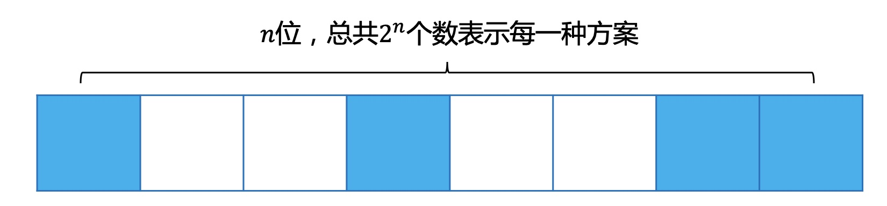</div>

继续回到上面的问题，在尝试第$$i$$行时，能否放置跟之前的$$i-1$$行都有关，意味着需要记录之前所有行放置的状态。  
但看下面2种情况，图1和图2对于在尝试放置第3行时，其实是等价的，前2列都是不能放置。也就是说这2种方案数是可以直接合并的，因为每1列也只能放一个，所以放置的方案状态也可以直接合并成一行。
<div align=center>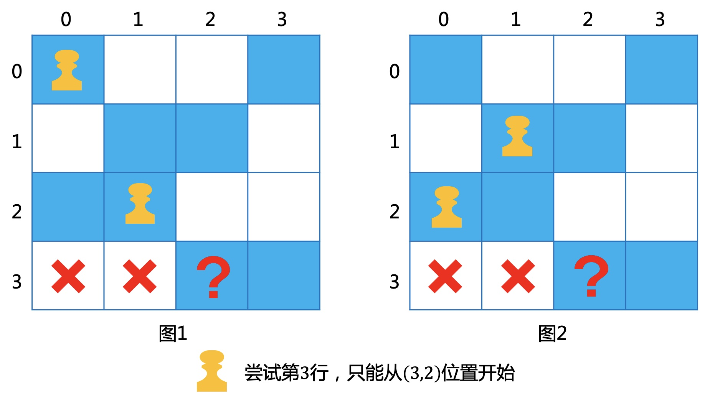</div>

用$$f[i][j]$$表示前$$i$$行，放置方案为$$j$$总共的方案数。  
第0行的过程如下：
<div align=center>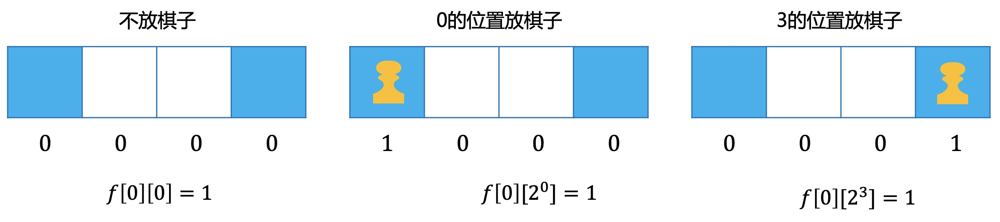</div>

第1行的过程如下：
<div align=center>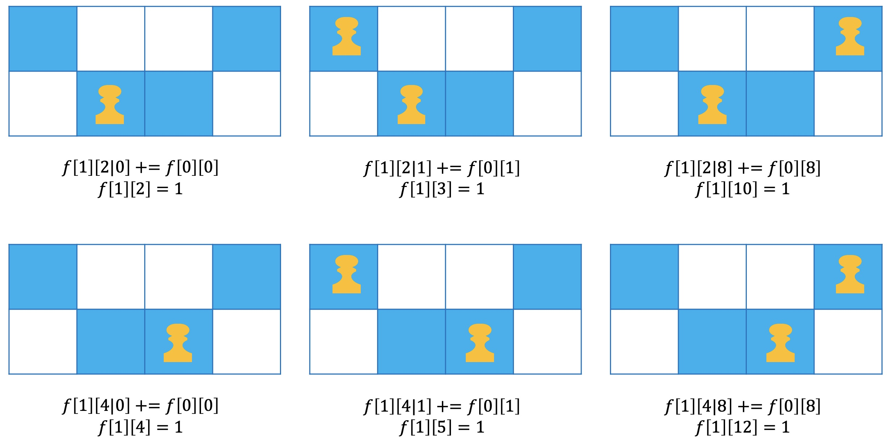</div>

如此递推求出$$n$$行，$$2^n$$种放置方案的总数，$$f[n][2^n]$$。因为只能放置$$k$$个棋子，所以在$$2^n$$种放置方案中找出刚好是$$k$$个棋子的方案，也就是对应的状态$$j$$转化为二进制时，有$$k$$个1。  

#### 4.3 小技巧：十进制数如何快速求对应的二进制包含1的个数呢? 
目标数$$n$$，通过$$n \& (n-1)$$运算，包含多少个1就刚好进行多少次该运算，可以快速求出1的个数。
<div align=center>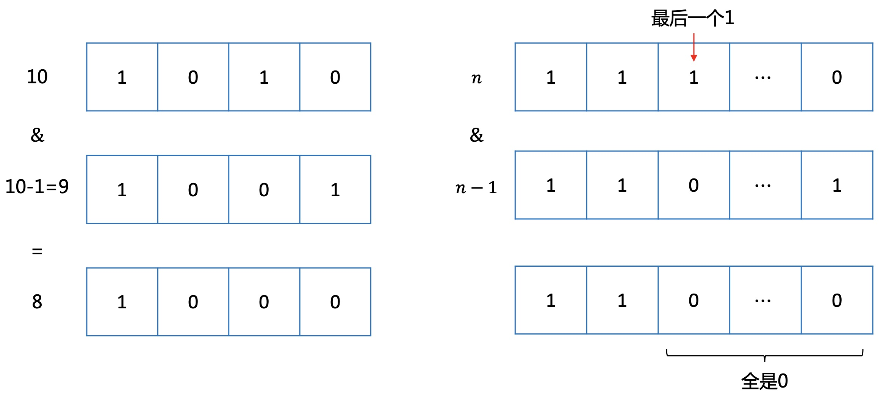</div>

#### 4.4 代码实现
计算数$$n$$中包含1的个数
```cpp
int countOne(int n) {
    int total = 0;
    while (n > 0) {
        total++;
        n &= n - 1;
    }
    return total;
}
```
变量定义及初始化
```cpp
int i, n, k, line[8], f[2][256], num[256];

for (i = 0; i < 256; ++i) num[i] = countOne(i);

memset(f, 0, 2 * 256 * 4);
f[0][0] = 1;
int j, c, now = 0;

// 棋盘读入
for (i = 0; i < n; ++i) {
    int t = 0;
    for (int j = 0; j < n; ++j) {
        t <<= 1;
        cin >> ch;
        if (ch == '.') t += 1;
    }
    line[i] = t;
}
```
核心递推
```cpp
for (i = 0; i < n; ++i) {
    now = 1 - now;
    for (j = 0; j < 256; ++j)
        if (num[j] <= k) {
            //第i行不放棋子
            f[now][j] += f[1 - now][j];
            //第i行放棋子
            for (c = 0; c < n; ++c) {
                if ((j & 1 << c) == 0 && (line[i] & 1 << c) == 0) {
                    f[now][j | 1 << c] += f[1 - now][j];
                }
            }
        }
}

// 枚举所有包含k个棋子的方案数
int ans = 0;
for (i = 0; i < 256; ++i) {
    if (num[i] == k) {
        ans += f[now][i];
    }
}
cout << ans << endl;

```

### 5.总结
递推最重要的思想，就是通过每一小步，找出与下一步之间的关系。关键在于思考问题的本质，对问题进行建模。常用$$f[i][j][k]$$等类似数组来记录，多一维就可以多记录一维状态信息，要思考上一步真正有多少个因素会影响当前步，那一般这些就是一定要记录的信息。

---
**扫描下方二维码关注公众号，第一时间获取更新信息！**  
<div align=center></div>