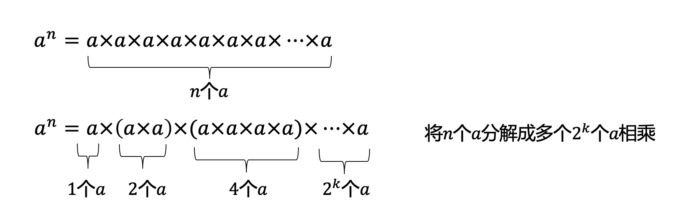
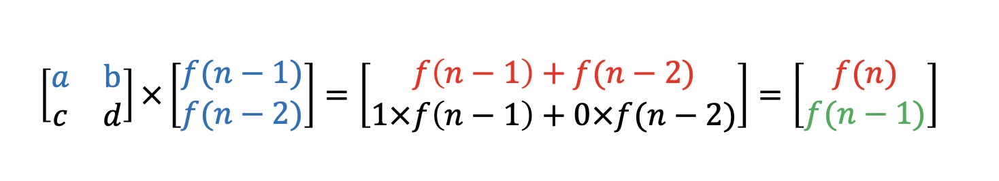

# 递推优化-矩阵幂乘

> [!TIP|style:flat|label:问题引入]
> 首先我们抛出一个问题，如何快速求出$$a^n,a,n\in \mathbb{N}^+$$？


### 1.整数幂运算
>**整数幂运算公式准备：**  
① 同底数幂相乘：$$a^m·a^n=a^{m+n}$$  
② 幂的乘方：$$(a^m)^n=a^{mn}$$  
③ 积的乘方：$$(ab)^m=a^m·b^m$$  
④ 同底数幂相除：$$a^m÷a^n=a^{m-n} (a≠0)$$  


**上面问题可转化为下图：**

设$$n=11$$，则$$n$$对应的二进制为1011  
$$n=11=2^0+2^1+2^3$$  
$$a^{11}=a^{2^0+2^1+2^3}=a^{2^0}\times a^{2^1}\times a^{2^3}=a^1 \times a^2 \times a^8=(a)\times(aa)\times(aaaaaaaa)$$  
要计算$$a^{11}$$，即要计算出$$a^1,a^2,a^8$$  
根据上面公式有：$$2^n=2^{n-1}+2^{n-1}$$，即$$a^{2^n}=a^{2^{n-1}+2^{n-1}}=a^{2^{n-1}}\times a^{2^{n-1}}$$  
所以循环按顺序计算$$a^k$$，$$a^1 \times a^1$$得$$a^2$$, $$a^2 \times a^2$$得$$a^4$$...


```cpp
int pow(int a, int b) {
    int ret = 1;
    while (b) {
        if (b & 1) {
            ret *= a;
        }
        a *= a;
        b >>= 1;
    }
    return ret;
}
```


### 2.矩阵幂运算
>**矩阵运算公式准备：**  
① 乘法结合律： $$(AB)C=A(BC)$$  
② 乘法左分配律：$$(A+B)C=AC+BC$$  
③ 乘法右分配律：$$C(A+B)=CA+CB$$  
④ 对数乘的结合性：$$k(AB）=(kA)B=A(kB)$$  
⑤ 转置：$$(AB)^T=B^TA^T$$  
⑥ 矩阵乘法一般不满足交换律


```cpp
void multiMatrix(int a[][N], int b[][N]) {
    int tmp[N][N] = {0}, i, j;
    for (i = 0; i < N; i++)
        for (j = 0; j < N; j++)
            for (int k = 0; k < N; k++) {
                tmp[i][j] += a[i][k] * b[k][j];
            }

    for (i = 0; i < N; i++)
        for (j = 0; j < N; j++) {
            a[i][j] = tmp[i][j];
        }
}
```


```cpp
void powMatrix(int a[][N], int b, int ret[][N]) {
    memset(ret, 0, sizeof(int) * N * N);
    for (int i = 0; i < N; i++) {
        ret[i][i] = 1;
    }

    while (b) {
        if (b & 1) {
            multiMatrix(ret, a);
        }
        multiMatrix(a, a);
        b >>= 1;
    }
}
```


### 3.斐波那契数列
> [!TIP|style:flat|label:描述]
>斐波那契数列指的是这样一个数列 1, 1, 2, 3, 5, 8, 13, 21......    
>该数列从第3项开始，每一项都等于前两项之和，即$$f(n)=f(n-1)+f(n-2)$$


```cpp
int solve(int step) {
    if (step == 0 || step == 1) {
        return 1;
    }
    return solve(step - 1) + solve(step - 2);
}
```


```cpp
f[0] = 1; f[1] = 1;
for (int i = 2; i < N; i++){
    f[i] = f[i - 1] + f[i - 2]
}
cout << f[N - 1] << endl;
```


#### 3.1.矩阵递推
斐波那契数列递推公式很简单，但数据很大时，效率就比较低，因为递推是$$O(n)$$复杂度。  
通过矩阵公式变换可将加法变为乘法  
如下将递推公式放入矩阵：
$$
\begin {bmatrix}1&1\\1&0\end {bmatrix}
\times
\begin{pmatrix}f(n-1) \\ f(n-2)\end{pmatrix}
=\begin{pmatrix}f(n-1)+f(n-2) \\ f(n-1)\end{pmatrix}
=\begin{pmatrix}f(n) \\ f(n-1)\end{pmatrix}
$$
假设：
$$A=\begin {bmatrix}1&1\\1&0\end {bmatrix}$$
则:
$$A^n \times
\begin{pmatrix}f(1) \\ f(0)\end{pmatrix}
= \begin{pmatrix}f(n+1) \\ f(n)\end{pmatrix}
$$  
$$A^n$$可以通过矩阵幂乘求出，即可快速获得数列值。


#### 3.2.Fibonacci数列变种
如果现在要对Fibonacci数列的前N项求和，又该如何变换成矩阵乘法呢？  
数列前$$n$$项和$$s(n)=f(1)+f(2)+...+f(n)$$  
其实方法是一样的，关键在于找出递推矩阵，如下：
$$
\begin {bmatrix} 1&1&0\\ 0&1&1\\ 0&1&0 \end {bmatrix}
\times
\begin {bmatrix} s(n-1)\\ f(n)\\ f(n-1) \end {bmatrix}
= \begin {bmatrix} s(n-1)+f(n)\\ f(n)+f(n-1)\\ f(n) \end {bmatrix}
= \begin {bmatrix} s(n)\\ f(n+1)\\ f(n) \end {bmatrix}
$$


### 4.普通递推矩阵变换
如何快速找出递推矩阵呢？  
将递推式左右两边先写入矩阵，然后构造A矩阵，根据现有项补全剩余项。  
具体步骤如下图所示：

>**步骤如下**  
①将递推公式写入红色位置  
②反推蓝色位置  
③补全绿色位置，即为新的递推项   
④补全$$A$$矩阵剩余的值

例1：
$$f(n)=f(n-1)+f(n-3)$$  
例1递推矩阵如下：
$$
\begin {bmatrix} 1&0&1\\ 1&0&0\\ 0&1&0 \end {bmatrix}
\times
\begin {bmatrix} f(n-1)\\ f(n-2)\\ f(n-3) \end {bmatrix}
= \begin {bmatrix} f(n-1)+f(n-3)\\ f(n-1)\\ f(n-2) \end {bmatrix}
= \begin {bmatrix} f(n)\\ f(n-1)\\ f(n-2) \end {bmatrix}
$$
例2：
$$f(n)=f(n-1)+n^2$$  
例2递推矩阵如下：
$$
\begin {bmatrix} 1&1&0&0\\ 0&1&2&1\\ 0 &0 &1&1\\ 0&0&0&1 \end {bmatrix}
\times
\begin {bmatrix} f(n-1)\\ n^2\\ n\\ 1 \end {bmatrix}
= \begin {bmatrix} f(n-1)+n^2\\ n^2+2n+1\\ n+1\\ 1 \end {bmatrix}
= \begin {bmatrix} f(n)\\ (n+1)^2\\ n+1\\ 1 \end {bmatrix}
$$
这里就不举更多的例子了，方法是一样的，可以自己随便写几个公式，然后按照上面的方法推导。

---
**扫描下方二维码关注公众号，第一时间获取更新信息！**  
<div align=center></div>
