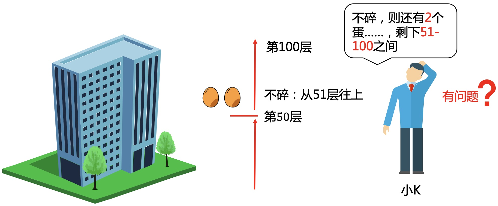

# 经典逻辑面试题，高楼扔鸡蛋

### 1.扔鸡蛋实验
有一栋100层的楼，和2个坚硬的鸡蛋，从楼上扔下鸡蛋，鸡蛋会在大于某一层刚好开始碎，那最少几次能测出鸡蛋能承受的最大楼层呢？  
如果从第50层扔下鸡蛋没碎，第51层扔下碎了，那鸡蛋能承受的最大楼层就是50。  
注意：你手上只有2个鸡蛋，如果扔下碎了，就没法再使用了。  
<div align=center></div>

小明条件反射般作答，从1层开始往上测试，到第i层碎掉就有结果了。
<div align=center></div>

小K说，这个方法确实可以测出来，但太慢了（当然暂不考虑下楼捡蛋的时间啦）。如果100层碎，最坏你得测试100次。如果先从第50层扔下呢？  
**这样分2种情况，碎和不碎：**  
* 碎：则还有1个蛋，再从1层开始逐层往上测试，最坏测到49层，总共50次。
* 不碎：则还有2个蛋，再从51层开始逐层往上测试，最坏测到100层，总共51次。

<div align=center></div>
小明说，这个方法确实好一些，等等，你刚才说第2种情况是什么？
<div align=center></div>

小明接着说，你还有2个蛋啊，兄弟，为啥不充分利用呢？  
不考虑1-50层，可以把51-100层看成一栋新的楼，现在问题就变成用2个蛋测量50层楼，和原始问题并没有本质区别啊，只是规模更小了。
<div align=center></div>

因为还有2个蛋，所以可以在75层再测试一次，就算碎了，也还有1个蛋，再从低层往上逐层测试。  
这个问题包含了规模更小的子问题，引导我们可以先从小规模的问题来思考。

### 2.小规模的子问题
**1.如果只有1个蛋，要怎么测量呢？**  
为了一定能测试出结果，只能从1层开始逐层往上，最坏总共要100次。  

<div align=center></div>

如果有n层楼，就需要n次，没有更好的方法。
<div align=center></div>

**2.如果有2个蛋，考虑最小的情况，1，2，3层楼**  
1层楼，只需1次，而且能看出鸡蛋数超过楼层数没意义。
<div align=center></div>

2层楼，分别先从1、2层扔，枚举所有的情况。最好的方案是总共要2次。
<div align=center></div>

3层楼，分别先从1，2，3层扔。可以看出从1或3层扔情况是等价的。且扔下一个鸡蛋后，问题会转化成2层或1层的子问题，这个在上一步已经求出结果了。  
从这3种情况中选择最好的方案，就是先从2层扔，总共要2次。
<div align=center></div>

**3.如此类推下去，就可以算出4，5，6...100层的最少次数。**  
100层如下：  
* 从1层扔：碎，剩0层1蛋；不碎，剩99层2蛋
* 从2层扔：碎，剩1层1蛋；不碎，剩98层2蛋
* $$\vdots$$
* 从99层扔：碎，剩98层1蛋；不碎，剩1层2蛋
* 从100层扔：碎，剩99层1蛋；不碎，剩0层2蛋

每一层扔下去的次数为：碎和不碎中选最大的（要考虑最坏的情况），再加这一层扔的次数，需要+1。  
再从上面所有情况中，选择次数最少的方案。  
<div align=center></div>

100层的具体测试方案如下：
<div align=center></div>

### 3.推广：N层楼，M个蛋
为描述方便，设$$f[i][j]$$表示$$i$$层楼，$$j$$个鸡蛋最小要测试的次数。  
从第$$k$$层扔下
* 碎，$$f[i][j]=f[k-1][j-1]+1$$
* 不碎，$$f[i][j]=f[i-k][j]+1$$

则$$f[i][j]=min(max(f[k-1][j-1],f[i-k][j])+1),1\leq k \leq i$$

<div align=center></div>

### 4.代码实现
**初始化**
```cpp
const int FLOOR = 101;
const int EGG = 3;
int f[FLOOR][EGG];
for (int i = 0; i < FLOOR; ++i) {
    for (int j = 0; j < EGG; ++j) {
        f[i][j] = 0x7fffffff;
    }
}
// i层楼，1个鸡蛋
for (int i = 1; i < FLOOR; ++i) f[i][1] = i;
//0,1层楼，i个鸡蛋
for (int i = 1; i < EGG; ++i) {
    f[0][i] = 0;
    f[1][i] = 1;
}
```
**递推过程**
```cpp
int main() {
    for (int j = 2; j < EGG; ++j) {
        for (int i = 2; i < FLOOR; ++i) {
            // 尝试从1到i层楼扔下，在最坏的情况中选择最好的
            for (int k = 1; k <= i; ++k) {
                int temp = max(f[k - 1][j - 1], f[i - k][j]) + 1;
                f[i][j] = min(temp, f[i][j]);
            }
        }
    }
    cout << f[100][2] << endl;
    return 0;
}
```

### 5.几组测试数据
<div align=center></div>

观察上面数据，会发现增加到6个蛋时，100、1000层楼的次数并没有减少，这说明最小次数是有极限的。  
**那怎么计算这个最小的极限呢？**  
想象一下，如果有无数个蛋，会是怎样呢？这时你可以不用考虑蛋碎了会不够用的问题，那你会怎么去测试？  
没错，这不就是最简单的二分查找吗，每次从中间的楼层测试，那最少就是$$\log_2N +1$$次

---
**扫描下方二维码关注公众号，第一时间获取更新信息！**  
<div align=center></div>