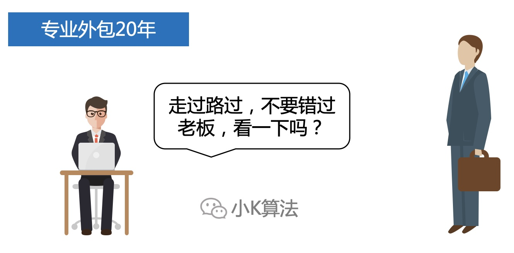
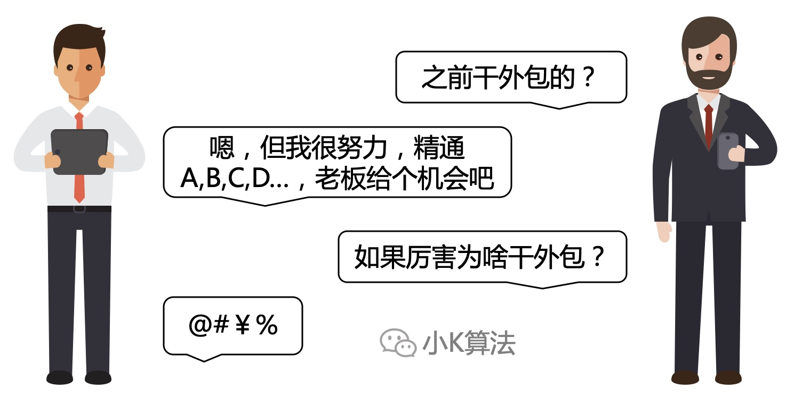
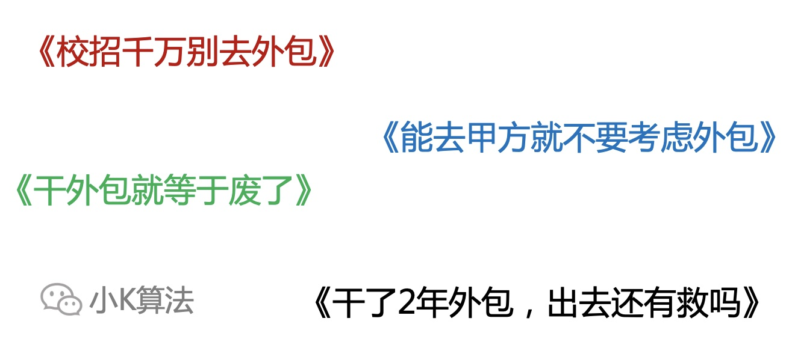
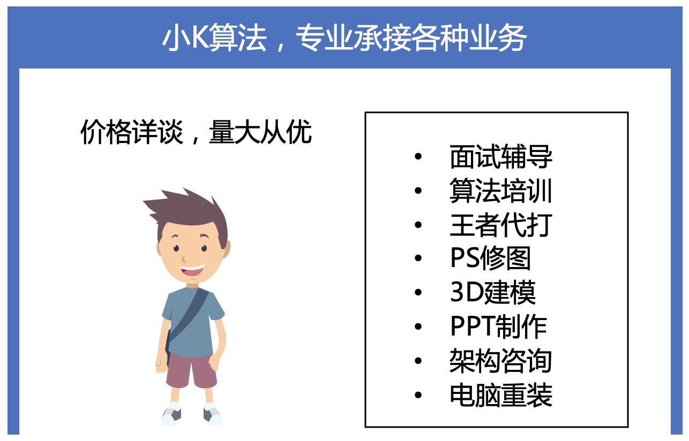

# 这一次，我想为外包正名

> [!TIP|style:flat|label:引言]
> 限制你的不是外包，而是你自己。

### 1 故事起源
每个企业都有自己的用户，也有自己的供应商。出钱的是甲方，出力的是乙方。

乙方也有自己的供应商，即丙方，不过对于甲方来说，一般看不到，也不关心。

有一天，乙方觉得丙方干得还不错，要不全交给他搞吧，这时我们就管丙方叫外包。

也不知什么时候，大家逐渐把外包区分开来，形成了明显的界线。。。

### 2 发展
外包是一种合作模式，各行各业都有外包。比如工程建筑，物业，装修等等。不过最多的应该还是特指现在的软件行业，因为计算机发展迅速，传统行业也向数字化转型，建设IT能力，所以有了大量的需求。例如IBM，ORACLE等大型企业，都提供企业定制服务。

### 3 转变
企业有自己的敏感数据，或者核心技术，并不会把所有的东西都外包出去，所以还有一种模式，即人头外包。简单来说就是，甲方有大量的搬砖工作需要一些熟练的技工就可以完成，但自己人员不够，而且成本过高，就到外面去购买人力。

所以大量专业外包公司出现了，你有需求，我就有服务。

### 4 问题
突然有一天，开始有点变味。。。

出去面试也没有自信了。

从此外包被贴上了各种标签，大量媒体、文章出现，进一步强化大家的观念。

### 5 分析
#### 5.1 对外包的理解
很多同学都认为外包就是帮别人做项目，领导也只是为了把任务完成，工作没有任何技术含量，自己学不到东西，导致几年时间过去了没有任何成长，出去以后就再也找不到好的工作了。  

你可以真心问自己内心，学不到知识真的是因为在外包的原因吗？现在我也算是从事企业服务相关的工作，售前界面参与的多，对这些还是有一定的了解。其实甲方对于项目的要求是非常高的，需要各种技术性能指标，说做项目没有技术含量，这个明显无法自圆其说，也许只是你的工作没有技术含量，跟外包的关系真不大。

#### 5.2 外包与甲方的区别
在找工作的时候，大家都喜欢问公司是做什么产品，因为觉得有自己的产品才是甲方，没有产品通通不考虑。因为大家理解外包都是项目制，没有自己的产品，也没有核心竞争力。  

我在甲方和乙方都干过，我觉得吧，真没啥区别。比如以前在华为，我在核心网产品线IMS部门，自然是有自己的产品，CSC，ATS等等，但也是要立项，需求评审，开发，测试，上线。在乙方做项目也是这个流程，又有多大的区别呢。  

再说一下之前在美团，我在餐饮生态部门。刚去的时候做的商城系统，做了几个月产品下架了拆了项目组，然后转去做供应链系统。迭代了几轮中间有空隙，又被调去收银系统支撑了几周。整个工作也是一个项目接一个项目。  

然后在乙方其实也是一样的，从立项到最后上线，流程不能说毫不相干，只能说一模一样。

#### 5.3 对外包的偏见
有同学说自己不想去外包的原因，也是因为外面的人有偏见，怕给自己贴上不好的标签，简历就坏了。这到底是你的不自信，还是别人的格局低？  

我身边是有很多人有这样的看法的，只想说一句，你哪来的自信看不上外包的同学的呢？是智商上面的碾压，还是学历上的优越，亦或是家里的矿井？有这种想法的人，只能说格局还是不到位啊。  

再说一下外包的同学，别人看不上你，你就接受了吗？你不会反抗，或者努力证明一下吗，拿出你的实力啊。如果拿不出，那也没办法了，但这个锅外包不应该背。

#### 5.4 技术提升
上面也提到了，外包项目不是没有技术难度，也许只是你的工作没有技术难度罢了，没有按照一个高标准去要求自己。如果工作上可以得心应手，没有新知识学习。那你完全可以利用业余时间，自己学习提升。现在的互联网知识共享，我相信你可以找到任何想要学习的资料。没学到东西是因为自己没有上进心，只是为了完成工作，这样的心态去任何公司都不会有提升。

#### 5.5 被甲方歧视
这个问题才是应该被重视的，这是人性出了问题。之前网上有说某厂不准外包吃零食啥的，我觉得吧，这也没啥，只是别人的规定，你按规定行事不就好了吗，再说你缺这一桶泡面，或者一包辣条吗，几块钱的事情自己买不香吗？但有人进行人格侮辱时，我建议你强烈反击。人人平等的社会，都是上班打工的，咋还搞出个三六九等了呢。拿钱办事可以，要下跪怕是做不到哦，请站着把钱赚了。

### 6 行业问题
上面谈了关于人的问题，再来谈一下关于外包行业的问题。那现在这个行业有没有问题呢？只能说，非常大。  

文章开头提到，外包本身只是一种模式，是社会发展的必然产物，其实本质是有很大的好处的，但现在真是强行被一群人玩坏了。  

首先是人头模式，公司利润和人头数量成正比，其它因素都无头紧要。因为人都是逐利的，所以大家真是为了人头不择手段。外包在收集简历时，只要是个人都能通过，完全没有规则，不看简历质量，也不把关，能忽悠一个是一个。在给甲方提供人力时，每一个人头抽取利润，所以在对于人的关怀上几乎为零。如果有人员流失也无所谓，对自己影响不大，再换一个人补上就行了。  

然后是项目模式，这种会好一些，但很多公司对于项目的质量把控还是不够，大多都是为了完成项目，能结项就行，其他都不奢求，如果老板有这样的想法，你觉得这个项目还能做好吗？  

再谈一下甲方，大家都喜欢低价买到高质量的东西，这都理解，但性价比也有度，频繁变更需求真的好吗？在追求质量的同时，也要考虑一下乙方能不能生存，如果频繁变更，工期拉长会导致乙方亏本，对于一个企业要面临项目亏本，你说他会怎么做，不说大家也能想象得到，肯定是各种偷工减料，压榨员工，压缩工期，最终结果自然大家都不满意。

### 7 外包未来
说了这么多问题，大家肯定觉得外包千万不能碰，能避多远就多远。可我的结论恰恰相反，我非常看好外包，未来而不是现在。  

外包公司的高P岗位要求也是很高的，需要具备商务谈判，成本控制，项目管理，团队建设，技术决策等很多技能，能接触到完整项目的多个阶段和流程，对于自己的能力提升也是有很大帮助，可以为以后做准备。

而对于传统企业，信息化能力需求有增不减，路边的包子店都开始直播带货了。要是有其他的定制需求，总不能找IBM这种公司出个咨询再搞个系统吧，一个顾问一天的开支估计一个月的利润就没了。所以外包模式让小工作室，小团队成为了可能。

全民自营，势在必行，人人都是个体户。

### 8 总结
行业没有好坏之分，只是一些人自己把自己玩废了。  
不要让别人的无知限制了你的想象，请记住，天花板永远由自己决定。

本文原创作者：小K，一个思维独特的写手。  
文章首发平台：微信公众号【小K算法】。  

如果喜欢小K的文章，请点个关注，分享给更多的人，小K将持续更新，谢谢啦！

---
**扫描下方二维码关注公众号，第一时间获取更新信息！**  

