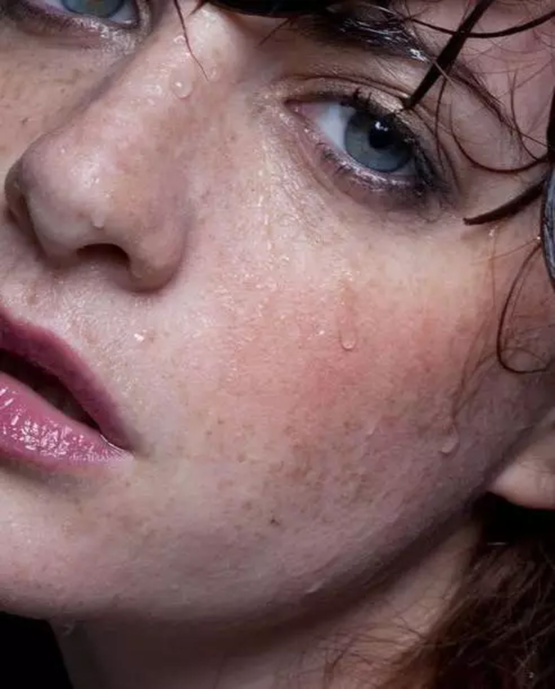

# 小姐姐让我帮忙修照片

### 1 故事起源
小姐姐听说我是程序员。。。

### 2 分析
这是原图。

解决问题的第一步肯定是先找出问题，所以先分析一下有哪些问题。

### 3 准备
首先需要用到的工具就是PS了。

最好还要有一个数位板，在触摸板上使用画笔工具我相信你不会喜欢的，哈哈。

用PS打开图片，cmd+j复制图层，原背景用于备份。

### 4 污点修复
使用污点修复画笔工具处理污点，处理完后效果如下。

### 5 高低频磨皮
人像修图最重要的部分就是磨皮了，所以给大家介绍一种主流的磨皮方法，高低频磨皮。低频用于处理皮肤光影，高频用于保留细节纹理。

#### 5.1 高低频图层
复制2个图层，命名为低频和高频。

对低频执行：滤镜->模糊->高斯模糊。

对高频执行：图像->应用图像。

将高频的图层混合模式改为线性光，效果又回到之前状态。

#### 5.2 观察层
建立观察层是为了更好的观察光影结构。  
建立2个黑白调整图层和1个曲线调整图层，效果如下。

第2个黑白图层混合模式改为正片叠底。

曲线调整图层，压低暗部，提亮高光，拉成S型曲线。现在就可以很清晰的观察光影，可以看出皮肤很脏，接下来就是处理磨皮。

#### 5.3 低频处理
处理前可以养成习惯先cmd+j复制一个图层作为备份。使用混合器画笔工具对低频进行处理，设置参考如下。

处理前后对比如下。

点亮高频，并关闭观察组，效果如下。

#### 5.4 高频处理
高频一般用仿制图章处理纹理，这里感觉效果还行，就先不处理。

### 6 中性灰
中性灰一般用于商业修图，更细节的处理光影。

用白色画笔打高光，用黑色画笔压低暗部。在鼻梁，脸部和下唇打点高光。

### 7 液化
液化主要用于调整脸型。  
先执行cmd+option+shift+e盖印图层。再执行滤镜->液化，向上收一下脸型。

### 8 调色
增加如下调整图层。

修改参数如下。

最终效果对比如下。

### 9 总结
小姐姐的任务总算完成了。  

今天主要分享一些基本的修图技巧，介绍了常用的方法和工具，主要还是看个人的审美。可能有些地方会处理的比较粗糙，所以你也可以自己动手修一下。希望大家有所收获，早日俘获小哥哥小姐姐的芳心。

psd工程及素材原文件地址：后台回复【0809】获取链接。

本文原创作者：小K，一个思维独特的写手。  
文章首发平台：微信公众号【小K算法】。  

如果喜欢小K的文章，请点个关注，分享给更多的人，小K将持续更新，谢谢啦！

---
**扫描下方二维码关注公众号，第一时间获取更新信息！**  

