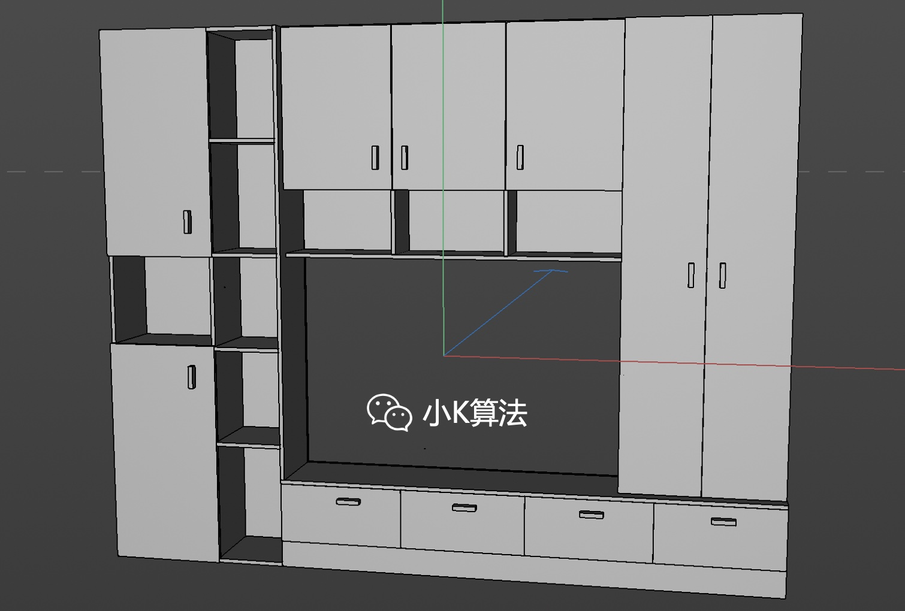

# 我想要一个这样的电视柜

### 1 故事起源
最近在忙装修的事情，为了不被坑，我也是花了几个月攻略了各种装修知识。不得不说，装修行业的知识真不比IT行业少啊，每一项都可以写一篇文章。我后面打算把所有的知识总结出来，保留最干货再分享给大家，以减少大家的学习成本，也避免智商税。

装修首先要做的就是设计，先确定想要什么样的效果。现在流行多种风格，比如现代，简约，轻奢，新中式等，不过我倾向简约或者轻奢。今天就先尝试给自己设计一个电视柜。

### 2 准备
一切都要从一个立方体说起。

### 3 砌墙
先把房间造型做出来。

### 4 抽屉
为了方便储物，首先得有几个抽屉，于是很快我的第一版方案就出来了。

中间空着是为了露出插座，但感觉不是很好看，还是直接挡住吧，接着开始调整需求。

### 5 书架
感觉有点单调，旁边应该有一个书架，再次变更需求。虽然需求变更有点频繁，好在自己既是甲方也是乙方，也就无所谓了，顶多浪费几个晚上。

开始想要开放格，但感觉落灰，还是得加个门。

不过感觉右边有点重，而且不对称，要不在左边也加一个收纳柜。

### 6 收纳柜
为了不单调，还是用开放格和收纳柜混搭。

现在看上去舒服多了，两边已经平衡，不过又多了一个新的问题，头轻脚重。上面也得加点东西才行。

### 7 吊柜
上面做3个吊柜，下接3个开放格，感觉是我想要的样子。

### 8 玻璃门
为了增加设计感，再把门做点造型，后面上玻璃门。

### 9 环境
摆放位置，打灯光，初步预览如下，感觉效果还不错。

### 10 渲染
给物体上材质，渲染出真实世界的效果。

终于完成了，我就想要一个这样的电视柜。  
等等，好像还有点问题，这投影面积有点大啊，算下来小一万就没了，超预算了，唉，不行，得砍需求。

### 11 初心
还记得当初的梦想，我只是想要一个电视柜...视柜...柜。  
于是，最终我决定买一个这样的电视柜，预算200。

不要让贫穷限制了你的想象，它能限制的只是让你实现不了想象。

本文原创作者：小K，一个思维独特的写手。  
文章首发平台：微信公众号【小K算法】。  

如果喜欢小K的文章，请点个关注，分享给更多的人，小K将持续更新，谢谢啦！

---
**扫描下方二维码关注公众号，第一时间获取更新信息！**  

