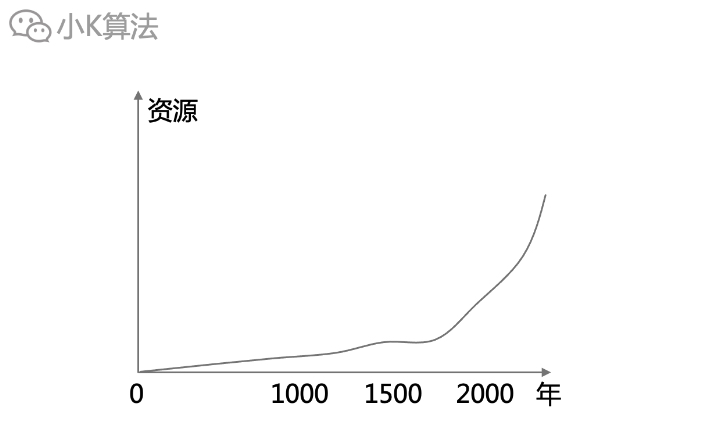
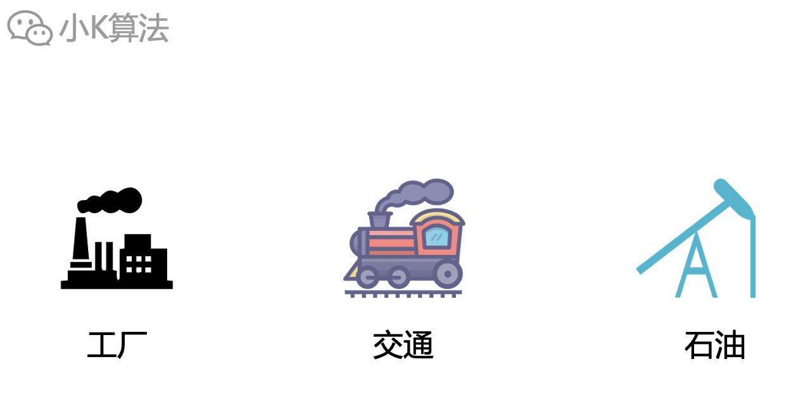
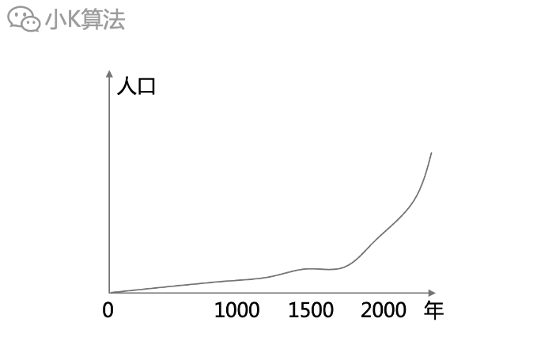
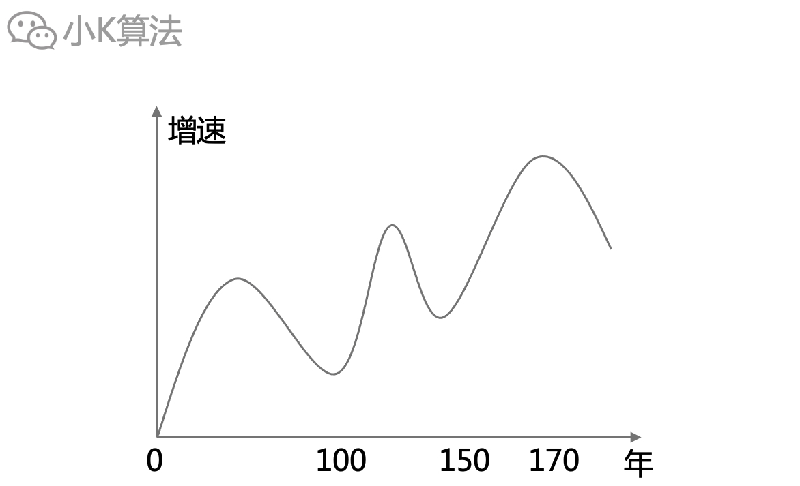
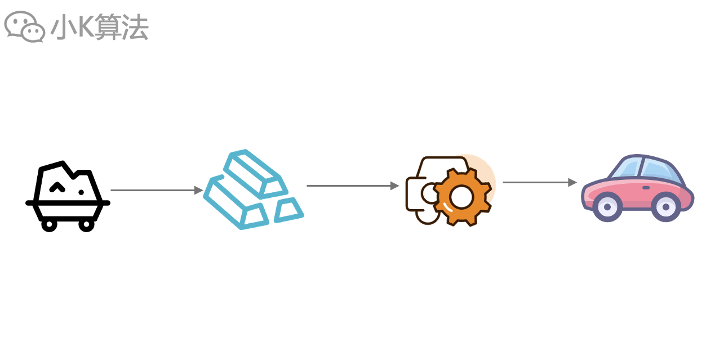
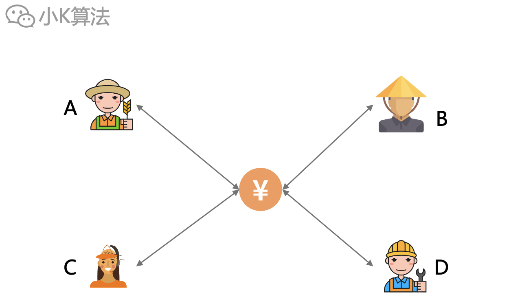
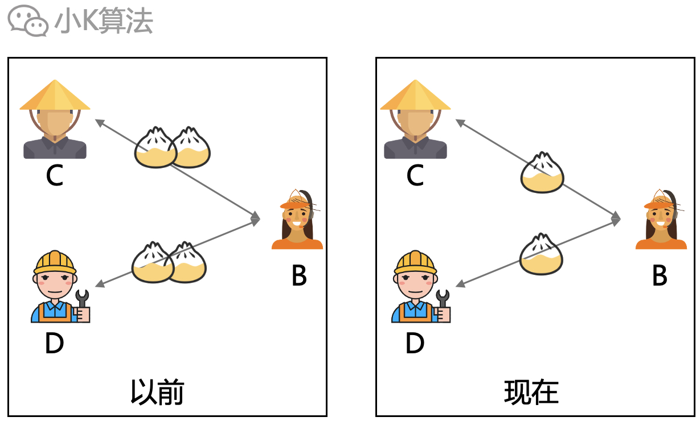
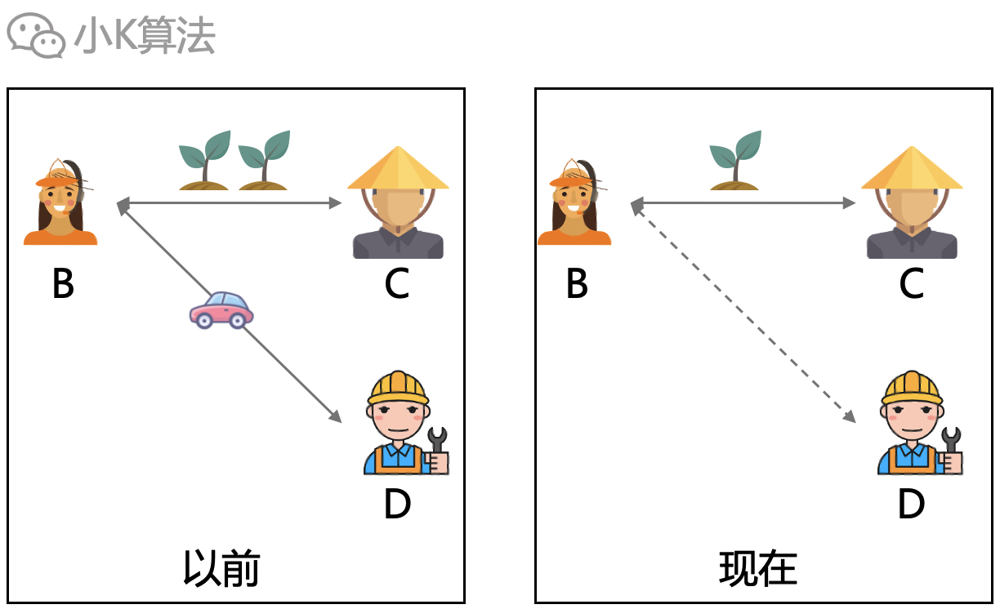

# 很幸运，我还有工作

### 1 背景
最近各种大小厂裁员的消息刷屏，难道互联网寒冬真的来了吗？其实不只是今年，几乎每年都会有各种裁员消息流出，甚至一些所谓的头部大厂都坐不住了，真的让人感觉，“今年是最差的一年，但也许是未来最好的一年”。

作为行业中的一员，小K也想谈一谈自己初浅的理解。其实根本没有所谓的“幸运”，想要立足活下去，就需要时刻保持危机感，也许他们的今天就是自己的明天。  
当然也不必过度恐慌，先来理性分析一波。

### 2 趋势
咱们先把时间线拉长，纵观历史长河，整个人类社会的整体资源其实是指数增长的。

资源的增长是因为技术的升级，18世纪60年代开始工业革命，由农耕文明转向工业文明，机器、工厂、石油等导致了生产力的爆炸增长。

与之伴随而来的红利就是人口的增长。

因为人类真正的刚需只是食物、空气、水，所以更多的资源首先就是能养活更多的人。

毕竟人类的终极目的其实也只有2个，生存和繁衍，这应该是基因决定的。

但如果聚焦某一个小的时间段，情况可能并不会太乐观，因为社会发展不可能永远保持高速增长，而是有一定的周期性规律。比如1929年的美国大箫条，上世纪90年代日本房产泡沫，08年次贷危机等等，都会导致增速放缓，即每过一个时间段都会出现经济危机，未来也一定会再次出现，那会不会就在2022？

那为啥会出现这样的现象呢？这就得从人类社会的底层逻辑上来说了，即经济学规律。

### 3 经济逻辑
以前农耕时代的社会结构比较简单，自己种地自己吃，能生产的食物是由个体的劳动时间决定，所以有上限。也因为生产的食物可能都不够，所以也不可能有精力再去生产其它的东西。

但现代社会不再是这种单一的生产结构，而是分工协作。尤其是1913年由福特最早应用的流水线作业，更是导致了精细化分工，这也更加提高了社会生产力。因为一个人不可能生产出像汽车、飞机这种大型复杂的工业产品，但一群人就可以。

生产力提高后，人们就不在只是单纯的生产粮食，生产力早就过剩了。所以现在A可以把时间用于生产汽车，B生产粮食。美国2010年左右只有2%的农业就业人口，就可以养活整个国家了。这样物质丰富了，为了每个人都可以享受到社会发展的红利，所以就要进行物质交换，即消费。A用汽车交换B的粮食，这样A和B就能同时享受汽车和粮食。

当然真实的社会不是这种简单的物物交换，这比较原始。一般人们是直接用货币进行物品交换。有国家作担保的货币体系，即增加了安全性，也提高了交换的效率，同时也降低了交换的成本，可以大大的促进消费。

这样看似一套完美的机制就产生了，但其实却隐藏了一个bug。  

刚开始大家拥有的资源都差不多。

随着时间的推移，可能因为不同行业的效益不同，或者因个人的能力差异，导致拥有的财富资源不再平衡，甚至逐渐扩大差异。资本的本质就是会转移到有利可图的地方，这也就导致了所谓的贫富差距。

假设B是包子店的老板，以前C和D每天都要吃2个包子，但因为现在财富减少了，只能缩减为1个包子。

B因为收入减少，也要缩减开支，以前还能买辆车，现在也买不起了。而A虽然拥有大量的财富，但他也只有一张嘴，两条腿，无法提供大量的消费。比如王校长天天买一辆跑车，也无法带动整个汽车行业啊，还是需要靠底层群体才能拉动如此庞大的消费市场。  
久而久之，这就导致了恶性循环，大家越来越穷，社会陷入经济危机。

社会经济结构非常复杂，不会是这么简单的原因导致，如果从整体上看，人类社会的资源还是在增加的，可以回忆一下我们小的时候，是不是一年都吃不上几次猪肉，但现在至少想吃猪肉的时候还是可以满足的。  
而现在人们不只是养猪，大家都从事不同的行业，提供的也是不同的服务或产品，比如小K是程序员，提供的是代码，所以我的代码也需要有人来买才行，不然我就赚不到钱，必然导致我的消费欲望下降。

### 4 应对策略
#### 4.1 税收
贫富差距过大不仅造成经济危机，也会造成社会动荡，所以必须得想办法解决，而税收就是一个办法。富人赚得多，那就多交税，穷人就少交或者不交税，这不就减小差距了。  

这里有几个不太容易理解的点，大家得仔细思考一下。  
1、货币只是衡量财富的一个标识，并不是真的资源，所以看似富人的账面数字减少了，但也不一定意味着他拥有的资源会减少。因为市场上的流动资金减少，会导致价格下降，所以要看大家所占的百分比。  
2、税收对于穷人一定是有利的，你应该期望越高越好，这是均贫富。  
3、税收不是国家凭空抽走你的财富，因为还有更高明的手段，直接超发货币，让你无任何感知，却能让你生活越来越困难，所以大家要积极响应税收。而美国在二战后建立的布雷顿森林体系就为它奠定了美元霸权，为今后超发美元洗劫全球建立了基础，当初是与黄金挂钩，现在是与石油挂钩。

但这又会产生一个问题，这看似都是对穷人友好，此时富人不干了。想办法赚取了更多的财富却不能获得资源上的优越，那还干个毛啊，于是富人也不愿意去增加收入，这看似大家公平了，但极其不利于社会的发展。社会要发展还得靠精英阶层的带动，如果他们没有动力去创新，去创造财富，那我们现在应该还是不能猪肉自由。所以税收也得适度。

#### 4.2 创新
经济危机是因为流动性不足，有钱的人消费不出去，没钱的人消费不起，贫富差距过大。像王校长这样的有钱人，得想办法掏空他的腰包才行啊，几千万的跑车又怎能激起富人的消费意愿呢？  
没有需求就得创造需求，溢出的生产力要用去生产稀缺的产品，以此提高市场的消费欲望，让大家都能赚到钱。  
比如火星移民计划，诺亚方舟船票，星际旅游等等创新型产品，我相信富人是愿意掏空腰包的。

但说到这里大家有没有感觉又有啥问题呢？  
你是不是觉得我在扯蛋，可是我想告诉你，这就是我内心真实的想法。这些产品对我等底层人民来说确实不切实际，我们肯定没有能力去创造，但精英阶层是完全有这个能力的啊。在中世纪你能想象以后会有汽车、飞机、火箭、飞船？而现在不是人人都能坐飞机了吗？所以不要限制自己的想象力。  

美国的马斯克大家都熟悉吧，你看他现在在搞什么，星链计划，新能源汽车，火星移民，脑机接口，这个首富就应该这样的人来坐。  
再看看我们的首富榜上，以前是搞房地产的，现在是卖矿泉水的。还有一些互联网大厂的老板，竟然做起了社区卖菜的生意了，这摆明是要榨干老百姓口袋里的每一块铜板啊。  

我真的希望精英们能听到底层人民的心声，真的还有很多有意义的事情可以去做。虽然我也经常用XX买菜，确实便宜，也带来了方便，但这会导致很多靠卖菜的老人失去就业岗位，不值得提倡。  

还待开发的市场可就大了。  
比如大飞机，现在几乎被波音、空客垄断了，什么时候能坐上国产大飞机呢。前段时间组装电脑，我却买了个二手显卡，不是因为我喜欢，是买不起，什么时候能用上国产的显卡啊。还有汽车，什么时候我才能开上自己的汽车呢，而美国在100年前就达到了差不多每家有汽车。如果有老板愿意投入这些高科技产业，将会创造多少个就业岗位出来，那大家也不用担心失业了，我第一时间冲进去，不求高薪，能养活家庭就行。  

行业变革会让以前的从业人员失业，但新的岗位也会出来，及时学习新技能跟上就行。第一次工业革命时期，英国发生了卢德运动，主要原因就是蒸汽机的出现，导致了大量手工业人员失业，他们认为这是机器的罪过，所以带头开始砸机器，以为这样就能改善自己的生活处境，结果如何也不用多说了，社会的发展洪流是不可逆转的。  

所以现在看似短时间互联网行业大量裁员，只是说明提前透支了未来的预期，需要回归理性，未来一定趋向合理的水平，不会动不动就年薪百万。我差不多在30岁左右就开始走职场下坡路，刚毕业那会如果跳槽没有50%的涨幅，就不要跟我谈，而现在我能接受30%的降薪，赚钱嘛，不寒碜，不要觉得自己以前高薪就拉不下脸来。如果等到了35岁失业了，我也可以去开滴滴，送外卖，密室扮鬼，城市跑腿等等，想办法活下来。等新的机会到来时，只要有老板愿意要我，我一定为各位老板披荆斩棘。

#### 4.3 其它
当然还有其它的手段，比如罗斯福新政，大搞基建，就是国家队牵头拉动内需。而日本侵华，也是为了转移国内矛盾，开动战争机器创造就业，这种暴力手段只会背道而驰。

### 5 总结
我相信未来一定是乐观的，一定会有新的岗位和机会出来。
如果各位觉得小K说的在理，可以帮忙分享转发一下，让更多的人看到，乐观的去面对。

本文原创作者：小K，一个思维独特的写手。  
文章首发平台：微信公众号【小K算法】。  

如果喜欢小K的文章，请点个关注，分享给更多的人，小K将持续更新，谢谢啦！

---
**扫描下方二维码关注公众号，第一时间获取更新信息！**  

