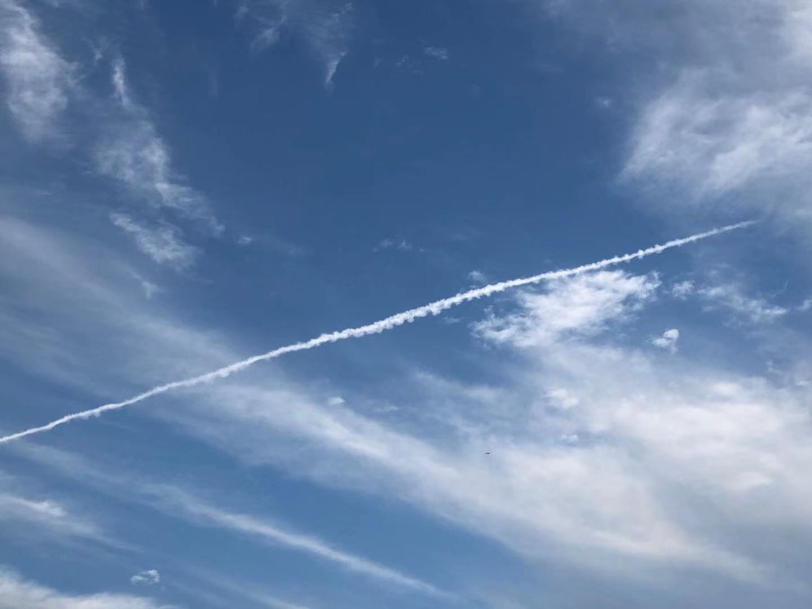
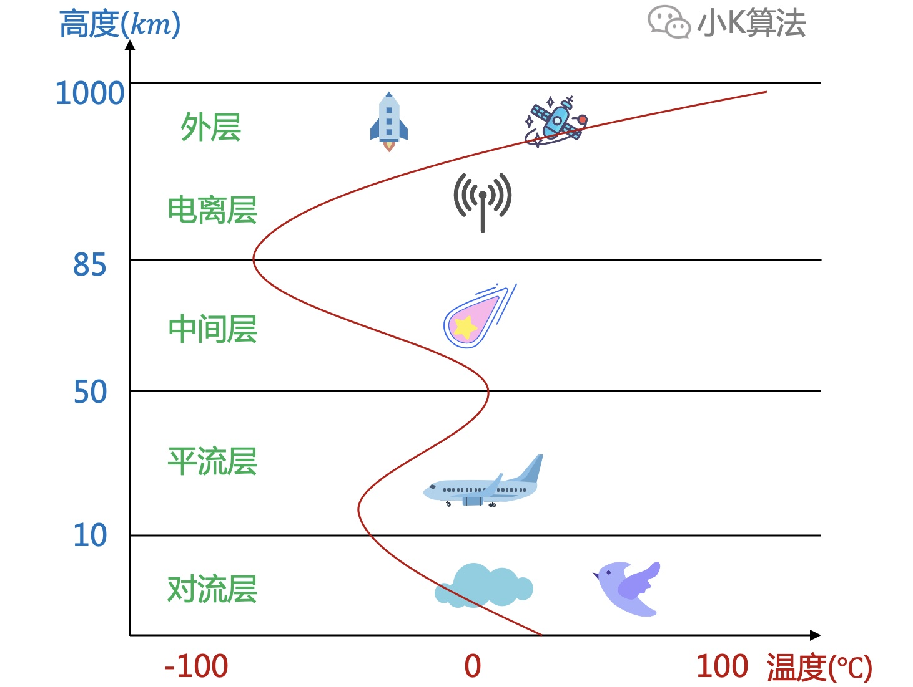
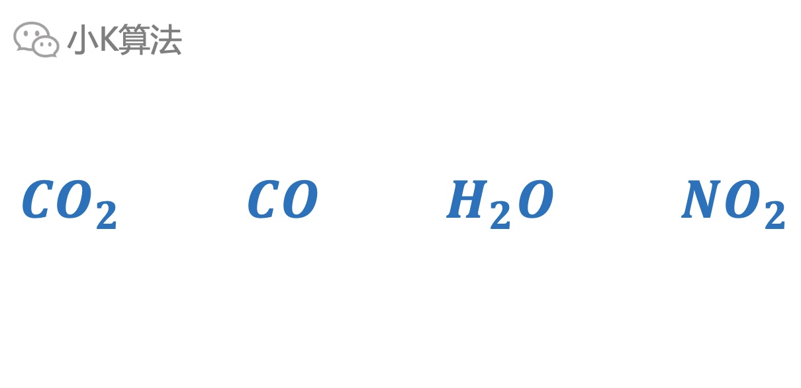
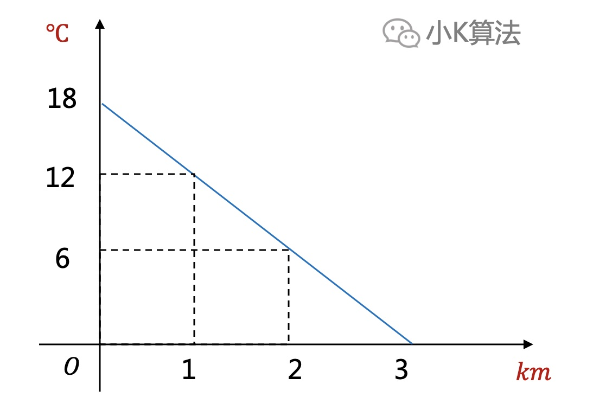
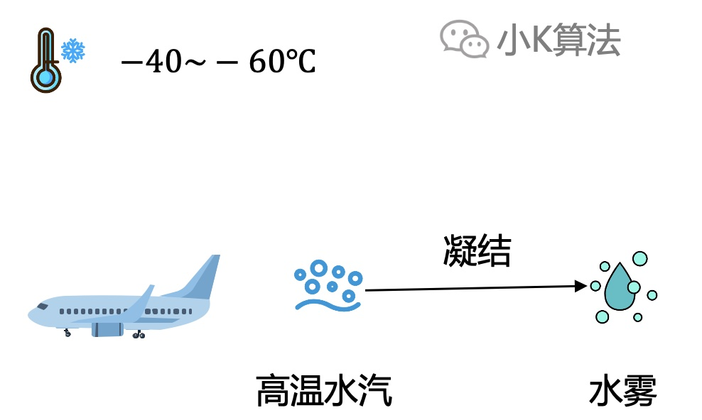

# 飞机飞过为啥会留下一条白线？

### 1 故事起源
有一架飞机从天空飞过，留下了长长的白色线条。  
在影视作品或现实生活中，经常可以看到这样的现象。  
下面是小K制作的一小段3D动画。

这是小K在某天下午拍摄的真实照片，很漂亮呀有木有，有没有摄影的潜质，哈哈。

后面产生的白线，专业术语称之为**尾迹云**。  
那你有没有想过，为什么会出现这样的现象呢？  
这背后到底蕴含了什么科学依据，今天我们就来仔细研究一下。

### 2 问题分析 
场景比较简单，涉及的变量不多，就2个，天空和飞机，那么原因肯定跟这两个有关。

那我们就从这两点下手分析，首先要了解一下地球大气层。 

### 3 大气层
地球外表有厚厚的大气包裹着，称为大气层。

大气层按高度分为5层：  
* 对流层：0~12km，空气对流，云层，小鸟都在这层。
* 平流层：10~50km，气流水平运动，没有水汽，晴朗无云，天气很少发生变化，适合航行。飞机一般都飞行在平流层底部，8~12km左右。臭氧层也在该层，20~25km，可以吸收紫外线，保护地球生物。
* 中间层：流星一般在该层燃尽。
* 电离层：也称暖层，气体电离，可反射无线电，长距离无线电通信就靠电离层反射。
* 外层：又称散逸层，空气极稀薄，温度极高，达数千度，延伸至1000km，是大气层向星际空间过渡的区域。

### 4 飞机
飞机是用航空燃油作为动力，燃油分为两大类：  
* 航空汽油：用于往复式发动机的飞机
* 航空煤油：用于航空燃气涡轮发动机和冲压发动机

所以燃油燃烧后，产生的尾气也主要是二氧化碳，一氧化碳，水，二氧化氮，跟汽车的尾气成分相差不大。  
那么尾迹云肯定不是飞机排出的尾气这么简单，你在路上肯定没看到汽车形成尾迹云。

### 5 原因
#### 5.1 低温
根据第3节可以看到，在对流层，温度随高度上升而下降，每上升1km温度下降6摄氏度。飞机飞行在10km高空，温度会下降60摄氏度。 

 

所以飞机到达飞行高度时，机外的温度在零下40-60度左右。  
小K有时自己坐飞机，发现机上设备显示外面的温度达到零下70~80度了。  

#### 5.2 凝结
再根据第4节的分析，飞机发动机燃烧会排出大量的高温尾气，其中含有很多水汽，高温水汽被喷出后进入零下40~60度，会快速凝结形成云雾，这就是我们看到的尾迹云了。  

 

根据相关统计，出现尾迹云时，一般在零下40~60度之间，其它温度很少出现。温度要相当低时才有可能凝结，所以在低空一般是看不到尾迹云的。

### 6 总结
生活中很多看似很普通的现象，也要善于观察，多思考，然后你会发现处处蕴含着科学知识。

本文原创作者：小K，一个思维独特的写手。  
文章首发平台：微信公众号【小K算法】。  

如果喜欢小K的文章，请点个关注，分享给更多的人，小K将持续更新，谢谢啦！

---
**扫描下方二维码关注公众号，第一时间获取更新信息！**  

