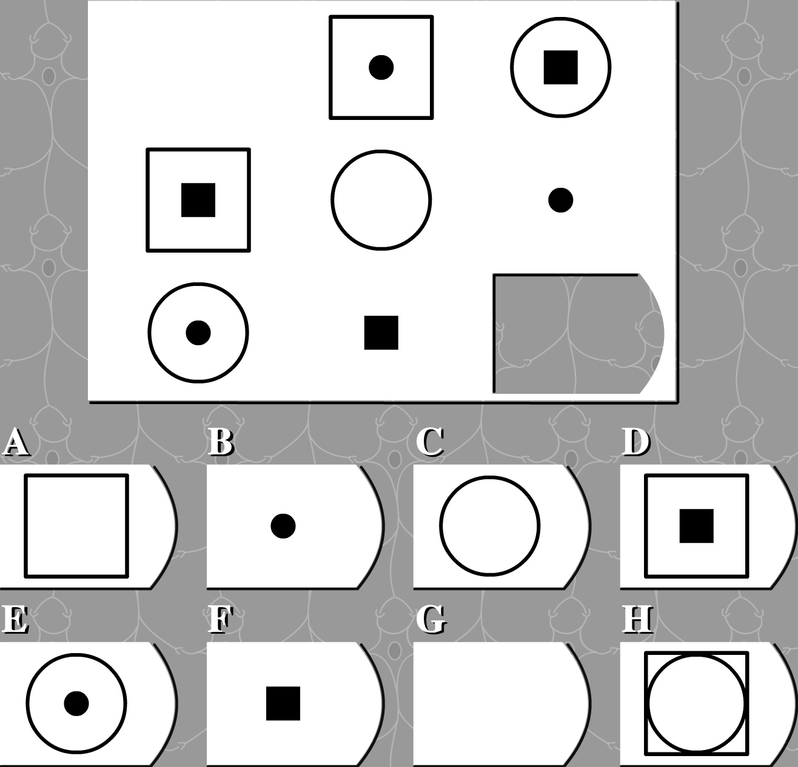
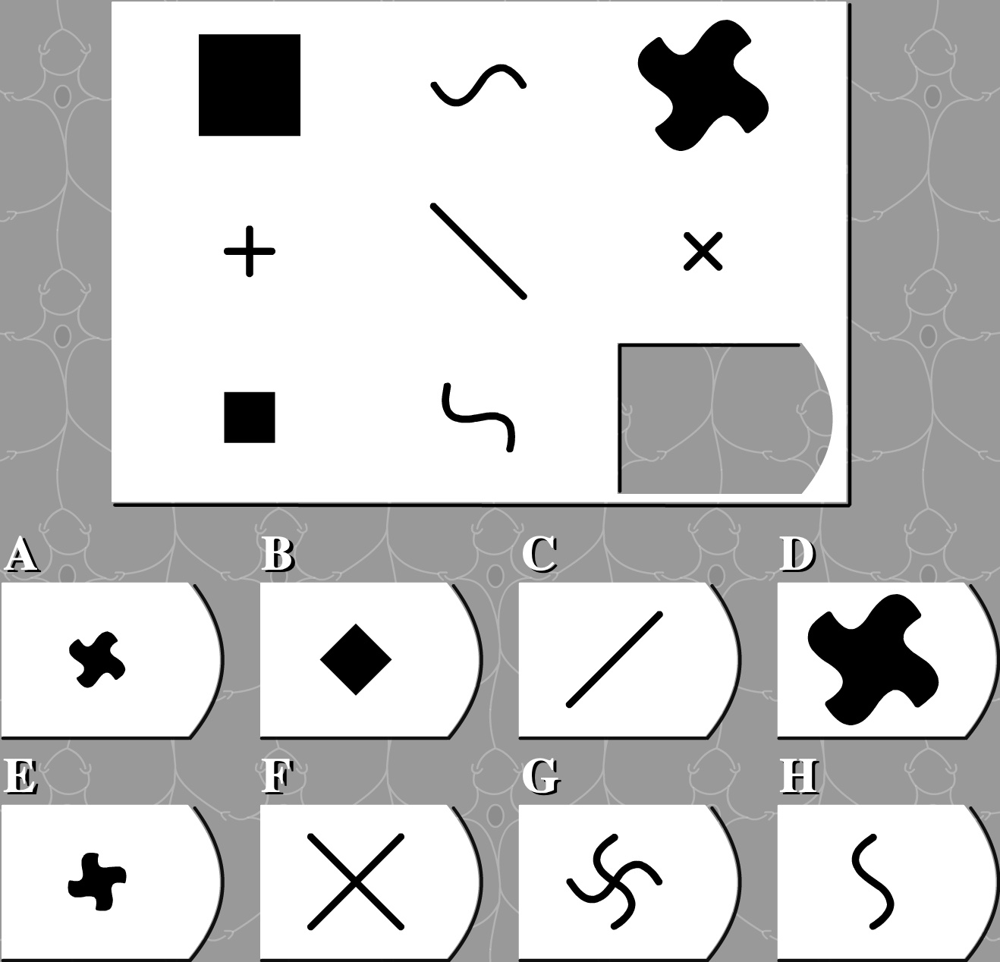

# 智商140以下慎点

> [!TIP|style:flat|label:注]
> 思维可以训练，套路可以模仿。  
> 通过分析常见的智商测试题，帮助大家打开思维方式。  
> 本文不需要知识背景的支撑，从小学到大学都通用，如果家里有小孩，也可以给小孩讲一讲，从小训练思维方式，提高逻辑思维能力，其本质就是找规律。  
> 题目来源：http://iqtest.dk/main.swf 大家可以先去测试一次，看自己能得多少分。

  
图形一样，都是圆

  
按每行，花瓣数量分别为1，2，3；按每列，花瓣顺时针旋转1个位置

  
按每行，竖线位置分别为左，中，右；按每列，竖线数量分别为1，2，3

  
相对于每行、每列、中心都对称

  
按每行，数量分别为1，2，3；按每列，位置为左、中、右

  
按每行，横线不动，竖线位置为右、中、左；按每列，竖线不动，横线位置为上、中、下

  
相对于每行、每列、中心都对称

  
按每行每列看，都有3个图形，分别为圆、三角、正方

  
相对于中心对称

  
按每行，左、右的图形往中间移动，构成中间的图形

  
按每行，左边图形参照中间直线的方向拉伸；第3行在水平和垂直的方向都拉伸

  
按每行、每列、全局看，直线数量都为1，2，3，方向都为横、竖、斜；

  
按每行看，2个花瓣同时分别按顺、逆时针旋转1个位置

  
按每行看，左+中=右(去掉重叠线条，保留不重叠线条)；按每列看，上+中=下(同理)

  
按每行看，左+右=中；按每列看，上+下=中

  
按每列看，都有3种图形；第3列每个位置有1个外部和1个内部图形，也要分别不一样；按全局看，第1列的图形放入第2列，再移动到第3列

  
按每行看，圆不动，正方顺时针旋转1个位置；按每列看，圆不动，正方顺时针旋转3个位置

  
按每行看，右+左=中；按每列看，上+下=中

  
按每行看，黑方一起向右移动1格；按每列看，黑方一起向下移动1格；超出边界移动到下一行或循环到左上

  
按每行看，都有3种图形，按全局看，同1种图形加起来形成1个完整的图形

  
按每行看，从左到右，4个弧形往里收缩

  
按每行每列看，都有4种不同的图形各1个

  
按每行每列看，都有圆、三角、正方3种图形，同时都有1个实心小圆在里面，1个空心小圆在里面，1个空心小圆在外面

  
按每行每列看，都有3种不同的图形，且上边为1个全开，1个半开，1个封闭；按全局看，同1种图形也满足1个全开，1个半开，1个封闭

  
按行从左到右，小圆顺时针旋转90度，且上面2个位置都为实心，下面2个位置都为空心

  
按每行看，3条直线分别绕中间3个点顺时针旋转45度，超出边界反向

  
按每行看，左+中=右(去掉重叠线条，保留不重叠线条)；按每列看，上+中=下(同理)

  
按每行每列看，都有6种不同图形

  
按每行每列看，第1个位置的图形按照第2个位置的线条指示做形变（旋转，扭曲，伸缩）

  
按每行看，中间图形放在左边图形里面得到右边图形

  
按每行看，图形的左右2条边向内弯曲；按每列看，图形的上下2条边向内弯曲

  
按每行看，右下方直线绕该直线中心旋转90度得到中间图形，继续左上方直线旋转90度得到右边图形；
按每列看，左下方直线旋转90度，接着右上方直线旋转90度

  
按全局看，第2行第3个+第3行第1个=第1行第2个，第1行第3个+第3行第2个=第2行第1个，剩下的=第1行第1个+第2行第2个

  
按每行每列看，第1个图形+第2个图形=第3个图形（里外都有小圆时会抵消相同数量）

  
按每行看，左边图形里面的箭头和右边的箭头关于中间的直线对称

  
按全局看，深灰3个连一起的有3个，浅灰3也有3个，黑色3的还差1个，同理还差深灰2的1个，和浅灰1的1个。按每行看，图形方向都有上、左、右。

  
黑色小方块依次从0-8，2个小圆一起向右移动1格，每进入1个黑块就变换(空心与实心互换)

  
按每行看，左图按照中图的线条方向旋转并拉伸

  
按每行看，叉变圆，圆变三角，三角变叉，同时向右移动1格

**答案**  
<!--  -->

**满分145**  
<!--  -->

---
**扫描下方二维码关注公众号，第一时间获取更新信息！**  

