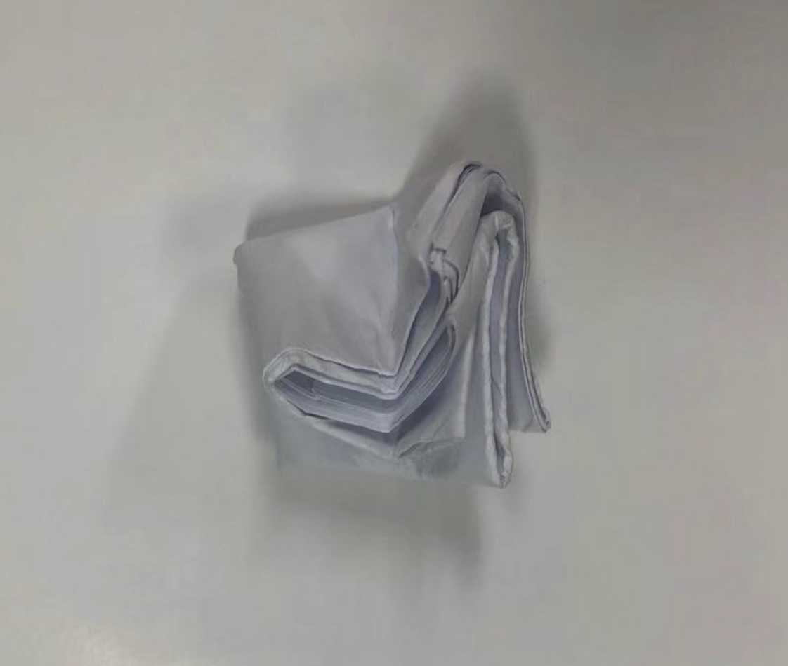

# 一张A4纸对折不了8次？

### 1.计算
一张普通A4纸规格为$$210mm\times 297mm$$，面积$$=62370mm^2$$，厚度$$\approx 0.104mm$$。  
对折1次面积变为原来的$$\frac{1}{2}$$，厚度变为原来的$$2$$倍。  
设原面积为$$S$$，厚度为$$H$$，对折$$n$$次后，  
面积$$=\frac{1}{2^n}\times S$$，厚度$$=2^n\times H$$。  
如果对折10次，面积和厚度的数据如下表：  

次数|面积($$mm^2$$)|厚度($$mm$$)
:-:|:-|:-
1|$$\frac{1}{2},\ 31185$$|$$2倍, 0.208$$
2|$$\frac{1}{4},\ 15592.5$$|$$4倍, 0.416$$
3|$$\frac{1}{8},\ 7796.25$$|$$8倍, 0.832$$
4|$$\frac{1}{16},\ 3898.13$$|$$16倍, 1.664$$
5|$$\frac{1}{32},\ 1949.06$$|$$32倍, 3.328$$
6|$$\frac{1}{64},\ 974.53$$|$$64倍, 6.656$$
7|$$\frac{1}{128},\ 487.27$$|$$128倍, 13.312$$
8|$$\frac{1}{256},\ 243.63$$|$$256倍, 26.624$$
9|$$\frac{1}{512},\ 121.82$$|$$512倍, 53.248$$
10|$$\frac{1}{1024},\ 60.91$$|$$1024倍, 106.496$$

**一张A4纸如果能成功对折10次，厚度能达到1分米**，当然这是不可能做到的。  

### 2.实验
我用了一张普通的A4纸进行对折，最终只对折了7次。  
因为纸张自身的拉力，已经无法再进行对折。  
如下图：

### 3.世界记录
地球到月球为38万公里，地球到太阳为1.5亿公里。  
一张A4纸设为0.1毫米，  
* 对折42次，达到42万公里，超越地球到月球距离。  
* 对折51次，达到2.3亿公里，超越地球到太阳距离。  
* 对折103次，达到930亿光年，超越宇宙。  

美国德克萨斯州圣马克中学师生们，用一张长达1.3万英尺(接近4公里)的厕纸对折了13次，创下世界记录。  

### 4.数学原理
背后的数学其实就是指数函数$$y=a^x\ (a>0,a\neq 1)$$。  
还可以应用在投资上，比如计算复利。  
假设初始资金10万，每年30%的利息收益，投资20年，则最终的收入为$$10\times 1.3^{20}=1900$$万

---
**扫描下方二维码关注公众号，第一时间获取更新信息！**  

