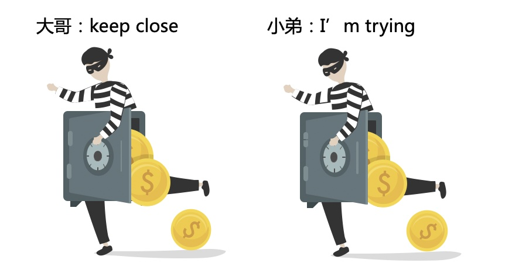
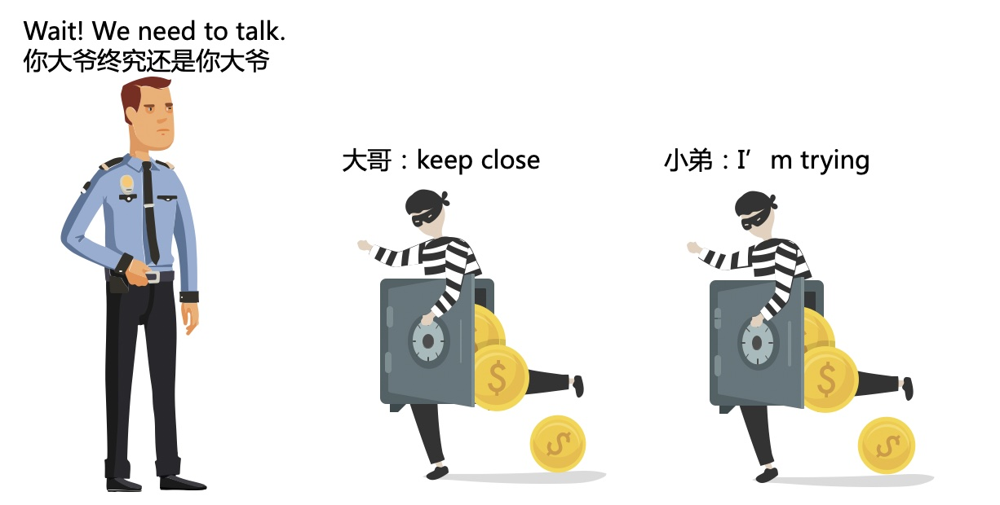
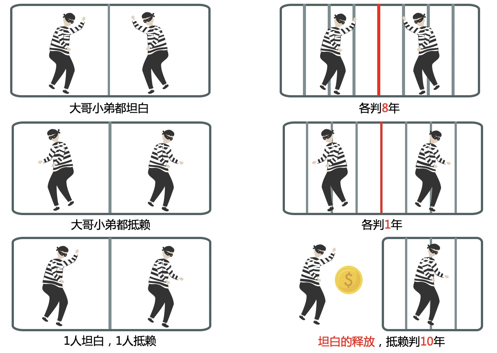
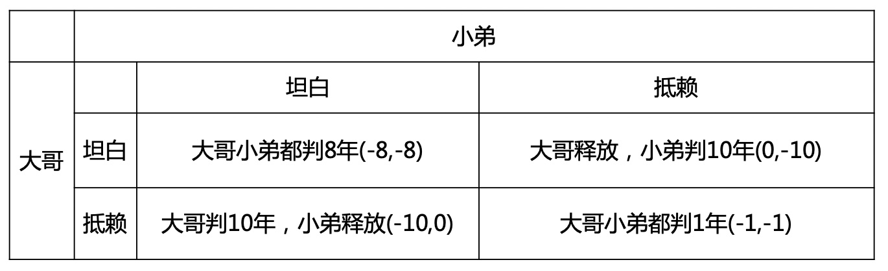
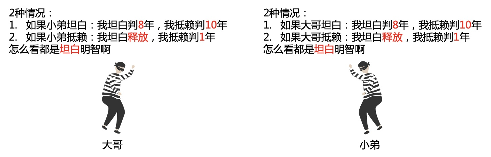
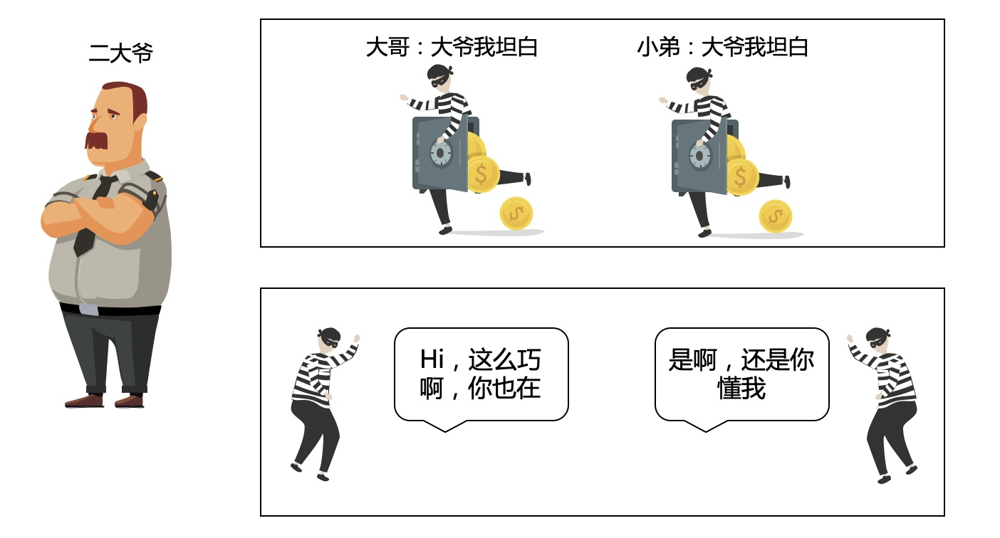
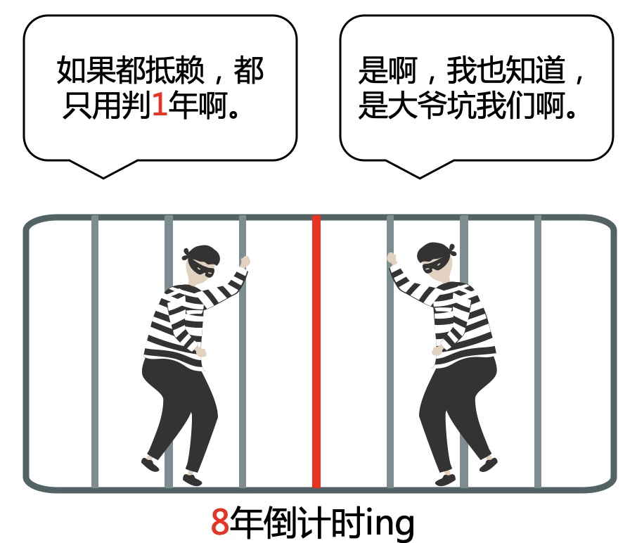

# 囚徒困境

### 1.故事的起源
话说很久以前，一个普通家庭的两兄弟，从小天资聪颖，智商超群，顺利考上了985，成为了人们口中的“别人家的孩子”。  
大学生活简直狂拽酷炫吊炸天，某个机遇接触到了“PUA”，从此一发不可收拾，“推拉”，“kino”，“dhv”各种技巧炉火纯青。《高数》、《线代》、《概率论》再也不香了。  
毕业了自然没有找到好工作，要是关注了我的公众号，何至于此啊，年青人“耗子尾汁”。  
无赖之际这两兄弟开始凭借自己的智商，盗窃金库，从此live happily ever after（永远幸福的生活下去）。

### 2.转折
oh，wait剧本错了，Action。 

常在河边走，难免不湿鞋。主角（你大爷）闪亮登场，“小子哪里逃，你大妈可能追不上你，但你大爷终究还是你大爷”。

大爷给你们3个选择，如下图：

### 3.分析
大哥小弟陷入了沉思，咋一看是一道选择题，但仔细分析这分明是一道智商题啊。  
还好哥俩智商都够用，开始分析吧，哥俩迅速得到下面这个思路。

但关键时刻，都不知道对方会怎么想啊，急，在线等。。。  

### 4.大结局
3分钟之后，终于想明白了

不对啊，兄弟，我们被坑了

### 5.原理分析
这是博弈论的典型应用场景。  
**博奕论**：
* 也称对策论（Game Theory），属运筹学。
* 主要研究公式化了的激励结构间的相互作用，是研究具有斗争或竞争性质现象的数学理论和方法。
* 分为零和博弈，和非零和博弈（可以共赢）。

**纳什均衡**：
* 指博弈中这样的局面，对于每个参与者来说，只要其他人不改变策略，他就无法改善自己的状况。
* 纳什证明了在每个参与者都只有有限种策略选择并允许混合策略的前提下，纳什均衡定存在。

### 6.其它社会应用场景
1. 美苏冷战：如果对方不减少军备竞赛投入，我方就无法改变策略，双输。
2. 世界贸易：如果双方都降低关税，就可以促进国际贸易，合作共赢。

---
**扫描下方二维码关注公众号，第一时间获取更新信息！**  

