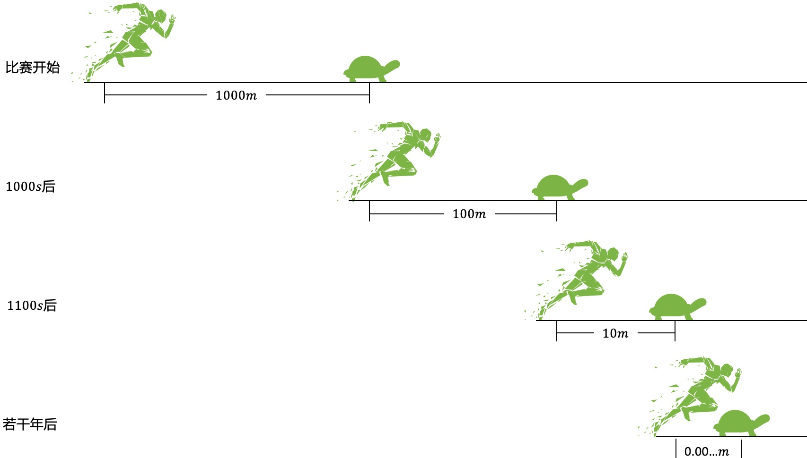

# 你永远也追不上乌龟？

### 1.故事的起源
公元前5世纪，古希腊哲学家芝诺提出了一个值得深思的问题，他说如果让阿基里斯和乌龟赛跑，阿基里斯永远也追不上乌龟？  
**规则如下**  
* 开始时乌龟在阿基里斯前面1000米处。
* 阿基里斯的速度是乌龟的10倍，可以假设阿基里斯1m/s，乌龟0.1m/s。
* 阿基里斯要想追上乌龟，首先要先到达乌龟之前所在的位置。

**比赛开始**  
* 阿基里斯先跑了1000米到达乌龟的起始位置，用了1000s，此时乌龟向前跑了100米。
* 阿斯里斯继续向前跑了100米到达乌龟1000s后的位置，用了100s，此时乌龟又向前跑了10米。
* 阿斯里斯再向前跑10米，此时乌龟又向前跑了1米...
* 若干年后，阿斯里斯：“我认输”，乌龟：“老铁别放弃，坚持就是胜利，就差最后0.000000...米啦”。

**这没毛病啊，阿基里斯确实追不上乌龟，因为乌龟一直都在向前跑，完了，我抑郁了。。。**

###  2.分析
> [!TIP|style:flat|label:思考]
> 这明显不符合常识，只要阿基里斯的速度大于乌龟，则一定能追上乌龟，原因是啥呢？

“**若干年后，这到底是什么时候呢**”  
第一阶段：$$t_1=\frac{1000m}{1m/s}=1000s$$，同理第二阶段$$t_2=\frac{100m}{1m/s}=100s$$。  
即阿基里斯所花费的时间为$$1000s,100s,10s,1s,0.1s,\cdots$$。  
总共花费的时间，$$T=t_1+t_2+\cdots+t_n=1111.1111\cdots$$。  
这个时间$$T$$其实是一个有限的时间，芝诺度量的时间是在考虑“阿基里斯追上乌龟前”的时间，而无法度量追上后的状态，即$$T$$不是一个无限大的时间，时间总会超过$$T$$。

这个悖论实际上是**反映时空并不是无限可分的，运动也不是连续的。**

为了解决这种问题，后面人们用数学语言定义了极限的概念。  
可以参考另一篇文章，里面有讲极限的知识，
[0.9循环等于1吗？](/math/0.9equal1.html)。  

---
**扫描下方二维码关注公众号，第一时间获取更新信息！**  

