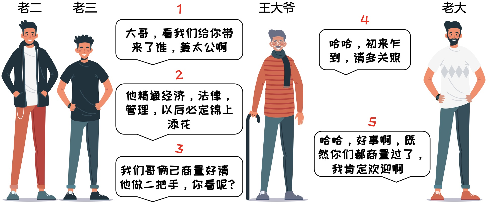

# 小小分金币，人生大道理

### 1 故事起源
很久以前，有3人桃园三结义，一起拜把子，准备干一番大事业。好在刚好赶上了改革开放，享受到了时代的红利，赚到了人生的第一桶金，没错，就是100个金币。  
没钱兄弟干，有钱干兄弟。是时候建立一套完整的分赃体系了，简称财务管理制度。  
前期创业艰难啊，一切从简吧，要不就这样：  
* 每个人轮流提出分配方案，得到半数以上赞成票就通过
* 如果没通过，就将提出者干掉，由剩下的人继续提出方案
* 3兄弟各有想法，都想要得到最大的利益，同时能干掉最多的人

### 2 召开第一次会议
老大首先提出了方案。

老三有点怨言，跟二哥商量了一下。

老二倒吸一口凉气，这三弟平时看不出来，没想到这么阴险啊，如果我们投死了大哥，接下来由我提方案，肯定会是这样。

只剩两个人的时候，无论老二提出什么方案，老三都会反对，这个投票肯定没有半数以上，老二一定会被杀死，而老三可以坐拥所有财富，老三一想还有点小激动呢，哈哈。

老二率先针对老大的方案发表了意见。

老大心想，小子几个还挺聪明的嘛，那下次我只拿98个，给你们一人1个好了，作为奖励。  

可谁知事事难料啊...

### 3 风云变幻
老三是一个爱思考有上进心的男人。

兄弟两来到了王大爷的住所。

和王大爷的沟通出奇的顺利，完全没有代沟啊。准备回去和老大汇报一下。

老大此时有一种说不出来的感受，仿佛屁股被扎了一针。心想：“不对，应该是我想多了，再坚持一下，就可以财务自由了呀，哈哈”。

### 4 召开第二次会议
王大爷刚加入团队，准备先崭露头角。

会议倒计时，每个人开始了疯狂的逻辑推理。

会议正式开始，老大开始了精彩的发言。

三兄弟都心满意足，那王大爷开不开心呢，咱也不知道，咱也不敢问啊。不过这二把手好像有点名不副实啊，哈哈。

### 5 天时，地利，人不和
上次会议后，王大爷已经看出了三兄弟的人品，真是各怀鬼胎啊，靠天靠地都不如靠自己。  
王大爷准备梭哈了，那就陪你们下一盘大棋吧。  

王大爷首先来到了老二老三的住所。

兄弟两都是明白人。

过了一会，老大也来看望两兄弟。

### 6 召开第三次会议
过新年，开好局，王大爷春风得意啊。

会议结束后，只看到王大爷头发都竖起来了，气冲冲的找到了两兄弟。

大爷准备放大招了。

### 7 年终总结
老大如往常一样自信的开始了发言。

不出所料啊，兄弟三反目，经典的剧情上演了。

大爷卧薪尝胆，终于走上了人生巅峰。开启了属于自己的时代，主持大局。

如果喜欢小K的文章，请点个关注，分享给更多的人，小K将持续更新，谢谢啦!

---
**扫描下方二维码关注公众号，第一时间获取更新信息！**  

