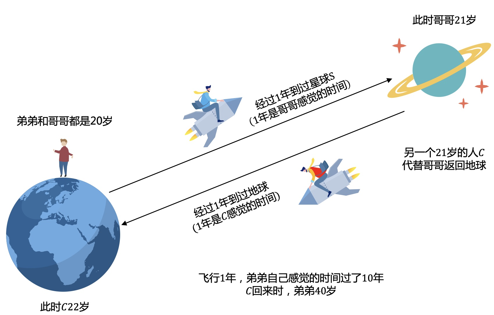

# 历史穿越也有科学依据，你信吗？

> [!TIP|style:flat|label:问题引入]
> 物理语言：一个3维物体在4维时间线上的移动速度是可变的。。。  
> 说人话：回到过去不是梦，穿越未来也敢想。让时间静止，让青春永驻，只要998...

走错片场了，ok，言归正传，这个就要说到爱因斯坦的相对论了。  
欲知相对论为何物，且听我慢慢分解。

### 1.光速不变原理
光速不变原理是由联立求解麦克斯韦方程组得到的。   
1887年，为验证“**以太**”是否存在，**阿尔伯特·迈克耳孙**与**爱德华·莫雷**合作在美国克利夫兰的凯斯西储大学进行了实验，此后又由不同的人进行了多次**“迈克耳孙-莫雷实验”**，验证了光速不变。  
光速不变原理也是爱因斯坦创立狭义相对论的基本出发点之一。  

所以不论你是走路，坐火车，还是骑火箭，你观察测量光速都是$$c(3.00×10^8 m/s)$$。  

### 2.思想实验
**想象一下这样的一个场景。**  
小明乘坐电梯以速度$$v$$向下移动，电梯里左右两边各有一面镜子，假设从右边的镜子发出一束光线，经过$$\frac{t}{2}$$时间到达左边镜子，再经过$$\frac{t}{2}$$时间返回到右边镜子，总共花费$$t$$时间。  

**小明看到的场景是这样的：**  
光线走的直线，经过时间t，路程为2s。

如果你站在电梯外面观察上面的整个过程，又会是怎样的呢？  

**作为局外人的你，看到的场景是这样的：**  
电梯在向下移动，光线走的斜线，经过时间t'，路程为2s'。

斜线路程大于直线路程，所以你的时间大于小明的时间，由此你会感觉小明的**时间变慢**。

 
那t和t'具体是什么关系呢，我们来推导一下。  

  
根据上面公式，当v增大时，你的时间会变大，相对小明的时间就会变小。

当$$v$$趋近于光速$$c$$时，$$\sqrt{1-{\left (\frac{v}{c}\right )}^2}$$趋近于0，所以你的时间$$t'$$趋近于无穷大。  
光线走的速度永远也追不上电梯的速度，即光线无法到达左边的镜子。  
那么小明相对你来说时间就无限慢，也就是时间静止。小明一眨眼的时间，外面可能已经过了几千年。

**假设v超过光速c(当然理论和实验都是不可能的)，又会怎样？**  
小明相对你来说时间比静止还要慢，那么只能发生时间倒流，回到过去了。

ok，完结啦。。。等等，聪明的你好像感觉哪里有点不对。。。
> [!TIP|style:flat|label:仔细思考]
知道问题出在哪了。如果把光源和镜子放在你的小房间里，运动都是相对的，电梯在向下移动的同时，小明观察到你也在相对于他向上移动，小明也会得出**你的时间更慢**的结论，这不就矛盾了吗？

这就要说到另一个著名的问题，**双生子佯谬**。
### 3.双生子佯谬
假设地球上有一对双生兄弟，哥哥以$$\frac{1}{2}$$光速朝另一星球S飞去，再返回地球。  
弟弟认为哥哥高速运动，哥哥应该更年轻。  
哥哥认为弟弟高速运动，弟弟应该更年轻。  
哥哥返回地球时，到底谁更年轻呢？

  
**解释如下：**  
相对论中，时间也是一个相对的概念，而不是绝对的。哥哥和弟弟观察到对方时间都更慢，都在做慢动作，这个是正确的。  

出现矛盾是因为大家认为哥哥和弟弟是等价的，可以互换。如果以匀速直线互相远离，此时都处在一个惯性参考系中，时间等价。但如果要让哥哥和弟弟做比较，哥哥要先返回地球，一定会经过一次变速过程，此时哥哥和弟弟就不等价了。  
弟弟此时相对于其它参照物，比如太阳，月球也是静止，但哥哥相对于其它所有物体也是在变速。非惯性系属于广义相对论的范畴。

如果用狭义相对论思考，可以分2个阶段。   
以地球作为参考系，弟弟在地球上不动，哥哥飞行1年到达星球S，此时星球S上另一个与哥哥同岁的C代替哥哥返回，再跟弟弟比较。  

同理如果弟弟21岁时飞行1年前往星球S，会发现此时哥哥已经40岁了。

大家感觉自己的时间都是正常的，不会加速或者减速，是你相对于别人来说，别人感觉你的时间变慢了。

---
**扫描下方二维码关注公众号，第一时间获取更新信息！**  

