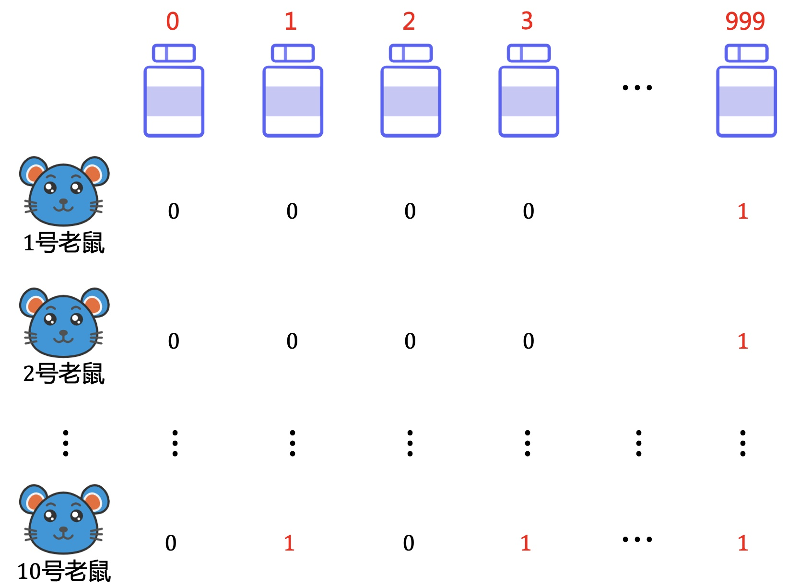

# 老鼠与毒药

### 1.故事起源
有1000瓶药水，其中一瓶是有毒的，老鼠喝掉药水后，毒性会在24小时后发作。那最少需要多少只老鼠，能够在24小时后找出哪一瓶有毒呢？
<div align=center></div>

### 2.思考小规模场景
先考虑小规模的问题会是怎样的呢？  
**2瓶药水**  
只需要1只老鼠，喝掉其中一瓶。24小时后老鼠死了，就是喝掉的这瓶有毒，否则是另一瓶。  
**4瓶药水**  
只需要2只老鼠
<div align=center></div>

**8瓶药水**  
只需要3只老鼠
<div align=center></div>

相信聪明的你已经看出来了，这不就是二分的思想吗？  

**问题建模**  
如果把喝掉的药水用1表示，没喝的用0表示。  
每一列就是一个二进制数字，对应的十进制数正好等于药水的编号。
<div align=center></div>

**结果查找**  
每一只老鼠最终都只有2种状态，“活”和“死”，把3只老鼠的状态建成一棵树，就成了一棵满二叉树。  
从根节点到叶子节点的每个子路径，也正好对应了药水的编号。
<div align=center></div>

老鼠死了有毒的肯定是在喝掉的药水中，也就是对应为1的节点，没死就是没喝有毒的，也就是对应为0的节点。这样根据24小时后所有老鼠的状态，就可以唯一确定哪一瓶有毒啦。    

所以可以看出，二分、二进制、二叉树是有着本质的联系。二分的思想在计算机算法中非常重要，以后也会多次提到，大家可以从多个角度思考问题，深入理解“二”的意义。  
如果有人说世界由01组成，也不为过啊。。。

### 3.还原1000瓶
1.给1000瓶药水按0-999编号，把十进制转为二进制，每一只老鼠喝掉对应为1的药水。  
2.再根据老鼠“死活”的状态确定药水的编号。  
总共需要10只就够了，$$2^{10}=1024 >1000$$。
<div align=center></div>


### 4.代码实现
**十进制/二进制互转**
<div align=center></div>

**代码如下：**
```cpp
int length = 0, a[11] = {0};
void transform10to2(int n, int &length, int a[]) {

    while (n) {
        a[length++] = n & 1;
        n >>= 1;
    }
}

int transform2to10(int &length, const int a[]) {

    int i = 0, k = 1, ans = 0;
    while (i < length) {
        ans += a[i++] * k;
        k *= 2;
    }
    return ans;
}
```


---
**扫描下方二维码关注公众号，第一时间获取更新信息！**  
<div align=center></div>