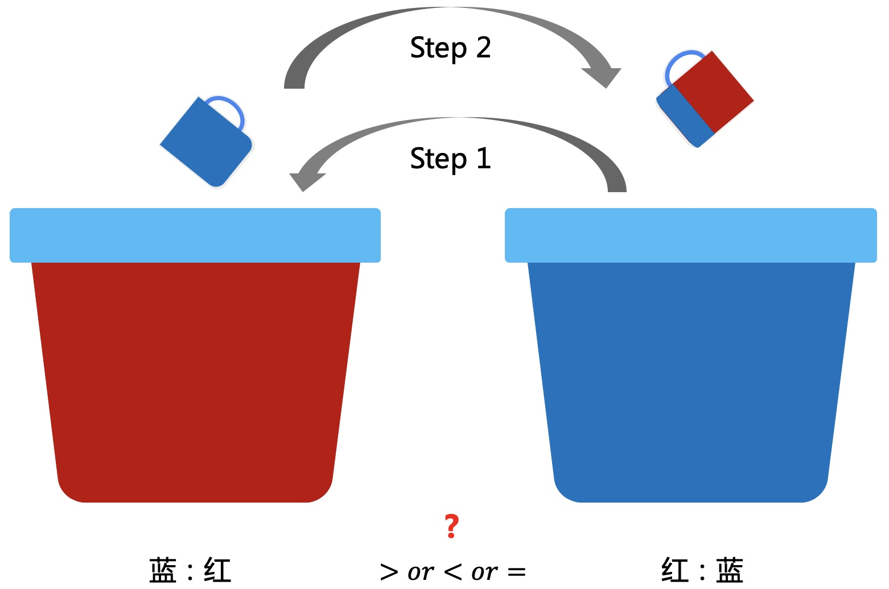

# 五道逻辑思维面试题

### 问题1
#### 1.1 问题描述
从1到100排列成一排，总共100个数，每一轮抽走奇数位置的数，问最后剩下哪个数？

#### 1.2.分析
先思考小规模的问题，例如从1到10，模拟整个抽取过程如下。

第1轮抽取完剩下所有偶数，如果都除以2，就变成了1到5的小问题；第2轮抽取后，还是剩下偶数，再除以2，变成1到2。

所以最后剩下的数如果因式分解，就是包含因数2最多的数。那么还原上面的问题，1到100最后剩下的数是64。

### 问题2
#### 2.1 问题描述
编号为1~100的灯，初始时都开着。  
现进行如下操作：  
* 编号为1的倍数的灯反方向拨一次开关。
* 编号为2的倍数的灯反方向拨一次开关。
* ...
* 编号为100的倍数的灯反方向拨一次开关。

问最后哪些灯是关闭的状态？

#### 2.2 分析
轮次数如果为灯编号的因数，那就需要操作一次开关。  
而且还能得出：
* 操作偶数次开关，状态不变
* 操作奇数次开关，状态改变

所以问题就转化为判断每个灯的编号有奇数个还是偶数个因数。  

例如$$12=1\times 12=2\times 6=3\times 4$$。  
可以看出因数是对称的，如果2个因数不一样，肯定有偶数个因数。  
只有能开平方的数才有奇数个因数，比如$$9=1\times 9=3\times 3$$。  
所以最后关闭的灯编号为1，4，9，16，25，36，49，64，81。

### 问题3
#### 3.1 问题描述
假设有8个球，其中有一个球偏重。给你一个天平，问最少要称几次就能找出这个偏重的球？

#### 3.2 分析
天平不能称出具体的重量，只能比较，所以每一次两边的球数量要一样多。  
很容易就可以想到用2分的方法，先4+4，再2+2，再1+1，总共3次就可以找出来。  
那有没有更少次数的方法呢？  
如果第一次称3+3，有2种情况如下：  
* 平，剩下2个球，再称一次就能找出来
* 不平，在重的3个球中，选择2个球1+1称一次，也能一次找出来

还能更少吗？答案是不能了，因为还剩下2+2或者1+1称第一次，都无法一次找出来，所以最少要两次就能找出偏重的球。

### 问题4
#### 4.1 问题描述
两个桶分别装了一样多的红色和蓝色的颜料。先从蓝色桶里舀一杯倒入红色中，搅拌不均匀。再从有蓝色的红色桶中舀一杯倒入蓝色桶里，问两个桶中蓝：红与红：蓝的大小关系？

#### 4.2 分析
第二步舀的时候，因为不均匀，所以无法知道具体有多少比例的红色和蓝色，可以换一个角度来考虑。  
因为是用的相同大小的杯子，所以两次操作后，两边的桶里的总体颜色是一样多的。假设红色里面混了一部分蓝色的颜料体积为X升，那么就有X升的红色颜料到了蓝色的桶里，所以两边的比例是一样的。

### 问题5
#### 5.1 问题描述
有无限多的水，给你两个杯子，容量分别为5升和6升，问如何量出3升水？

#### 5.2 分析
杯子没有具体的刻度，所以肯定要装满才有意义。两个杯子相差1升，所以要利用之间的差来量出其它的容量。  
步骤如下：
* 将6升装满，再倒入5升中，剩下1升；将这1升转移到5升容量的杯子里
* 再将6升装满，再倒入5升中，剩下2升；将这2升转移到5升容量的杯子里
* 继续将6升装满，再倒入5升中，剩下3升

---
**扫描下方二维码关注公众号，第一时间获取更新信息！**  

