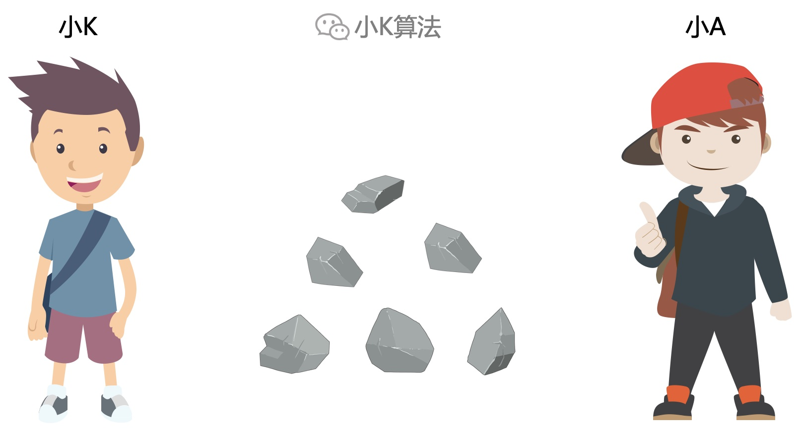

# 巴什博弈：取石子游戏

### 1 故事起源
有一堆石子共N颗，小K和小A轮流取，每次最少取1颗，最多取M颗，最后一次取光石子的获胜。  
那么小K应该采取怎样的策略尽可能获胜呢？

### 2 分析
如果没有取的数量的限制，那就可以一次取完所有的，所以先取的人必胜。

但游戏的规则有限制条件，最少1颗，最多M颗，所以在这种条件下应该采取什么策略，我们继续分析。

### 3 小规模场景
先考虑一个简单场景，假设只有8颗石子，最少取1颗，最多取3颗。  
#### 3.1 剩下小于等于3颗
如果在进行若干轮之后，剩下的石子数量小于等于3，那该轮的人一定必胜。不论是剩1颗，2颗，还是3颗，他都可以一次取走所有的。

为描述方便，设f[x]表示有x颗石子，先取的人的输赢情况。
* f[x]=1表示必胜
* f[x]=0表示必败

则根据上面的分析有f[1]=f[2]=f[3]=1。

#### 3.2 剩下4颗
如果当前轮次剩下4颗石子，那能取的也就3种情况，取1，2，3颗，则剩下3，2，1颗。

根据上面有f[1]=f[2]=f[3]=1，即剩下的都是必胜局势，也就意味着当剩下4颗时，无论怎么取都是输，即必败局势，f[4]=0。

#### 3.3 剩下5颗
如果当前轮次剩下5颗石子。你会怎么取呢？  
因为上面我们已经能得到一个信息，4颗是必败，那此时为了胜，当然要尽量留给对方必败局势，所以取1颗剩下4颗，对方必败，则我们就必胜了，即f[5]=1。

#### 3.4 剩下6，7颗
同样如果剩下6颗，就取2颗；如果剩下7颗，就取3颗，留给对方必败局势，那当前就是必胜局势，即f[5]=f[6]=f[7]=1。

#### 3.5 剩下8颗
此时能取的也还是3种情况，剩下的都是必胜局势，那么此时就是必败局势，即f[8]=0。

分析到这里，我想大家基本都能发现规律了，所有能被4整除的都是必败局势，那么不能被4整除的就是必胜局势。

### 4 回到原问题
有N颗石子，最少取1颗，最多取M颗。根据上面分析可得出以下结论：
* N能被(M+1)整除，则为必败局势
* N不能被(M+1)整除，则为必胜局势

### 5 变种：最后取光的人输
如果游戏规则更改，最后取光石子的人是输家，那又会是怎样的情况呢？ 

#### 5.1 剩下1颗 
如果只有1颗，你不得不取，那一定是输，必败局势，得f[1]=0。

#### 5.2 剩下2、3、4颗
如果剩下2、3、4颗，为了尽可能赢，则可以取1、2、3颗，留给对方必败局势，那自己就是必胜，即f[2]=f[3]=f[4]=1。

#### 5.3 剩下5颗
可取的也只有3种情况，留给对方的都是必胜局势，那么此时就是必败，即f[5]=0。

分析到这里，这种规则下的规律我们也已经找出来了，对4取模等于1的都是必败局势，那取模不等于1的都是必胜局势。

变种问题的规律总结如下：
* N mod (M+1)=1，则为必败局势
* N mod (M+1)≠1，则为必胜局势

### 6 总结
这个问题其实就是一个经典的博弈论问题，**巴什博弈**，如果每个人都很聪明，在每一轮都采取对自己最有利的策略，那么游戏从开局就注定了输赢，不存在其它的变数。这样想这个问题好像也不存在什么博弈的过程，毕竟结果是确定的。因为只有一个限制因素，规则比较简单，但现实生活中的博弈远比这个复杂，因素太多就导致变数很大，每一种不同的策略都会带来不同的结果，那才更有意思呢，哈哈。

本文原创作者：小K，一个思维独特的写手。  
文章首发平台：微信公众号【小K算法】。  

如果喜欢小K的文章，请点个关注，分享给更多的人，小K将持续更新，谢谢啦！

---
**扫描下方二维码关注公众号，第一时间获取更新信息！**  

