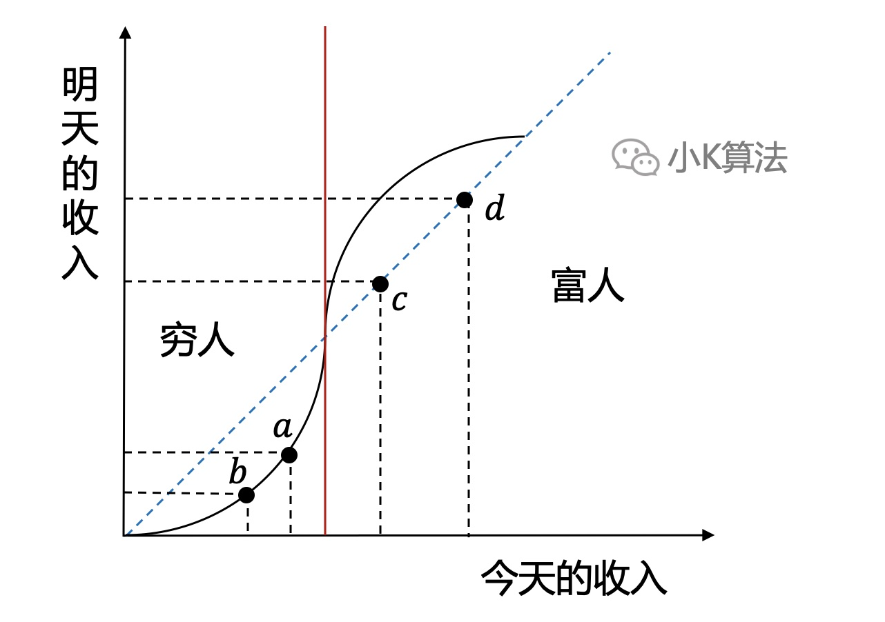
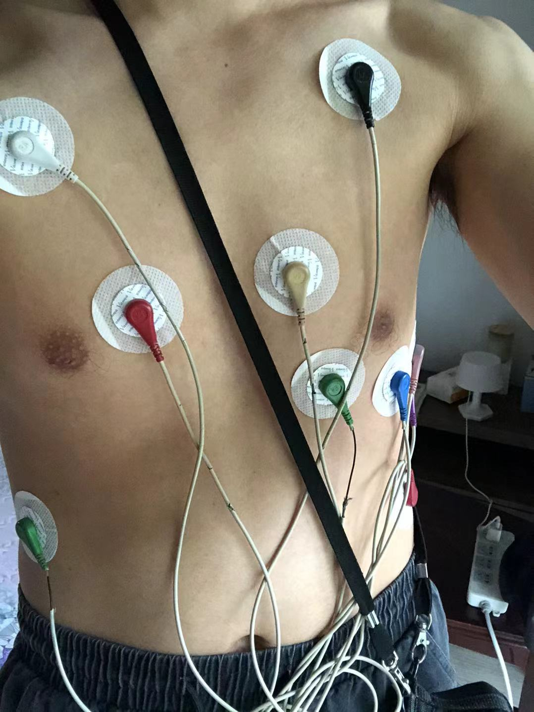

# 有一种病，叫情绪枯竭

### 1 背景
大家好，我是小K。好久不见了，不知大家还记得我不，一个立志通过画图，分享传播硬核知识的写手，哈哈。  
已经一个多月没有更新原创了，实在惭愧，欲知详情，且听我慢慢道来。这种文章相信对大家一定有所启发，请耐心看完，都是个人的真实经验总结。

我相信每个人都会遇到挫折和低谷，重要的是如何快速调整心态，走出低谷。

### 2 情绪枯竭
不知你们有没有过一段时间，或者很长时间，对任何事情和事物都提不起任何兴趣，对人生也没有方向，很迷茫，完全没有奋斗的动力和为之努力的目标？甚至对于金钱也毫无兴趣，感觉一切都没啥意义，活着都是一种负担。这属于一种心理疾病，就叫情绪枯竭，如果严重有可能会导致抑郁症。

很明显，小K也遭遇了一段时间的情绪枯竭。你以为这只会反映在心理上吗？不，心理上情绪的失落会通过身体上的各种不适反映出来，向你自己发出告警，所以切记要重视这个问题。

可能有人会觉得情绪低落，那你调整一下不就行了吗？这就如同你没有近视，永远无法理解为啥这么近的东西别人会看不清楚一样。

### 3 原因
整个人生也就由工作和生活组成。工作是为了更好的生活，有了更好的生活才有精力和时间去更好的工作，良性循环。反之如果没有好的工作，得不到更好的生活，没了更好的生活，也不可能有能力去更好的工作，陷入恶性循环。  

经济学上有一个类似的概念，叫贫穷陷阱，解释了穷人与富人之间临界点的重要性，直接影响整个一生。  
在a点，明天的收入低于今天的收入，所以到了明天，就会移动到b点，财富越来越少最终陷入贫穷。  
在c点，明天的收入高于今天的收入，所以到了明天，就会移到到d点，财富越来越多进入良性循环。  
由此可以看出平衡点的重要性，工作和生活也是一样的，相辅相承。

#### 3.1 工作
先谈一下工作，因为我还在职，所以不谈现在具体的工作，只谈到目前为止的工作感受。  
先说结论，工作不可能一直顺利，有人的地方就有烦恼。  

根据我的经验，基本每隔1-2年左右就会在职场上遭遇低谷，无法避免。因为我有期望，从不接受平淡无奇，一成不变的工作，这是在浪费我的时间，而时间成本，机会成本远远大于所能得到的收入，所以有了期望也就会有失望。“年轻就是资本啊”，这句话你再细品一下，除了年轻，你还有其它的资本吗，那现在如何规划自己的时间，重要性不言而喻了吧。

工作上小K暂时还没有遇到知识和技术层面搞不定的问题，而对于工作环境和人的处理上，肯定遇到过很多问题的，因为这里面有很多的不可抗力因素，不会因个人的主观意志而改变。说白了就是有太多的不可控，也许所有人都知道一件事情的对错，但所有人都会选择默认错误的发生，这可能就是工作特有的魅力吧，哈哈。

不过说了工作上面的问题，我还是选择一如既往的尽职尽责，做好自己的本职工作，只是要更加成熟冷静的思考和看待问题。

#### 3.2 生活
上学的时候对于田园诗派没有任何概念，而现在我终于理解了为啥陶渊明想隐居山林，因为我也想。  
有人的地方就有烦恼，有人的地方就有江湖。我想独居，只是有时候真的太累了，想选择暂时逃避问题，而在别人看来，仿佛你在自嘲，讲笑话一样，反手就是一个“我也想回老家养猪呢”。不过要是生活真的平淡无奇，没有波折，又会显得索然无味。

我有比较严重的强迫症，任何小事情都要达到自己满意的状态，比如写文章的配图，因为一个小标点，或者字体大小、颜色、位置看上去不舒服，我都要重新画，重新排版，这需要很多时间和精力。在生活中也一样，每一件小事都按这种标准去做，最终心理能承受，但身材承受不了，身体透支了。

前一段时间事情也比较多，筹备结婚，搞装修。如果所有的事情都要自己可控，那必然就涉及到需要学习大量的知识，我也是没日没夜的学习做攻略，确实太累了，但收获的东西也很多，毕竟都是一些生活知识，以后肯定对生活也有帮助。

有时家人的不理解才是压垮骆驼的最后一根稻草，要适当帮家里的顶梁柱分担压力，不要所有的事情都一个人抗起来。相信我，一定会有崩溃的一天。

### 4 健康
心理健康和身体健康同样重要。因为情绪枯竭，我身体多次告警，9月份医院去了至少10次以上，几乎每个周末都要去医院。三甲医院资源紧缺，挂号，排队，效率很低，每个检查至少要半天时间，有时没号就挂第二天再去检查，还是很折腾的。

最先出现胸口隐痛，我挂了心脏外科，心血管内科，然后查了心脏彩超，动态心电图，心肌酶等，结果所有指标、结构都正常。动态心电图要监控24小时，还不能洗澡，我背了一天。

心绞痛和胃绞痛无法区分，所以医生建议再查消化内科。然后又挂了消化内科，查了幽门螺旋杆菌，也是正常。我还挂了皮肤科，关节外科，耳鼻喉科，彩超也做了好多次。最终医生诊断胃酸反流，开药吃了一周就好了。我一日3餐都是自己做的，饮食习惯也没有问题，原因肯定是和情绪压力分不开的。

整个就医过程肯定不舒服，谁愿意天天跑医院呢，唯一幸运的就是，我的所有检查性都没有异常，只是一些小问题，完全是由于情绪和压力引起的。所以希望大家一定要重视健康，生病是很难受的。

### 5 后续计划
首先我必须得承认，自己不是万能的，不是所有的事情都能自己搞定，就算要自己去搞，也很耗精力，所以要进一步合理规划时间。  

先给自己把保险买上，重疾险，医疗险，意外险等。然后坚持每周运动1-2次。预留一部分时间静下心来理财，扩充自己的财务知识。再预留一部分时间提升厨艺，尝试做一些新的菜品。还有看书，利用闲散时间扩充自己的知识面。

至于公众号，文章也许会迟到，但永远不会缺席，分享知识是我的一个爱好。因为专业原因，文章还是会以算法和数学为主的硬核知识，直到掏空自己。后续还会增加一些生活方面的知识分享，希望能帮助到大家。

今天的内容就到这里，都是走心之谈，再次感谢大家的关注和对小K一如既往的支持。

本文原创作者：小K，一个思维独特的写手。  
文章首发平台：微信公众号【小K算法】。  

如果喜欢小K的文章，请点个关注，分享给更多的人，小K将持续更新，谢谢啦！

---
**扫描下方二维码关注公众号，第一时间获取更新信息！**  

