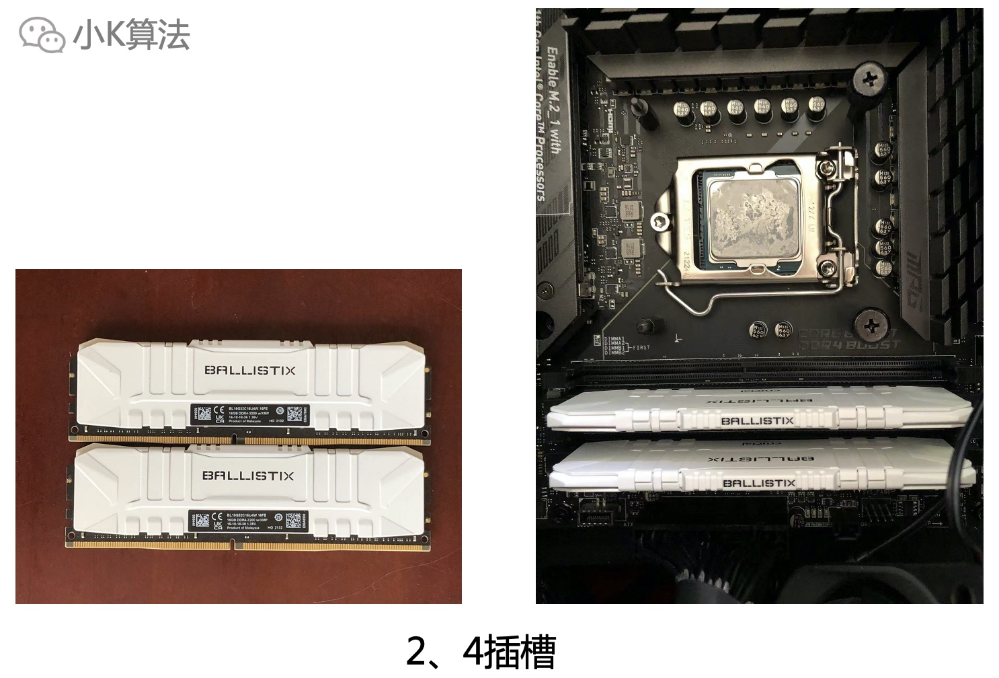

# 组装了人生第一台电脑

### 1 需求
作为一个新时代农民工，电脑肯定是必不可少的。对于写代码还是mbp效率高，所以也一直用的mbp。不过因为工作性质，还需要经常编写大量office文档，为了使用office一些插件，我还专门在我的mbp上面安装了windows10，可见windows系统对我来说也是有需求的。不过虚拟系统还是不方便，最主要的就是不流畅。

之前做一些素材或者模型，也需要使用GPU来实现并行计算，用CPU太慢了，但我现在这个mbp明显无法满足需求，打开个AE就要死机。
而且mbp只能用于工作，也没有娱乐功能，有时回家还想玩个游戏或者娱乐啥的也无法进行，所以决定趁这次双11活动，给自己组装一台电脑。总算给自己找了一个合适的理由，哈哈。

### 2 调研
既然有了需求，接下来就是开展调研工作了，那调研啥呢？

自然就是调研用户的核心诉求，以及市场上主流的实现方案。比如软件方面，需要支持AE，PS等，计算方面需要能跑tensorflow，娱乐方面需要支持主流单机，2k视频等，系统方面没得选，windows10。

当然需求比较零散，如果认真分析，会发现很多问题。单独展开某一方面的需求都没问题，如果要同时实现各种需求，其实是不太现实的，因为专业领域不同，重心和偏向都有取舍。游戏主机和工作站，所需的硬件配置也完全不一样，所以最终还是需要做一个权衡取舍，当然预算也是很重要的一个方面。

### 3 预算
首先自己得有一个预期，愿意为此需求付出多少钱。一上来就看这个好，那个也好，最终肯定超预算，也浪费时间，先锁定自己的预算。比如我的预算在1-1.5w，不能再多了，但可以在不同的硬件当中做调整，如果显卡超了，那处理器就得降。

### 4 配置
有了需求和预算，接下来就是选配置，这也是最重要的一步。能不能用最高的性价比实现自己的需求，这就得靠自己的知识储备了。当然不差钱的大佬不需要自己花时间，直接满配，或者交给专业人士，没有一百万解决不了的问题，有就再给一百万。

自己的几个建议供大家参考：  
* 最重要也最贵的几个大件就是主板，CPU，显卡，先选好这几个，其它的跟这些配套选择。
* CPU主要分intel、amd两个平台，不同型号的性能可以网上找资料对比，个人觉得amd性价比更高。
* 主板有大小，atx，m-atx，itx，在后面选机箱要考虑能不能装进去。
* 显卡非常重要，不论是游戏还是设计，都重度依赖显卡，但现在因为矿工，导致显卡溢价严重，5年前的二手卡现在卖的比原价还高，所以现在不太适合显卡一步到位，可以先买个过度卡，以后再升级。
* 显卡分N卡和A卡，不过N卡兼容性更好，有一些软件只支持N卡，具体软件可以自己查阅资料。
* 电源功率要足够，不能低。
* 机箱要考虑风道设计和大小。
* 显示器考虑分辨率和刷新率，2k，144hz足够了。
* CPU可以带核显，没显卡也能亮机。
* 散热高端上水冷，中低端上风冷，水冷有漏液风险，风冷比较大机箱空间要足够，风冷性价比更高。360水冷要考虑机箱是否支持，不然装不下。
* 固态硬盘装系统，机械硬盘存资料。
* 建议别搞RGB，会贵很多，光污染的新鲜感会过期，如果喜欢请随意。

接下来就是我最终的配置清单和参考价：

采购可以在几大平台多对比，自己选择，价格会有一些差异，官方更靠谱，质量和售后有保障，小商家就要看自己能不能判断质量了。

### 5 装机
等了几天，我的所有配件都收到了，还是激动啊，毕竟人生第一次装机，哈哈。

接下来就是我们最享受的装机过程了，如果你不会装，我相信你看完就能学会，肯定没有学微积分、矩阵难。

装机顺序可以调整，有时安装之后发现其它配件不好装，还得取下来重新装。

#### 5.1 安装CPU
intel和amd的支架不同，我的是intel，一般说明书中都会有教程。

#### 5.2 安装固态
把挡板取下，再拧上一个螺柱，档板上面的塑料膜撕掉，再安装上去。

#### 5.3 安装水冷
冷头一般有涂硅脂，如果没有记得自己涂上。有的机箱空间小，可能装了风排后面不好插线，可以最后再装水冷。

#### 5.4 安装前面风扇
机箱前盖取下来，装上风扇，前面和底部都是进风口，上面和后面是出风口，这是比较合理的风道设计，也是我选这个机箱最大的原因，还是侧透的，如果搞RGB就更炫酷了。

#### 5.5 安装主板
检查螺柱，atx主板有9个，小板子用不了这么多。风排可以最后再固定，我是先固定了，后面装电源的时候，没法插CPU供电，还得再取下来。

#### 5.6 安装电源
先检查电源是否正常，风扇转动就没问题。

插上所有线。

#### 5.7 安装内存
内存优先插2，4插槽，如果只有一个就插2槽。内存也可以先安装到主板上面，我是因为内存挡住水冷的安装，最后再装的内存。

#### 5.8 安装显卡
机箱显卡位的挡板取下来，拧上螺丝。

#### 5.9 安装硬盘
从机箱背面扣出硬盘盒，插进去即可。

#### 5.10 接线
冷头接cpu_fan，风排接sys_fan，前面风扇接电源大4Pin，主板接24pin，cpu供电接4+4pin，显卡接2+6pin，我的显卡只有6pin，硬盘面板等线就对应接就行了，都有标识，也有防呆设计，接错了是接不进去的，如果不会接也可以咨询主板商家，注意不要把针脚弄断了。

初次接线是这样子的。但作为一个有严重强迫症的我来说，肯定是无法接受的。

然后最终的走线是这样子的。

虽然我走的背线是这样子的。

#### 5.11 外设
外设没啥安装的，插线就行了。

#### 5.12 点亮
插上电，点亮，赛博朋克即视感。

### 6 安装系统
接下来就是安装系统，需要提前准备8G的U盘，做好windows启动盘。

安装完成，简洁漂亮的桌面。

### 7 安装驱动
只需要用U盘先拷贝网卡驱动，安装之后连上网，就可以安装其它驱动或者软件了。建议到主板官网安装官方驱动。

### 8 娱乐大师跑分
开始跑分，看看它究竟行不行。

最终跑分结果，感觉还可以。

### 9 玩一局游戏看看
估计没人想到第一局游戏竟然是玩war3，暴露了时代，哈哈，主要很久没玩游戏了，我也不知道有啥游戏。

再开个罗马2，可惜已经不会玩了，算了，直接投降。

### 10 再测试我的2k170hz屏
感觉还是比较细腻的，满意。

### 11 收工
终于装好了，接下来就是好好利用，是作为生产力工具，还是作为娱乐工具，就看自己了，哈哈。

本文原创作者：小K，一个思维独特的写手。  
文章首发平台：微信公众号【小K算法】。  

如果喜欢小K的文章，请点个关注，分享给更多的人，小K将持续更新，谢谢啦！

---
**扫描下方二维码关注公众号，第一时间获取更新信息！**  

