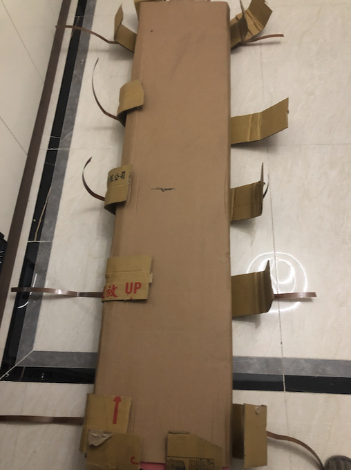

# 花了300多买的鞋柜，没想到...

### 1 故事起源
本来也没买多少鞋子，但由于质量太好了，一直穿不坏，2012年在大学时买的一双米高的轮滑鞋现在都还放在家里。

我从广州带到深圳，又从深圳带回老家，再从老家带回成都，然后再从一个出租屋带到另一个出租屋，这已经不是一双鞋了，而是一个又一个曾经的故事。

所以我得搞一个鞋柜把它好好的收藏起来，证明我曾经真的研究过平花，（平花也就是过桩，撩妹神技，不信你试试），哈哈。

### 2 问题分析
明确了需求，接下来就是调研如何实现需求了。  
首先就是定制，好处就是大小和样式都可以自己定义，但缺点就是成本比较高，我感觉也没有啥必要，所以排除了。  

接着就是线下家具城去找，大大小小的家具城我跑过很多家，但总感觉还是不够完美，好看的太贵，便宜的又不好看，唉，都是穷惹得祸。  

于是我决定网上再去搜索，好家伙，不搜不知道，一搜吓一跳，一个300多的鞋柜进入了我的视野。  
众里寻它千百度，得来全不费功夫，这不就是我想要的吗，安排。

### 3 收货
过了几周，终于到货了，拿到货第一眼的感觉，其貌不扬，接下来我们一探究竟。

先拆开看看。

主要就是板材和五金，说实话，这个价格，这个质量，还是有点意外的，真香啊，哈哈。

### 4 准备安装
商家其实有提供安装服务的，但要贵100多，考虑到咱们也不是啥富裕家庭，还是买配件自己动手吧。（我都上pdd了，你问我要不要买安装服务，真的是搞笑...）。

还是先梳理问题，也就是配件分类。底板，顶板，背板，侧板，隔板，柜脚，铰链，螺丝等，组装首先就是在脑袋里构建好架构图。

要砍柴怎么少得了砍刀呢，准备好咱们干活的工具。

### 5 开干

#### 5.1 准备底板和顶板
先将白色预埋打进板子，拧上黑色螺柱。

#### 5.2 拼接侧板
插上侧板，用偏心轮锁住。

完成如下。

#### 5.3 安装背板
先测量对角线，保证长度一样来找齐柜体，然后放好背板，打上钉子。

完成如下。

#### 5.4 安装柜脚
将柜脚用自攻螺丝固定，电钻比较方便，推荐配一把，但容易打坏螺丝。手拧也可以，就是比较费手。

#### 5.5 安装柜门
摆放好柜门和铰链，用自攻螺丝固定铰链，切记要在关上门的时候固定，避免错位了，当然后续也可以再次调节铰链。

完成如下。

#### 5.6 安装拉手
拧上螺丝即可。

#### 5.7 安装层板
插上板钉，放入层板。

### 6 最终效果
花了4、5个小时，终于完成了。从质量和外观上来说，都还是挺让我满意的，这个价位已经很值了。

### 7 总结
作为一个程序员，咱们要坚持“没有解决不了的问题”的原则。生活中也是一样的，有时多思考，尝试不同的解决方案，说不定真的有奇效。今天，请叫我木工K。

本文原创作者：小K，一个思维独特的写手。  
文章首发平台：微信公众号【小K算法】。  

如果喜欢小K的文章，请点个关注，分享给更多的人，小K将持续更新，谢谢啦！

---
**扫描下方二维码关注公众号，第一时间获取更新信息！**  

