# 第一次修U盘，没想到...

### 1 序
都2022年了，还有人在用U盘？是的，你没有看错，小K确实有几个u盘。

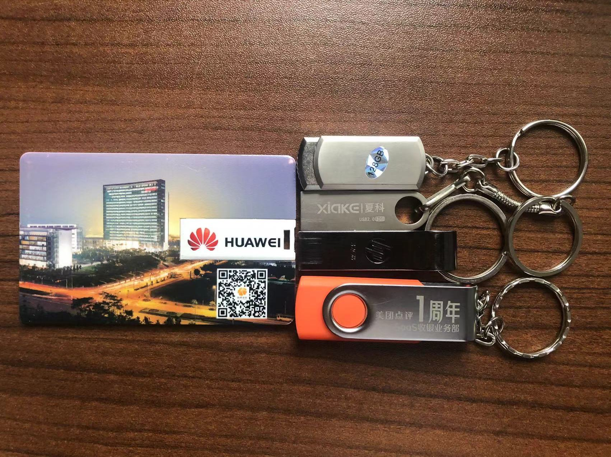

不过这几个u盘没有一个是我出钱买的，要么是公司发的，要么是搞活动送的。我也不是啥u盘重度用户，但偶尔带出去复印文件还是挺方便的。

### 2 故事起源
这还得从上周六说起。  
我爸在网上买了个40块钱的128g的u盘，让我给他下载歌曲。你可能会问现在不都是云音乐吗，还下载干嘛？那是因为老家还有几台老设备，比如20年前的DVD还在家里放着，当时主流的方式还是光盘。我爸没让我给他刻光盘已经不错了，因为我的电脑光驱都没有。。。  

那就下吧，复制粘贴不是作为一个程序员最拿手的技能吗？插入u盘拖就完了。  

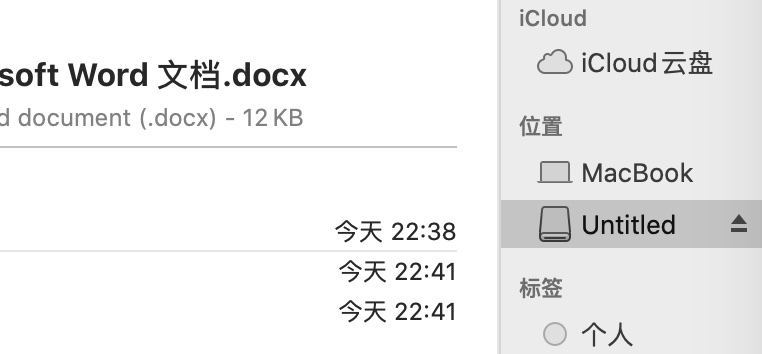

好家伙，看来还是我太年轻了，刚拖了1个g的文件进去，我这16款的macbook直接开始转圈了。。。u盘也直接卡死了，这什么破玩意。我点了推出也没反应，这哪受得了，一气之下，我直接给拔了，拔了。。。

当我再次插回去的时候，神奇的事情发生了，它不见了，读不出来了。完了，巴比Q了(所以不要在读写的时候随意拔)。  
我问我爸你这是在哪里买的劣质产品(总得为这40大洋的损失找个落脚点)，他说是pdd，好吧，都上pdd，还在乎啥质量啊。  

我想既然坏了就算了，再重新买一个。但又想了一下，40块可以买20斤米了呀，一个月都吃不完，要不咱们还是再折腾一下。

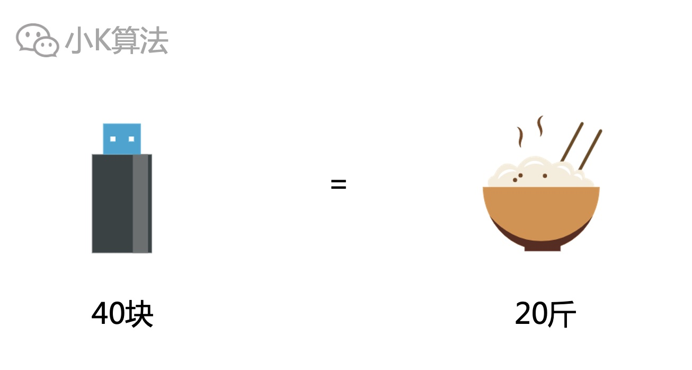

### 3 问题分析
首先初步分析，这玩意肯定是哪里故障了，可能是软件故障，也有可能是芯片故障，我也不确定，得先定位问题。我的win台式机该发挥作用了。  

先插到win台式机上面看看，万一和电脑有关呢。能看到盘，但看不到容量。

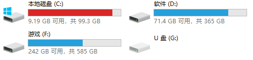

双击打开时，打不开，可我不是已经插入了吗？

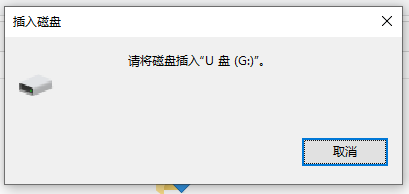

再看一下磁盘管理里面，能看到盘符，但看不到容量。

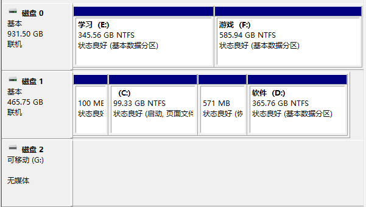

想格式化一下，发现也不行。

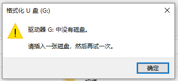

再看一下属性，确实读不出来容量。

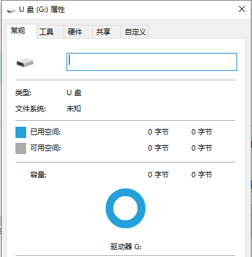

驱动应该没啥问题，毕竟其它盘都没问题。

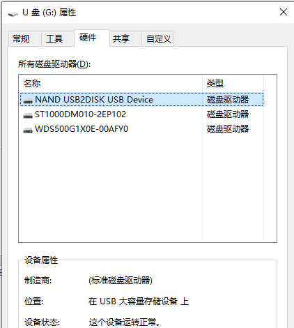

难道真的坏了？电脑上还是能识别出来有u盘，只是读不出来，都到这里了，也不能轻易放弃，这可是40块的事业，得进一步借助工具手段才行。

### 4 进一步诊断
现在需要确认是不是芯片坏了。用chipeasy检测一下，发现没有识别到主控信息，那没办法了，接下来该去找锤子了，砸了一探究竟。

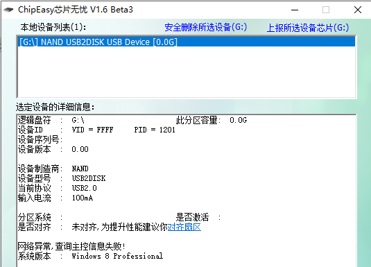

再看上面不是能识别盘符和型号吗，会不会是软件版本的问题。于是再用chipgenius检测，我可真是个genius。  
识别出了主控芯片信息，说明硬件没坏。

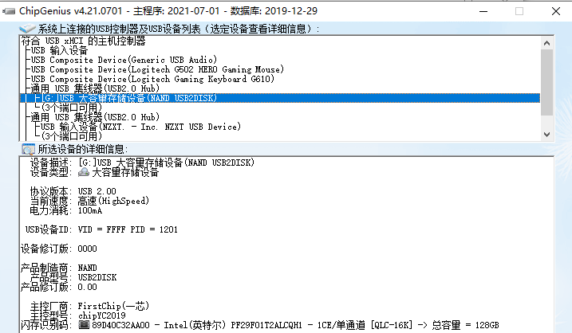

那现在该怎么办呢。电脑问题的终极手段，重启、重装，u盘也一样，即u盘量产，也就是重写主控芯片。

### 5 量产
打开量产工具mptools，确实能看到有问题。

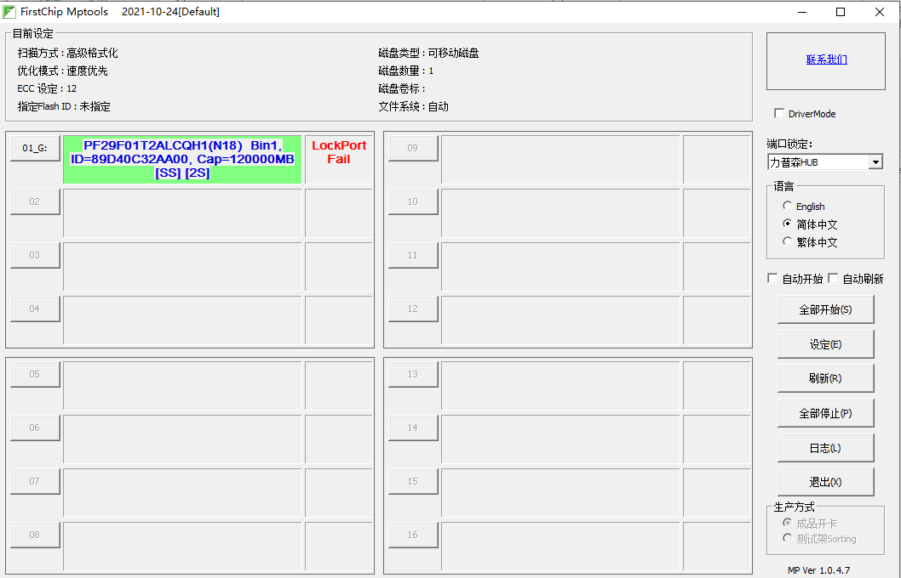

开始量产。

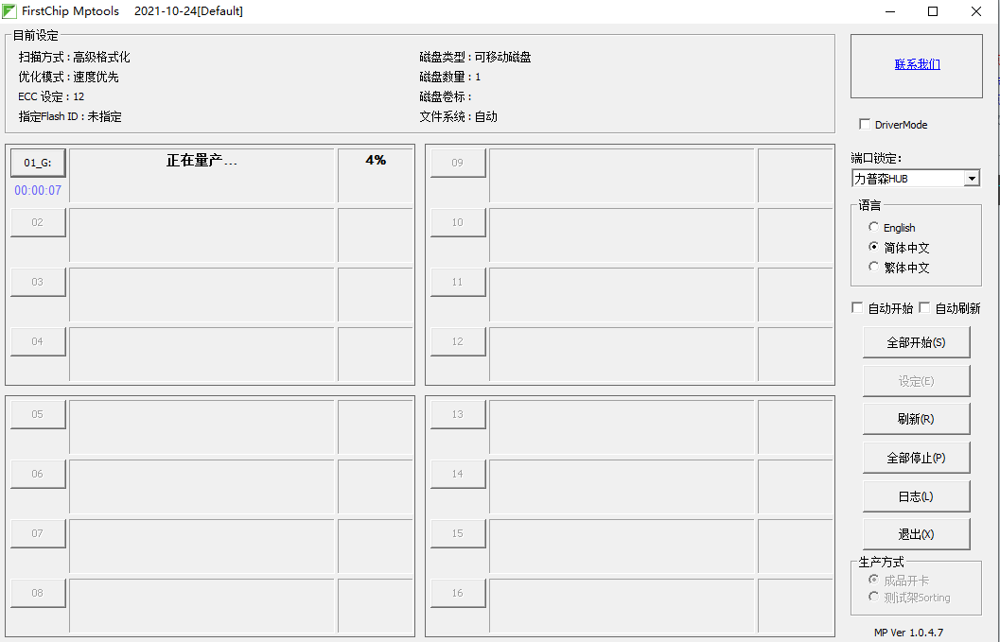

量产完成。

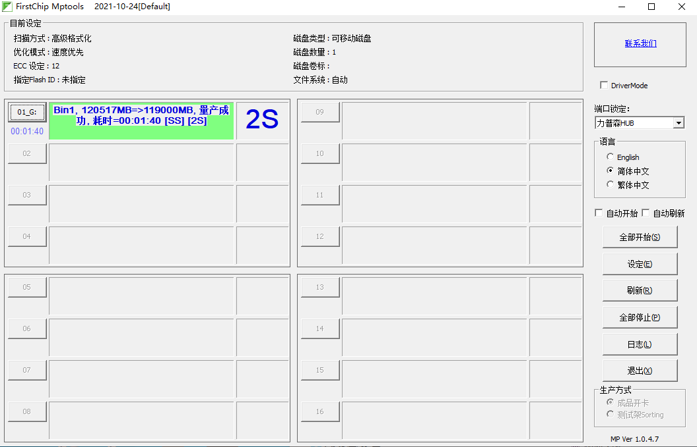

### 6 验证
接下来再验证一下是否已经修复。打开我的电脑，果然已经能看到u盘及容量了。

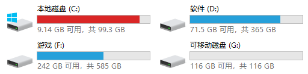

再进行一下u盘鉴定。

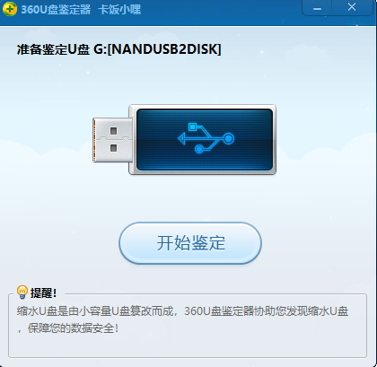

u盘容量是正常的。

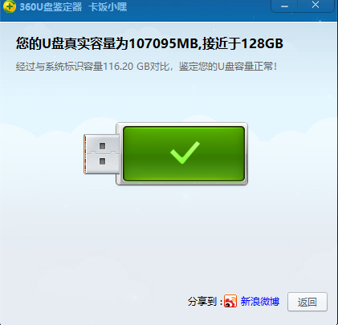

再看一下磁盘管理，也ok。

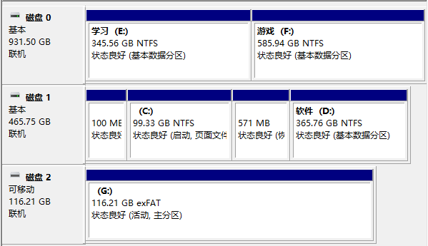

这次我们将u盘安全的移除，然后再重新插入。

我去，神奇的事情发生了，再次重新插入的时候又不行了，这是在玩我呀。

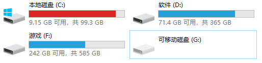

现在我怀疑可能是因为某些软件还处于打开u盘的状态，导致我再次拔出的时候又损坏了。  
于是我再次把上面的操作重复了一遍，然后关掉所有相关的软件再拔出，果然，它又行了。
### 7 测速
为了搞清楚之前打开的时候为啥这么卡，我想验证一下u盘的速度。采用diskmark进行测试。  

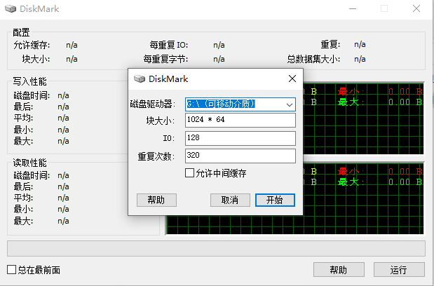

平均速度只有3mb/s左右，咋这么慢，会不会是接口的问题。

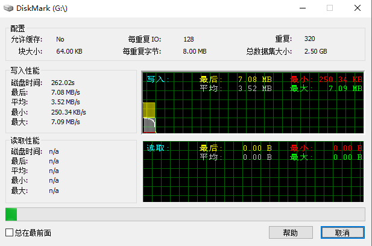

然后我插到前面板支持usb3.0的接口上再次测试。平均速度为6mb/s左右，这应该是极限了。

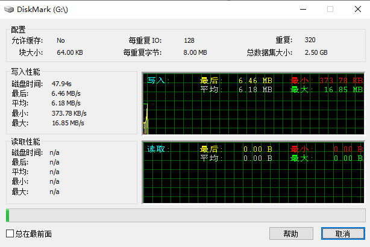

为了保证正确性，我又用之前公司发的u盘测试了一下，8mb/s左右，差不多只能算个usb1.1的水平，估计都这样吧，难怪这么卡。

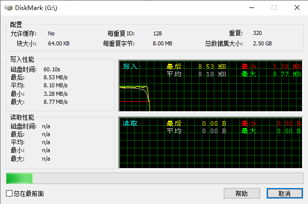

### 8 总结
总算修好了u盘，又省下了40块，这盘速度确实慢，不过能用就行，一般也不会用于大型文件的存储。建议买个32g的usb3.0的就可以了。  
好了，今天的收获也不只是为了省40块，而是为了解决问题，如果大家在工作或生活中遇到问题，也可以尝试想尽各种办法去解决，当然也可以下方留言，小K来帮你攻略搞定，说真的，工作这么多年，还真没遇到过有啥搞不定的技术问题，哈哈，因为，我可以学。

本文原创作者：小K，一个思维独特的写手。  
文章首发平台：微信公众号【小K算法】。  

如果喜欢小K的文章，请点个关注，分享给更多的人，小K将持续更新，谢谢啦！

---
**扫描下方二维码关注公众号，第一时间获取更新信息！**  

